# EAN Validator System - Solution Diagrams

---

## Cover Page

| Field | Value |
|-------|-------|
| Project Name | EAN Validator System |
| Client | Carrefour Brasil |
| Document Author | Gabriela Souza |
| Version | 1.0 |
| Document Type | Solution Architecture & Process Diagrams |

---

## 1. System Architecture Overview

### High-Level Architecture

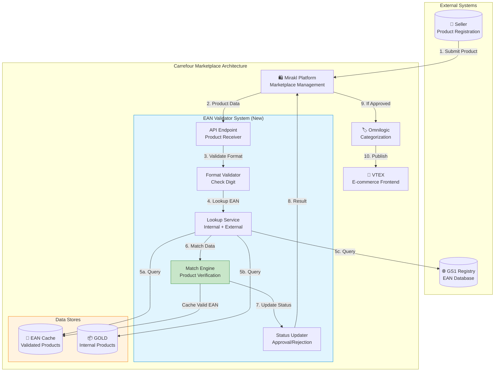

---

## 2. Validation Flow - Complete Process

### End-to-End Validation Sequence

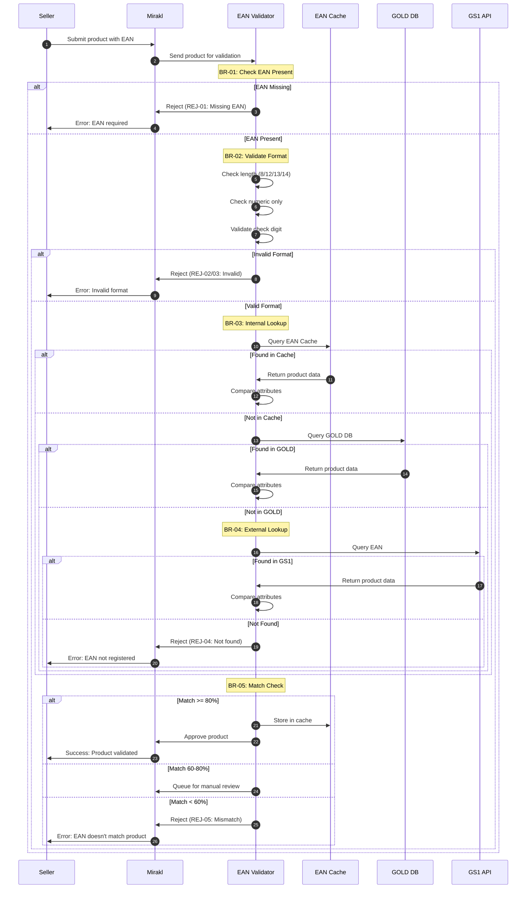

---

## 3. Validation Decision Tree

### Complete Decision Logic

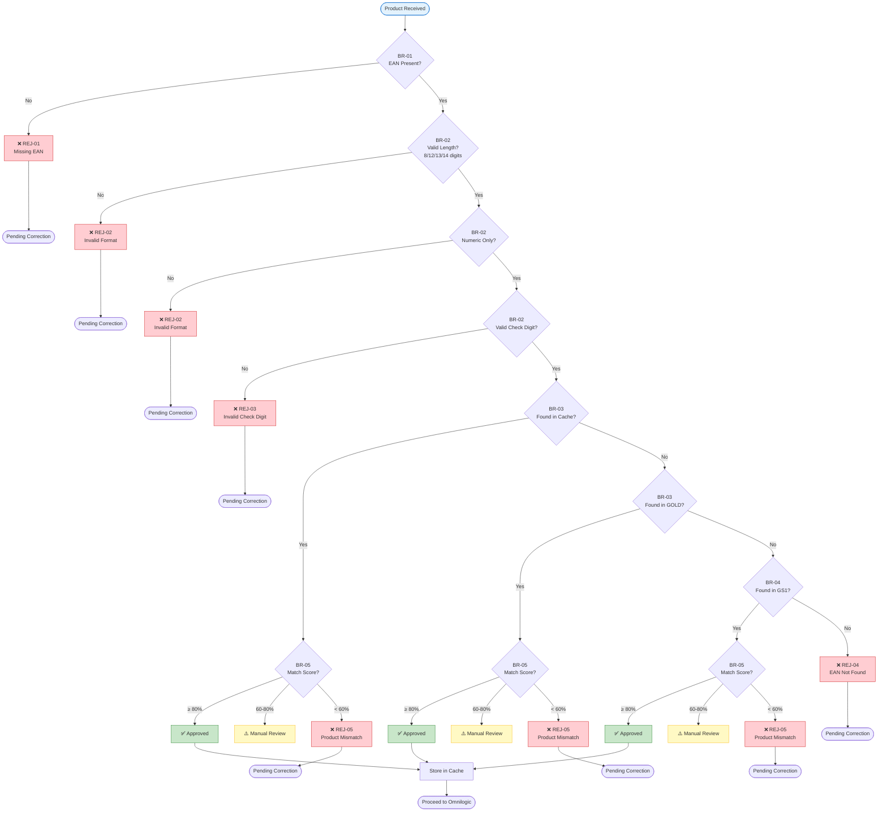

---

## 4. Lookup Hierarchy

### Internal-First Lookup Strategy

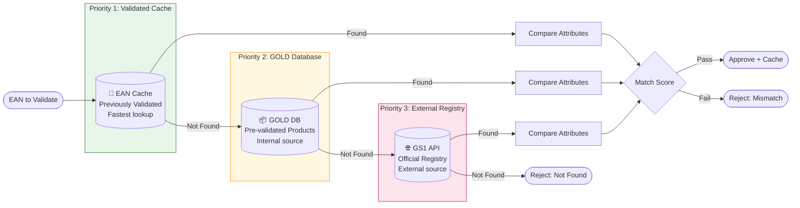

### Lookup Cost Comparison

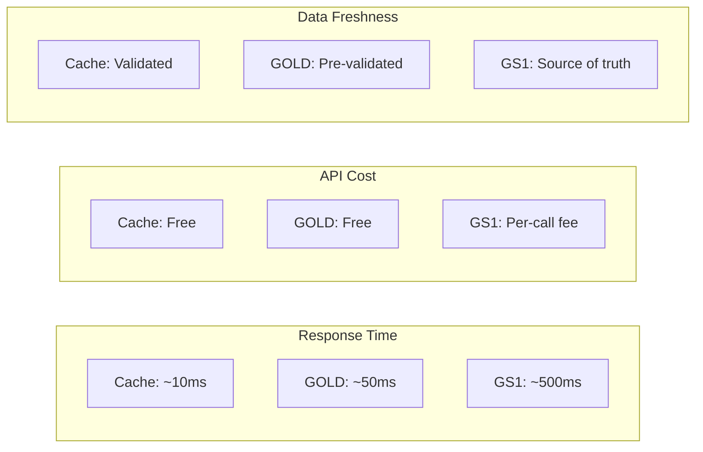

---

## 5. Product Matching Logic

### Attribute Comparison Flow

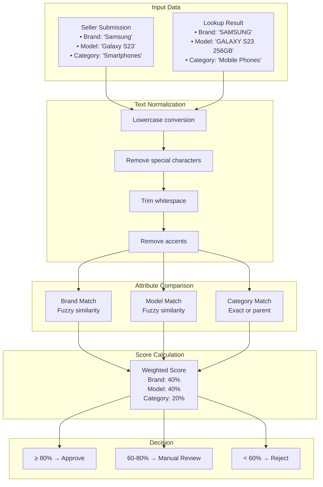

### Match Score Matrix

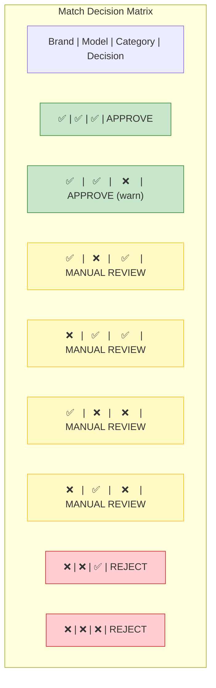

---

## 6. Seller Resubmission Flow

### Correction Journey

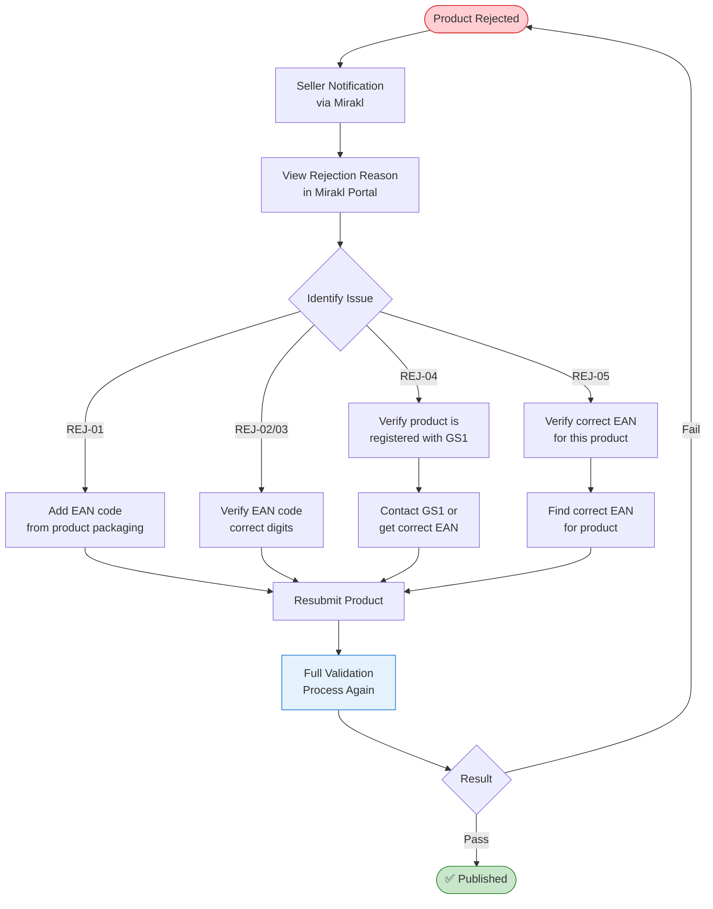

---

## 7. Manual Review Queue

### Review Process Flow

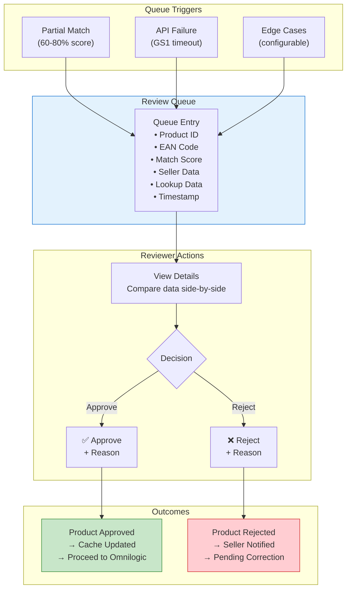

---

## 8. Integration Architecture

### API Integration Points

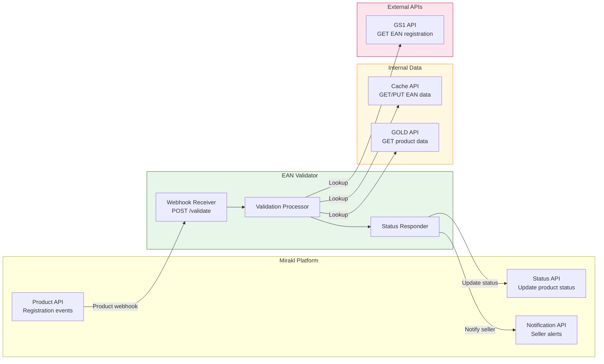

---

## 9. Data Model

### Cache Schema

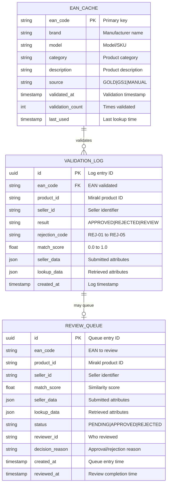

---

## 10. Deployment Architecture

### Infrastructure Overview

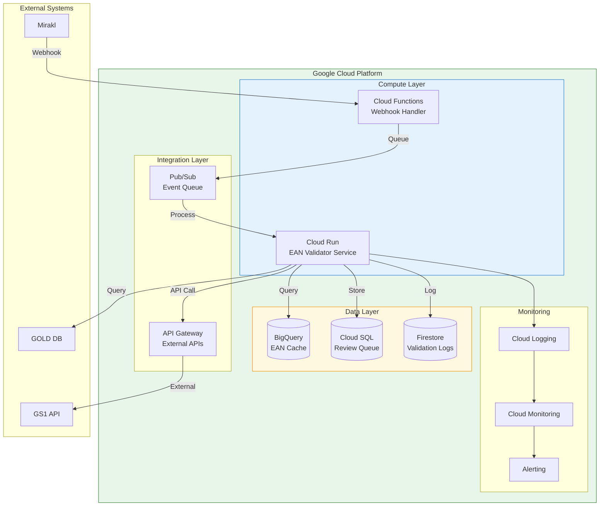

---

## 11. EAN Format Validation Detail

### Check Digit Calculation

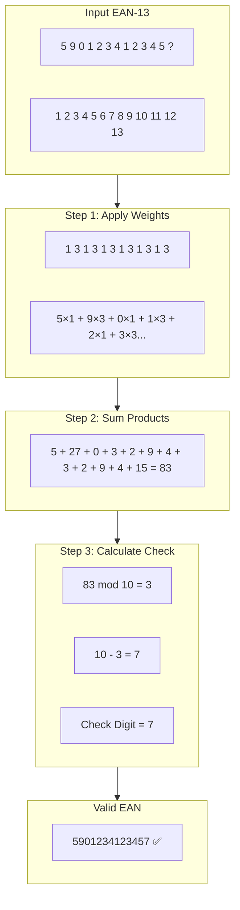

---

## Related Documents

- [Blueprint](../discovery-docs/ean-validator-blueprint.md) - Discovery document
- [PRD](./ean-validator-prd.md) - Product Requirements Document
- [Assumptions Log](./assumptions-decisions-log.md) - Assumptions tracking
- [SOW](./ean-validator-sow.md) - Statement of Work

---

*Document Version: 1.0*
*Author: Gabriela Souza*
