# Products Without Offer Blocker - Solution Diagrams

---

## Cover Page

| Field | Value |
|-------|-------|
| Project Name | Products Without Offer Blocker |
| Client | Carrefour Brasil |
| Document Author | Gabriela Souza |
| Version | 1.0 |

---

## 1. System Architecture Overview

### Before vs. After

```mermaid
graph TB
    subgraph Before["BEFORE: Current Flow"]
        B_Seller["🛒 Seller"] --> B_Mirakl["Mirakl"]
        B_Mirakl --> B_Omni["Omnilogic 💰"]
        B_Omni --> B_EAN["EAN Lookup 💰"]
        B_EAN --> B_VTEX["VTEX 💰"]
        B_VTEX --> B_Check{Has Offer?}
        B_Check -->|Yes| B_Pub["Published ✅"]
        B_Check -->|No| B_Hidden["Hidden ❌<br/>(Costs incurred, no revenue)"]
    end
    
    subgraph After["AFTER: With Blocker"]
        A_Seller["🛒 Seller"] --> A_Validator["🛡️ Offer Validator"]
        A_Validator --> A_Check{Has Offer?}
        A_Check -->|Yes| A_Mirakl["Mirakl"]
        A_Check -->|No| A_Block["Blocked 🚫<br/>(No costs incurred)"]
        A_Mirakl --> A_Omni["Omnilogic 💰"]
        A_Omni --> A_EAN["EAN Lookup 💰"]
        A_EAN --> A_VTEX["VTEX 💰"]
        A_VTEX --> A_Pub["Published ✅"]
    end

    style A_Validator fill:#c8e6c9,stroke:#388e3c
    style A_Block fill:#ffcdd2,stroke:#d32f2f
    style B_Hidden fill:#ffcdd2,stroke:#d32f2f
```

---

## 2. Validation Flow

### Complete Decision Logic

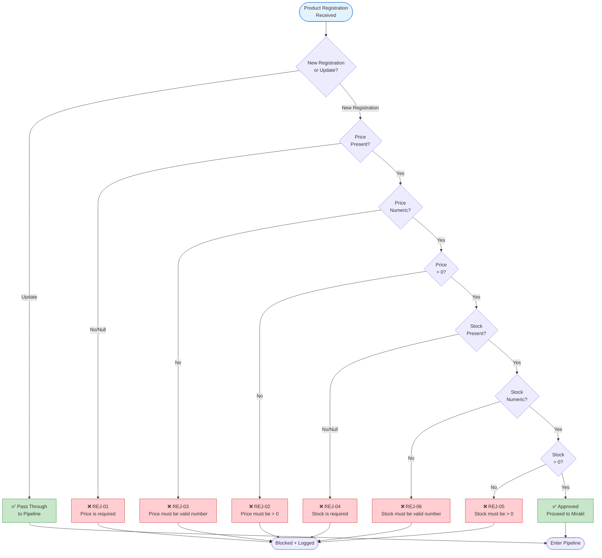

---

## 3. Sequence Diagram

### Valid Registration Flow

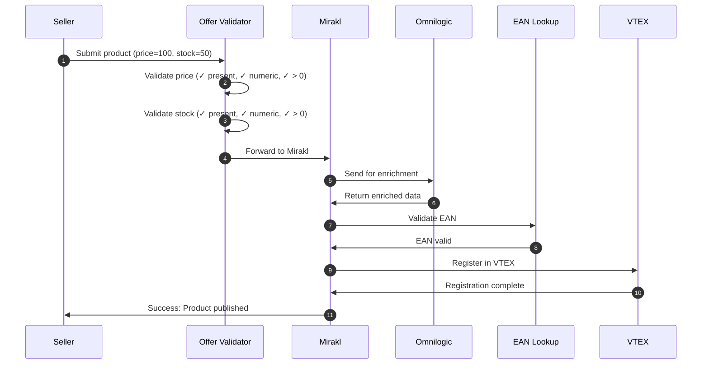

### Blocked Registration Flow

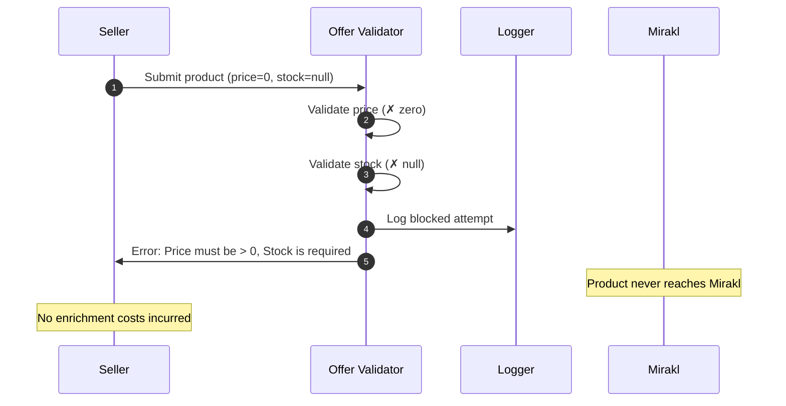

---

## 4. Integration Architecture

### System Integration Points

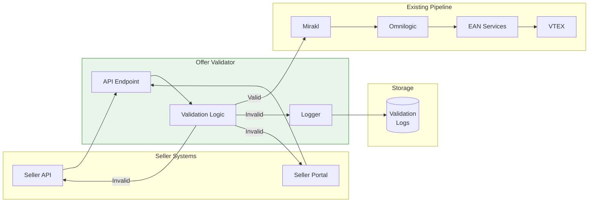

---

## 5. Validation Matrix

### Price Validation

### Stock Validation

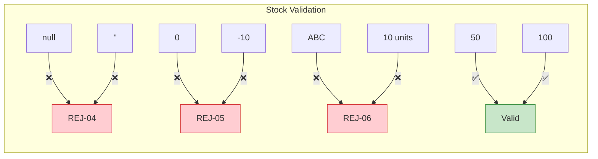

---

## 6. Use Case Diagram

### Actors and Use Cases

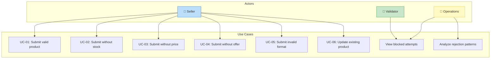

---

## 7. Data Flow

### Validation Data Flow

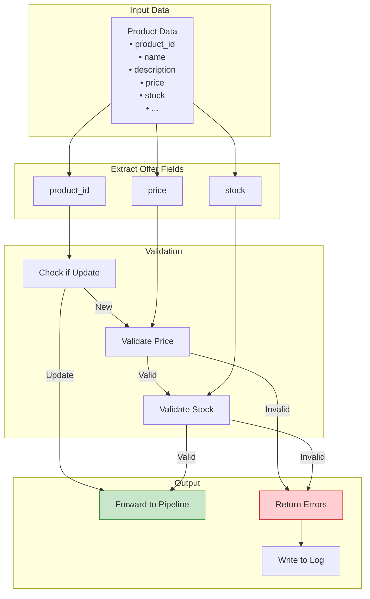

---

## 8. Cost Impact Visualization

### Cost Flow Comparison

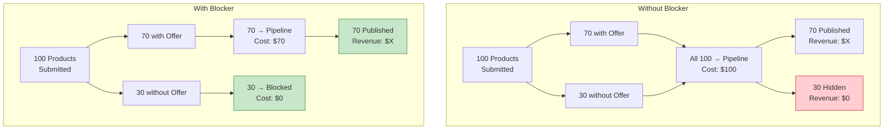

---

## 9. Deployment Architecture

### Infrastructure

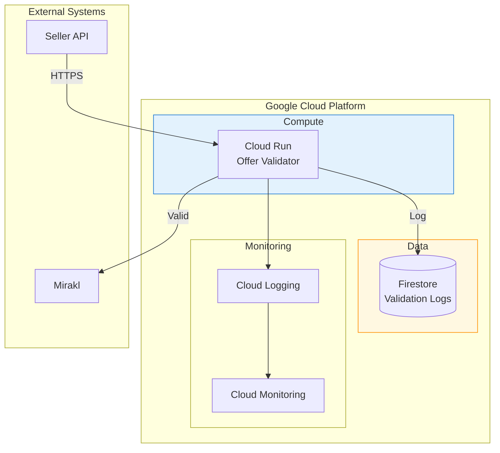

---

## 10. Error Response Format

### API Response Structure

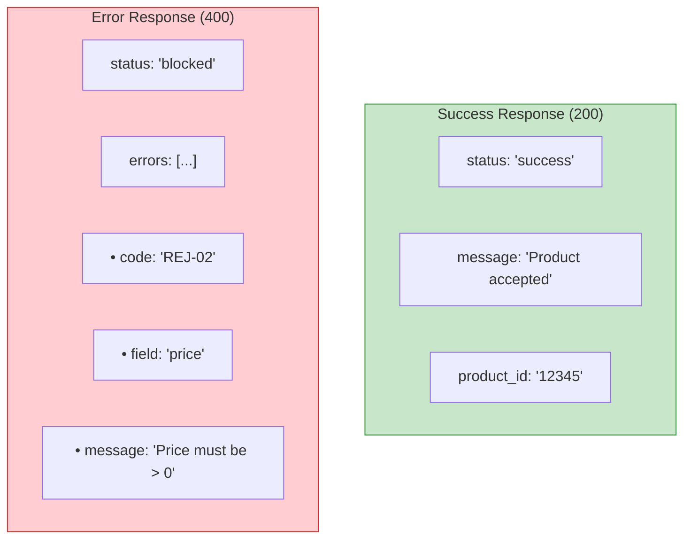

---

## Related Documents

- [Blueprint](../discovery-docs/offer-blocker-blueprint.md)
- [PRD](./offer-blocker-prd.md)
- [SOW](./offer-blocker-sow.md)
- [Assumptions Log](./assumptions-decisions-log.md)

---

*Document Version: 1.0*
*Author: Gabriela Souza*
