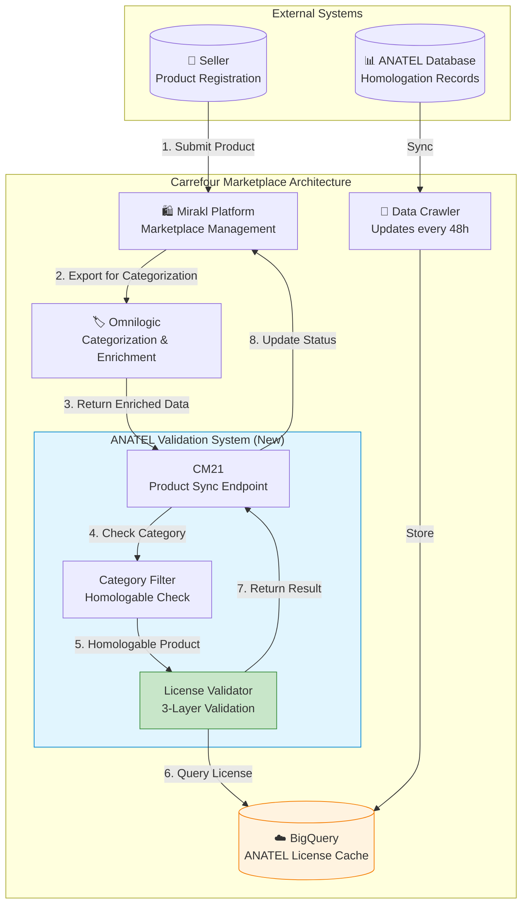
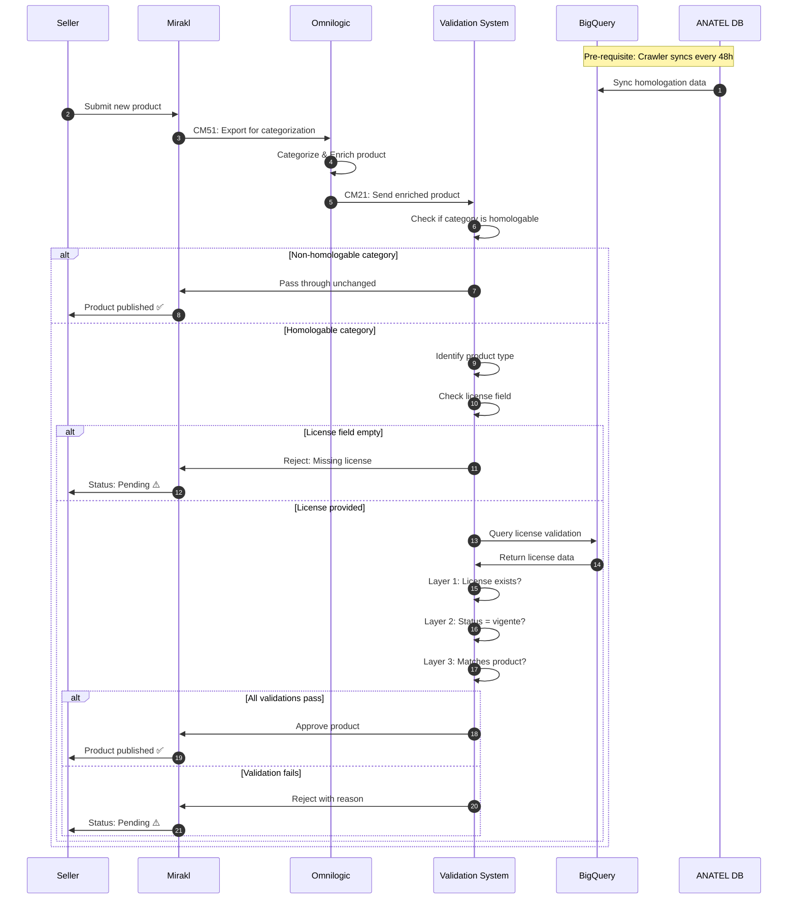
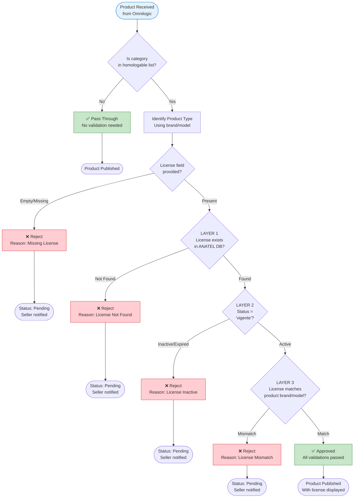
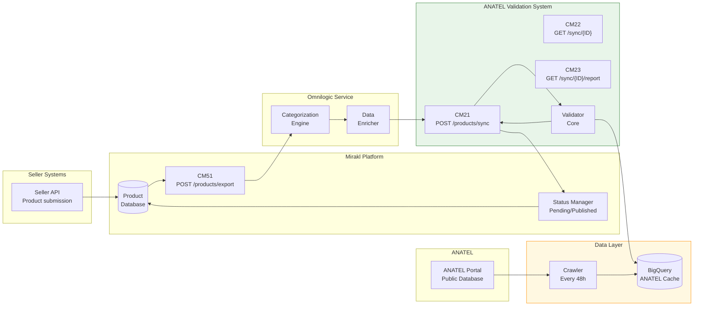
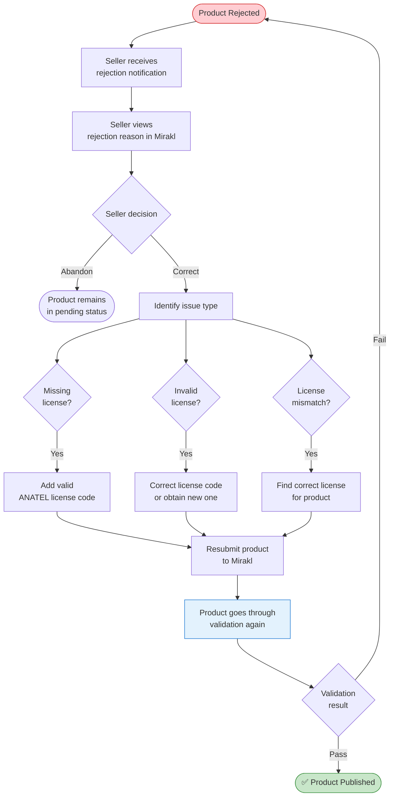
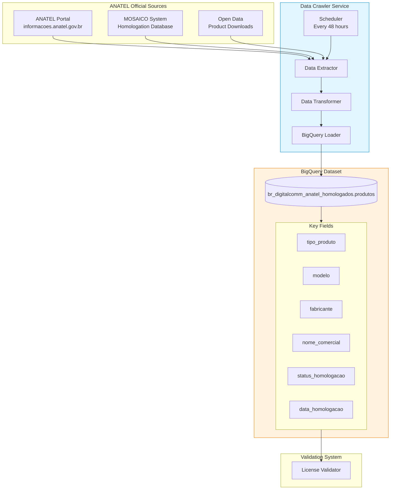
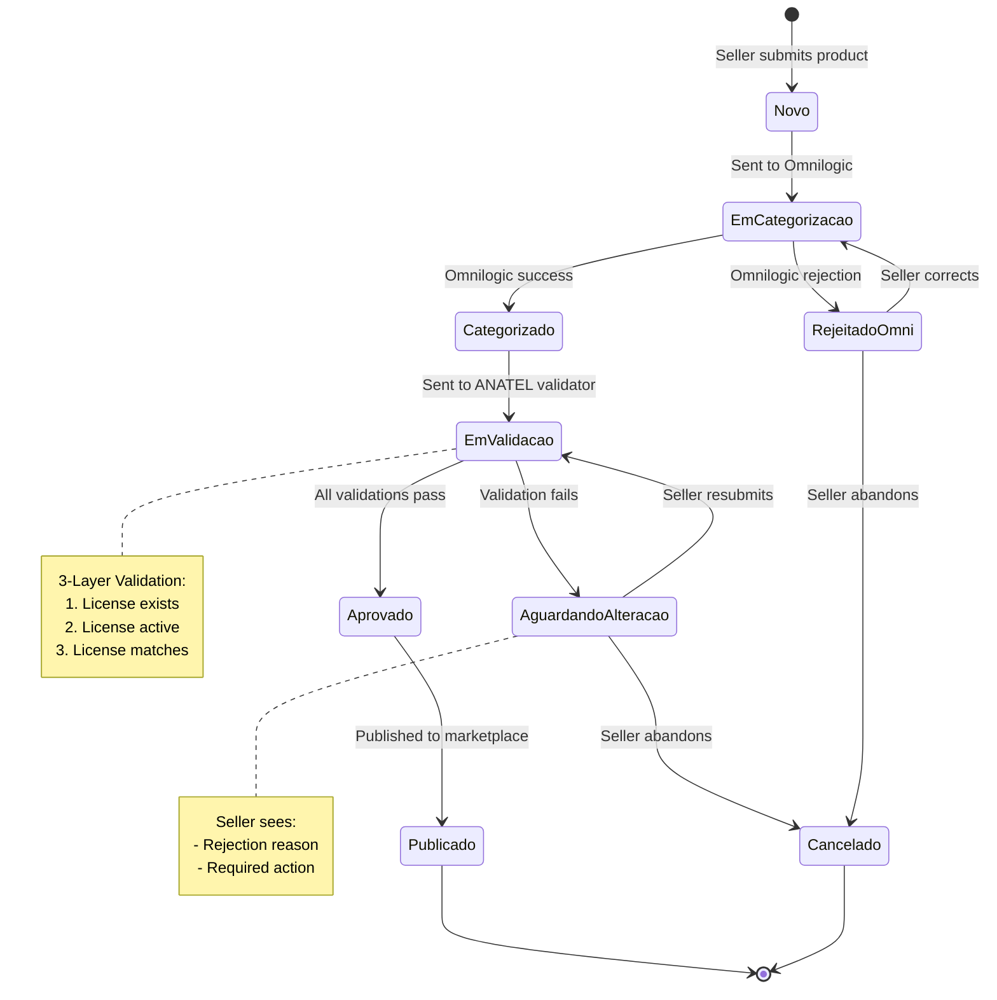
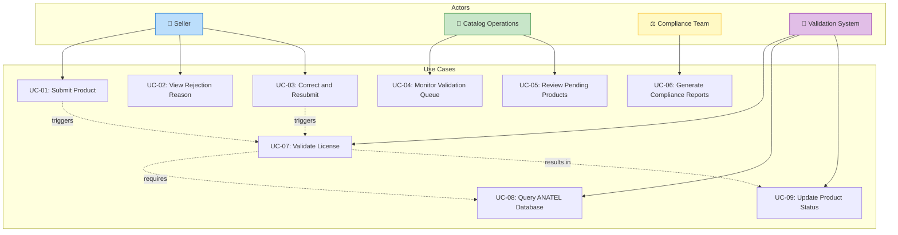
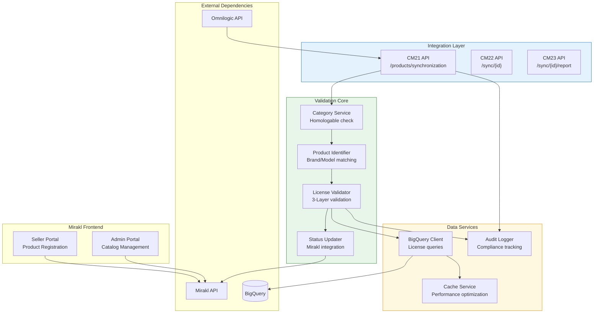
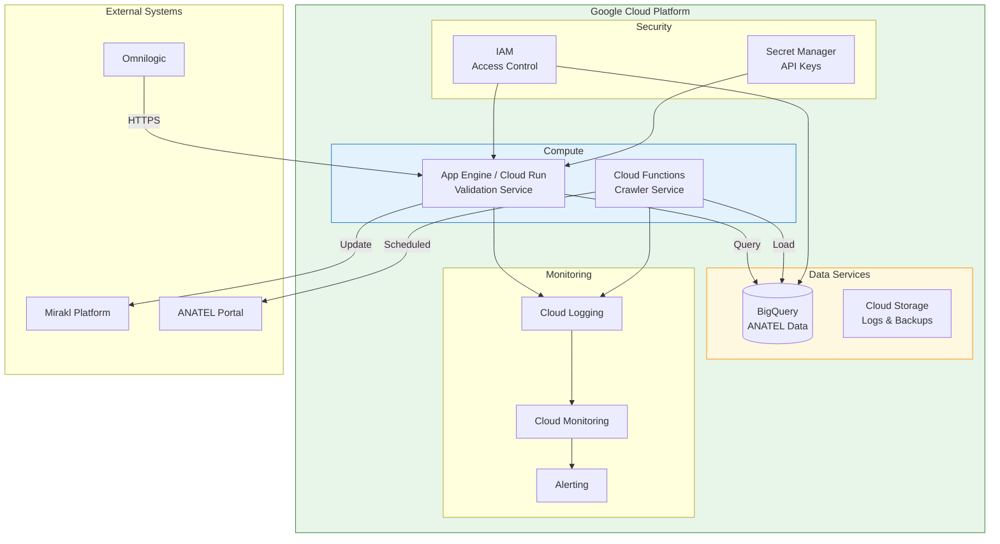

# ANATEL Homologation Validation System - Solution Diagrams

---

## Cover Page

| Field | Value |
|-------|-------|
| Project Name | ANATEL Homologation Validation System |
| Client | Carrefour Brasil |
| Document Author | Gabriela Souza |
| Version | 1.0 |
| Document Type | Solution Architecture & Process Diagrams |

---

## 1. System Architecture Overview

### High-Level Architecture

---

## 2. Product Registration Flow

### Complete Product Lifecycle

---

## 3. Validation Decision Tree

### 3-Layer License Validation Logic

---

## 4. Integration Architecture

### API Integration Flow

---

## 5. Seller Resubmission Flow

### Product Correction Journey

---

## 6. Data Flow Architecture

### ANATEL Database Synchronization

---

## 7. State Machine: Product Status

### Product Status Transitions

---

## 8. Use Case Diagram

### System Actors and Use Cases

---

## 9. Component Diagram

### System Components

---

## 10. Deployment Architecture

### Infrastructure Overview

---

## Related Documents

- [Blueprint](../discovery-docs/anatel-blueprint.md) - Discovery document
- [PRD](./anatel-prd.md) - Product Requirements Document
- [SOW](./anatel-sow.md) - Statement of Work

---

*Document Version: 1.0*
*Author: Gabriela Souza*
