# ReadAssist AI - Technical Documentation

## Project Overview

**ReadAssist AI** is a K-12 reading fluency assessment system. Students read text aloud, and the system uses AI to analyze fluency, pronunciation, and provide real-time feedback.

### Key Capabilities

- **Progressive Sentence Accumulation** - Students build fluency by reading progressively (sentence 1, then 1+2, then 1+2+3, etc.)
- **Dual Speech-to-Text Analysis** - Every attempt is processed by both Deepgram and SpeechAce simultaneously
- **AI-Generated Feedback** - Gemini 2.5 Flash Lite provides age-appropriate, encouraging feedback
- **Word-Level Pronunciation Feedback** - Identifies and highlights words that need practice
- **Teacher Dashboard** - Real-time session tracking, attempt review, and CSV export
- **COPPA Compliant** - No PII storage, anonymous student identifiers only

---

## System Architecture

### High-Level Architecture Diagram

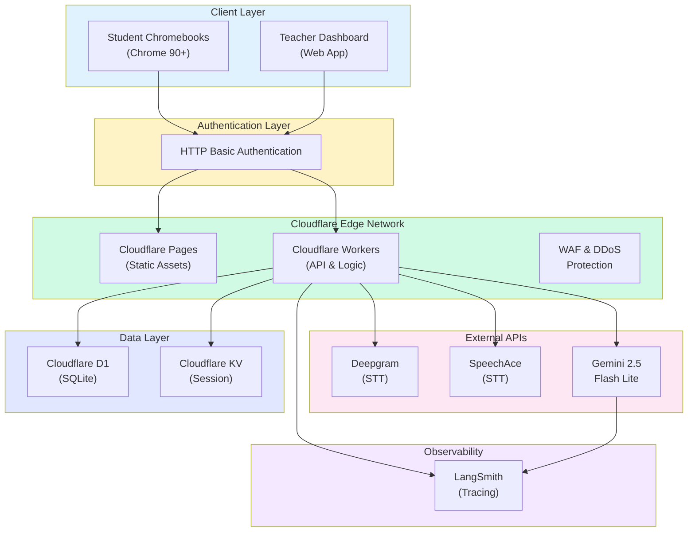

### Technology Stack

| Layer | Technology | Purpose |
|-------|------------|---------|
| **Frontend** | React + React Router 7 | UI framework with SSR |
| **Styling** | Tailwind CSS 4 | Utility-first CSS |
| **Backend** | Cloudflare Workers | Serverless edge compute |
| **Database** | Cloudflare D1 (SQLite) | Persistent data storage |
| **Session Store** | Cloudflare KV | Temporary session state |
| **STT Provider 1** | Deepgram Nova-3 | Word-level confidence scoring |
| **STT Provider 2** | SpeechAce | Pronunciation quality scoring |
| **LLM** | Gemini 2.5 Flash Lite | Feedback generation |
| **Observability** | LangSmith | Tracing & prompt management |
| **ORM** | Drizzle ORM | Type-safe database access |

---

## Entity Relationship Diagram (ERD)

```mermaid
erDiagram
    teachers ||--o{ classes : "has"
    teachers ||--o{ test_results : "owns"
    classes ||--o{ attempts : "contains"
    classes ||--o{ test_results : "has"
    tests ||--o{ sentences : "contains"
    tests ||--o{ attempts : "has"
    tests ||--o{ test_results : "has"
    sentences ||--o{ attempts : "references"
    sentences ||--o{ attempt_step : "references"
    sentences ||--o{ test_step_result : "references"
    attempts ||--|| attempt_stt : "has"
    attempts ||--o{ attempt_step : "contains"
    test_results ||--o{ test_step_result : "contains"

    teachers {
        int id PK
        string name
        string email UK
        timestamp created_at
        timestamp updated_at
    }

    classes {
        int id PK
        int teacher_id FK
        string name
        string code UK
        timestamp created_at
        timestamp updated_at
    }

    tests {
        int id PK
        string title
        real fluency_threshold
        int max_attempts_per_step
        timestamp created_at
        timestamp updated_at
    }

    sentences {
        int id PK
        int test_id FK
        string content
        int sequence_number
        timestamp created_at
        timestamp updated_at
    }

    attempts {
        string id PK
        string student_anonymous_id
        int class_id FK
        int test_id FK
        int sentence_id FK
        int step_number
        int attempt_number
        int paragraph_read_number
        string deepgram_transcript
        real deepgram_wcpm
        real deepgram_accuracy
        real deepgram_confidence
        real deepgram_fluency
        real speechace_wcpm
        real speechace_accuracy
        real speechace_fluency
        boolean speechace_has_irrelevant_speech
        string deepgram_teacher_feedback
        string speechace_teacher_feedback
        string highlighted_words
        boolean passed
        int duration_ms
        timestamp created_at
        timestamp updated_at
    }

    attempt_step {
        string attempt_sentence_id PK
        string attempt_id FK
        string student_anonymous_id
        int class_id FK
        int test_id FK
        int sentence_id FK
        int step_number
        int attempt_number
        int paragraph_read_number
        string deepgram_transcript
        real deepgram_wcpm
        real deepgram_accuracy
        real deepgram_fluency
        real speechace_wcpm
        real speechace_accuracy
        real speechace_fluency
        string words_skipped
        string words_added
        string words_highlighted
        string step_type
        boolean passed
        timestamp created_at
        timestamp updated_at
    }

    attempt_stt {
        string attempt_id PK_FK
        string raw_deepgram
        string raw_speechace
        string raw_gemini
    }

    test_results {
        int id PK
        string student_anonymous_id
        int teacher_id FK
        int class_id FK
        int test_id FK
        string finalized_at
        int wcpm
        int accuracy
        int fluency
        string ai_feedback_deepgram
        string ai_feedback_speechace
        string original_text
        string teacher_notes
        timestamp created_at
        timestamp updated_at
    }

    test_step_result {
        int id PK
        int test_results_id FK
        int sentence_id FK
        int paragraph_read_number
        int wcpm_deepgram
        int accuracy_deepgram
        int fluency_deepgram
        int wcpm_speechace
        int accuracy_speechace
        int fluency_speechace
        string words_skipped
        string words_added
        string words_highlighted
        int attempts
        string step_type
    }
```

### Table Descriptions

| Table | Purpose |
|-------|---------|
| `teachers` | Teacher accounts with name and email |
| `classes` | Classrooms linked to teachers via `teacher_id` |
| `tests` | Reading assessments with fluency thresholds and attempt limits |
| `sentences` | Individual sentences within a test, ordered by `sequence_number` |
| `attempts` | Individual reading attempts with dual STT results |
| `attempt_step` | Per-sentence metrics within an attempt |
| `attempt_stt` | Raw API responses from Deepgram, SpeechAce, and Gemini |
| `test_results` | Finalized student test results with aggregated metrics |
| `test_step_result` | Aggregated per-step results for teacher review |

---

## Data Flow Diagrams

### Submit Attempt Flow

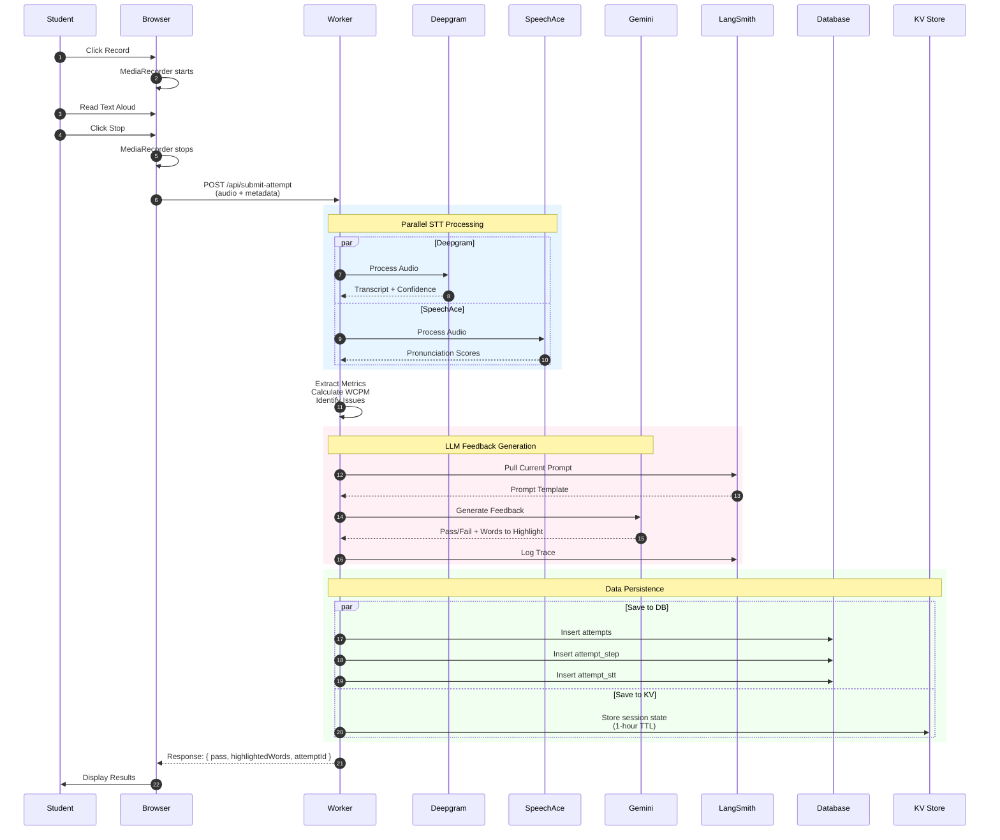

### Progressive Sentence Accumulation Flow

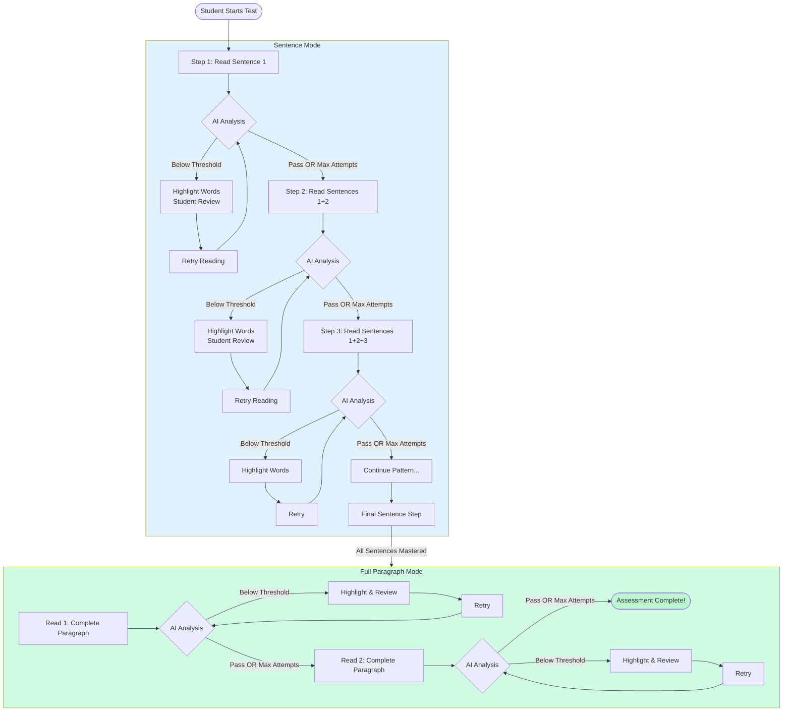

### Word Highlighting Flow (TR-16)

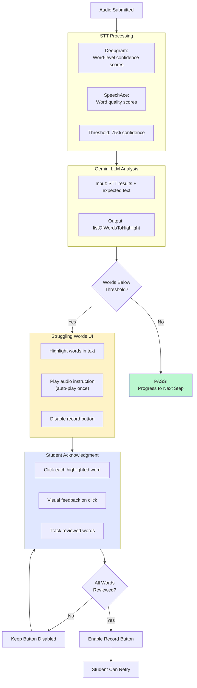

### Complete System Flow

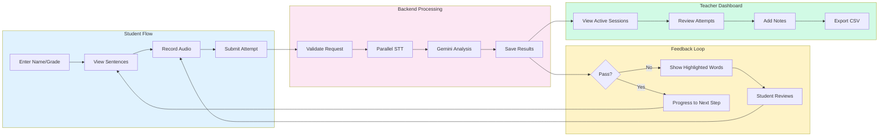

---

## Metrics Calculation

### WCPM (Words Correct Per Minute)

Each STT provider calculates WCPM differently:

**Deepgram Calculation:**
```typescript
// Words with confidence >= 75% are considered "correct"
const correctWords = words.filter(w => w.confidence >= 0.75);
const durationSeconds = endTime - startTime;
const wcpm = Math.round((correctWords.length / durationSeconds) * 60);
```

**SpeechAce Calculation:**
```typescript
// SpeechAce provides WCPM directly in the response
const wcpm = response.text_score.fluency.overall_metrics.word_correct_per_minute;
```

**Best WCPM Selection:**
```typescript
// The system uses the maximum WCPM from both providers
const bestWcpm = Math.max(deepgramWcpm ?? 0, speechaceWcpm ?? 0);
```

### Metrics Flow Diagram

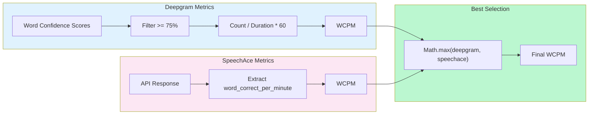

### Accuracy Calculation

**Deepgram:**
```typescript
// Average confidence across all words, converted to percentage
const avgConfidence = words.reduce((sum, w) => sum + w.confidence, 0) / words.length;
const accuracy = Math.round(avgConfidence * 100);
```

**SpeechAce:**
```typescript
// Direct pronunciation score from API
const accuracy = response.text_score.speechace_score.pronunciation;
```

### Fluency Calculation

**Deepgram:**
```typescript
// Fluency = accuracy * confidence * similarity
const fluency = (accuracy / 100) * confidence * similarityScore;
```

**SpeechAce:**
```typescript
// Direct fluency score from API
const fluency = response.text_score.speechace_score.fluency;
```

### Final Metrics Aggregation

```typescript
// Extract best metrics from attempt
function extractAttemptMetrics(attempt) {
  return {
    wcpm: Math.max(attempt.deepgramWcpm ?? 0, attempt.speechaceWcpm ?? 0),
    fluencyScore: Math.max(attempt.speechaceFluency ?? 0, attempt.deepgramFluency ?? 0),
    accuracyScore: Math.max(attempt.deepgramAccuracy ?? 0, attempt.speechaceAccuracy ?? 0),
  };
}
```

---

## API Routes

### Student Routes

| Route | Method | Description |
|-------|--------|-------------|
| `/students/start` | GET | Entry page for student to enter name/grade |
| `/students/assessment` | GET | Main assessment interface |
| `/students/assessment/completed` | GET | Assessment completion screen |

### Teacher Routes

| Route | Method | Description |
|-------|--------|-------------|
| `/teachers` | GET | Teacher dashboard with session tracking |

### API Endpoints

| Endpoint | Method | Description |
|----------|--------|-------------|
| `/api/submit-attempt` | POST | Submit audio recording for processing |
| `/api/start-session` | POST | Initialize student session |
| `/api/active-sessions` | GET | Fetch in-progress student sessions |
| `/api/completed-sessions` | GET | Fetch completed student sessions |
| `/api/student-detail-results` | GET | Get detailed results for a student |
| `/api/save-teacher-notes` | POST | Save teacher qualitative feedback |
| `/api/export-attempts-csv` | GET | Export all attempts as CSV |
| `/api/export-results-csv` | GET | Export final results as CSV |

### URL Parameter Routing

- **Student Portal:** `/students/assessment?testId={id}&classId={id}`
- **Teacher Portal:** `/teachers?classId={id}`

Both routes require HTTP Basic Authentication.

---

## External Service Integrations

### Integration Overview

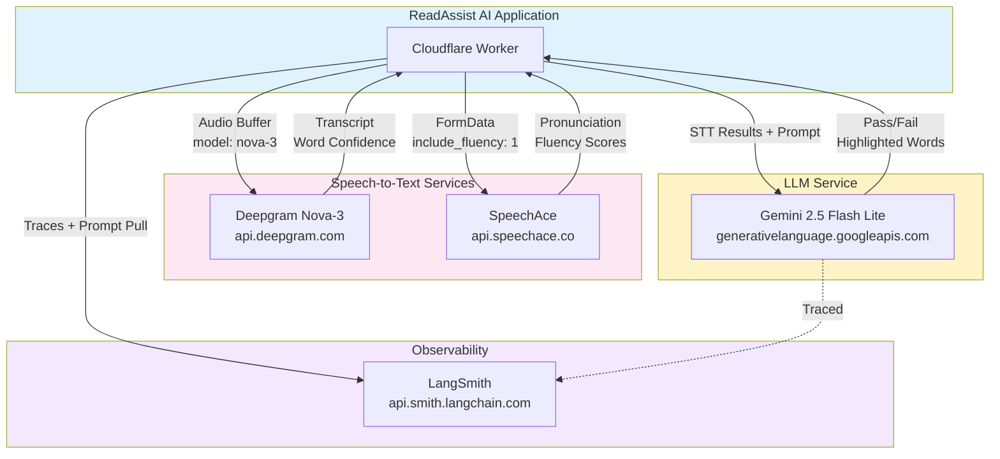

### Deepgram Integration

**Endpoint:** `https://api.deepgram.com/v1/listen`

**Configuration:**
```typescript
{
  smart_format: true,
  model: 'nova-3',
  language: 'en-US'
}
```

**Response Processing:**
- Extract word-level confidence scores
- Calculate accuracy from average confidence
- Identify words below 75% confidence threshold
- Calculate WCPM from correct words and duration

### SpeechAce Integration

**Endpoint:** `https://api.speechace.co/api/scoring/text/v9/json`

**Request Parameters:**
```typescript
{
  text: expectedText,
  user_audio_file: audioFile,
  include_fluency: '1',
  no_mc: '1'
}
```

**Response Processing:**
- Extract pronunciation score (accuracy)
- Extract fluency score
- Get WCPM from `word_correct_per_minute`
- Identify words with quality below 70%
- Detect irrelevant speech from `score_issue_list`

### Gemini LLM Integration

**Model:** `gemini-2.5-flash-lite`

**Input:**
```typescript
{
  deepgram: { wcpm, acc, transcript, wordsWithIssues },
  speechace: { wcpm, acc, fluency, lowQualityWords, irrelevantSpeech },
  expectedSentences: [{ id, content, sequenceNumber }],
  fluency_threshold: number
}
```

**Output Schema:**
```typescript
{
  ui: {
    listOfWordsToHighlight: string[],
    deepgramTeacherFeedback: string,
    speechaceTeacherFeedback: string,
    passOrNoPass: boolean,
    reasonForNoPass: string,
    similarity: number,
    wordsSkipped: string[],
    wordsAdded: string[]
  }
}
```

### LangSmith Integration

**Features:** Prompt Hub (version-controlled prompt storage), Tracing (complete LLM interaction logging), Playground (web-based prompt testing).

**Usage:**
```typescript
// Pull prompt at runtime
const prompt = await Langsmith.pullPrompt();

// Replace variables using mustache templates
const finalPrompt = Langsmith.replacePromptVariables(template, variables, inputs);

// Trace LLM calls
const result = await llmRequest
  .withConfig({ callbacks: [Langsmith.tracer] })
  .invoke(prompt, { runName: `attempt-${attemptId}` });
```

---

## Audio Recording

**Technology:** Web Audio API with MediaRecorder

**Configuration:**
```typescript
{
  mimeType: 'audio/webm;codecs=opus',
  echoCancellation: true,
  noiseSuppression: true,
  sampleRate: 44100
}
```

**Constraints:**
- Maximum audio file size: 10MB
- Supported formats: `audio/webm`, `audio/mp3`, `audio/wav`, `audio/mpeg`, `audio/ogg`

### Audio Recording State Machine

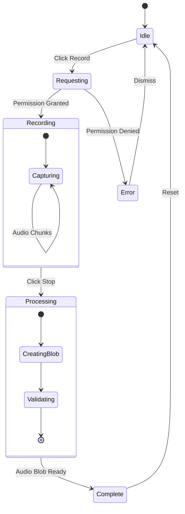

---

## Session State Management

### KV Storage

Sessions are stored in Cloudflare KV with a 1-hour TTL:

**Key Format:** `{classId}:{testId}:{studentAnonymousId}`

**Value Structure:**
```typescript
{
  attemptId: string,
  classId: number,
  testId: number,
  stepNumber: number,
  attemptNumber: number,
  metrics: {
    fluencyScore: number,
    accuracyScore: number,
    wcpm: number,
    highlightedWords: string[]
  },
  passed: boolean,
  completed: boolean,
  createdAt: number
}
```

### Session Lifecycle

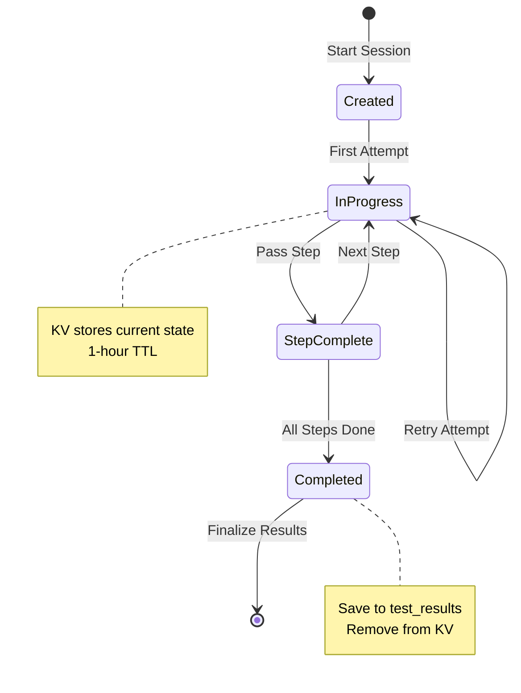

---

## Privacy & COPPA Compliance

### Data Minimization

- No full names stored — only anonymous identifiers (e.g., "J_Smith_7B3X")
- Audio deleted immediately after STT processing
- No persistent cookies or tracking
- Only anonymized metrics retained: WCPM, accuracy, transcriptions, feedback

### LangSmith Data Handling

- No PII transmitted to LangSmith
- Only anonymized attempt IDs and metrics traced
- Only text-based transcriptions, scores, and feedback logged

### Security Measures

- HTTPS-only communication
- HTTP Basic Authentication for access control
- URL parameter validation
- Input validation on all forms
- Rate limiting via Cloudflare
- No direct database access from client

### Data Flow Privacy

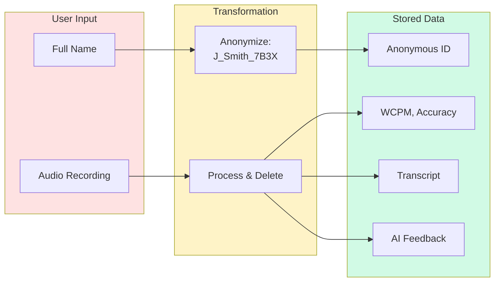

---

## Database Migrations

Drizzle ORM manages 25 migration files in `db/migrations/`:

```bash
# Local
npm run db:migrate:local

# Staging
npm run db:migrate:staging

# Production
npm run db:migrate:production
```

---

## Environment Configuration

### Wrangler Configuration

- **Local Development:** `local-dev` D1 database
- **Staging:** `staging-db` D1 with staging KV namespace
- **Production:** `readassist-production-db` D1 with production KV namespace

### Environment Variables

| Variable | Description |
|----------|-------------|
| `LANGSMITH_TRACING` | Enable LangSmith tracing |
| `LANGSMITH_PROJECT` | LangSmith project name |
| `LANGSMITH_INSTRUCTOR_PROMPT_ID` | Prompt ID in LangSmith Hub |
| `LANGSMITH_API_URL` | LangSmith API endpoint |
| `SPEECHACE_API_URL` | SpeechAce API endpoint |
| `GEMINI_TEMPERATURE` | LLM temperature setting |
| `BASIC_AUTH_USERNAME` | HTTP Basic Auth username |

### Environment Diagram

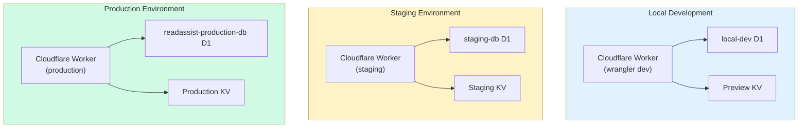

---

## Glossary

| Term | Definition |
|------|------------|
| **Attempt** | Single student reading instance, processed by both STT providers |
| **WCPM** | Words Correct Per Minute — primary fluency metric |
| **Progressive Accumulation** | Reading pattern: sentence 1, then 1+2, then 1+2+3, etc. |
| **Reading Step** | Single assessment unit with its own retry limit |
| **Word Highlighting** | Visual marking of mispronounced words for review |
| **Auto-Progression** | Advancing to next step after max attempts, regardless of pass/fail |
| **D1** | Cloudflare's serverless SQLite database |
| **KV** | Cloudflare's key-value storage service |
