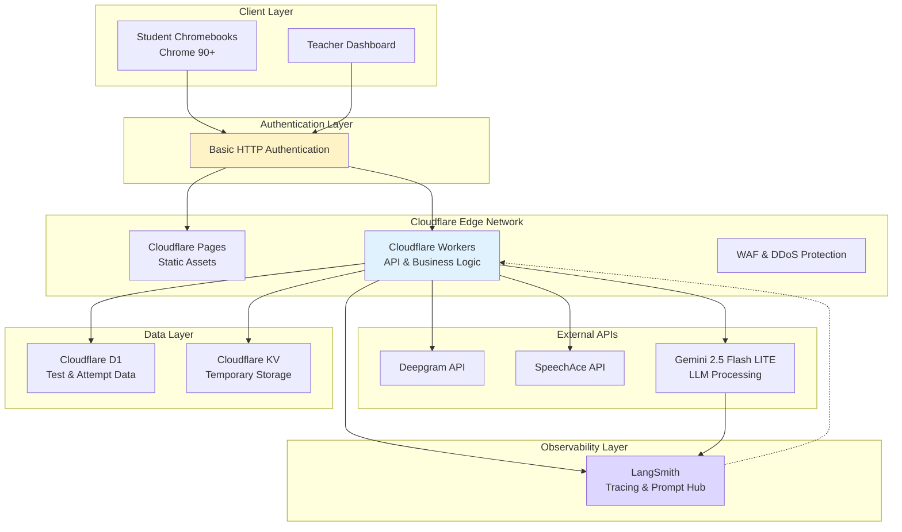
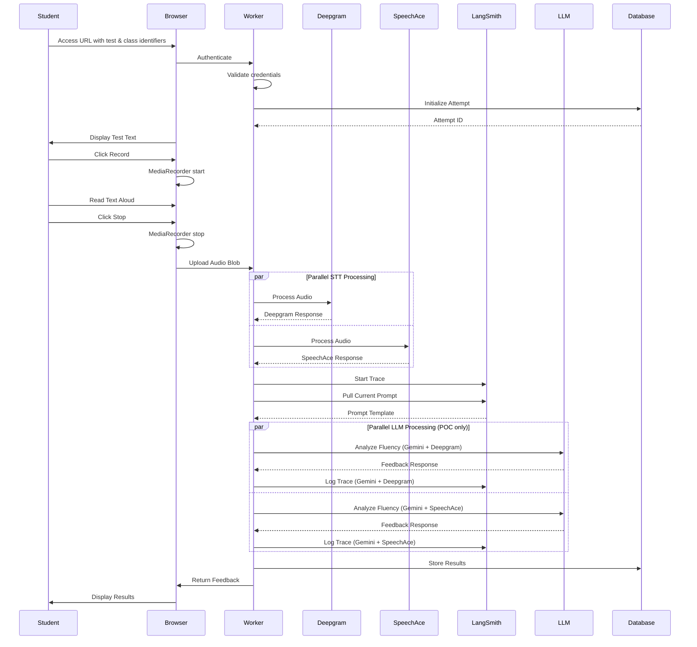
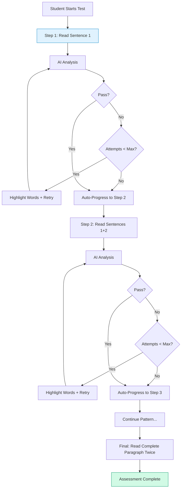
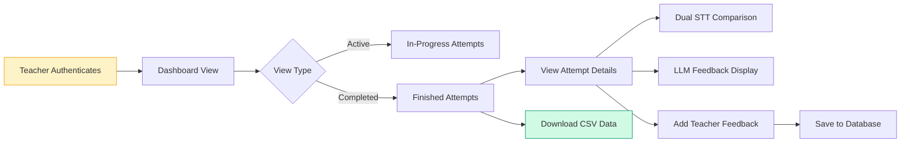
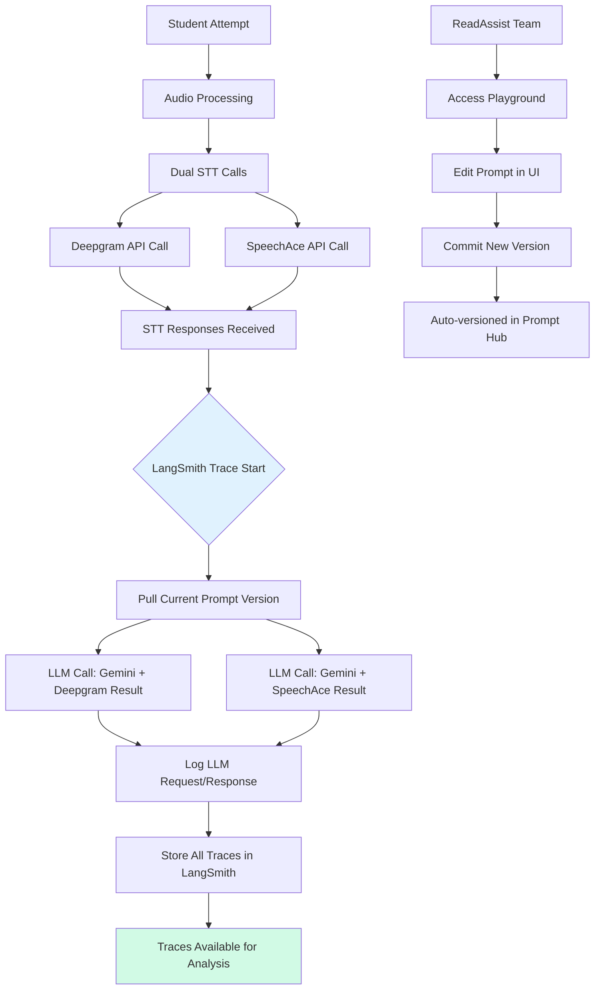
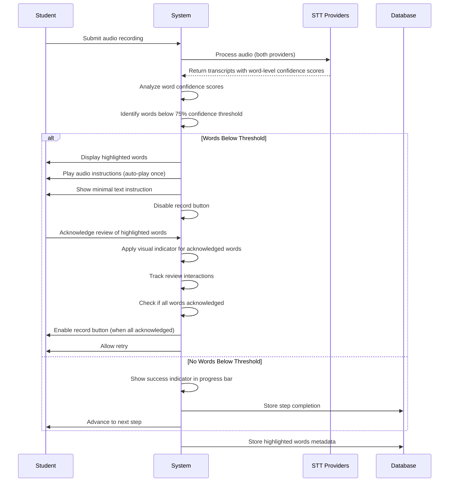
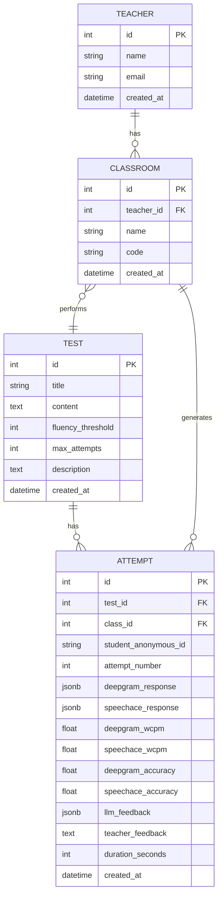

# ReadAssist AI - Technical Requirements Document (TRD)

## 1. Cover Page

**Project Name:** ReadAssist AI – Reading Fluency Assessment System  
**Version:** 4.2  
**Date:** November 18, 2025  
**Author(s):** The Contractor Team  
**Document Status:** Technical Implementation Specification

---

## 2. Introduction

### 2.1 Document Purpose

This Technical Requirements Document (TRD) details the technical vision, architecture, and implementation specifications for the ReadAssist AI Reading Fluency Assessment System. The document provides comprehensive technical guidance for the development, deployment, and maintenance of an AI-powered assessment platform that automates and enhances reading fluency evaluations in K-12 classroom environments.

This TRD translates business requirements into concrete technical specifications, defining the system architecture, technology stack, integration patterns, and infrastructure requirements necessary to deliver a scalable, performant, and cost-effective solution.

### 2.2 Relationship to BRD

This document builds upon the Business Requirements Document (BRD) v2.2 dated November 18, 2025, which defines the business needs, functional requirements, and success criteria for the ReadAssist AI Proof of Concept.

Reference Documents:

- ReadAssist AI Business Requirements Document (BRD) v2.2
- ReadAssist AI Product Requirements Document (PRD) - October 2025

### 2.3 Audience

This document is intended for:

- **Technical Team:** Software engineers, full-stack developers, and AI/ML engineers responsible for implementation
- **Quality Assurance:** Test engineers who will validate the technical implementation against requirements
- **System Architects:** Technical architects responsible for system design and integration patterns
- **DevOps Engineers:** Infrastructure and deployment specialists managing CI/CD pipelines and cloud resources
- **Technical Leadership:** CTOs, engineering managers, and technical leads overseeing the project
- **Security Team:** Security engineers ensuring COPPA compliance and data protection
- **Business Stakeholders:** Product owners, project sponsors, and decision-makers interested in technical feasibility
- **Educational Partners:** School IT administrators and technical coordinators who need to understand system requirements

---

## 3. Technical Architecture

### 3.1 Proposed Architecture

The ReadAssist AI system will be built using a **serverless, edge-first architecture** leveraging Cloudflare's global infrastructure for optimal performance and cost efficiency.

**High-Level Architecture Pattern:**

- **Client Layer:** Standard web application built with Remix
- **Authentication Layer:** Basic HTTP Authentication
- **Edge Layer:** Cloudflare Workers for compute at 275+ global locations
- **API Gateway:** Cloudflare Workers handling routing and rate limiting
- **Services Layer:** Microservices pattern with dedicated workers for STT services and LLM processing
- **Data Layer:** Cloudflare D1 (SQLite at edge) with KV for temporary attempt storage
- **Observability Layer:** LangSmith for observability, management and tracing of prompts

**POC-Specific Architecture:**

- **URL Parameter Routing:** Application routes using test identifier and class identifier parameters
- **Pre-Configured Data:** Development team configures 5 teachers, 5 classes, and 3 tests using data provided by ReadAssist
- **Dual STT Processing:** Every student attempt is processed simultaneously by both Deepgram and SpeechAce; both responses are stored in the database for comparative analysis

### 3.2 Selected Technologies

#### Frontend Stack

- **Framework:** Remix
- **Deployment:** Cloudflare Pages
- **Styling:** Tailwind CSS
- **Audio Capture:** Web Audio API with MediaRecorder

#### Backend Stack

- **Runtime:** Cloudflare Workers
- **API Layer:** Remix loaders/actions
- **Database:** Cloudflare D1
- **Session Storage:** Cloudflare KV
- **Authentication:** HTTP Basic Authentication
- **Prompt Engineering:** LangSmith

#### AI/ML Services

**Speech-to-Text Services:**

Both services process every attempt simultaneously.

**Deepgram Nova-3 API**:

- Pre-recorded audio transcription
- 120+ language support
- Word-level confidence scores
- Cost: $0.0043/minute

**SpeechAce API**:

- Pre-recorded audio processing (max 2 minutes)
- Built-in WCPM calculation
- Pronunciation scoring included
- Educational rubrics (IELTS, CEFR)
- Cost: $125/month base (2,500 minutes included) + $0.05/minute overage

**Large Language Model - Gemini 2.5 Flash LITE:**

- Fluency assessment and feedback generation
- Context window: 1M tokens
- **Free Tier:** 15 Requests per minute
- **Paid Tier:** $0.1 per 1M input tokens, $0.4 per 1M output tokens
- For a 300-word test with feedback: approximately $0.00029 per assessment
- POC can potentially utilize free tier depending on usage patterns

#### Infrastructure Services

**Selected Platform: Cloudflare**

- **CDN:** 275+ Points of presence globally
- **DDoS Protection:** Included
- **WAF:** Cloudflare Web Application Firewall included
- **Analytics:** Included out-of-the-box

#### Observability and Prompt Management

**LangSmith Platform:**

- Comprehensive tracing for LLM API calls
- Prompt Hub for version-controlled prompt management
- Web-based Playground for non-technical prompt editing
- Request/response logging with full metadata capture
- **Pricing:** Developer plan with 5,000 base traces/month included
- **Overage Cost:** $0.0005 per base trace (14-day retention), $0.0045 per extended trace (up to 400-day retention)

### 3.3 Technical Justification

The Cloudflare/Remix architecture was selected based on the following technical criteria:

#### Performance Optimization

- **Sub-50ms cold starts** compared to 150ms+ for Vercel, 500ms+ for Railway
- **Global edge deployment** reduces latency for geographically distributed schools

#### Cost Efficiency

- **77% lower operational costs** compared to alternatives at production scale
- **Linear cost scaling** with pay-per-request model
- **Generous free tier** covers development and initial testing

#### Education-Specific Requirements

- **Simple whitelisting:** Single domain (\*.pages.dev) for school firewalls
- **COPPA compliance:** Anonymized data storage approach

### 3.4 Architecture Diagrams

---

## 4. Technical Requirements Mapping

### 4.1 BR01 → TR01: AI Listening and Evaluation

**Business Requirement:** The system listens as the student reads text aloud and performs AI-based analysis of fluency and pronunciation.

**Technical Implementation:**

**Technical Details:**

1. Student authenticates and accesses URL containing test and class identifiers
2. Unique attempt ID generated automatically
3. Web Audio API captures microphone input
4. MediaRecorder saves audio as WebM/Opus format
5. Complete audio file uploaded
6. Audio processed by both STT providers simultaneously
7. Store processed responses from both providers in database
8. Extract and calculate metrics from both responses:
   - Accuracy percentage
   - Words Correct Per Minute (WCPM)
   - Error patterns
9. Generate feedback via Gemini 2.5 Flash LITE
10. Display results immediately

### 4.2 BR02 → TR02: Progressive Sentence Accumulation and Feedback Loop

**Business Requirement:** Students build reading fluency progressively by accumulating sentences (reading sentence 1, then sentences 1+2, then 1+2+3, etc.). At each reading step, the AI provides feedback and allows retries. Configurable retry limit per reading step prevents extended frustration while maintaining engagement.

**Technical Implementation:**

**Progressive Accumulation Architecture:**

**Implementation Details:**

1. **Sentence Display Logic:**
   - Step 1: Display sentence 1
   - Step 2: Display sentences 1+2
   - Pattern continues until all sentences shown
   - Final two steps: Display complete paragraph

2. **Per-Step Attempt Management:**
   - Track attempts for current step only
   - Reset counter when progressing to next step
   - Load maximum attempts per step from test configuration
   - Enforce limit to prevent student frustration
   - After reaching maximum attempts, system advances to next step with encouraging message

3. **Progress Visualization:**
   - Progress bar segments equal sentence count
   - Each segment fills on step completion

4. **Error Handling:**
   - Word-level error identification and review process detailed in TR-16

### 4.3 BR03 → TR03: Teacher Feedback Interface

**Business Requirement:** Teachers observe the session and can leave qualitative comments post-assessment.

**Technical Implementation:**

**Features:**

- Real-time dashboard updates when new attempts start
- View all attempt metrics with side-by-side STT comparison
- Add qualitative feedback post-assessment
- CSV export functionality for data analysis
- No charts or complex visualizations in POC

### 4.4 BR04 → TR04: Session Tracking and Data Storage

**Business Requirement:** Session data is stored during the POC period to enable teacher review, feedback, and CSV export.

**Technical Details:**

- Attempt data persists in D1 database for analysis
- KV storage for temporary session state (expires after reload)
- No PII stored - only attempt identifiers (first letter + last name + random ID)
- Only anonymized assessment metrics retained during POC
- Data retention decisions at ReadAssist's discretion

### 4.5 BR05 → TR05: Standalone Platform

**Business Requirement:** The PoC must operate independently of ReadAssist's main app while allowing future integration.

**Implementation:**

- Deploy as separate Cloudflare Pages project
- Subdomain deployment (e.g., poc.readassist.ai)
- REST API design for future integration. No OpenAPI docs for POC.
- Modular architecture for easy migration

### 4.6 BR06 → TR06: Chromebook Compatibility

**Business Requirement:** The system must function reliably in web browsers on Chromebooks.

**Technical Specifications:**

- Target Chrome 90+ (covers 95% of school Chromebooks)
- Bundle size optimization (< 500KB initial load)
- Web Workers for heavy computations

### 4.7 BR07 → TR07: Whitelisting and Firewall Access

**Business Requirement:** The platform must be whitelisted by school networks for accessibility.

**Network Requirements:**

- Single domain for whitelisting, e.g. \*.pages.dev
- HTTPS-only communication
- Standard ports (443, 80)

### 4.8 BR08 → TR08: Concurrency Support

**Business Requirement:** System supports up to 100 simultaneous sessions.

**Technical Implementation:**

- Cloudflare Workers automatic scaling
- D1 database concurrent connection handling
- KV storage for distributed session state
- No hard concurrency limits in architecture

### 4.9 BR09 → TR09: Comparative Data Collection

**Business Requirement:** Collect comparative data between both STT providers, as well as between AI-generated and teacher-provided feedback.

**Data Collection Strategy:**

- All attempts include responses from both STT providers
- Metrics stored: WCPM, accuracy, completion time from both providers
- Teacher feedback linked to attempts
- CSV export for comparative analysis

### 4.10 BR10 → TR10: Privacy Compliance

**Business Requirement:** Audio files deleted immediately after processing. Only anonymized assessment metrics retained.

**Privacy Implementation:**

- No persistent storage of PII
- Attempt identifiers use minimal information
- Only anonymized metrics, transcriptions, and feedback retained during POC
- All data transmission encrypted (HTTPS)

### 4.11 BR11 → TR11: Multiple Pre-Configured Reading Tests

**Business Requirement:** The system shall include three distinct reading assessments. Each test will consist of a reading passage divided into individual sentences, fluency and accuracy score thresholds, and a maximum retry limit per reading step provided by ReadAssist's educational team.

**Technical Implementation:**

**Test Configuration:**
- Three tests pre-configured by development team using data provided by ReadAssist educational team
- Each test includes:
  - Reading passage divided into individual sentences
  - Fluency threshold (Words Correct Per Minute target)
  - Accuracy threshold (minimum percentage required)
  - Maximum attempts allowed per reading step
  - Grade level and difficulty description

### 4.12 BR12 → TR12: URL Parameter Routing and POC Configuration

**Business Requirement:** The system shall be pre-configured to support maximum of five teachers and five classes with URL-based access.

**Technical Implementation:**

**URL Structure:**
- Student route: `/student?testId={id}&classId={id}`
- Teacher route: `/teacher?classId={id}`

**Pre-Configuration:**
- Development team configures 5 teachers and 5 classes during setup
- Teacher and class data provided by ReadAssist

**Access Flow:**
1. User authenticates
2. Application extracts test identifier and class identifier from URL
3. Loads appropriate interface based on parameters
4. Data filtered by class identifier for isolation

### 4.13 BR13 → TR13: Dual STT Provider Processing

**Business Requirement:** Each student attempt shall be analyzed simultaneously by both STT providers.

**Technical Implementation:**

**Parallel Processing:**
- Worker initiates parallel API calls to both Deepgram and SpeechAce
- Wait for both responses before proceeding
- Store processed responses in separate JSONB columns

**Teacher Dashboard Display:**
- Side-by-side comparison table

**CSV Export:**
- Include all metrics from both providers
- Separate columns for comparative analysis

### 4.14 BR14 → TR14: LLM Feedback Generation and Teacher Feedback Capture

**Business Requirement:** The system shall generate student-facing feedback using AI and allow teacher observations.

**Technical Implementation:**

**LLM Feedback Generation:**
- Gemini 2.5 Flash LITE generates age-appropriate feedback for K-12
- Input: test content + best transcription from STT providers + system prompt
- Output: Encouraging, actionable feedback in JSON format
- Stored in llm_feedback (JSONB) column

**Teacher Feedback:**
- Teacher dashboard displays LLM-generated feedback
- Text area for teacher to add qualitative observations
- Stored in teacher_feedback (TEXT) column
- Both feedbacks available for CSV export

---

### 4.15 BR15 → TR15: Prompt Observability and Tracing

**Business Requirement:** The system shall implement comprehensive tracing and metadata capture for all AI interactions during the POC period. Enable non-technical educational stakeholders to iteratively refine LLM prompts through LangSmith's Playground interface.

**Technical Implementation:**

**Implementation Details:**

1. **LangSmith SDK Integration:**
   - Application uses LangSmith SDK for tracing and prompt management
   - Wrap all LLM API calls with LangSmith tracing

2. **Trace Capture:**
   - **LLM Traces:** Capture prompt template, input variables (STT transcription from Deepgram or SpeechAce), full request payload, response, token usage, and latency
   - **Metadata:** Include attempt ID, student anonymous ID, test ID, timestamp, attempt number, and STT provider used (Deepgram or SpeechAce)
   - **POC:** Two separate traces per attempt (one for Gemini + Deepgram, one for Gemini + SpeechAce) for comparative analysis
   - **MVP:** Single trace per attempt (Gemini + selected STT provider only)

3. **Prompt Management Workflow:**
   - Store prompts in LangSmith Prompt Hub
   - Application pulls the current version of the prompt at runtime
   - ReadAssist team accesses the Playground to edit prompts
   - Prompt changes automatically versioned with commit hashes
   - No code deployment required for prompt updates

### 4.16 BR16 → TR16: Adaptive Word-Level Feedback

**Business Requirement:** When student performance falls below fluency/accuracy thresholds, the system identifies and highlights specific mispronounced words within the reading text. Students must acknowledge review of each highlighted word before being permitted to retry the reading step. System provides age-appropriate instruction and encouragement during the review process.

**Technical Overview:**

The system analyzes speech-to-text provider responses to identify words with low confidence scores (below 75%). These words are visually highlighted for the student to review. The process repeats until either no words require review or maximum attempts are reached.

**Technical Implementation Flow:**

**Word Identification Process:**
1. Both STT providers return word-level confidence scores
2. System identifies words with confidence below 75% from either provider
3. List of flagged words sent to user interface for highlighting

**Student Review Interface:**
1. Mispronounced words displayed with highlighting
2. Audio instruction automatically plays on first appearance
3. Manual replay available via play button
4. Student acknowledges each highlighted word
5. Visual indicator shows acknowledged words
6. Record button disabled until all words acknowledged
7. Record button enabled with animation when all words acknowledged

**Teacher Visibility:**
- Dashboard displays which words were highlighted per attempt
- Data included in CSV export for analysis

### 4.17 BR17 → TR17: Reading Step Metrics Granularity

**Business Requirement:** System captures detailed performance metrics for each reading step within an assessment attempt. Metrics include fluency percentage, accuracy percentage, words per minute, retry attempt count, and identified problem words. Data is structured to enable teacher analysis of student progression through the reading assessment.

**Technical Implementation:**

**Metrics Captured Per Sentence:**

For each sentence reading within a step, the system captures:
- Fluency percentage
- Accuracy percentage
- Words per minute (WPM)
- Attempt number
- Words that required review (if any)
- Responses from both STT providers (Deepgram and SpeechAce)

**Teacher Dashboard Display:**

**Sentence-by-Sentence Performance View:**
- Expandable sections (one per sentence)
- Section header displays sentence number
- Expanded content shows:
  - Attempt number
  - Fluency percentage
  - Accuracy percentage  
  - WPM
  - Words highlighted (if applicable)

**Full Paragraph Performance View:**
- Displays metrics for complete paragraph reads (final two attempts)
- Same metric structure as sentence-level view

**Provider Feedback Comparison:**
- Side-by-side display of AI-generated feedback from both providers
- Feedback generated by Gemini based on Deepgram analysis
- Feedback generated by Gemini based on SpeechAce analysis

---

## 5. Data Design

### 5.1 Entity Relationship Model

### 5.2 Database Schema

| Table        | Column                   | Type         | Description                                 |
| ------------ | ------------------------ | ------------ | ------------------------------------------- |
| **teachers** | id                       | INTEGER      | Primary key                                 |
|              | name                     | VARCHAR(255) | Teacher name                                |
|              | email                    | VARCHAR(255) | Teacher email                               |
|              | created_at               | TIMESTAMP    | Creation timestamp                          |
| **classes**  | id                       | INTEGER      | Primary key                                 |
|              | teacher_id               | INTEGER      | Foreign key to teachers                     |
|              | name                     | VARCHAR(255) | Class name                                  |
|              | code                     | VARCHAR(50)  | Unique class code for URL routing           |
|              | created_at               | TIMESTAMP    | Creation timestamp                          |
| **tests**    | id                       | INTEGER      | Primary key                                 |
|              | title                    | VARCHAR(255) | Test name                                   |
|              | fluency_threshold        | INTEGER      | Target WCPM for completion                  |
|              | accuracy_threshold       | INTEGER      | Minimum accuracy percentage required        |
|              | max_attempts_per_step    | INTEGER      | Maximum retry attempts per reading step     |
|              | description              | TEXT         | Difficulty level/grade info                 |
|              | created_at               | TIMESTAMP    | Creation timestamp                          |
| **sentences** | id                      | INTEGER      | Primary key                                 |
|              | test_id                  | INTEGER      | Foreign key to tests                        |
|              | content                  | TEXT         | The sentence text                           |
|              | sequence_number          | INTEGER      | Order within the test                       |
|              | created_at               | TIMESTAMP    | Creation timestamp                          |
| **attempts** | id                       | INTEGER      | Primary key                                 |
|              | test_id                  | INTEGER      | Foreign key to tests                        |
|              | class_id                 | INTEGER      | Foreign key to classes                      |
|              | student_anonymous_id     | VARCHAR(50)  | Anonymous identifier (e.g., "J_Smith_7B3X") |
|              | attempt_number           | INTEGER      | Attempt sequence (1=baseline)               |
|              | deepgram_response        | JSONB        | Processed Deepgram API response             |
|              | speechace_response       | JSONB        | Processed SpeechAce API response            |
|              | deepgram_wcpm            | FLOAT        | Words Correct Per Minute from Deepgram     |
|              | speechace_wcpm           | FLOAT        | Words Correct Per Minute from SpeechAce    |
|              | deepgram_accuracy        | FLOAT        | Accuracy percentage from Deepgram          |
|              | speechace_accuracy       | FLOAT        | Accuracy percentage from SpeechAce         |
|              | llm_feedback             | JSONB        | Generated LLM feedback                      |
|              | teacher_feedback         | TEXT         | Teacher's qualitative notes                 |
|              | duration_seconds         | INTEGER      | Total assessment time                       |
|              | created_at               | TIMESTAMP    | Creation timestamp                          |

---

## 6. External Services Integration

### 6.1 Speech-to-Text Integration

Both providers process each attempt simultaneously via parallel API calls.

#### Deepgram Integration

- **Endpoint:** https://api.deepgram.com/v1/listen
- **Authentication:** API Key in header
- **Audio Format:** WebM or Wav

**Word-Level Analysis Requirements:**
- System requests word-level confidence scores from Deepgram API
- Response includes per-word confidence data with timestamps
- Words with confidence below 75% flagged for student review

#### SpeechAce Integration

- **Endpoint:** https://api.speechace.com/api/scoring/text/v9/json
- **Authentication:** API Key in header
- **Audio Format:** WebM or Wav (max 2 minutes)

**Word-Level Scoring:**
- Response includes word-level pronunciation quality scores
- System extracts quality scores per word
- Words with quality score below 75 identified for highlighting

### 6.2 LLM Integration

**Gemini 2.5 Flash LITE Configuration:**

- **Model:** gemini-2.5-flash-lite
- **Context:** ~300 words of test text + student transcription + system prompt
- **Output:** ~500 tokens (age-appropriate JSON feedback with strengths, tips, encouragement for K-12)
- **Token Usage:** ~900 input tokens, ~500 output tokens per assessment
- **Cost per assessment:** (900 × $0.1 + 500 × $0.4) / 1,000,000 = $0.00029
- **Free Tier Limits:** 15 RPM (sufficient for POC testing)

---

## 7. User Interface Standards

### 7.1 Design System

- **Framework:** Remix with Tailwind CSS
- **Responsiveness:** Mobile-first, optimized for Chromebook screens (1366x768)
- **Accessibility:** WCAG 2.1 AA compliance

### 7.2 Authentication Flow

Basic HTTP Authentication protects both portals:
- Teacher Portal: `/teacher?classId={id}`
- Student Portal: `/student?testId={id}&classId={id}`
- Browser native auth dialog

### 7.3 Core Interfaces

**Student Interface:**

- Authenticate, then access URL with parameters
- Display accumulated sentences based on current step
- Progress bar shows completion status across all sentences
- Visual success indicators on progress bar segments
- Simple record/stop controls
- Word review interface when pronunciation needs improvement
- Audio instruction playback with manual replay option
- Visual acknowledgment system for reviewed words
- Record button state management (enabled/disabled based on review completion)
- Minimal text instructions to guide review process
- Show feedback after processing
- Retry button (within attempt limits)

**Teacher Dashboard:**

- Authenticate, then access URL with class identifier
- Two-tab interface: Active | Completed
- Show attempts for specified class only
- **Attempt Details View**:
  - Student anonymous ID
  - Attempt number and timestamp
  - **Sentence-by-Sentence Performance View**:
    - Expandable sections (one per sentence)
    - Metrics: Fluency %, Accuracy %, WPM, Attempt number, Words highlighted
  - **Full Paragraph Performance View**:
    - Displays metrics for complete paragraph reads (final two attempts)
  - **Provider Feedback Comparison**:
    - Side-by-side display of AI-generated feedback from both providers
  - **Teacher Feedback Section**: Text area for observations (save button)
- CSV export functionality

## **Wireframe for POC:** [View Figma Design]([Figma Design Link Removed])

## 8. Security & Compliance

### 8.1 COPPA Compliance

**Data Minimization:**

- No collection of full names or personal details
- Anonymous identifiers only (first letter + last name + random)
- Only anonymized assessment metrics retained during POC
- Data retention decisions at ReadAssist's discretion
- No persistent cookies or tracking

**LangSmith Data Handling:**

- No PII transmitted to LangSmith
- Only anonymized attempt IDs and metrics traced
- Only text-based transcriptions, scores, and feedback logged

### 8.2 Security Measures

- HTTPS-only communication
- Basic HTTP authentication for access control
- URL parameter validation
- Input validation on all forms
- Rate limiting via Cloudflare
- No direct database access from client

---

## 9. Testing Strategy

### 9.1 Testing Approach

**Unit/Integration Testing:**

- Jest framework for JavaScript testing
- Focus on critical business logic
- Mock external API calls

**Manual Testing:**

- Chromebook compatibility verification
- Teacher and student workflow validation
- Performance testing on school networks

**LangSmith Integration Testing:**

- Validate correct prompt versioning, trace filtering, and storage

### 9.2 Acceptance Criteria

- All user stories implemented and functional
- Manual QA completed on target devices
- Basic HTTP auth functionality verified
- URL parameter routing validation
- Dual STT processing verification (both providers for every attempt)
- Performance targets met
- Successful deployment to production

---

## 10. Technical Roadmap

### 10.1 Sprint Plan (4 Weeks Total)

#### Sprint 1: Environment Setup & Foundations (Week 1)

- Cloudflare environment configuration
- Database schema implementation (all tables: teachers, classes, tests, attempts)
- Basic project structure with Remix
- HTTP Basic authentication setup
- Initial UI components
- LangSmith SDK integration and tracing setup

#### Sprint 2: Configuration & Core Development (Week 2)

- Pre-configure 5 teachers, 5 classes, 3 tests in database
- Implement sentence accumulation display logic
- Build per-step attempt tracking
- Create word highlighting backend logic
- Add test configuration fields to database (accuracy_threshold, max_attempts_per_step)
- Student interface implementation
- Teacher dashboard development
- Audio recording functionality
- Parallel dual STT provider integration
- Gemini feedback generation
- Initial prompt creation and upload to Prompt Hub
- Test prompt pull and LLM integration with LangSmith tracing

#### Sprint 3: UI Refinement & Comparison Features (Week 3)

- UI polish and responsiveness
- Build word highlighting frontend UI
- Implement instruction panel with audio
- Create per-step metrics display in teacher dashboard
- Build attempt counter and auto-progression UI
- Add audio instruction file to project
- Dual STT comparison UI in teacher dashboard
- Real-time dashboard updates
- CSV export functionality
- Teacher feedback system
- Validation of prompt iteration workflow

#### Sprint 4: QA & Deployment (Week 4)

- Comprehensive testing on Chromebooks
- Bug fixes and refinements
- Performance optimization
- Production deployment
- Documentation finalization

### 10.2 Deliverables Timeline

| Week | Deliverables                                   |
| ---- | ---------------------------------------------- |
| 1    | Infrastructure ready, database schema deployed |
| 2    | Core functionality complete, APIs integrated, data pre-configured   |
| 3    | Full UI implemented, dual STT comparison functional    |
| 4    | Production-ready system deployed               |

---

## 11. Infrastructure Cost Analysis

**Note on LangSmith Plans:** LangSmith offers a Plus plan at $39/month which includes 10,000 base traces/month, email support, and up to 10 seats for enhanced team collaboration. Enterprise plans with custom SLA options are available by contacting the sales team. All cost calculations in this document are based on the Developer plan (5,000 free traces/month + $0.0005 per base trace overage).

**Assumptions:** Each student takes one 5-minute test per week (20 minutes per month)

### 11.1 POC Infrastructure Costs (Per Month)

| Service                   | Component          | Fixed Cost | Variable Cost         | Source                                                                         |
| ------------------------- | ------------------ | ---------- | --------------------- | ------------------------------------------------------------------------------ |
| **Cloudflare Pages**      | Free tier          | $0         | -                     | [Pricing](https://pages.cloudflare.com/#pricing)                               |
|                           | 500 builds/month   |            |                       |                                                                                |
|                           | 100k requests/day  |            |                       |                                                                                |
| **Cloudflare D1**         | First 5GB          | $0         | $0.75/GB after 5GB    | [D1 Pricing](https://developers.cloudflare.com/d1/platform/pricing/)           |
| **Deepgram**              | Nova-3 STT         | -          | $0.0043/minute        | [Pricing](https://deepgram.com/pricing)                                        |
| **SpeechAce**             | Premium Plan       | $125       | -                     | [API Plans](https://www.speechace.com/api-plans/#pricing)                      |
|                           | 2,500 min included |            |                       |                                                                                |
|                           | Overage            | -          | $0.0125/15-sec        |                                                                                |
| **Gemini 2.5 Flash LITE** | Free tier (15 RPM) | $0         | -                     | [Pricing](https://ai.google.dev/gemini-api/docs/pricing#gemini-2.5-flash-lite) |
|                           | Paid tier          | -          | $0.1/1M input tokens  |                                                                                |
|                           |                    | -          | $0.4/1M output tokens |                                                                                |
| **LangSmith** | Developer Plan | $0 | - | [Pricing](https://www.langchain.com/pricing) |
| | Up to 5,000 traces/mo | | | |
| | Overage | - | $0.0005/base trace (14-day retention) | |
| | | - | $0.0045/extended trace (400-day retention) | |
| | Plus Plan | $39 | - | |
| | Up to 10,000 traces/mo | | | |
| | Overage | - | $0.0005/base trace (14-day retention) | |
| | | - | $0.0045/extended trace (400-day retention) | |
| | Enterprise Plan | Contact for pricing with SLA options | | |

### 11.2 Cost Calculations by Phase and Scale

#### POC Phase (100 Students)

POC processes all attempts with both STT providers simultaneously.

**LangSmith Trace Calculation:**
- 100 students × 3 attempts × 2 LLM calls (dual STT testing) × 4 weeks = 2,400 traces/month
- Within 5,000 Developer plan free tier limit
- Cost per student: $0/student/month

| Provider Setup          | Fixed Costs | Variable Costs | Total Monthly |
| ----------------------- | ----------- | -------------- | ------------- |
| **Deepgram + Gemini**   |             |                |               |
| - Cloudflare            | $0          | -              | $0            |
| - Deepgram (2,000 min)  | -           | $8.60          | $8.60         |
| - Gemini 2.5 Flash Lite | $0          | $0.12          | $0.12         |
| - LangSmith (2,400 traces) | $0 | $0 | $0 |
| **Total Deepgram**      | **$0**      | **$8.72**      | **$8.72**     |
|                         |             |                |               |
| **SpeechAce + Gemini**  |             |                |               |
| - Cloudflare            | $0          | -              | $0            |
| - SpeechAce             | $125        | $0\*           | $125          |
| - Gemini 2.5 Flash Lite | $0          | $0.12          | $0.12         |
| - LangSmith (2,400 traces) | $0 | $0 | $0 |
| **Total SpeechAce**     | **$125**    | **$0.12**      | **$125.12**   |

\*2,000 minutes within SpeechAce's 2,500 included minutes

**Total POC Monthly Cost: $133.96**

#### MVP Phase (1,000 Students)

**LangSmith Trace Calculation:**
- 1,000 students × 3 attempts × 1 LLM call (Gemini + selected STT provider only) × 4 weeks = 12,000 traces/month
- First 5,000 traces free (Developer plan)
- Overage: 7,000 traces × $0.0005 = $3.50/month
- **Total LangSmith cost:** $3.50/month
- Cost calculation: $3.50 / 1,000 students = $0.0035/student/month

| Provider Setup          | Fixed Costs | Variable Costs | Total Monthly |
| ----------------------- | ----------- | -------------- | ------------- |
| **Deepgram + Gemini**   |             |                |               |
| - Cloudflare Pages      | $25         | -              | $25           |
| - D1 Storage\*          | $0          | -              | $0            |
| - Deepgram (20,000 min) | -           | $86.00         | $86.00        |
| - Gemini 2.5            | -           | $1.16          | $1.16         |
| - LangSmith (12,000 traces) | $0 | $3.50 | $3.50 |
| **Total Deepgram**      | **$25**     | **$90.66**     | **$116.82**   |
|                         |             |                |               |
| **SpeechAce + Gemini**  |             |                |               |
| - Cloudflare Pages      | $25         | -              | $25           |
| - D1 Storage\*          | $0          | -              | $0            |
| - SpeechAce base        | $125        | -              | $125          |
| - SpeechAce overage†    | -           | $875           | $875          |
| - Gemini 2.5            | -           | $1.16          | $1.16         |
| - LangSmith (12,000 traces) | $0 | $3.50 | $3.50 |
| **Total SpeechAce**     | **$150**    | **$879.66**    | **$1,030.82** |

\*Database storage: <10 MB/month for 1,000 students, well within 5GB free tier

†17,500 minutes overage = 70,000 × 15-sec blocks × $0.0125 = $875

#### General Availability (10,000 Students)

**LangSmith Trace Calculation:**
- 10,000 students × 3 attempts × 1 LLM call (Gemini + selected STT provider only) × 4 weeks = 120,000 traces/month
- First 5,000 traces free (Developer plan)
- Overage: 115,000 traces × $0.0005 = $57.50/month
- **Total LangSmith cost:** $57.50/month
- Cost calculation: $57.50 / 10,000 students = $0.00575/student/month

**Note:** Due to rate limiting considerations at this scale, an Enterprise subscription should be evaluated for General Availability deployment. Enterprise plans include custom SLA options and enhanced rate limits.

| Provider Setup           | Fixed Costs | Variable Costs | Total Monthly |
| ------------------------ | ----------- | -------------- | ------------- |
| **Deepgram + Gemini**    |             |                |               |
| - Cloudflare Pages       | $25         | -              | $25           |
| - D1 Storage\*           | $0          | $0             | $0            |
| - Deepgram (200,000 min) | -           | $860.00        | $860.00       |
| - Gemini 2.5             | -           | $11.60         | $11.60        |
| - LangSmith (120,000 traces) | $0 | $57.50 | $57.50 |
| **Total Deepgram**       | **$25**     | **$929.10**    | **$965.70**   |

\*Database storage: 96 MB/month for 10,000 students, well within 5GB free tier

**Note:** SpeechAce requires enterprise pricing at this scale

### 11.3 Cost Formula 

**Per-Student LangSmith Cost:**

- **POC:** $0/student (within 5,000 free traces)
- **MVP:** $0.0035/student
- **GA:** $0.00575/student

**Deepgram Configuration:**

- **Formula MVP:** $25 fixed + ($0.0907 × number of students)
- **MVP (1,000 students):** $25 + $90.7 = **$115.66/month**
- **Formula GA:** $25 fixed + ($0.093 × number of students)
- **GA (10,000 students):** $25 + $930 = **$955/month**

**SpeechAce Configuration:**    

- **Formula (MVP, >125 students):** $150 fixed + ($1.0016 × number of students above 125) + ($0,0035 × total number of students)
- **MVP (1,000 students):**  $150 + $876.16 + $3.5 = $1,029.66/month
- **Formula (GA, 10,000 students):** $150 fixed + ($1.0016 × number of students above 125) + ($0,00575 × total number of students)
- **GA:** Requires enterprise contract & pricing evaluation

## 12. MVP Enhancement Recommendations

The following enhancements are recommended for the MVP phase (post-POC):

### 12.1 Feature Enhancements

- Multiple test management interface
- Student progress tracking over time
- Advanced analytics dashboard with charts
- Batch student management for teachers
- Custom rubric configuration

**Deferred from POC to MVP:**
- Phoneme-level pronunciation analysis with detailed phonetic feedback
- Interactive word correction exercises beyond simple acknowledgment
- AI-generated audio pronunciation modeling (Text-to-Speech integration)
- Skipped/added words detection
- Adaptive difficulty adjustment based on historical performance patterns
- Real-time pronunciation coaching during reading

### 12.2 Technical Enhancements

- API rate limiting and API Queue
- Comprehensive audit logging

### 12.3 Integration Capabilities

- LMS integration with ReadAssist
- REST API for third-party integrations

### 12.4 Security & Compliance

- Full COPPA compliance audit
- Penetration testing
- Advanced encryption for data at rest
- Role-based access control

### 12.5 Scalability Improvements

- Load testing for 10,000+ concurrent users
- Disaster recovery planning
- Multi-region deployment

---

## 13. Appendices

### 13.1 Technical Glossary

| Term           | Definition                                                                        |
| -------------- | --------------------------------------------------------------------------------- |
| **Attempt**    | A single instance of a student reading a test, processed by both STT providers, including all metrics and feedback |
| **Test**       | A collection of text for students to read, with configured thresholds and limits  |
| **WCPM**       | Words Correct Per Minute - key fluency metric                                     |
| **D1**         | Cloudflare's serverless SQLite database                                           |
| **KV**         | Cloudflare's key-value storage service                                            |
| **Basic Auth** | HTTP Basic Authentication for access control                                      |
| **Test Identifier** | Unique identifier passed via URL parameter for test routing |
| **Class Identifier** | Unique identifier passed via URL parameter for class routing |
| **Dual STT Processing** | Simultaneous processing by both STT providers for comparative analysis |
| **Anonymized Metrics** | Assessment data stored without PII: WCPM scores, accuracy percentages, transcriptions, and feedback |
| **LangSmith** | Observability and development platform for LLM applications providing tracing, prompt management, and evaluation tools |
| **Prompt Hub** | LangSmith's version-controlled repository for storing and managing LLM prompts |
| **Trace** | Complete record of an API interaction including request, response, latency, and metadata |
| **Base Trace** | Standard trace record for single LLM or tool call with 14-day retention |
| **Extended Trace** | Enhanced trace with additional debugging metadata and context with up to 400-day retention |
| **Playground** | LangSmith's web-based interface for interactive prompt testing and editing |
| **Progressive Accumulation** | Frontend rendering pattern where displayed text grows by adding one sentence at each step (1, then 1+2, then 1+2+3, etc.) |
| **Reading Step** | Single assessment unit consisting of accumulated sentences, with its own retry limit and performance metrics |
| **Word Highlighting** | DOM manipulation technique to apply visual styles to identified mispronounced words for student review |
| **Attempt Limiting** | Business logic that enforces configurable maximum retry attempts per reading step with automatic progression fallback |
| **Per-Step Metrics** | Nested JSONB data structure capturing independent performance data for each reading step within an overall assessment |
| **Word Review State** | Frontend component state tracking which highlighted words student has clicked/acknowledged for review |
| **Auto-Progression** | System behavior that advances student to next reading step after maximum retry attempts, regardless of pass/fail status |

### 13.2 External Documentation

1. **ReadAssist AI Business Requirements Document (BRD)** - Version 2.2, November 18, 2025
2. **ReadAssist AI Product Requirements Document (PRD)** - October 2025
3. [Deepgram API Documentation](https://developers.deepgram.com)
4. [SpeechAce API Documentation](https://www.speechace.com/docs/api/)
5. [Gemini 2.5 Flash LITE Documentation](https://ai.google.dev/gemini-api/docs)
6. [Cloudflare Developer Documentation](https://developers.cloudflare.com)
7. [Remix Framework Documentation](https://remix.run/docs)
8. [ReadAssist UI Wireframes]([Figma Design Link Removed])
9. [LangSmith Documentation](https://docs.smith.langchain.com/)
10. [LangSmith Prompt Management Guide](https://docs.smith.langchain.com/prompt_engineering)

---

### 13.3 Document Revision History

| Version | Date | Author | Description of Changes |
|---------|------|--------|------------------------|
| **1.0** | **October 20, 2025** | **The Contractor** | **Initial TRD creation including business requirements mapping, architecture diagrams, and technical specifications.** |
| **2.0** | **October 22, 2025** | **The Contractor** | **Added comprehensive sections including data design, external services integration, user interface standards, security and compliance, testing strategy, technical roadmap, and appendices.** |
| **3.0** | **October 27, 2025** | **The Contractor** | **Incorporated architecture feedback, updated document formatting, added external documentation links, included infrastructure pricing and cost analysis, and refined architecture specifications.** |
| **4.0** | **October 31, 2025** | **The Contractor** | **Added TR11 (Multiple Pre-Configured Reading Tests), TR12 (POC Configuration and URL-Based Access Model), TR13 (Dual Speech Recognition Provider Evaluation), and TR14 (AI-Generated Feedback with Teacher Validation). Updated architecture to implement parallel dual STT processing (Deepgram and SpeechAce simultaneously). Updated all related sections including data flow, cost analysis, and technical specifications to reflect dual STT architecture.** |
| **4.1** | **November 04, 2025** | **The Contractor** | **Added TR15 (Prompt Observability and Tracing) with LangSmith integration. Updated Section 3.1 (Architecture) to include LangSmith platform. Added Section 3.2 (Observability and Prompt Management) with LangSmith specifications including Developer plan for POC/MVP and notes on Plus and Enterprise plans. Added Section 4.15 (BR15 → TR15 mapping) with technical implementation details. Updated Section 8.1 (COPPA Compliance) for LangSmith data handling. Updated Section 9 (Testing Strategy) to include LangSmith integration testing. Updated Section 10.1 (Sprint Plan) with LangSmith SDK setup. Updated Section 11 (Infrastructure Costs) to include LangSmith pricing analysis with Developer plan calculations (2,400 POC traces, 12,000 MVP traces, 120,000 GA traces) including per-student costs and trace retention details. Updated Section 12.2 (MVP Enhancements) with advanced LangSmith features. Updated Section 13.1 (Glossary) with LangSmith terminology including base trace and extended trace definitions. Updated Section 13.2 (External Documentation) with LangSmith resources. Updated reference to BRD v2.1. Added Appendix 13.3 (Document Revision History).** |
| **4.2** | **November 18, 2025** | **The Contractor** | **Updated TR-02 to implement progressive sentence accumulation reading methodology with per-step attempt limiting and auto-progression. Updated TR-11 to reflect sentence-structured tests with accuracy thresholds and per-step retry configuration. Added TR-16 (Adaptive Word-Level Feedback) with STT word-level confidence analysis, frontend highlighting implementation, audio instruction system, and review state tracking. Added TR-17 (Reading Step Metrics Granularity) with sentence-level metrics capture and teacher dashboard sentence-by-sentence display specifications. Updated database schema: removed max_attempts field from tests table, added accuracy_threshold and max_attempts_per_step fields, added new sentences table with test_id foreign key for sentence-level content storage. Enhanced STT integration section with word-level analysis requirements for both Deepgram (confidence scores) and SpeechAce (quality scores). Updated Section 7.3 (Core Interfaces) with progressive reading display, word review interface, sentence-by-sentence performance view, and provider feedback comparison. Updated sprint plan (Sections 10.1) with additional tasks: sentence accumulation logic, word highlighting, per-step metrics display, instruction panel with audio (6 additional days allocated across sprints 2-3). Added deferred features to MVP recommendations (Section 12.1): phoneme-level analysis, interactive correction exercises, TTS integration, word detection, adaptive difficulty, real-time coaching. Added 7 new technical glossary terms: Progressive Accumulation, Reading Step, Word Highlighting, Attempt Limiting, Per-Step Metrics, Word Review State, Auto-Progression. Updated BRD reference to v2.2. All changes aligned with BRD v2.2 requirements for progressive accumulation methodology and adaptive word-level feedback.** |

---
