# PartnerHub AI Support Agent - Technical Requirements Document (TRD)

## 1. Cover Page

| Field               | Details                                        |
| ------------------- | ---------------------------------------------- |
| **Project Name**    | PartnerHub AI Support Agent                     |
| **Client**          | PartnerHub                                      |
| **Version**         | 1.1                                            |
| **Date**            | January 28, 2026                               |
| **Document Author** | The Contractor Team           |
| **Status**          | Final - Ready for Client Approval              |
| **ADR Reference**   | [support-agent-adr.md](./support-agent-adr.md) |

> **Note:** Architecture decision rationale (why technologies were chosen, alternatives considered) is documented in the [Architecture Decision Records (ADR)](./support-agent-adr.md). This TRD focuses on implementation details (how the system is built).

---

## Table of Contents

1. [Cover Page](#1-cover-page)
2. [Introduction](#2-introduction)
   - [2.1 Document Purpose](#21-document-purpose)
   - [2.2 Relationship to BRD](#22-relationship-to-brd)
   - [2.3 Audience](#23-audience)
   - [2.4 Document Overview](#24-document-overview)
3. [Technical Architecture](#3-technical-architecture)
   - [3.1 Proposed Architecture](#31-proposed-architecture)
   - [3.2 Technology Stack](#32-technology-stack)
   - [3.3 Architecture Diagrams](#33-architecture-diagrams)
4. [Technical Requirements Mapping](#4-technical-requirements-mapping)
   - [4.1 BR-01 → TR-01: Unified AI Chat Interface](#41-br-01--tr-01-unified-ai-chat-interface)
   - [4.2 BR-02 → TR-02: Email Redirect System](#42-br-02--tr-02-email-redirect-system)
   - [4.3 BR-03 → TR-03: Initial Support Classification](#43-br-03--tr-03-initial-support-classification)
   - [4.4 BR-04 → TR-04: Platform Identification](#44-br-04--tr-04-platform-identification)
   - [4.5 BR-05 → TR-05: Embrace API Integration](#45-br-05--tr-05-embrace-api-integration)
   - [4.6 BR-06 → TR-06: Multi-Attempt Embrace Conversations](#46-br-06--tr-06-multi-attempt-embrace-conversations)
   - [4.7 BR-07 → TR-07: Business Hours Live Agent Handoff](#47-br-07--tr-07-business-hours-live-agent-handoff)
   - [4.8 BR-08 → TR-08: Live Agent Option for Problem Reports](#48-br-08--tr-08-live-agent-option-for-problem-reports)
   - [4.9 BR-09 → TR-09: Outage Detection and PagerDuty Integration](#49-br-09--tr-09-outage-detection-and-pagerduty-integration)
   - [4.10 BR-10 → TR-10: Classic Platform ASPX Detection](#410-br-10--tr-10-classic-platform-aspx-detection)
   - [4.11 BR-11 → TR-11: Module-Based Ticket Routing](#411-br-11--tr-11-module-based-ticket-routing)
   - [4.12 BR-12 → TR-12: Problem Information Gathering](#412-br-12--tr-12-problem-information-gathering)
   - [4.13 BR-13 → TR-13: Change Request Processing](#413-br-13--tr-13-change-request-processing)
   - [4.14 BR-14 → TR-14: Zendesk Ticket Creation](#414-br-14--tr-14-zendesk-ticket-creation)
   - [4.15 BR-15 → TR-15: Feedback Collection](#415-br-15--tr-15-feedback-collection)
   - [4.16 BR-16 → TR-16: Session Management and Context](#416-br-16--tr-16-session-management-and-context)
5. [Non-Functional Requirements](#5-non-functional-requirements)
   - [5.1 Security](#51-security)
   - [5.2 Performance](#52-performance)
   - [5.3 Scalability](#53-scalability)
   - [5.4 Availability](#54-availability)
   - [5.5 Usability](#55-usability)
   - [5.6 Maintainability](#56-maintainability)
6. [Data Design](#6-data-design)
   - [6.1 Database Tables Overview](#61-database-tables-overview)
   - [6.2 Entity-Relationship Model](#62-entity-relationship-model)
   - [6.3 Data Dictionary](#63-data-dictionary)
   - [6.4 Database Versioning and Migration Policies](#64-database-versioning-and-migration-policies)
7. [Integrations and APIs](#7-integrations-and-apis)
   - [7.1 External Services](#71-external-services)
   - [7.2 API Specifications](#72-api-specifications)
8. [User Interface (Technical)](#8-user-interface-technical)
   - [8.1 Design System](#81-design-system)
   - [8.2 Key UI Components](#82-key-ui-components)
   - [8.3 Form Validation](#83-form-validation)
9. [Infrastructure Requirements](#9-infrastructure-requirements)
   - [9.1 Environments](#91-environments)
   - [9.2 CI/CD Pipeline](#92-cicd-pipeline)
   - [9.3 Scheduled Jobs](#93-scheduled-jobs)
10. [Testing and QA](#10-testing-and-qa)
    - [10.1 Testing Strategy Overview](#101-testing-strategy-overview)
    - [10.2 AI Model Testing (Evals)](#102-ai-model-testing-evals)
    - [10.3 Integration Testing (Deterministic State Transitions)](#103-integration-testing-deterministic-state-transitions)
11. [Technical Assumptions and Limitations](#11-technical-assumptions-and-limitations)
    - [11.1 Assumptions](#111-assumptions)
    - [11.2 Limitations](#112-limitations)
    - [11.3 Technology Dependencies](#113-technology-dependencies)
    - [11.4 External Dependencies (Client-Provided Requirements)](#114-external-dependencies-client-provided-requirements)
12. [Technical Roadmap](#12-technical-roadmap)
    - [12.1 Cycle 1: Foundation & Infrastructure](#121-cycle-1-foundation--infrastructure)
    - [12.2 Cycle 2: AI Integration & Core Chat Flow](#122-cycle-2-ai-integration--core-chat-flow)
    - [12.3 Cycle 3: Zendesk Integration & Ticket Creation](#123-cycle-3-zendesk-integration--ticket-creation)
    - [12.4 Cycle 4: Live Agent Handoff & Sunshine Conversations](#124-cycle-4-live-agent-handoff--sunshine-conversations)
    - [12.5 Cycle 5: Testing & Performance Optimization](#125-cycle-5-testing--performance-optimization)
    - [12.6 Cycle 6: Deployment & Final Testing](#126-cycle-6-deployment--final-testing)
13. [Infrastructure Cost Analysis](#13-infrastructure-cost-analysis)
    - [13.1 Cost Assumptions](#131-cost-assumptions)
    - [13.2 Cost Breakdown by Service](#132-cost-breakdown-by-service)
    - [13.3 Cost Projections by Phase](#133-cost-projections-by-phase)
14. [Appendices](#14-appendices)
    - [14.1 Technical Glossary](#141-technical-glossary)
    - [14.2 External Documentation](#142-external-documentation)
    - [14.3 Document Revision History](#143-document-revision-history)

---

## 2. Introduction

### 2.1 Document Purpose

Details the technical architecture and implementation for the PartnerHub AI Support Agent — an AI-powered support system automating workflows, integrating with Embrace API for documentation search, and handing off to live agents when needed.

### 2.2 Relationship to BRD

Maps BR-01 to BR-16 to Technical Requirements (TR-01 to TR-16) with implementation details, security considerations, and acceptance criteria.

**Reference Documents:**

- PartnerHub AI Support Agent Business Requirements Document (BRD) v2.0 - December 4, 2025
- Embrace API Documentation
- Zendesk API Documentation
- PagerDuty API Documentation

### 2.3 Audience

- **Technical Team:** Engineers and AI/ML developers responsible for implementation
- **QA:** Test engineers validating against requirements
- **Architects & DevOps:** System design, CI/CD, and infrastructure
- **Technical Leadership:** CTOs, engineering managers overseeing the project
- **Security Team:** Compliance and data protection
- **Business Stakeholders:** Product owners and decision-makers
- **Integration Partners:** Embrace, Zendesk, PagerDuty technical coordinators

### 2.4 Document Overview

See [Table of Contents](#table-of-contents) for document structure.

---

## 3. Technical Architecture

### 3.1 Proposed Architecture

**High-Level Architecture Pattern:**

- **Client Layer:** JavaScript widget embedded in PartnerHub portal via simple script tag. Chat SDK provides `widget-loader.js` that handles widget initialization, UI rendering, and communication with backend. Uses Shadow DOM for CSS isolation and integrates seamlessly with parent application through JWT-based authentication.

- **Authentication Layer:** JWT-based authentication signed by PartnerHub portal with public key validation. No separate authentication system required—leverages existing PartnerHub user sessions. Chat SDK's authentication middleware validates JWT tokens.

- **API Layer:** Next.js API Routes (from Chat SDK) serving as unified API gateway. Handles all client requests, AI interactions, external service integrations, and database operations. Chat SDK provides base chat API routes that we extend with custom business logic.

- **Services Layer:**
  - **AI Classification Service:** Natural language understanding for user intent and response classification
  - **State Machine Service:** XState-powered conversation flow management with deterministic state transitions (integrates with Chat SDK's message flow)
  - **Embrace Integration Service:** Documentation search and AI-powered answer generation
  - **Zendesk Integration Service:** Ticket creation with full transcript and custom field management
  - **Sunshine Conversations Service:** Live agent handoff with warm context transfer

- **Data Layer:**
  - **Primary Database:** PostgreSQL (Railway-managed) for conversations, messages, tickets, feedback, and configuration
  - **Chat SDK Tables:** Base tables for messages, conversations, and users (provided by Chat SDK)
  - **Custom Tables:** XState state machine snapshots and business logic data
  - **Business Configuration:** Timezone-aware business hours schedule stored in `business_config` table (JSONB)
  - **Session State:** JSONB-based state machine persistence for conversation context

### 3.2 Technology Stack

> **Decision Rationale:** For detailed information on why each technology was chosen, alternatives considered, and trade-offs, see the [Architecture Decision Records (ADR)](./support-agent-adr.md).

| Layer                 | Technology                      | Version | Purpose                                                                         | ADR Reference                                                            |
| --------------------- | ------------------------------- | ------- | ------------------------------------------------------------------------------- | ------------------------------------------------------------------------ |
| **Framework**         | Vercel Chat SDK (Next.js)       | 15.x    | Production-ready chat infrastructure with UI, database schema, widget embedding | [ADR-001](./support-agent-adr.md#adr-001-chat-widget-platform-selection) |
| **Hosting**           | Railway                         | -       | Zero-downtime deploys, automatic HTTPS, built-in PostgreSQL                     | [ADR-002](./support-agent-adr.md#adr-002-hosting-platform-selection)     |
| **Database**          | PostgreSQL                      | 16.x    | ACID-compliant storage with JSONB for flexible state                            | [ADR-003](./support-agent-adr.md#adr-003-database-technology-selection)  |
| **State Machine**     | XState                          | v5      | Deterministic conversation flow with persistence                                | [ADR-004](./support-agent-adr.md#adr-004-state-management-selection)     |
| **AI Provider**       | Gemini 2.5 Flash / GPT-4.1 mini | -       | Intent classification and response generation                                   | [ADR-005](./support-agent-adr.md#adr-005-ai-model-selection)             |
| **Widget Embedding**  | Chat SDK Widget Loader          | -       | Script tag integration with Shadow DOM isolation                                | [ADR-006](./support-agent-adr.md#adr-006-widget-embedding-strategy)      |
| **External Services** | Zendesk + Embrace + Sunshine    | -       | Ticketing, documentation search, live agent handoff                             | -                                                                        |

**Tech Stack Summary:** Vercel Chat SDK (Next.js 15 App Router) + React/TypeScript/Tailwind, Node.js 20 LTS, PostgreSQL 16 (Railway) with Prisma ORM, XState v5, Gemini 2.5 Flash / GPT-4.1 mini, SSE via Vercel AI SDK. Chat SDK provides UI/schema/widget/auth; XState adds business logic coordinating via `useChat()` hook.

> See [ADR-007: Chat SDK + XState Integration Architecture](./support-agent-adr.md#adr-007-chat-sdk--xstate-integration-architecture) for decision rationale.

---

### 3.3 Architecture Diagrams

#### 3.3.1 High-Level System Architecture

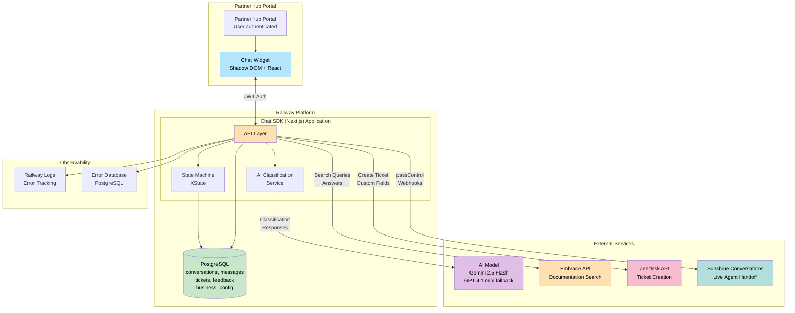
```mermaid
graph TB
    subgraph "PartnerHub Portal"
        Portal[PartnerHub Portal<br/>User authenticated]
        Widget[Chat Widget<br/>Shadow DOM + React]
        Portal --> Widget
    end

    subgraph "Railway Platform"
        subgraph "Chat SDK (Next.js) Application"
            API[API Layer<br/>]
            StateMachine[State Machine<br/>XState]
            AIClass[AI Classification<br/>Service]
        end

        DB[(PostgreSQL<br/>conversations, messages<br/>tickets, feedback<br/>business_config)]

        API --> StateMachine
        API --> AIClass
        StateMachine --> DB
        API --> DB
    end

    subgraph "External Services"
        AIModel[AI Model<br/>Gemini 2.5 Flash<br/>GPT-4.1 mini fallback]
        Embrace[Embrace API<br/>Documentation Search]
        Zendesk[Zendesk API<br/>Ticket Creation]
        Sunshine[Sunshine Conversations<br/>Live Agent Handoff]
    end

    Widget <-->|JWT Auth| API
    AIClass -->|Classification<br/>Responses| AIModel
    API -->|Search Queries<br/>Answers| Embrace
    API -->|Create Ticket<br/>Custom Fields| Zendesk
    API -->|passControl<br/>Webhooks| Sunshine

    subgraph "Observability"
        RailwayLogs[Railway Logs<br/>Error Tracking]
        ErrorDB[Error Database<br/>PostgreSQL]
    end

    API --> RailwayLogs
    API --> ErrorDB

    style Widget fill:#b3e5fc,color:#000
    style API fill:#ffe0b2,color:#000
    style DB fill:#c8e6c9,color:#000
    style AIModel fill:#e1bee7,color:#000
    style Embrace fill:#ffe0b2,color:#000
    style Zendesk fill:#f8bbd0,color:#000
    style Sunshine fill:#b2dfdb,color:#000
```

#### 3.3.2 Widget Embedding and Authentication Flow

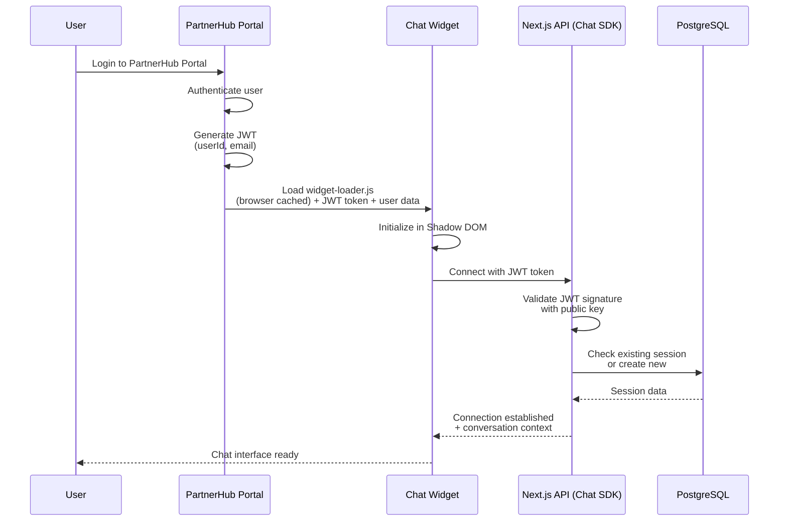
```mermaid
sequenceDiagram
    participant User
    participant Portal as PartnerHub Portal
    participant Widget as Chat Widget
    participant API as Next.js API (Chat SDK)
    participant DB as PostgreSQL

    User->>Portal: Login to PartnerHub Portal
    Portal->>Portal: Authenticate user
    Portal->>Portal: Generate JWT<br/>(userId, email)
    Portal->>Widget: Load widget-loader.js<br/>(browser cached) + JWT token + user data
    Widget->>Widget: Initialize in Shadow DOM
    Widget->>API: Connect with JWT token
    API->>API: Validate JWT signature<br/>with public key
    API->>DB: Check existing session<br/>or create new
    DB-->>API: Session data
    API-->>Widget: Connection established<br/>+ conversation context
    Widget-->>User: Chat interface ready
```

**Summary:** User logs into PartnerHub → Portal generates JWT (userId, email) → loads `widget-loader.js` (browser-cached) with JWT + user data → Widget initializes in Shadow DOM → connects to API with JWT → API validates signature, restores or creates session → chat interface ready. See diagram above for detail.

#### 3.3.3 AI-Powered Conversation Flow

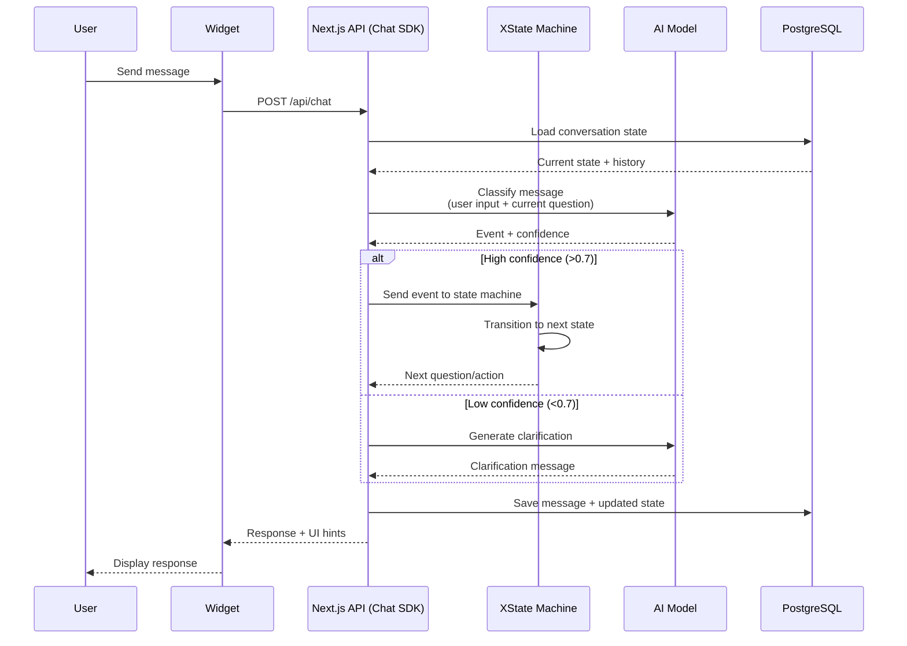
```mermaid
sequenceDiagram
    participant User
    participant Widget
    participant API as Next.js API (Chat SDK)
    participant State as XState Machine
    participant AI as AI Model
    participant DB as PostgreSQL

    User->>Widget: Send message
    Widget->>API: POST /api/chat
    API->>DB: Load conversation state
    DB-->>API: Current state + history
    API->>AI: Classify message<br/>(user input + current question)
    AI-->>API: Event + confidence

    alt High confidence (>0.7)
        API->>State: Send event to state machine
        State->>State: Transition to next state
        State-->>API: Next question/action
    else Low confidence (<0.7)
        API->>AI: Generate clarification
        AI-->>API: Clarification message
    end

    API->>DB: Save message + updated state
    API-->>Widget: Response + UI hints
    Widget-->>User: Display response
```

**Summary:** User sends message → API loads state + classifies intent via AI → confidence ≥0.7: XState transitions to next state → confidence <0.7: AI generates clarification prompt → saves message + state to DB → streams response to widget. See diagram above for detail.

**Low Confidence Behavior:** If confidence <0.7 and clarification_attempts <3, system sends `UNCLEAR` event to XState, generates clarification prompt, logs to `classification_log`, increments attempts. After 3 failed attempts, escalates via Zendesk ticket.

#### 3.3.4 Embrace Documentation Search Flow

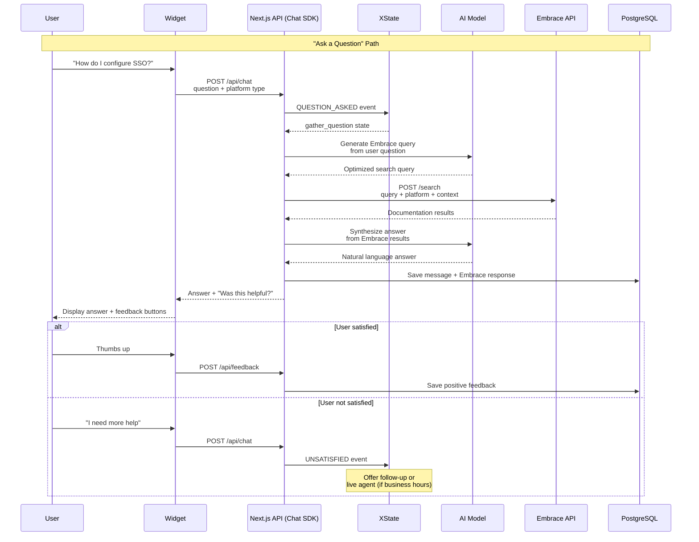
```mermaid
sequenceDiagram
    participant User
    participant Widget
    participant API as Next.js API (Chat SDK)
    participant State as XState
    participant AI as AI Model
    participant Embrace as Embrace API
    participant DB as PostgreSQL

    Note over User,DB: "Ask a Question" Path

    User->>Widget: "How do I configure SSO?"
    Widget->>API: POST /api/chat<br/>question + platform type
    API->>State: QUESTION_ASKED event
    State-->>API: gather_question state

    API->>AI: Generate Embrace query<br/>from user question
    AI-->>API: Optimized search query

    API->>Embrace: POST /search<br/>query + platform + context
    Embrace-->>API: Documentation results

    API->>AI: Synthesize answer<br/>from Embrace results
    AI-->>API: Natural language answer

    API->>DB: Save message + Embrace response
    API-->>Widget: Answer + "Was this helpful?"
    Widget-->>User: Display answer + feedback buttons

    alt User satisfied
        User->>Widget: Thumbs up
        Widget->>API: POST /api/feedback
        API->>DB: Save positive feedback
    else User not satisfied
        User->>Widget: "I need more help"
        Widget->>API: POST /api/chat
        API->>State: UNSATISFIED event
        Note over State: Offer follow-up or<br/>live agent (if business hours)
    end
```

**Summary:** User asks question → XState transitions to `gather_question` → AI optimizes query → Embrace API searches docs → AI synthesizes answer → saves to DB → presents answer with feedback prompt. If unsatisfied, UNSATISFIED event offers follow-up or live agent. See diagram above.

#### 3.3.5 Live Agent Handoff Flow (Sunshine Conversations)

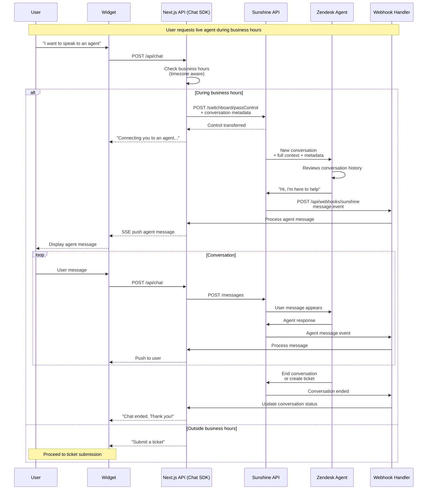
```mermaid
sequenceDiagram
    participant User
    participant Widget
    participant API as Next.js API (Chat SDK)
    participant Sunshine as Sunshine API
    participant Agent as Zendesk Agent
    participant Webhook as Webhook Handler

    Note over User,Webhook: User requests live agent during business hours

    User->>Widget: "I want to speak to an agent"
    Widget->>API: POST /api/chat
    API->>API: Check business hours<br/>(timezone aware)

    alt During business hours
        API->>Sunshine: POST /switchboard/passControl<br/>+ conversation metadata
        Sunshine-->>API: Control transferred
        API-->>Widget: "Connecting you to an agent..."

        Sunshine->>Agent: New conversation<br/>+ full context + metadata
        Agent->>Agent: Reviews conversation history

        Agent->>Sunshine: "Hi, I'm here to help"
        Sunshine->>Webhook: POST /api/webhooks/sunshine<br/>message event
        Webhook->>API: Process agent message
        API-->>Widget: SSE push agent message
        Widget-->>User: Display agent message

        loop Conversation
            User->>Widget: User message
            Widget->>API: POST /api/chat
            API->>Sunshine: POST /messages
            Sunshine->>Agent: User message appears
            Agent->>Sunshine: Agent response
            Sunshine->>Webhook: Agent message event
            Webhook->>API: Process message
            API-->>Widget: Push to user
        end

        Agent->>Sunshine: End conversation<br/>or create ticket
        Sunshine->>Webhook: Conversation ended
        Webhook->>API: Update conversation status
        API-->>Widget: "Chat ended. Thank you!"

    else Outside business hours
        API-->>Widget: "Submit a ticket"
        Note over User,Widget: Proceed to ticket submission
    end
```

**Summary:** User requests agent → API checks business hours → during hours: Sunshine passControl transfers to agent with full context → agent responds via webhook → bidirectional messaging loop → agent ends conversation → status updated. Outside hours: offers ticket submission. See diagram above.

#### 3.3.6 Zendesk Ticket Creation Flow

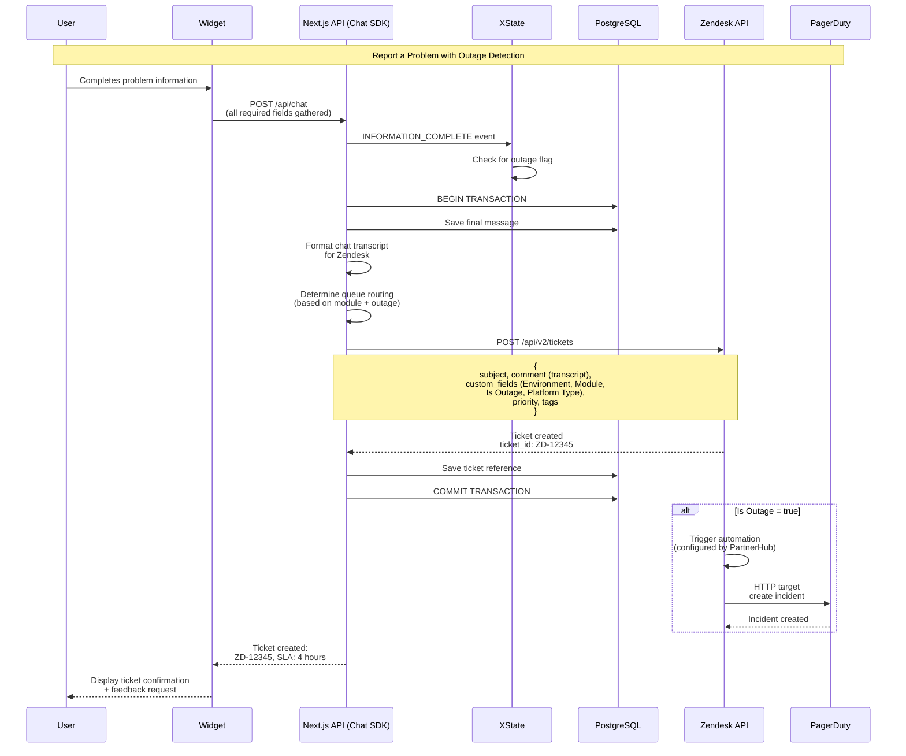
```mermaid
sequenceDiagram
    participant User
    participant Widget
    participant API as Next.js API (Chat SDK)
    participant State as XState
    participant DB as PostgreSQL
    participant Zendesk as Zendesk API
    participant PagerDuty as PagerDuty

    Note over User,PagerDuty: Report a Problem with Outage Detection

    User->>Widget: Completes problem information
    Widget->>API: POST /api/chat<br/>(all required fields gathered)

    API->>State: INFORMATION_COMPLETE event
    State->>State: Check for outage flag

    API->>DB: BEGIN TRANSACTION
    API->>DB: Save final message

    API->>API: Format chat transcript<br/>for Zendesk
    API->>API: Determine queue routing<br/>(based on module + outage)

    API->>Zendesk: POST /api/v2/tickets
    Note over API,Zendesk: {<br/> subject, comment (transcript),<br/> custom_fields (Environment, Module,<br/> Is Outage, Platform Type),<br/> priority, tags<br/>}

    Zendesk-->>API: Ticket created<br/>ticket_id: ZD-12345

    API->>DB: Save ticket reference
    API->>DB: COMMIT TRANSACTION

    alt Is Outage = true
        Zendesk->>Zendesk: Trigger automation<br/>(configured by PartnerHub)
        Zendesk->>PagerDuty: HTTP target<br/>create incident
        PagerDuty-->>Zendesk: Incident created
    end

    API-->>Widget: Ticket created:<br/>ZD-12345, SLA: 4 hours
    Widget-->>User: Display ticket confirmation<br/>+ feedback request
```

**Summary:** User completes info → INFORMATION_COMPLETE event → DB transaction: save message, format transcript, determine queue routing → POST /api/v2/tickets with custom fields (Environment, Module, Is Outage, Platform Type) → save ticket ID → commit. If outage: Zendesk automation triggers PagerDuty. Returns ticket ID + SLA to user. See diagram above.

#### 3.3.7 State Machine Architecture

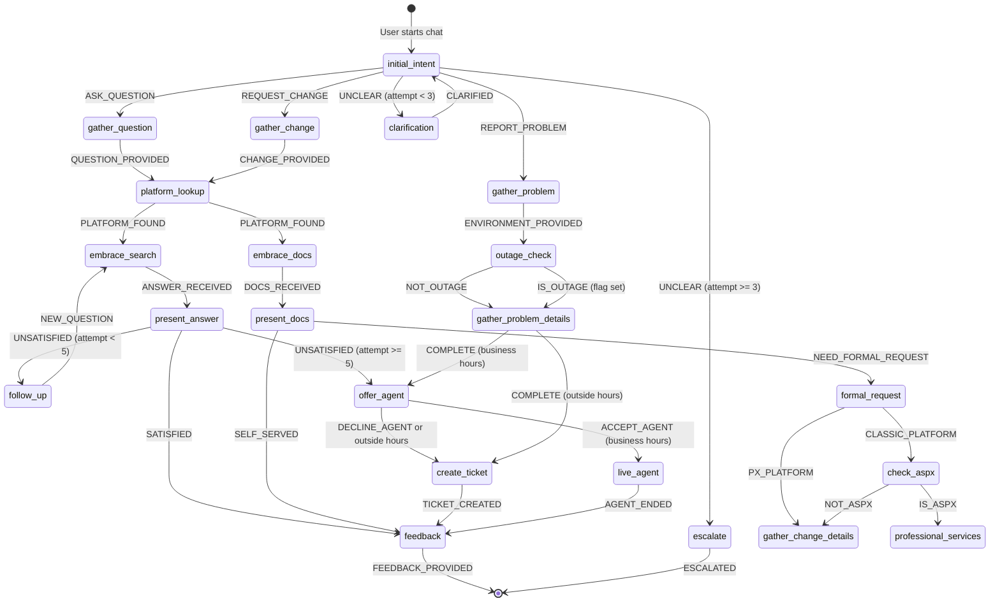
```mermaid
stateDiagram-v2
    [*] --> initial_intent: User starts chat

    initial_intent --> gather_question: ASK_QUESTION
    initial_intent --> gather_change: REQUEST_CHANGE
    initial_intent --> gather_problem: REPORT_PROBLEM
    initial_intent --> clarification: UNCLEAR (attempt < 3)
    initial_intent --> escalate: UNCLEAR (attempt >= 3)

    clarification --> initial_intent: CLARIFIED

    gather_question --> platform_lookup: QUESTION_PROVIDED
    platform_lookup --> embrace_search: PLATFORM_FOUND
    embrace_search --> present_answer: ANSWER_RECEIVED
    present_answer --> feedback: SATISFIED
    present_answer --> follow_up: UNSATISFIED (attempt < 5)
    present_answer --> offer_agent: UNSATISFIED (attempt >= 5)

    follow_up --> embrace_search: NEW_QUESTION
    offer_agent --> live_agent: ACCEPT_AGENT (business hours)
    offer_agent --> create_ticket: DECLINE_AGENT or outside hours

    gather_change --> platform_lookup: CHANGE_PROVIDED
    platform_lookup --> embrace_docs: PLATFORM_FOUND
    embrace_docs --> present_docs: DOCS_RECEIVED
    present_docs --> feedback: SELF_SERVED
    present_docs --> formal_request: NEED_FORMAL_REQUEST

    formal_request --> check_aspx: CLASSIC_PLATFORM
    formal_request --> gather_change_details: PX_PLATFORM
    check_aspx --> professional_services: IS_ASPX
    check_aspx --> gather_change_details: NOT_ASPX

    gather_problem --> outage_check: ENVIRONMENT_PROVIDED
    outage_check --> gather_problem_details: NOT_OUTAGE
    outage_check --> gather_problem_details: IS_OUTAGE (flag set)
    gather_problem_details --> offer_agent: COMPLETE (business hours)
    gather_problem_details --> create_ticket: COMPLETE (outside hours)

    create_ticket --> feedback: TICKET_CREATED
    live_agent --> feedback: AGENT_ENDED
    feedback --> [*]: FEEDBACK_PROVIDED
    escalate --> [*]: ESCALATED
```

**Summary: State Machine Architecture**

The state diagram above defines the complete conversation flow. Key XState events and transitions:

| Path | Entry Event | Key States | Terminal State |
| --- | --- | --- | --- |
| **Ask a Question** | `ASK_QUESTION` | `gather_question` → `platform_lookup` → `embrace_search` → `present_answer` | `feedback` (satisfied) or `offer_agent` (5 attempts) |
| **Request a Change** | `REQUEST_CHANGE` | `gather_change` → `platform_lookup` → `embrace_docs` → `present_docs` | `feedback` (self-served) or `formal_request` → ticket |
| **Report a Problem** | `REPORT_PROBLEM` | `gather_problem` → `outage_check` → `gather_problem_details` | `offer_agent` (business hours) or `create_ticket` |
| **Clarification** | `UNCLEAR` | `clarification` → retry (max 3) | `escalate` after 3 failed attempts |
| **Terminal** | Various | `create_ticket`, `live_agent` | `feedback` → `[*]` |

## 4. Technical Requirements Mapping

Maps each BR to a corresponding TR with implementation details, data structures, and acceptance criteria.

### Common Technical Patterns

The following patterns apply across all Technical Requirements unless explicitly noted otherwise. Individual TRs only document deviations or additions to these patterns.

**Input Handling:**

- All user input sanitized and validated server-side before storage or processing
- AI classification prompts sanitized to prevent injection
- URL inputs validated and sanitized to prevent injection

**State Persistence:**

- XState machine state persisted in `conversations.machine_state` (JSONB) after every message
- Gathered information stored in `conversations.gathered_info` (JSONB)
- All state survives session restoration and page refresh
- Conversation can be resumed at any time from database snapshot

**Data Integrity:**

- All classification attempts logged to `classification_logs` table (intent, confidence, method, result)
- All messages stored in `messages` table with role indicator (user/assistant/agent)
- Metadata stored in JSONB columns for flexible schema evolution
- Foreign key relationships with CASCADE DELETE where appropriate

**Reliability:**

- Failed API calls retry with exponential backoff
- Network errors handled gracefully with user-facing error messages
- Failed operations do not corrupt conversation state
- Business hours checks use server-side IANA timezone conversion with DST support

**Security:**

- JWT-based authentication (RS256 signature validation with PartnerHub public key)
- HTTPS-only connections
- API credentials stored in environment variables
- Server-side validation for all security-critical logic (business hours, attempt counters, escalation)

---

### 4.1 BR-01 → TR-01: Unified AI Chat Interface

**Business Requirement Summary:**

The system must provide a single AI-powered chat interface that serves as the primary entry point for all customer support interactions. The interface must load within 2 seconds, support text and file attachments, maintain session context, preserve full transcripts, and clearly disclose AI interaction for legal compliance.

**Priority:** Critical  
**BRD Reference:** Section BR-01

**Flow Diagram:**

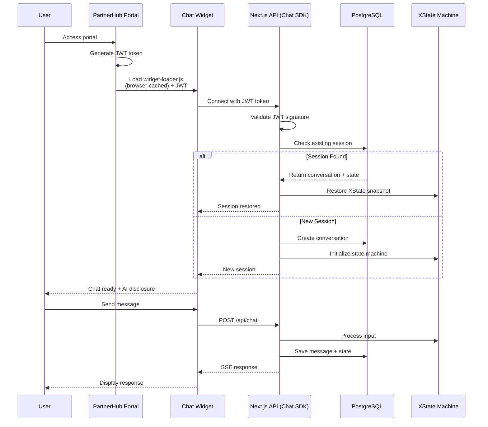
```mermaid
sequenceDiagram
    participant User
    participant Portal as PartnerHub Portal
    participant Widget as Chat Widget
    participant API as Next.js API (Chat SDK)
    participant DB as PostgreSQL
    participant State as XState Machine

    User->>Portal: Access portal
    Portal->>Portal: Generate JWT token
    Portal->>Widget: Load widget-loader.js<br/>(browser cached) + JWT
    Widget->>API: Connect with JWT token
    API->>API: Validate JWT signature
    API->>DB: Check existing session

    alt Session Found
        DB-->>API: Return conversation + state
        API->>State: Restore XState snapshot
        API-->>Widget: Session restored
    else New Session
        API->>DB: Create conversation
        API->>State: Initialize state machine
        API-->>Widget: New session
    end

    Widget-->>User: Chat ready + AI disclosure

    User->>Widget: Send message
    Widget->>API: POST /api/chat
    API->>State: Process input
    API->>DB: Save message + state
    API-->>Widget: SSE response
    Widget-->>User: Display response
```

**Steps:**

1. User accesses PartnerHub Portal → Portal generates JWT token and passes user data
2. Portal loads widget-loader.js from Railway → Widget initializes Shadow DOM → React mounts chat UI
3. Widget connects to API with JWT token and user data
4. API validates JWT signature using PartnerHub's public key
5. API queries database for existing active conversation for the user
6. If session found: Restore XState snapshot and conversation history
7. If no session: Create new conversation record and initialize XState machine
8. Widget displays chat interface with AI disclosure banner (total time <2 seconds)
9. User types message → Widget sends to API → API processes via XState → Returns response via SSE
10. User uploads file → Widget validates (size <20MB, allowed types) → API scans for viruses → Saves to storage
11. Every message updates conversation state (machine_state JSONB, gathered_info JSONB)

**Security:**

- JWT-based authentication (RS256 signature validation with PartnerHub public key)
- File upload validation: Type checking, size limits (20MB max)
- Shadow DOM isolation prevents CSS/JS conflicts with parent application
- HTTPS-only connections

**Data Integrity:**

- Full conversation history preserved in messages table
- XState machine state persisted in conversations.machine_state (JSONB)
- Gathered information stored in conversations.gathered_info (JSONB)
- File attachments linked via foreign keys (CASCADE DELETE)
- Conversations can be resumed at any time from database

**Data Reliability:**

- Session persistence across server restarts (database-backed)
- Conversation state restored from XState snapshot
- Failed file uploads don't corrupt conversation state

**Critical Requirements:**

- Widget MUST load within 2 seconds
- Widget bundle MUST be optimized for fast loading
- Conversations MUST persist across page refresh and can be resumed at any time
- Shadow DOM MUST prevent CSS conflicts with PartnerHub portal
- XState machine state MUST be saved after every message

#### Acceptance Criteria

**Performance & Speed:**

- [ ] Chat widget appears and is ready to use within 2 seconds of page load
- [ ] Users can send their first message within 3 seconds of opening the chat
- [ ] File attachments (up to 5MB) upload and process within 10 seconds
- [ ] System handles multiple users chatting simultaneously without slowdown

**Core Functionality:**

- [ ] Users can send and receive text messages reliably
- [ ] File attachments work correctly for common file types (images, PDFs, documents)
- [ ] Conversation history is saved and available if user refreshes the page

**User Experience:**

- [ ] Clear notice displayed that users are chatting with an AI assistant
- [ ] Chat works smoothly on desktop, and tablet
- [ ] Interface is easy to use and visually clear

**Data & Reliability:**

- [ ] Complete conversation history is saved and can be retrieved
- [ ] Conversation context is preserved throughout the entire chat session
- [ ] Full conversation transcript is available for review, with all messages in chronological order

---

### 4.2 BR-02 → TR-02: Email Redirect System

**Priority:** High
**BRD Reference:** Section BR-02
**Client Responsibility:** PartnerHub IT configures email automation
**PartnerHub Contacts:** Client Contact A (contact.a@partnerhub.com), CC: Client Contact B (contact.b@partnerhub.com)

**Flow Diagram:**

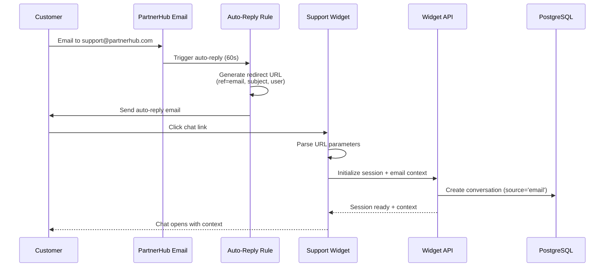
```mermaid
sequenceDiagram
    participant Customer
    participant EmailSystem as PartnerHub Email
    participant AutoReply as Auto-Reply Rule
    participant Widget as Support Widget
    participant API as Widget API
    participant DB as PostgreSQL

    Customer->>EmailSystem: Email to support@partnerhub.com
    EmailSystem->>AutoReply: Trigger auto-reply (60s)
    AutoReply->>AutoReply: Generate redirect URL<br/>(ref=email, subject, user)
    AutoReply->>Customer: Send auto-reply email

    Customer->>Widget: Click chat link
    Widget->>Widget: Parse URL parameters
    Widget->>API: Initialize session + email context
    API->>DB: Create conversation (source='email')
    API-->>Widget: Session ready + context
    Widget-->>Customer: Chat opens with context
```

**Steps:**

**Setup Phase (Pre-Launch):**

1. The Contractor develops redirect URL generator and email template
2. The Contractor coordinates with Client Contact A (contact.a@partnerhub.com) and Client Contact B (contact.b@partnerhub.com)
3. The Contractor provides redirect URL format and template requirements to PartnerHub IT
4. PartnerHub IT configures auto-reply rule in email system
5. Both teams test redirect flow end-to-end

**Runtime Flow (Post-Launch):**

1. Customer emails support@partnerhub.com → Email system receives and stores in queue
2. Auto-reply rule triggers within 60 seconds (configured by PartnerHub IT)
3. Auto-reply generates redirect URL with context parameters (ref=email, subject, user email)
4. Auto-reply email sent to customer with chat link (template provided by The Contractor)
5. Customer clicks link → Widget parses URL parameters (ref, subject, user)
6. Widget initializes session with email context → API creates conversation (source='email')

**Security:**

- URL parameters validated and sanitized before processing
- Email context stored in database with source tracking

**Data Integrity:**

- Conversation source tracked (source='email' vs 'direct')
- Email context stored in conversations.email_context (JSONB)
- Email tracking table links email_id to conversation_id
- Original email preserved in PartnerHub email queue

**Critical Requirements:**

- Redirect URL generator MUST be provided to PartnerHub IT
- Email template (HTML + plain text) MUST be provided
- Widget MUST parse URL parameters correctly
- Email context MUST be displayed in chat interface

#### Acceptance Criteria

**The Contractor Deliverables:**

- [ ] System generates unique chat links that can be included in email templates
- [ ] Email template provided to PartnerHub team
- [ ] Chat system recognizes when users arrive from email links
- [ ] System tracks which conversations originated from email
- [ ] Setup instructions provided to PartnerHub IT team for email integration
- [ ] Coordination email sent to Client Contact A (CC: Client Contact B) with all requirements and next steps

---

### 4.3 BR-03 → TR-03: Initial Support Classification

**Priority:** Critical
**BRD Reference:** Section BR-03

**Flow Diagram:**

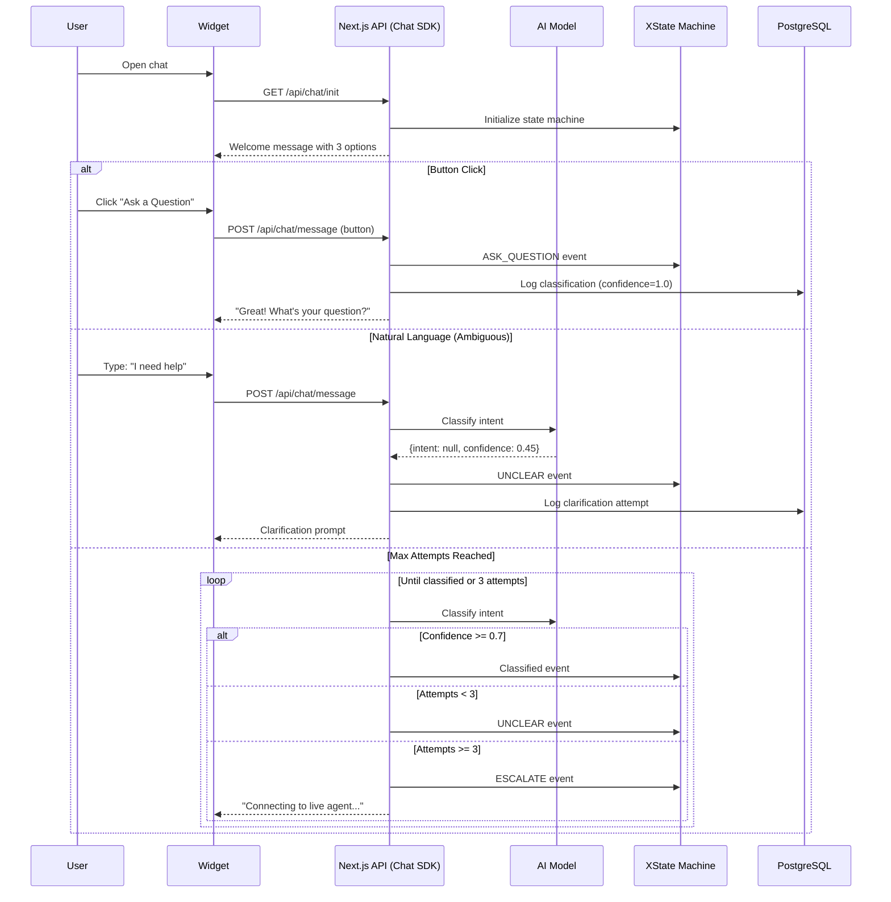
```mermaid
sequenceDiagram
    participant User
    participant Widget
    participant API as Next.js API (Chat SDK)
    participant AI as AI Model
    participant State as XState Machine
    participant DB as PostgreSQL

    User->>Widget: Open chat
    Widget->>API: GET /api/chat/init
    API->>State: Initialize state machine
    API-->>Widget: Welcome message with 3 options

    alt Button Click
        User->>Widget: Click "Ask a Question"
        Widget->>API: POST /api/chat/message (button)
        API->>State: ASK_QUESTION event
        API->>DB: Log classification (confidence=1.0)
        API-->>Widget: "Great! What's your question?"
    else Natural Language (Ambiguous)
        User->>Widget: Type: "I need help"
        Widget->>API: POST /api/chat/message
        API->>AI: Classify intent
        AI-->>API: {intent: null, confidence: 0.45}
        API->>State: UNCLEAR event
        API->>DB: Log clarification attempt
        API-->>Widget: Clarification prompt
    else Max Attempts Reached
        loop Until classified or 3 attempts
            API->>AI: Classify intent
            alt Confidence >= 0.7
                API->>State: Classified event
            else Attempts < 3
                API->>State: UNCLEAR event
            else Attempts >= 3
                API->>State: ESCALATE event
                API-->>Widget: "Connecting to live agent..."
            end
        end
    end
```

**Steps:**

1. User opens chat → API initializes XState machine in 'initial_intent' state
2. Widget displays welcome message with three options: Ask a Question, Request a Change, Report a Problem
3. **Button click:** User clicks button → API sends event to state machine → Logs classification (confidence=1.0) → Transitions to gather state
4. **Natural language:** User types message → API sends to AI for classification
5. **High confidence (≥0.7):** AI classifies intent → API logs success → Transitions to appropriate state
6. **Low confidence (<0.7):** API increments clarification_attempts → Sends UNCLEAR event → AI generates clarification prompt
7. **Max attempts (3):** If still unclear after 3 attempts → API sends ESCALATE event → Offers live agent connection
8. All classification attempts logged to database (intent, confidence, method, result)

**Security:**

- AI classification prompts sanitized to prevent injection
- Classification logs stored securely (no PII in logs)

**Data Integrity:**

- All classification attempts logged to classification_logs table
- Classification result stored in conversations table
- Clarification attempts counter enforced (max 3)
- Intent stored in XState machine context

**Data Reliability:**

- Classification logs persist across system restarts
- Failed AI calls retry with exponential backoff
- Escalation state persisted in conversation record

**Critical Requirements:**

- Three intent options MUST be presented clearly
- Button clicks MUST result in immediate classification (confidence=1.0)
- Natural language classification MUST use confidence threshold (0.7)
- Maximum 3 clarification attempts MUST be enforced
- Escalation MUST trigger after 3 failed attempts
- All classification attempts MUST be logged for analytics

#### Acceptance Criteria

**User Experience:**

- [ ] Three clear options presented to users: "Ask a Question", "Request a Change", or "Report a Problem"
- [ ] When users click a button, their choice is immediately recorded (no delay)
- [ ] When users type a message, the AI understands their intent automatically
- [ ] If the AI is uncertain about user intent, it asks a clarifying question
- [ ] System makes up to 3 attempts to understand user intent before escalating
- [ ] If intent cannot be determined after 3 attempts, conversation is transferred to a human agent

**AI Accuracy & Speed:**

- [ ] AI correctly identifies user intent at least 85% of the time (tested with 100 diverse messages)
- [ ] AI responds with intent classification in less than 1 second
- [ ] AI's confidence in its decisions is accurate and reliable

**Tracking & Analytics:**

- [ ] All intent classification attempts are recorded for analysis
- [ ] Records include how many attempts were made, AI confidence level, and final result
- [ ] Analytics reports can be generated quickly (for last 30 days of data)

---

### 4.4 BR-04 → TR-04: Platform Identification

**Priority:** High
**BRD Reference:** Section BR-04

**Flow Diagram:**

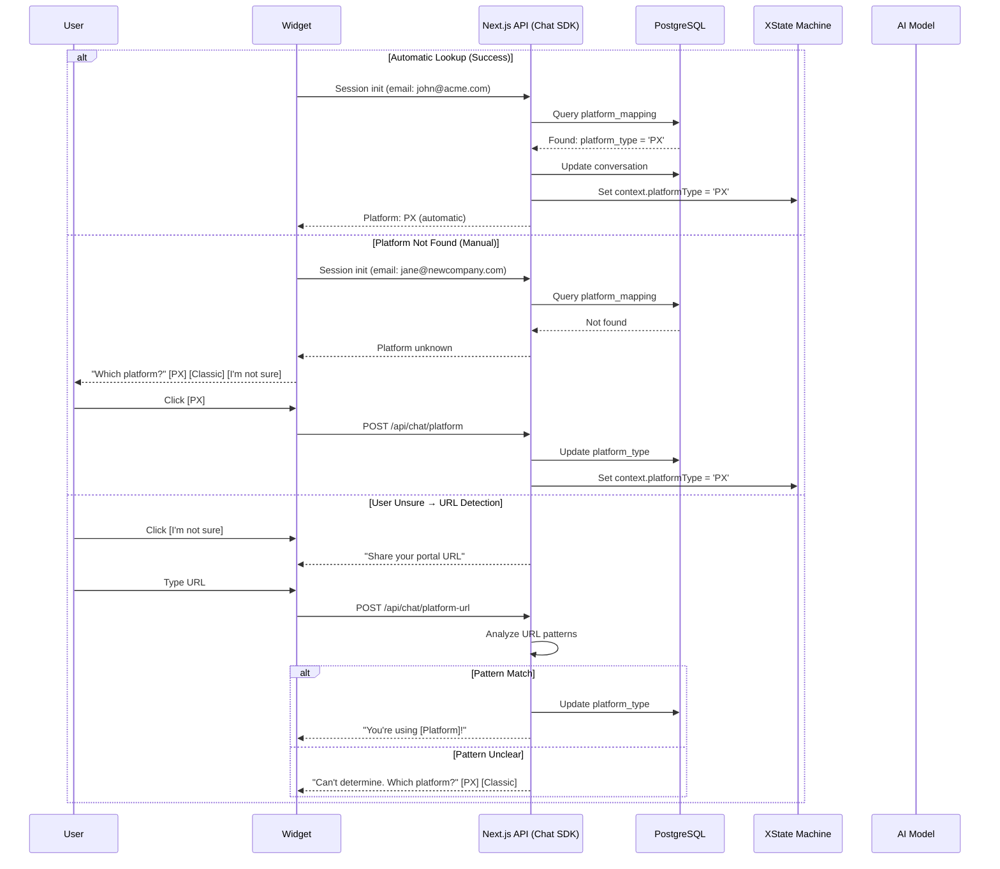
```mermaid
sequenceDiagram
    participant User
    participant Widget
    participant API as Next.js API (Chat SDK)
    participant DB as PostgreSQL
    participant State as XState Machine
    participant AI as AI Model

    alt Automatic Lookup (Success)
        Widget->>API: Session init (email: john@acme.com)
        API->>DB: Query platform_mapping
        DB-->>API: Found: platform_type = 'PX'
        API->>DB: Update conversation
        API->>State: Set context.platformType = 'PX'
        API-->>Widget: Platform: PX (automatic)
    else Platform Not Found (Manual)
        Widget->>API: Session init (email: jane@newcompany.com)
        API->>DB: Query platform_mapping
        DB-->>API: Not found
        API-->>Widget: Platform unknown
        Widget-->>User: "Which platform?" [PX] [Classic] [I'm not sure]
        User->>Widget: Click [PX]
        Widget->>API: POST /api/chat/platform
        API->>DB: Update platform_type
        API->>State: Set context.platformType = 'PX'
    else User Unsure → URL Detection
        User->>Widget: Click [I'm not sure]
        API-->>Widget: "Share your portal URL"
        User->>Widget: Type URL
        Widget->>API: POST /api/chat/platform-url
        API->>API: Analyze URL patterns
        alt Pattern Match
            API->>DB: Update platform_type
            API-->>Widget: "You're using [Platform]!"
        else Pattern Unclear
            API-->>Widget: "Can't determine. Which platform?" [PX] [Classic]
        end
    end
```

**Steps:**

1. **Automatic lookup:** Session init with user email → API queries platform_mapping table (email or domain) → If found, update conversation and XState context → Skip manual identification
2. **Platform not found:** Database returns no match → API sets context.platformType = null → Widget displays "Which platform?" with buttons: [PX] [Classic] [I'm not sure]
3. **Manual selection:** User clicks button → Widget sends platform selection → API updates conversation and platform_mapping table → Sets XState context
4. **User unsure:** User clicks [I'm not sure] → API requests portal URL → User provides URL
5. **URL pattern analysis:** API checks URL patterns → If match found, update platform; if pattern unclear, request manual selection

**Security:**

- Email addresses normalized (lowercase) before lookup
- URL input sanitized to prevent injection
- Platform mapping data validated (only 'PX' or 'Classic' allowed)

**Data Integrity:**

- Platform type stored in conversations.platform_type
- Platform mapping table tracks source (admin, self_reported, url_detection)
- Email/domain lookups prioritized (exact match > domain match)
- Platform type persisted in XState machine context

**Data Reliability:**

- Platform lookup query completes in <100ms
- Failed lookups gracefully fall back to manual identification
- Platform type survives session restoration
- URL detection patterns updated as needed

**Critical Requirements:**

- Platform lookup MUST query database on session initialization
- Email-specific matches MUST take priority over domain matches
- Manual identification MUST be available if lookup fails
- URL-based detection MUST use pattern matching; if pattern unclear, request manual selection
- Platform type MUST be included in all Embrace API queries
- Platform type MUST be included in Zendesk ticket custom field

#### Acceptance Criteria

**Automatic Platform Detection:**

- [ ] System automatically identifies user's platform (PX or Classic)
- [ ] System prioritizes exact email matches over general domain matches for accuracy
- [ ] Detected platform is saved and used throughout the conversation
- [ ] If automatic detection fails, system smoothly switches to asking the user directly

**Manual Platform Selection:**

- [ ] Platform selection buttons are clearly displayed and easy to understand
- [ ] When user clicks a platform button, their choice is immediately saved
- [ ] "I'm not sure" option allows user to provide a URL for detection
- [ ] Selected platform is remembered throughout the entire conversation

**URL-Based Detection:**

- [ ] System correctly identifies platform from URL at least 90% of the time (tested with various URL formats)
- [ ] If URL pattern is unclear, system requests manual platform selection
- [ ] System tracks platform detection results for quality monitoring

**Platform Information Usage:**

- [ ] Platform type is automatically included when searching documentation
- [ ] Platform type is included in support tickets created for the user
- [ ] Platform information is saved and available even if user refreshes the page

---

### 4.5 BR-05 → TR-05: Embrace API Integration

**Business Requirement Summary:**

The system must integrate with Embrace API to provide AI-powered answers to customer questions and documentation for change requests. Embrace API is called with user question, platform type, and user context. AI-generated answers must be presented within 10 seconds. Customers can provide feedback, ask follow-up questions, or request human agent.

**Priority:** Critical  
**BRD Reference:** Section BR-05

#### Technical Implementation Flow

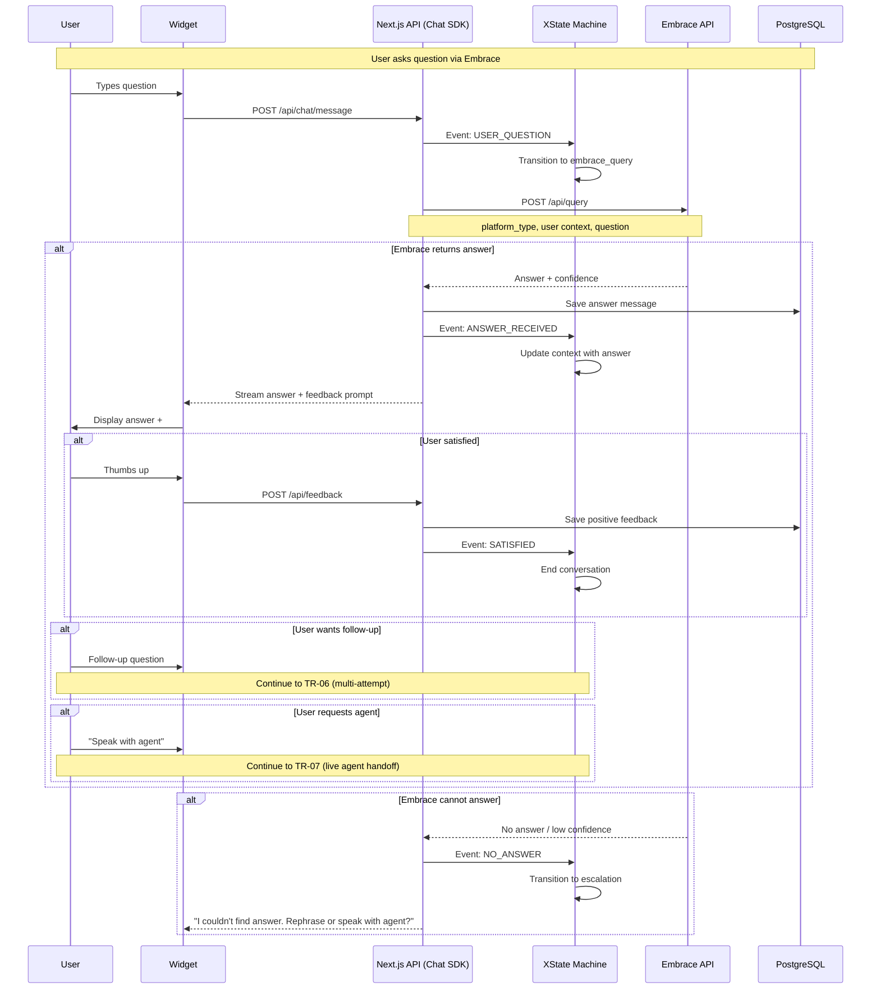
```mermaid
sequenceDiagram
    participant User
    participant Widget
    participant API as Next.js API (Chat SDK)
    participant State as XState Machine
    participant Embrace as Embrace API
    participant DB as PostgreSQL

    Note over User,DB: User asks question via Embrace

    User->>Widget: Types question
    Widget->>API: POST /api/chat/message
    API->>State: Event: USER_QUESTION
    State->>State: Transition to embrace_query

    API->>Embrace: POST /api/query
    Note over API,Embrace: platform_type, user context, question

    alt Embrace returns answer
        Embrace-->>API: Answer + confidence
        API->>DB: Save answer message
        API->>State: Event: ANSWER_RECEIVED
        State->>State: Update context with answer
        API-->>Widget: Stream answer + feedback prompt
        Widget->>User: Display answer + 

        alt User satisfied
            User->>Widget: Thumbs up
            Widget->>API: POST /api/feedback
            API->>DB: Save positive feedback
            API->>State: Event: SATISFIED
            State->>State: End conversation
        end

        alt User wants follow-up
            User->>Widget: Follow-up question
            Note over User,State: Continue to TR-06 (multi-attempt)
        end

        alt User requests agent
            User->>Widget: "Speak with agent"
            Note over User,State: Continue to TR-07 (live agent handoff)
        end
    end

    alt Embrace cannot answer
        Embrace-->>API: No answer / low confidence
        API->>State: Event: NO_ANSWER
        State->>State: Transition to escalation
        API-->>Widget: "I couldn't find answer. Rephrase or speak with agent?"
    end
```

#### What It Does

**Embrace API Integration:**

1. **API Call Construction:** Platform type (PX/Classic), user context (email, org), question text sent to Embrace API
2. **Response Handling:** Parse Embrace response, extract answer and confidence, store in messages table
3. **Streaming:** Stream answer to widget using Server-Sent Events (SSE) via Vercel AI SDK
4. **Feedback Collection:** Display thumbs up/down buttons, save feedback with conversation ID and message ID
5. **Multi-Turn Support:** Support follow-up questions (see TR-06 for multi-attempt logic)

**Performance Targets:**

- Embrace API response time: <10 seconds (as per BRD)
- Widget displays streaming response within 500ms of first token
- Feedback button click registers within 200ms

**Security:**

- Embrace API credentials stored in environment variables
- User context sanitized before sending to Embrace
- API responses validated and sanitized before displaying

**Data Integrity:**

- All Embrace queries logged with question, answer, confidence, platform type
- Feedback linked to specific message and conversation
- Answer content stored in messages table with role='assistant'
- Confidence scores stored in JSONB metadata

**Data Reliability:**

- Embrace API timeout: 15 seconds (hard limit)
- Failed API calls retry once with exponential backoff
- Network errors gracefully handled with error message to user
- Fallback to "no answer" flow if Embrace unavailable

**Critical Requirements:**

- Platform type MUST be included in every Embrace query
- API response time MUST be <10 seconds
- User MUST have option to request human agent if answer unsatisfactory
- Feedback MUST be optional (user can skip)
- Follow-up questions MUST maintain conversation context

#### Acceptance Criteria

**Documentation Search Integration:**

- [ ] System searches documentation using user's platform type, email, organization, and question
- [ ] Search results are received and displayed within 10 seconds
- [ ] Answers appear to users in real-time as they're generated
- [ ] If search fails or times out, system automatically retries with appropriate delays
- [ ] Users see clear, helpful error messages (never technical jargon) with options to try again or get help

**Answer Quality:**

- [ ] System tracks how confident it is in each answer for quality monitoring
- [ ] If system is not confident in an answer (less than 70% sure), it offers alternative options
- [ ] All answers are checked for safety and formatting before showing to users

**Feedback Collection:**

- [ ] Thumbs up/down buttons are displayed on all answers for user feedback
- [ ] User feedback is saved and linked to the specific conversation and answer
- [ ] Users can skip providing feedback if they prefer
- [ ] System responds appropriately based on feedback (satisfied users can end, unsatisfied users get help)

**Continued Support Options:**

- [ ] Users can ask follow-up questions if the answer wasn't complete
- [ ] Users can request to speak with a human agent if needed

---

### 4.6 BR-06 → TR-06: Multi-Attempt Embrace Conversations

**Business Requirement Summary:**

The system must allow customers to ask multiple follow-up questions or rephrase queries before escalating to human agents, with a maximum of 5 Embrace attempts. After the 3rd attempt, the system displays a soft nudge suggesting a live agent. After 5 attempts without resolution, the system automatically escalates to live agent (during business hours) or ticket submission (outside business hours).

**Priority:** High  
**BRD Reference:** Section BR-06

#### Technical Implementation Flow

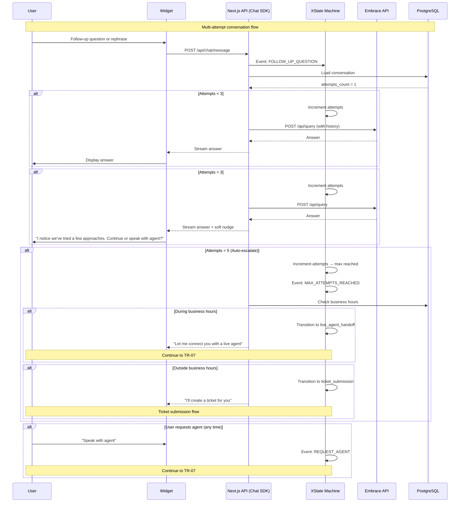
```mermaid
sequenceDiagram
    participant User
    participant Widget
    participant API as Next.js API (Chat SDK)
    participant State as XState Machine
    participant Embrace as Embrace API
    participant DB as PostgreSQL

    Note over User,DB: Multi-attempt conversation flow

    User->>Widget: Follow-up question or rephrase
    Widget->>API: POST /api/chat/message
    API->>State: Event: FOLLOW_UP_QUESTION

    API->>DB: Load conversation
    DB-->>API: attempts_count = 1

    alt Attempts < 3
        State->>State: Increment attempts
        API->>Embrace: POST /api/query (with history)
        Embrace-->>API: Answer
        API-->>Widget: Stream answer
        Widget->>User: Display answer
    end

    alt Attempts = 3
        State->>State: Increment attempts
        API->>Embrace: POST /api/query
        Embrace-->>API: Answer
        API-->>Widget: Stream answer + soft nudge
        Widget->>User: "I notice we've tried a few approaches. Continue or speak with agent?"
    end

    alt Attempts = 5 (Auto-escalate)
        State->>State: Increment attempts → max reached
        State->>State: Event: MAX_ATTEMPTS_REACHED

        API->>DB: Check business hours

        alt During business hours
            State->>State: Transition to live_agent_handoff
            API-->>Widget: "Let me connect you with a live agent"
            Note over User,State: Continue to TR-07
        end

        alt Outside business hours
            State->>State: Transition to ticket_submission
            API-->>Widget: "I'll create a ticket for you"
            Note over User,State: Ticket submission flow
        end
    end

    alt User requests agent (any time)
        User->>Widget: "Speak with agent"
        State->>State: Event: REQUEST_AGENT
        Note over User,State: Continue to TR-07
    end
```

#### What It Does

**Attempt Tracking:**

1. **Counter Management:** XState context tracks `embrace_attempts` counter (0-5)
2. **Increment Logic:** Counter increments on each Embrace API call
3. **Persistence:** Attempt count stored in conversations.embrace_attempts
4. **Reset:** Counter resets only on successful resolution or new conversation

**Soft Nudge Logic (Attempt 3):**

- Display message: "I notice we've tried a few approaches. You can continue trying, or speak with a live agent who might help faster."
- User maintains control (can continue or escalate)
- Nudge displayed on attempts 3 and 4

**Auto-Escalation (Attempt 5):**

- Automatically check business hours
- During hours: Initiate live agent handoff (TR-07)
- Outside hours: Create ticket with full transcript
- User informed of escalation reason

**Security:**

- Attempt counter cannot be manipulated by client
- Business hours check uses server timezone
- Escalation logic runs server-side only

**Data Integrity:**

- Attempt count stored in XState context and database
- All Embrace queries logged with attempt number
- Escalation events logged for analytics
- Conversation history maintained for agent context

**Data Reliability:**

- Attempt counter survives session restoration
- Failed Embrace calls don't increment counter
- Business hours check handles timezone correctly
- Escalation triggered reliably at attempt 5

**Critical Requirements:**

- Soft nudge MUST display after 3rd attempt per BRD
- Auto-escalation MUST occur at 5 attempts per BRD
- User MUST have option to request agent before max attempts
- Business hours MUST be checked on auto-escalation
- Full conversation history MUST be passed to agent or ticket

#### Acceptance Criteria

**Attempt Tracking:**

- [ ] System tracks how many times it has searched for an answer (counts from 0 to 5)
- [ ] Attempt count is saved and remembered throughout the conversation
- [ ] Attempt count is preserved even if user refreshes the page
- [ ] Only successful searches count toward the attempt limit

**Helpful Reminders:**

- [ ] After 3 search attempts, system offers a gentle reminder about other options
- [ ] Reminder message uses the exact wording specified in requirements
- [ ] User can choose to continue searching or escalate to human agent
- [ ] System tracks when reminders are shown for analysis

**Automatic Escalation:**

- [ ] Auto-escalation triggered at 5 attempts
- [ ] Business hours checked correctly
- [ ] During hours: Live agent handoff initiated
- [ ] Outside hours: Ticket created with transcript
- [ ] User notified of escalation reason

**User Control:**

- [ ] User can request agent at any time (before max attempts)
- [ ] User maintains control until attempt 5

---

### 4.7 BR-07 → TR-07: Business Hours Live Agent Handoff

**Business Requirement Summary:**

The system must offer live agent handoff during business hours when AI cannot resolve customer needs. Business hours are configurable by administrator. During business hours, the system offers a warm handoff with full chat context passed to the agent. Outside business hours, the system offers ticket submission with SLA information. Agents can view complete conversation history before joining.

**Priority:** High  
**BRD Reference:** Section BR-07

#### Technical Implementation Flow

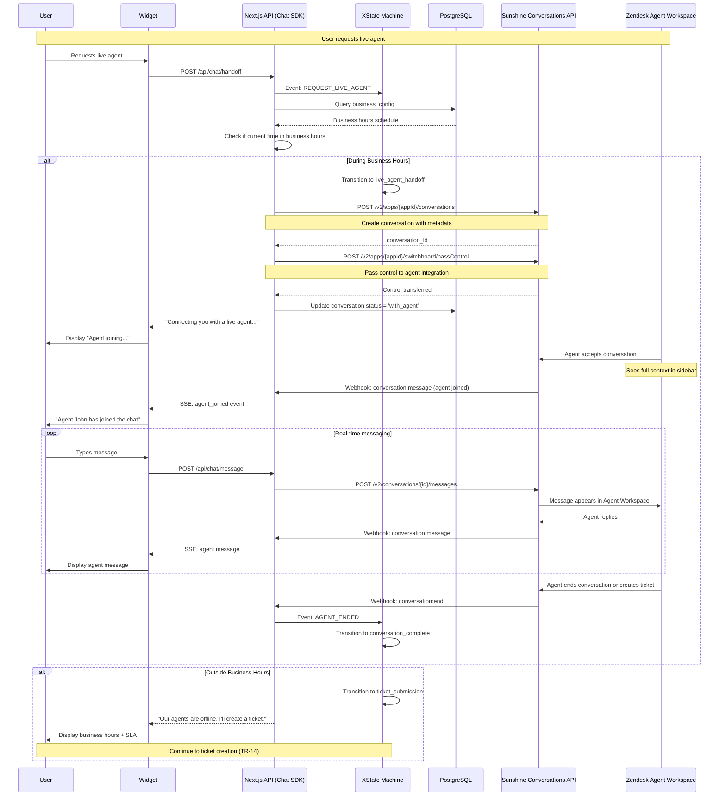
```mermaid
sequenceDiagram
    participant User
    participant Widget
    participant API as Next.js API (Chat SDK)
    participant State as XState Machine
    participant DB as PostgreSQL
    participant Sunshine as Sunshine Conversations API
    participant Agent as Zendesk Agent Workspace

    Note over User,Agent: User requests live agent

    User->>Widget: Requests live agent
    Widget->>API: POST /api/chat/handoff
    API->>State: Event: REQUEST_LIVE_AGENT

    API->>DB: Query business_config
    DB-->>API: Business hours schedule

    API->>API: Check if current time in business hours

    alt During Business Hours
        State->>State: Transition to live_agent_handoff

        API->>Sunshine: POST /v2/apps/{appId}/conversations
        Note over API,Sunshine: Create conversation with metadata
        Sunshine-->>API: conversation_id

        API->>Sunshine: POST /v2/apps/{appId}/switchboard/passControl
        Note over API,Sunshine: Pass control to agent integration
        Sunshine-->>API: Control transferred

        API->>DB: Update conversation status = 'with_agent'

        API-->>Widget: "Connecting you with a live agent..."
        Widget->>User: Display "Agent joining..."

        Agent->>Sunshine: Agent accepts conversation
        Note over Agent: Sees full context in sidebar

        Sunshine->>API: Webhook: conversation:message (agent joined)
        API->>Widget: SSE: agent_joined event
        Widget->>User: "Agent John has joined the chat"

        loop Real-time messaging
            User->>Widget: Types message
            Widget->>API: POST /api/chat/message
            API->>Sunshine: POST /v2/conversations/{id}/messages
            Sunshine->>Agent: Message appears in Agent Workspace

            Agent->>Sunshine: Agent replies
            Sunshine->>API: Webhook: conversation:message
            API->>Widget: SSE: agent message
            Widget->>User: Display agent message
        end

        Agent->>Sunshine: Agent ends conversation or creates ticket
        Sunshine->>API: Webhook: conversation:end
        API->>State: Event: AGENT_ENDED
        State->>State: Transition to conversation_complete
    end

    alt Outside Business Hours
        State->>State: Transition to ticket_submission
        API-->>Widget: "Our agents are offline. I'll create a ticket."
        Widget->>User: Display business hours + SLA
        Note over User,State: Continue to ticket creation (TR-14)
    end
```

#### What It Does

**Business Hours Configuration:**

1. **Database Storage:** JSONB column in business_config table stores timezone, schedule, holidays
2. **Configuration Management:** Updated directly in database via SQL scripts or migrations
3. **Timezone Handling:** Uses IANA timezones (e.g., "America/Denver") with date-fns-tz library for DST support
4. **Holiday Management:** Array of holiday dates in ISO format stored in database

**Live Agent Handoff (Sunshine Conversations):**

1. **Conversation Creation:** Create Sunshine conversation with user metadata
2. **Switchboard API:** Use `passControl` to transfer control from bot to agent integration
3. **Metadata API:** Pass full context (XState snapshot, gathered info, platform type, conversation history)
4. **Webhook Handling:** Receive agent messages via webhooks, forward to widget via SSE
5. **Bidirectional Messaging:** User ↔ Widget ↔ API ↔ Sunshine ↔ Agent Workspace

**Security:**

- Business hours config managed directly in database
- Sunshine API credentials stored in environment variables
- Webhook signature validation on all Sunshine webhooks
- Agent messages sanitized before displaying to user

**Data Integrity:**

- Business hours stored in database with updated_at timestamp
- Conversation status tracked (ai_handling → with_agent → completed)
- All agent messages stored in messages table with role='agent'
- Full audit trail of handoff events

**Data Reliability:**

- Business hours check handles timezone conversions correctly
- DST transitions handled by date-fns-tz library
- Sunshine API failures fallback to ticket creation
- Webhook delivery failures handled with polling fallback

**Critical Requirements:**

- Business hours MUST be configurable without code deployment per BRD
- Warm handoff MUST include full chat context per BRD
- Agent MUST see conversation history before joining per BRD
- Outside hours MUST offer ticket submission per BRD
- SLA information MUST be displayed on ticket creation per BRD

#### Acceptance Criteria

**Business Hours Setup:**

- [ ] Business hours are stored in the system with timezone, schedule, and holiday information
- [ ] Business hours can be updated via database SQL scripts
- [ ] System correctly handles timezone changes
- [ ] Holiday dates are properly recognized and excluded from business hours

**Live Agent Connection (During Business Hours):**

- [ ] System creates a live agent conversation with all user information included
- [ ] Control is smoothly transferred from AI to human agent
- [ ] Agent receives full conversation context (what was discussed, information gathered, user's platform)
- [ ] Agent sees the conversation in their Zendesk workspace
- [ ] Agent can view the complete conversation history from the beginning

**Real-Time Messaging:**

- [ ] User messages are delivered to the agent instantly
- [ ] Agent messages are delivered to the user instantly
- [ ] All agent messages are saved and clearly marked in the conversation history

**Outside Business Hours Handling:**

- [ ] User is informed of current business hours and expected response time
- [ ] User is offered the option to submit a support ticket
- [ ] Full conversation transcript is included in the ticket for agent review

**Error Handling:**

- [ ] If live agent connection fails, system automatically creates a support ticket instead
- [ ] If messaging system has issues, system uses backup methods to ensure delivery
- [ ] User is always informed of the current status of their request

---

### 4.8 BR-08 → TR-08: Live Agent Option for Problem Reports

**Business Requirement Summary:**

The system must offer a live agent option during business hours for "Report a Problem" path, with appropriate disclaimer. After gathering all problem information, the system checks business hours. During business hours, it offers a live agent with a disclaimer about potential ticket conversion. The user can choose live agent or proceed to ticket submission. Outside business hours, the system proceeds directly to ticket submission.

**Priority:** High  
**BRD Reference:** Section BR-08

#### Technical Implementation Flow

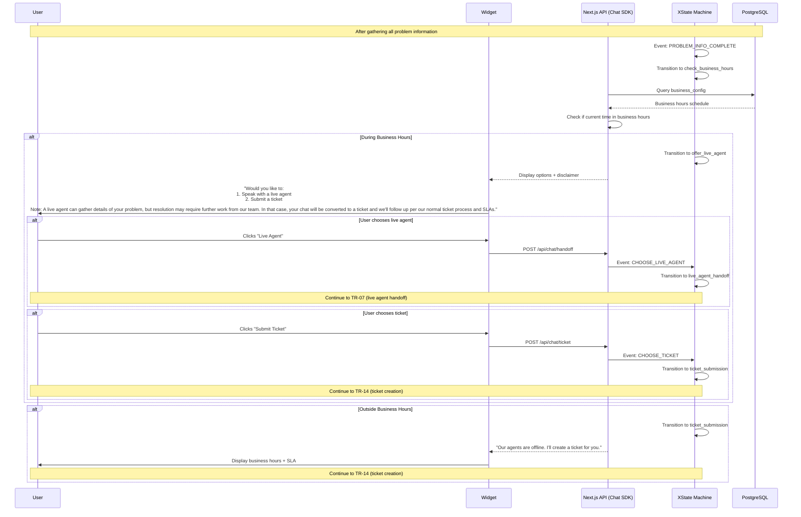
```mermaid
sequenceDiagram
    participant User
    participant Widget
    participant API as Next.js API (Chat SDK)
    participant State as XState Machine
    participant DB as PostgreSQL

    Note over User,DB: After gathering all problem information

    State->>State: Event: PROBLEM_INFO_COMPLETE
    State->>State: Transition to check_business_hours

    API->>DB: Query business_config
    DB-->>API: Business hours schedule

    API->>API: Check if current time in business hours

    alt During Business Hours
        State->>State: Transition to offer_live_agent

        API-->>Widget: Display options + disclaimer
        Widget->>User: "Would you like to:<br/>1. Speak with a live agent<br/>2. Submit a ticket<br/><br/>Note: A live agent can gather details of your problem, but resolution may require further work from our team. In that case, your chat will be converted to a ticket and we'll follow up per our normal ticket process and SLAs."

        alt User chooses live agent
            User->>Widget: Clicks "Live Agent"
            Widget->>API: POST /api/chat/handoff
            API->>State: Event: CHOOSE_LIVE_AGENT
            State->>State: Transition to live_agent_handoff
            Note over User,State: Continue to TR-07 (live agent handoff)
        end

        alt User chooses ticket
            User->>Widget: Clicks "Submit Ticket"
            Widget->>API: POST /api/chat/ticket
            API->>State: Event: CHOOSE_TICKET
            State->>State: Transition to ticket_submission
            Note over User,State: Continue to TR-14 (ticket creation)
        end
    end

    alt Outside Business Hours
        State->>State: Transition to ticket_submission
        API-->>Widget: "Our agents are offline. I'll create a ticket for you."
        Widget->>User: Display business hours + SLA
        Note over User,State: Continue to TR-14 (ticket creation)
    end
```

#### What It Does

**Business Hours Check:**

1. **Timing:** Check triggered after all required problem information gathered
2. **Database Query:** Query business_config table for timezone, schedule, holidays
3. **Timezone Conversion:** Convert current server time to configured timezone
4. **Holiday Check:** Verify current date not in holidays array
5. **Result:** Boolean (within_hours) determines next step

**During Business Hours:**

1. **Two Options Presented:**
   - Option 1: "Speak with a live agent" → Live agent handoff (TR-07)
   - Option 2: "Submit a ticket" → Ticket creation (TR-14)
2. **Disclaimer Display:** BRD-required disclaimer about potential ticket conversion displayed prominently
3. **User Choice:** User explicitly selects option (no default, both equally presented)
4. **Context Preservation:** All gathered problem info preserved regardless of choice

**Outside Business Hours:**

1. **Ticket Only:** No live agent option presented
2. **Business Hours Display:** Show business hours and timezone
3. **SLA Information:** Display expected response time based on queue assignment
4. **Automatic Ticket Creation:** Proceed directly to ticket creation (TR-14)

**Security:**

- Business hours check runs server-side only
- User cannot manipulate business hours result
- Disclaimer text cannot be modified by client

**Data Integrity:**

- Business hours check result logged for analytics
- User choice (agent vs ticket) logged in conversation metadata
- Disclaimer display logged (compliance requirement)
- All gathered problem information preserved

**Data Reliability:**

- Business hours check handles timezone correctly
- Holiday checking accurate
- Disclaimer text stored in constants (single source of truth)
- User choice validation (must be 'agent' or 'ticket')

**Critical Requirements:**

- Business hours MUST be checked after all problem info gathered per BRD
- Disclaimer MUST match exact BRD wording per BR-08
- User MUST have choice between agent and ticket during hours per BRD
- Outside hours MUST proceed directly to ticket per BRD
- Full problem context MUST be passed to agent or ticket per BRD

#### Acceptance Criteria

**Business Hours Check:**

- [ ] Business hours check happens only after all required problem information is collected
- [ ] System uses the correct timezone from business configuration
- [ ] Holiday dates are properly excluded from business hours
- [ ] Business hours check results are recorded for analysis

**During Business Hours:**

- [ ] Two clear options are presented: "Connect with Live Agent" or "Submit Ticket"
- [ ] Required disclaimer is displayed using the exact wording from requirements
- [ ] Both options are presented equally (no default selection or bias)
- [ ] User can choose either option
- [ ] User's choice is saved in the conversation record

**Disclaimer:**

- [ ] Disclaimer text matches the exact wording from requirements
- [ ] Disclaimer is prominently displayed and easy to read
- [ ] User must acknowledge disclaimer before making a selection
- [ ] System records when disclaimer is displayed for compliance tracking

**Outside Business Hours:**

- [ ] Live agent option is NOT shown to users
- [ ] Business hours and timezone displayed
- [ ] SLA information displayed
- [ ] Automatic ticket creation initiated

**Context Preservation:**

- [ ] All gathered problem info preserved regardless of choice
- [ ] If agent chosen: Full context passed to agent via Sunshine metadata
- [ ] If ticket chosen: Full info included in Zendesk ticket

---

### 4.9 BR-09 → TR-09: Outage Detection and PagerDuty Integration

**Business Requirement Summary:**

The system must detect potential outages and trigger appropriate alerting through Zendesk/PagerDuty integration. AI asks outage screening questions during problem reporting. Negative responses set internal "Is Outage" flag, which is passed to Zendesk custom field. Zendesk automation (configured by PartnerHub) triggers PagerDuty based on outage flag.

**Priority:** Critical  
**BRD Reference:** Section BR-09  
**Client Responsibility:** PartnerHub configures Zendesk → PagerDuty automation

**Flow Diagram:**

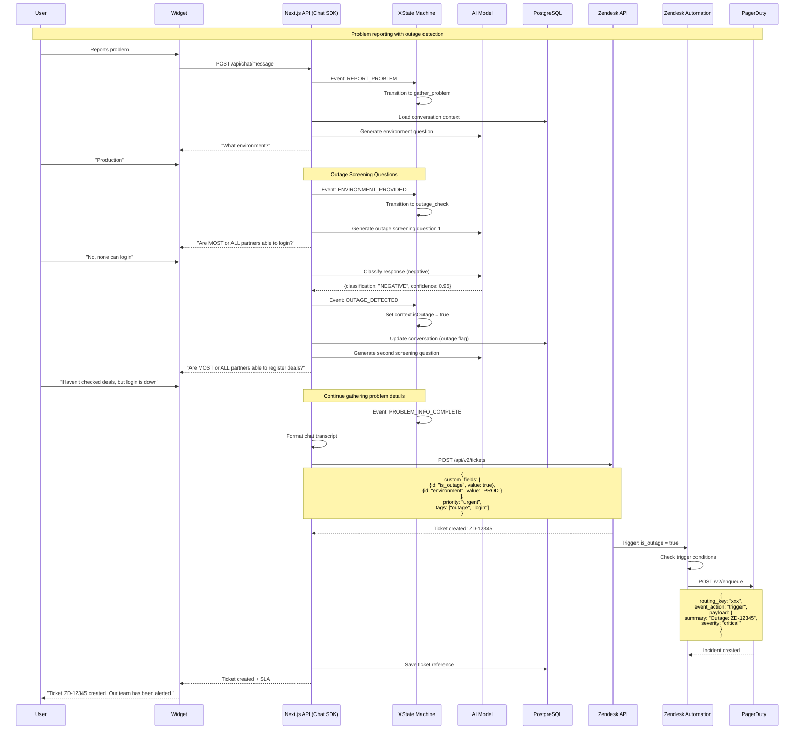
```mermaid
sequenceDiagram
    participant User
    participant Widget
    participant API as Next.js API (Chat SDK)
    participant State as XState Machine
    participant AI as AI Model
    participant DB as PostgreSQL
    participant Zendesk as Zendesk API
    participant ZAutomation as Zendesk Automation
    participant PagerDuty

    Note over User,PagerDuty: Problem reporting with outage detection

    User->>Widget: Reports problem
    Widget->>API: POST /api/chat/message
    API->>State: Event: REPORT_PROBLEM
    State->>State: Transition to gather_problem

    API->>DB: Load conversation context
    API->>AI: Generate environment question
    API-->>Widget: "What environment?"
    User->>Widget: "Production"

    Note over API,State: Outage Screening Questions

    API->>State: Event: ENVIRONMENT_PROVIDED
    State->>State: Transition to outage_check

    API->>AI: Generate outage screening question 1
    API-->>Widget: "Are MOST or ALL partners able to login?"
    User->>Widget: "No, none can login"

    API->>AI: Classify response (negative)
    AI-->>API: {classification: "NEGATIVE", confidence: 0.95}

    API->>State: Event: OUTAGE_DETECTED
    State->>State: Set context.isOutage = true
    API->>DB: Update conversation (outage flag)

    API->>AI: Generate second screening question
    API-->>Widget: "Are MOST or ALL partners able to register deals?"
    User->>Widget: "Haven't checked deals, but login is down"

    Note over API,State: Continue gathering problem details

    State->>State: Event: PROBLEM_INFO_COMPLETE
    API->>API: Format chat transcript

    API->>Zendesk: POST /api/v2/tickets
    Note over API,Zendesk: {<br/>  custom_fields: [<br/>    {id: "is_outage", value: true},<br/>    {id: "environment", value: "PROD"}<br/>  ],<br/>  priority: "urgent",<br/>  tags: ["outage", "login"]<br/>}

    Zendesk-->>API: Ticket created: ZD-12345

    Zendesk->>ZAutomation: Trigger: is_outage = true
    ZAutomation->>ZAutomation: Check trigger conditions
    ZAutomation->>PagerDuty: POST /v2/enqueue
    Note over ZAutomation,PagerDuty: {<br/>  routing_key: "xxx",<br/>  event_action: "trigger",<br/>  payload: {<br/>    summary: "Outage: ZD-12345",<br/>    severity: "critical"<br/>  }<br/>}

    PagerDuty-->>ZAutomation: Incident created
    API->>DB: Save ticket reference
    API-->>Widget: Ticket created + SLA
    Widget-->>User: "Ticket ZD-12345 created. Our team has been alerted."
```

**Steps:**

1. User reports problem → State machine transitions to gather_problem
2. AI gathers environment information (PROD, STAGE, DEV)
3. **Outage Screening Question 1:** "Are MOST or ALL of your partners able to login to the partner portal at this time?"
4. AI classifies response using natural language understanding
5. **NEGATIVE response** (no, cannot login) → Set `context.isOutage = true` in XState machine
6. **Outage Screening Question 2:** "Are MOST or ALL of your partners able to register deals in the partner portal?"
7. AI classifies response → NEGATIVE on either question triggers outage flag
8. **Outage flag logic:** If either answer is NEGATIVE → isOutage = true (remains true for rest of conversation)
9. Continue gathering problem information (module, URL, steps, etc.)
10. Create Zendesk ticket with custom field "Is Outage" = true
11. Ticket automatically assigned to Tier 1 queue with "urgent" priority
12. Zendesk automation (configured by PartnerHub) detects "Is Outage" = true
13. Zendesk automation triggers PagerDuty via HTTP target
14. PagerDuty creates incident and notifies on-call engineer

**Security:**

- Outage flag stored securely in database
- Only admins can modify outage detection logic
- PagerDuty routing key secured in Zendesk configuration
- No false positive protection: Flag cannot be unset once triggered

**Data Integrity:**

- Outage flag stored in conversations.is_outage (boolean)
- Flag persists throughout conversation and in Zendesk ticket
- Classification attempts logged to classification_logs table
- Outage screening responses stored in messages table

**Data Reliability:**

- Outage flag survives session restoration
- Flag included in Zendesk ticket custom field
- PagerDuty integration handled by Zendesk (client responsibility)
- Failed ticket creation retries preserve outage flag

**Critical Requirements:**

- Outage screening questions MUST use "MOST or ALL" wording per BRD
- NEGATIVE response to either question MUST set outage flag per BRD
- Outage flag MUST be passed to Zendesk custom field per BRD
- Outage tickets MUST route to Tier 1 queue with urgent priority per BRD
- Zendesk → PagerDuty automation is CLIENT RESPONSIBILITY per BRD

#### Acceptance Criteria

**Outage Detection Questions:**

- [ ] Question 1 asks about login capability using "MOST or ALL" language as specified
- [ ] Question 2 asks about deal registration using "MOST or ALL" language as specified
- [ ] Questions are asked in the correct order during problem information gathering

**Outage Detection Logic:**

- [ ] If user answers "NO" to question 1, system marks this as a potential outage
- [ ] If user answers "NO" to question 2, system marks this as a potential outage
- [ ] If user answers "YES" to both questions, system does not mark as outage
- [ ] Outage status is remembered throughout the entire conversation
- [ ] Outage status is saved in the system for ticket routing

**Zendesk Integration:**

- [ ] Outage status is included in the Zendesk ticket custom field "Is Outage"
- [ ] Outage tickets are automatically set to "urgent" priority
- [ ] Outage tickets are routed to Tier 1 support queue
- [ ] Outage tickets are tagged with "outage" for easy identification
- [ ] Custom field is properly configured in Zendesk

**Client Configuration (PartnerHub Responsibility):**

- [ ] Zendesk automation rule created for "Is Outage" = true
- [ ] Zendesk automation calls PagerDuty Events API
- [ ] PagerDuty routing key configured
- [ ] Incident creation tested and verified

**Logging:**

- [ ] All outage screening responses logged to messages table
- [ ] AI classification logged to classification_logs table
- [ ] Outage flag logged in conversation metadata
- [ ] PagerDuty integration success/failure logged (if tracked)

---

### 4.10 BR-10 → TR-10: Classic Platform ASPX Detection

**Business Requirement Summary:**

The system must detect when Classic platform customers are requesting changes to custom ASPX pages and route to Professional Services. For Classic customers requesting changes, AI asks for page URL. If URL contains ".aspx", route to Professional Services workflow with disclaimer about potential billing.

**Priority:** High  
**BRD Reference:** Section BR-10

**Flow Diagram:**

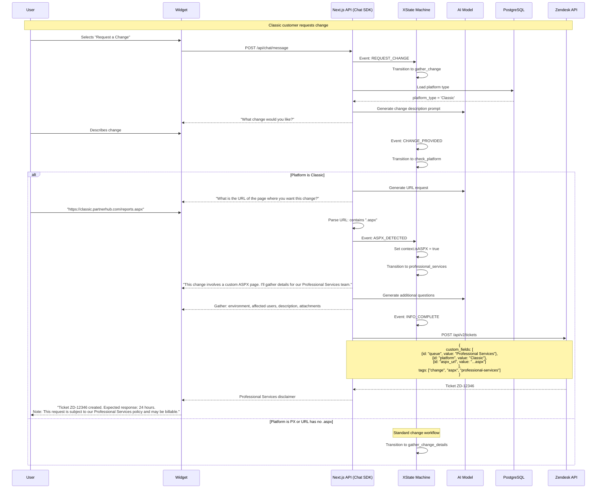
```mermaid
sequenceDiagram
    participant User
    participant Widget
    participant API as Next.js API (Chat SDK)
    participant State as XState Machine
    participant AI as AI Model
    participant DB as PostgreSQL
    participant Zendesk as Zendesk API

    Note over User,Zendesk: Classic customer requests change

    User->>Widget: Selects "Request a Change"
    Widget->>API: POST /api/chat/message
    API->>State: Event: REQUEST_CHANGE
    State->>State: Transition to gather_change

    API->>DB: Load platform type
    DB-->>API: platform_type = 'Classic'

    API->>AI: Generate change description prompt
    API-->>Widget: "What change would you like?"
    User->>Widget: Describes change

    State->>State: Event: CHANGE_PROVIDED
    State->>State: Transition to check_platform

    alt Platform is Classic
        API->>AI: Generate URL request
        API-->>Widget: "What is the URL of the page where you want this change?"
        User->>Widget: "https://classic.partnerhub.com/reports.aspx"

        API->>API: Parse URL: contains ".aspx"

        API->>State: Event: ASPX_DETECTED
        State->>State: Set context.isASPX = true
        State->>State: Transition to professional_services

        API-->>Widget: "This change involves a custom ASPX page. I'll gather details for our Professional Services team."

        API->>AI: Generate additional questions
        API-->>Widget: Gather: environment, affected users, description, attachments

        State->>State: Event: INFO_COMPLETE

        API->>Zendesk: POST /api/v2/tickets
        Note over API,Zendesk: {<br/>  custom_fields: [<br/>    {id: "queue", value: "Professional Services"},<br/>    {id: "platform", value: "Classic"},<br/>    {id: "aspx_url", value: "...aspx"}<br/>  ],<br/>  tags: ["change", "aspx", "professional-services"]<br/>}

        Zendesk-->>API: Ticket ZD-12346

        API-->>Widget: Professional Services disclaimer
        Widget-->>User: "Ticket ZD-12346 created. Expected response: 24 hours.<br/>Note: This request is subject to our Professional Services policy and may be billable."
    else Platform is PX or URL has no .aspx
        Note over State: Standard change workflow
        State->>State: Transition to gather_change_details
    end
```

**Steps:**

1. User selects "Request a Change" path
2. System checks platform type from database (PX vs Classic)
3. **If Classic platform:**
   - AI asks for page URL where change is needed
   - User provides URL
   - System parses URL string
4. **ASPX Detection Logic:**
   ```typescript
   function isASPXPage(url: string): boolean {
     return url.toLowerCase().includes(".aspx");
   }
   ```
5. **If ASPX detected:**
   - Set `context.isASPX = true` in XState machine
   - Transition to `professional_services` state
   - Inform user: "This change involves a custom ASPX page. I'll route this to our Professional Services team."
6. **Gather Professional Services information:**
   - Environment (PROD, STAGE, DEV)
   - Impacted users (who needs the change)
   - Detailed change description
   - File attachments (mockups, workflow diagrams)
   - Time-sensitive event date (optional)
7. **Create Zendesk ticket with:**
   - Queue: "Professional Services"
   - SLA: 24 hours
   - Custom field: Platform Type = "Classic"
   - Custom field: ASPX URL
   - Tags: ["change", "aspx", "professional-services"]
8. **Display disclaimer:**
   - "Your Professional Services request has been created! Ticket #[ID]."
   - "Expected response time: 24 hours."
   - "Note: This request is subject to our Professional Services policy and may be billable."

**If NOT Classic or NO .aspx:** Proceed to standard change request workflow (TR-13)

**Security:**

- URL input sanitized to prevent injection attacks
- ASPX detection case-insensitive
- Professional Services queue restricted to authorized agents
- Billing disclaimer required for compliance

**Data Integrity:**

- ASPX flag stored in conversations.is_aspx (boolean)
- ASPX URL stored in conversations.aspx_url (text)
- Platform type verified from platform_mapping table
- ASPX detection logged in conversation metadata

**Data Reliability:**

- ASPX detection survives session restoration
- URL parsing handles various URL formats
- Detection works with or without https://
- Detection works with query parameters and fragments

**Critical Requirements:**

- URL request MUST be asked for Classic platform change requests per BRD
- ASPX detection MUST check for ".aspx" in URL per BRD
- Professional Services routing MUST occur for ASPX pages per BRD
- Billing disclaimer MUST be displayed per BRD (exact wording)
- SLA MUST be 24 hours for Professional Services per BRD

#### Acceptance Criteria

**Platform Detection:**

- [ ] System checks user's platform type when processing change requests
- [ ] For Classic platform users, system asks for URL
- [ ] For PX platform users, system skips URL collection (not needed)
- [ ] Platform type is remembered throughout the conversation

**URL Collection:**

- [ ] System asks for URL only for Classic platform change requests
- [ ] System validates that the URL is in correct format
- [ ] URL is saved in the conversation for later use
- [ ] User can provide URL in various formats (with or without https://, etc.)

**ASPX Detection:**

- [ ] System detects ASPX pages regardless of readassistalization (.aspx, .ASPX, .Aspx all work)
- [ ] Detection works with full URLs (https://domain.com/page.aspx)
- [ ] Detection works with relative URLs (/custom/page.aspx)
- [ ] Detection works with query parameters (page.aspx?id=123)
- [ ] Non-ASPX URLs don't trigger Professional Services routing

**Professional Services Routing:**

- [ ] ASPX detection sets context.isASPX = true
- [ ] System routes the request to the appropriate Professional Services workflow
- [ ] User is informed that their request will be handled by Professional Services
- [ ] Ticket is assigned to "Professional Services" queue
- [ ] Expected response time is 24 hours
- [ ] Ticket is tagged with "aspx" and "professional-services" for tracking

**Information Gathering:**

- [ ] System collects environment information (PROD, STAGE, DEV)
- [ ] System collects number of impacted users
- [ ] System collects detailed description of the change request
- [ ] File attachments supported
- [ ] Time-sensitive date collected (optional)

**Disclaimer Display:**

- [ ] Professional Services billing disclaimer displayed per BRD wording
- [ ] Disclaimer shown before ticket creation confirmation
- [ ] Ticket number and SLA displayed
- [ ] User cannot proceed without seeing disclaimer

**Non-ASPX Classic Changes:**

- [ ] Classic URLs without .aspx follow standard change workflow
- [ ] Standard change workflow doesn't display Professional Services disclaimer
- [ ] Queue routing follows module-based rules (not Professional Services)

---

### 4.11 BR-11 → TR-11: Module-Based Ticket Routing

**Business Requirement Summary:**

The system must route tickets to appropriate queues based on PartnerHub module/product. TCMA/FLOW issues route to TCMA queue (24-hour SLA). News on Demand routes to NOD queue (24-hour SLA). Social on Demand routes to SOD queue (24-hour SLA). All other modules route to Tier 1 queue (4-hour SLA). Outage tickets always route to Tier 1 with urgent priority regardless of module.

**Priority:** High  
**BRD Reference:** Section BR-11

**Flow Diagram:**

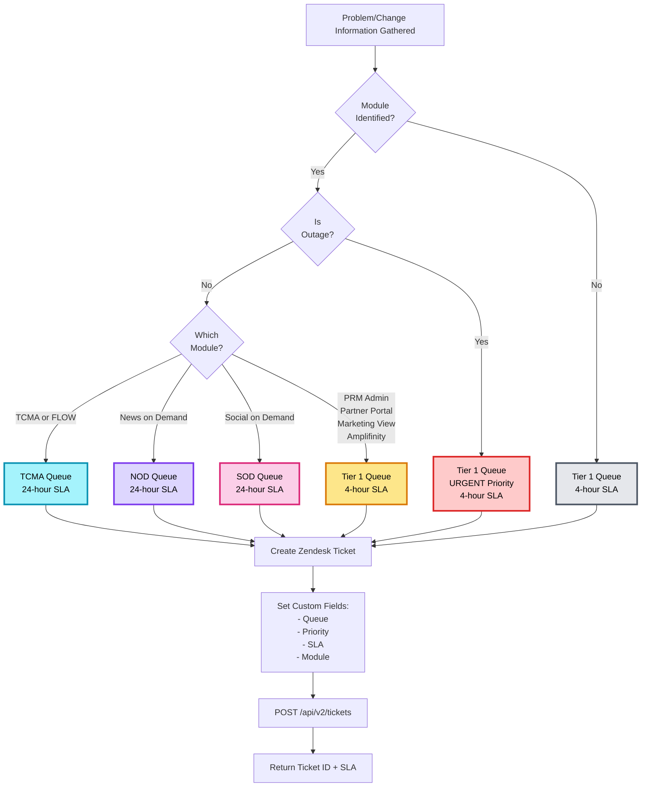
```mermaid
flowchart TD
    Start[Problem/Change Information Gathered] --> HasModule{Module<br/>Identified?}

    HasModule -->|Yes| IsOutage{Is<br/>Outage?}
    HasModule -->|No| Default[Tier 1 Queue<br/>4-hour SLA]

    IsOutage -->|Yes| T1Urgent[Tier 1 Queue<br/>URGENT Priority<br/>4-hour SLA]
    IsOutage -->|No| CheckModule{Which<br/>Module?}

    CheckModule -->|TCMA or FLOW| TCMA[TCMA Queue<br/>24-hour SLA]
    CheckModule -->|News on Demand| NOD[NOD Queue<br/>24-hour SLA]
    CheckModule -->|Social on Demand| SOD[SOD Queue<br/>24-hour SLA]
    CheckModule -->|PRM Admin<br/>Partner Portal<br/>Marketing View<br/>Amplifinity| T1[Tier 1 Queue<br/>4-hour SLA]

    TCMA --> CreateTicket[Create Zendesk Ticket]
    NOD --> CreateTicket
    SOD --> CreateTicket
    T1 --> CreateTicket
    T1Urgent --> CreateTicket
    Default --> CreateTicket

    CreateTicket --> SetFields[Set Custom Fields:<br/>- Queue<br/>- Priority<br/>- SLA<br/>- Module]

    SetFields --> ZendeskAPI[POST /api/v2/tickets]
    ZendeskAPI --> Confirmation[Return Ticket ID + SLA]

    style T1Urgent fill:#fecaca,stroke:#dc2626,stroke-width:3px,color:#000
    style TCMA fill:#a5f3fc,stroke:#0891b2,stroke-width:3px,color:#000
    style NOD fill:#ddd6fe,stroke:#7c3aed,stroke-width:3px,color:#000
    style SOD fill:#fbcfe8,stroke:#db2777,stroke-width:3px,color:#000
    style T1 fill:#fde68a,stroke:#d97706,stroke-width:3px,color:#000
    style Default fill:#e5e7eb,stroke:#4b5563,stroke-width:3px,color:#000
```

**Steps:**

1. **Module Collection:** During problem or change gathering, AI asks: "Which PartnerHub module or product is affected?"
2. **Module Options Presented:**
   - PRM Admin
   - Partner Portal
   - Marketing View
   - News on Demand
   - Social on Demand
   - TCMA/FLOW
   - Amplifinity
   - Other/Not Sure
3. **User Selects Module:** Selection stored in `context.module` (XState) and `conversations.module` (database)
4. **Routing Logic Evaluation:** System determines queue assignment (Tier 1, TCMA, NOD, SOD) and SLA based on module selection and outage detection. Outages always route to Tier 1 with urgent priority (4-hour SLA), while other modules route to specialized queues with 24-hour SLAs.
5. **Queue Assignment:** Result stored in `conversations.assigned_queue` and passed to Zendesk ticket
6. **Zendesk Custom Field:** Queue assignment set in Zendesk "Program" custom field
7. **SLA Communication:** User informed of expected response time based on queue

**Security:**

- Module selection validated against allowed values
- Queue assignment logic server-side only (not manipulable by client)
- Outage priority elevation logged for audit

**Data Integrity:**

- Module stored in conversations.module (text)
- Queue assignment stored in conversations.assigned_queue (text)
- SLA hours stored in conversations.sla_hours (integer)
- Routing logic logged in conversation metadata

**Data Reliability:**

- Module selection survives session restoration
- Queue assignment deterministic (same inputs = same output)
- Outage override always takes precedence
- Default to Tier 1 if module unknown

**Critical Requirements:**

- TCMA/FLOW MUST route to TCMA queue per BRD
- NOD MUST route to NOD queue per BRD
- SOD MUST route to SOD queue per BRD
- All other modules MUST route to Tier 1 per BRD
- Outages MUST override module routing and go to Tier 1 urgent per BRD
- SLA times MUST match BRD specifications

#### Acceptance Criteria

**Module Selection:**

- [ ] System asks user to select a module during problem or change request gathering
- [ ] All modules specified in requirements are presented as options
- [ ] User can select from the predefined list of modules
- [ ] "Other/Not Sure" option is available if user's module isn't listed
- [ ] Selected module is saved and used throughout the conversation

**Ticket Routing:**

- [ ] TCMA/FLOW module routes tickets to TCMA queue (24-hour response time)
- [ ] News on Demand module routes tickets to NOD queue (24-hour response time)
- [ ] Social on Demand module routes tickets to SOD queue (24-hour response time)
- [ ] PRM Admin module routes tickets to Tier 1 queue (4-hour response time)
- [ ] Partner Portal module routes tickets to Tier 1 queue (4-hour response time)
- [ ] Marketing View module routes tickets to Tier 1 queue (4-hour response time)
- [ ] Amplifinity module routes tickets to Tier 1 queue (4-hour response time)
- [ ] Unknown or unspecified modules route to Tier 1 queue (4-hour response time)

**Outage Priority:**

- [ ] If outage is detected, it takes priority over module routing
- [ ] Outage tickets always route to Tier 1, regardless of module selected
- [ ] Outage tickets are automatically set to "urgent" priority
- [ ] Outage tickets maintain 4-hour response time commitment
- [ ] Override logic logged for audit

**Zendesk Integration:**

- [ ] Queue assignment passed to Zendesk "Program" custom field
- [ ] SLA configured in Zendesk for each queue
- [ ] Priority set correctly (normal vs urgent)
- [ ] Tags include module name
- [ ] Custom field mapping documented

**User Communication:**

- [ ] Expected response time displayed to user
- [ ] SLA communicated clearly (4 hours vs 24 hours)
- [ ] Queue name not exposed to user (internal detail)
- [ ] Ticket confirmation includes SLA

**Data Persistence:**

- [ ] Module stored in database
- [ ] Queue assignment stored in database
- [ ] SLA hours stored in database
- [ ] Routing logic survives session restoration

**Testing:**

- [ ] All module routing rules tested
- [ ] Outage override tested for each module
- [ ] Default routing tested (unknown module)
- [ ] SLA calculations verified
- [ ] Zendesk queue assignment verified

---

### 4.12 BR-12 → TR-12: Problem Information Gathering

**Business Requirement Summary:**

The system must systematically gather all required information for problem reports through conversational prompts. Required information: environment, module, impacted user, page URL, steps to replicate, troubleshooting steps taken. Optional information offered: file attachments, CC email addresses. AI re-prompts for missing required information (maximum 2 attempts per field).

**Priority:** High  
**BRD Reference:** Section BR-12

**Flow Diagram:**

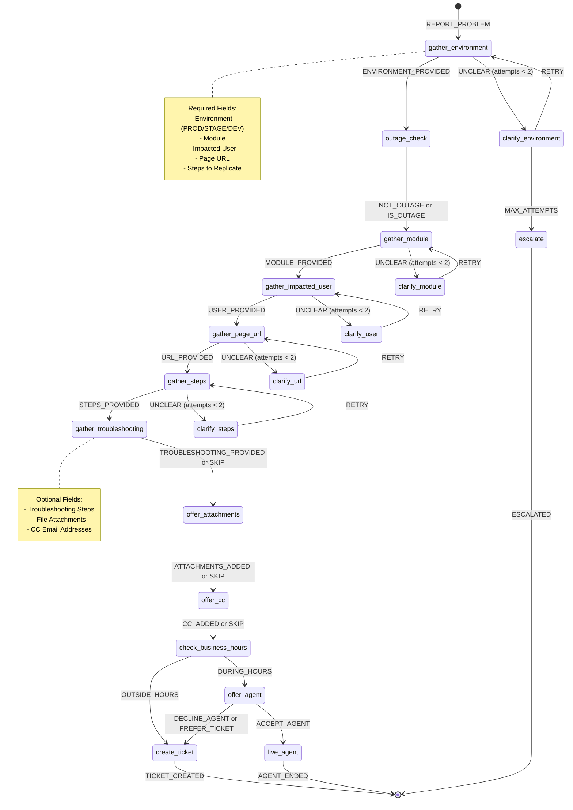
```mermaid
stateDiagram-v2
    [*] --> gather_environment: REPORT_PROBLEM

    gather_environment --> outage_check: ENVIRONMENT_PROVIDED
    gather_environment --> clarify_environment: UNCLEAR (attempts < 2)
    clarify_environment --> gather_environment: RETRY
    clarify_environment --> escalate: MAX_ATTEMPTS

    outage_check --> gather_module: NOT_OUTAGE or IS_OUTAGE

    gather_module --> gather_impacted_user: MODULE_PROVIDED
    gather_module --> clarify_module: UNCLEAR (attempts < 2)
    clarify_module --> gather_module: RETRY

    gather_impacted_user --> gather_page_url: USER_PROVIDED
    gather_impacted_user --> clarify_user: UNCLEAR (attempts < 2)
    clarify_user --> gather_impacted_user: RETRY

    gather_page_url --> gather_steps: URL_PROVIDED
    gather_page_url --> clarify_url: UNCLEAR (attempts < 2)
    clarify_url --> gather_page_url: RETRY

    gather_steps --> gather_troubleshooting: STEPS_PROVIDED
    gather_steps --> clarify_steps: UNCLEAR (attempts < 2)
    clarify_steps --> gather_steps: RETRY

    gather_troubleshooting --> offer_attachments: TROUBLESHOOTING_PROVIDED or SKIP

    offer_attachments --> offer_cc: ATTACHMENTS_ADDED or SKIP

    offer_cc --> check_business_hours: CC_ADDED or SKIP

    check_business_hours --> offer_agent: DURING_HOURS
    check_business_hours --> create_ticket: OUTSIDE_HOURS

    offer_agent --> live_agent: ACCEPT_AGENT
    offer_agent --> create_ticket: DECLINE_AGENT or PREFER_TICKET

    create_ticket --> [*]: TICKET_CREATED
    live_agent --> [*]: AGENT_ENDED
    escalate --> [*]: ESCALATED

    note right of gather_environment
        Required Fields:
        - Environment (PROD/STAGE/DEV)
        - Module
        - Impacted User
        - Page URL
        - Steps to Replicate
    end note

    note right of gather_troubleshooting
        Optional Fields:
        - Troubleshooting Steps
        - File Attachments
        - CC Email Addresses
    end note
```

**Steps:**

1. **Environment Collection:**
   - AI asks: "What environment is this issue occurring in?"
   - Options: Production, Staging, Development
   - Validation: Must match one of three options
   - Classification: AI maps user response to PROD/STAGE/DEV
   - Retry logic: If unclear, AI re-prompts (max 2 attempts)

2. **Outage Check:** See TR-09 for outage detection logic

3. **Module Collection:**
   - AI asks: "Which PartnerHub module or product is affected?"
   - Options: PRM Admin, Partner Portal, Marketing View, News on Demand, Social on Demand, TCMA/FLOW, Amplifinity
   - Validation: Must select from module list
   - Retry logic: If unclear, AI re-prompts (max 2 attempts)

4. **Impacted User Collection:**
   - AI asks: "Who is experiencing this issue?"
   - Expected format: "user@company.com", "All partners in our organization", "Specific user group: Sales team"
   - Validation: Text (min 3 characters)
   - Retry logic: If unclear, AI clarifies (max 2 attempts)

5. **Page URL Collection:**
   - AI asks: "What is the URL of the page where this issue occurs?"
   - Expected format: https://partners.acme.partnerhubprm.com/page
   - Validation: Basic URL format (contains domain)
   - Retry logic: If invalid, AI re-prompts (max 2 attempts)

6. **Steps to Replicate:**
   - AI asks: "What steps can we follow to replicate this issue?"
   - Expected: Step-by-step instructions
   - Validation: Min 10 characters
   - Retry logic: If too short/unclear, AI re-prompts (max 2 attempts)

7. **Troubleshooting Steps (Optional):**
   - AI asks: "Have you already tried any troubleshooting steps?"
   - User can provide details or skip
   - No retry logic (optional field)

8. **File Attachments (Optional):**
   - AI asks: "Would you like to attach any screenshots, logs, or files?"
   - User can upload files or skip
   - Validation: File type (<20MB, allowed types)
   - No retry logic (optional field)

9. **CC Email Addresses (Optional):**
   - AI asks: "Would you like to CC anyone else on the ticket?"
   - User can provide comma-separated emails or skip
   - Validation: Email format for each address
   - No retry logic (optional field)

10. **Information Complete:**
    - All required fields gathered
    - Optional fields collected or skipped
    - Proceed to business hours check and ticket creation

**Security:**

- All user input sanitized before storage
- URL validation prevents injection attacks
- Email validation prevents malformed addresses
- File uploads scanned for viruses

**Data Integrity:**

- All gathered information stored in conversations.gathered_info (JSONB)
- Required fields validated before ticket creation
- Field collection attempts tracked per field
- Missing required fields block ticket creation

**Data Reliability:**

- Gathered information survives session restoration
- Field collection state persisted in XState snapshot
- Retry attempts tracked per field (not global counter)
- Partial information saved incrementally

**Critical Requirements:**

- Five required fields MUST be collected per BRD: environment, module, impacted user, page URL, steps to replicate
- Maximum 2 re-prompt attempts per field per BRD
- Optional fields MUST be offered but not required per BRD
- User MUST be able to skip optional fields per BRD
- Required fields MUST be validated before ticket creation

#### Acceptance Criteria

**Required Information Collection:**

- [ ] System collects environment with 3 clear options (Production, Staging, Development)
- [ ] System collects module from the predefined list
- [ ] System collects number of impacted users with validation
- [ ] System collects page URL and validates it's in correct format
- [ ] System collects steps to reproduce the problem with minimum length requirement

**Helpful Retry Logic:**

- [ ] System allows up to 2 attempts for each required field
- [ ] Each field is tracked separately (not all fields together)
- [ ] If user can't provide information after 2 attempts, system escalates to human agent
- [ ] Clear, helpful error messages are shown when validation fails
- [ ] AI provides helpful guidance to help user provide the correct information

**Optional Field Handling:**

- [ ] Troubleshooting steps offered but skippable
- [ ] File attachments offered but skippable
- [ ] CC email addresses offered but skippable
- [ ] User can explicitly skip optional fields
- [ ] Skipped fields don't block ticket creation

**Data Validation:**

- [ ] Environment validated against allowed values
- [ ] Module validated against module list
- [ ] URL validated for basic format
- [ ] Email addresses validated for format
- [ ] File uploads validated for type and size

**Conversational Flow:**

- [ ] Questions asked in logical order
- [ ] AI acknowledges user responses
- [ ] Progress indicated to user
- [ ] User can see what's been collected
- [ ] User can modify previously provided information

**File Upload Support:**

- [ ] Multiple files supported
- [ ] File types validated (images, PDFs, logs, etc.)
- [ ] File size limit enforced (20MB max per BRD from TR-01)
- [ ] Files virus scanned before storage
- [ ] File metadata stored with conversation

**Error Handling:**

- [ ] Clear error messages for validation failures
- [ ] Retry prompts provide helpful guidance
- [ ] Escalation path for max retries exceeded
- [ ] Network errors handled gracefully
- [ ] Partial information preserved on error

---

### 4.13 BR-13 → TR-13: Change Request Processing

**Business Requirement Summary:**

The system must guide customers through change requests with appropriate documentation and routing. Embrace provides relevant documentation for self-service. Customer can ask follow-up questions. If customer wants formal request, gather: module/feature, detailed description, file attachments, time-sensitive event date. Change requests include Professional Services billing disclaimer and route to Tier 1 queue (4-hour SLA).

**Priority:** High  
**BRD Reference:** Section BR-13

**Flow Diagram:**

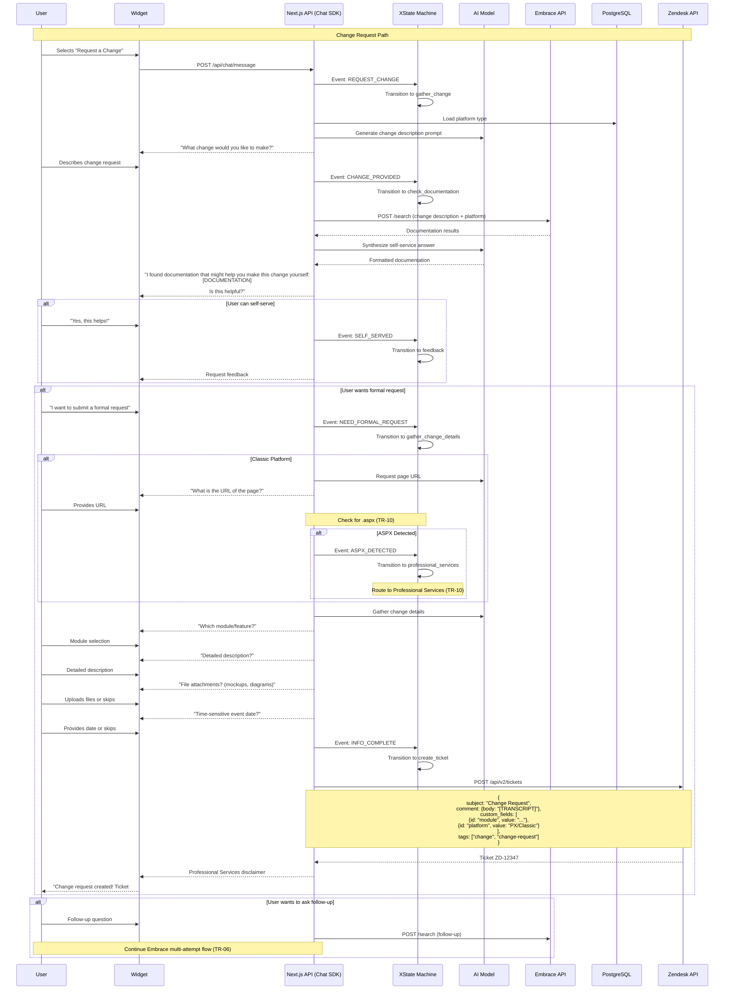
```mermaid
sequenceDiagram
    participant User
    participant Widget
    participant API as Next.js API (Chat SDK)
    participant State as XState Machine
    participant AI as AI Model
    participant Embrace as Embrace API
    participant DB as PostgreSQL
    participant Zendesk as Zendesk API

    Note over User,Zendesk: Change Request Path

    User->>Widget: Selects "Request a Change"
    Widget->>API: POST /api/chat/message
    API->>State: Event: REQUEST_CHANGE
    State->>State: Transition to gather_change

    API->>DB: Load platform type
    API->>AI: Generate change description prompt
    API-->>Widget: "What change would you like to make?"
    User->>Widget: Describes change request

    API->>State: Event: CHANGE_PROVIDED
    State->>State: Transition to check_documentation

    API->>Embrace: POST /search (change description + platform)
    Embrace-->>API: Documentation results

    API->>AI: Synthesize self-service answer
    AI-->>API: Formatted documentation

    API-->>Widget: "I found documentation that might help you make this change yourself:<br/>[DOCUMENTATION]<br/><br/>Is this helpful?"

    alt User can self-serve
        User->>Widget: "Yes, this helps!"
        API->>State: Event: SELF_SERVED
        State->>State: Transition to feedback
        API-->>Widget: Request feedback
    end

    alt User wants formal request
        User->>Widget: "I want to submit a formal request"
        API->>State: Event: NEED_FORMAL_REQUEST
        State->>State: Transition to gather_change_details

        alt Classic Platform
            API->>AI: Request page URL
            API-->>Widget: "What is the URL of the page?"
            User->>Widget: Provides URL

            Note over API,State: Check for .aspx (TR-10)

            alt ASPX Detected
                API->>State: Event: ASPX_DETECTED
                State->>State: Transition to professional_services
                Note over State: Route to Professional Services (TR-10)
            end
        end

        API->>AI: Gather change details
        API-->>Widget: "Which module/feature?"
        User->>Widget: Module selection

        API-->>Widget: "Detailed description?"
        User->>Widget: Detailed description

        API-->>Widget: "File attachments? (mockups, diagrams)"
        User->>Widget: Uploads files or skips

        API-->>Widget: "Time-sensitive event date?"
        User->>Widget: Provides date or skips

        API->>State: Event: INFO_COMPLETE
        State->>State: Transition to create_ticket

        API->>Zendesk: POST /api/v2/tickets
        Note over API,Zendesk: {<br/>  subject: "Change Request",<br/>  comment: {body: "[TRANSCRIPT]"},<br/>  custom_fields: [<br/>    {id: "module", value: "..."},<br/>    {id: "platform", value: "PX/Classic"}<br/>  ],<br/>  tags: ["change", "change-request"]<br/>}

        Zendesk-->>API: Ticket ZD-12347

        API-->>Widget: Professional Services disclaimer
        Widget-->>User: "Change request created! Ticket #ZD-12347.<br/>Expected response: 4 hours.<br/><br/>Note: Change requests are subject to our Professional Services policy and may be billable."
    end

    alt User wants to ask follow-up
        User->>Widget: Follow-up question
        API->>Embrace: POST /search (follow-up)
        Note over API,User: Continue Embrace multi-attempt flow (TR-06)
    end
```

**Steps:**

1. **Initial Change Description:**
   - AI asks: "What change would you like to make to your PartnerHub portal?"
   - User provides natural language description
   - System loads platform type from database (TR-04)

2. **Embrace Documentation Search:**
   - Call Embrace API with change description
   - Include platform type (PX vs Classic)
   - Include user context (org, email)

3. **Present Self-Service Documentation:**
   - AI synthesizes Embrace results into readable format
   - Display: "I found documentation that might help you make this change yourself:"
   - Include relevant links and instructions
   - Ask: "Is this helpful? Can you make the change yourself?"

4. **Self-Service Path:**
   - If user indicates success: Mark as self-served
   - Request feedback (thumbs up/down)
   - End conversation successfully

5. **Formal Request Path:**
   - If user needs formal request: Transition to gather_change_details
   - If Classic platform: Request URL (check for .aspx per TR-10)

6. **Gather Change Details:**

   **Required Fields:**
   - **Module/Feature:** Which part of PartnerHub affected
   - **Detailed Description:** Clear description of desired change

   **Optional Fields:**
   - **File Attachments:** Mockups, workflow diagrams, screenshots
   - **Time-Sensitive Event Date:** "Is this needed for a specific event?" (e.g., "Partner summit on March 15")

7. **Queue Routing:**
   - **If ASPX detected:** Professional Services queue (24-hour SLA) - see TR-10
   - **If standard change:** Tier 1 queue (4-hour SLA) - see TR-11

8. **Create Zendesk Ticket:**
   - Full chat transcript included
   - Custom fields: Module, Platform Type, Change Type
   - Tags: ["change", "change-request"]
   - Priority: Normal

9. **Professional Services Disclaimer:**
   - Display for ALL change requests: "Change requests are subject to our Professional Services policy and may be billable."
   - ASPX changes get additional disclaimer: "This request is subject to our Professional Services policy and may be billable."

10. **Follow-Up Questions Path:**
    - If user asks follow-up about documentation
    - Continue Embrace multi-attempt flow (TR-06)
    - Maximum 5 Embrace attempts before escalation

**Security:**

- Change descriptions sanitized before Embrace API calls
- File uploads validated and virus scanned
- URLs validated for ASPX detection
- Professional Services disclaimer required for compliance

**Data Integrity:**

- All change details stored in conversations.gathered_info (JSONB)
- Embrace query and response stored in messages table
- Self-service success tracked in conversation metadata
- File attachments linked to conversation

**Data Reliability:**

- Change information survives session restoration
- Embrace API failures fallback to formal request path
- Failed ticket creation retries with exponential backoff
- Partial information saved incrementally

**Critical Requirements:**

- Embrace API MUST be called before formal request per BRD
- Self-service option MUST be offered per BRD
- Follow-up questions MUST be supported per BRD
- Professional Services disclaimer MUST be displayed per BRD
- ASPX detection MUST route to Professional Services per TR-10
- Change requests MUST route to Tier 1 (4-hour SLA) unless Professional Services per BRD

#### Acceptance Criteria

**Embrace Documentation Search:**

- [ ] Embrace API called with change description
- [ ] Platform type included in API call
- [ ] User context included in API call
- [ ] Response synthesized by AI into readable format
- [ ] Documentation presented clearly to user

**Self-Service Option:**

- [ ] User is offered choice to try self-service or submit formal change request
- [ ] System tracks when users successfully resolve issues through self-service
- [ ] System asks for feedback after self-service attempt
- [ ] No support ticket is created if user successfully resolves issue themselves

**Formal Change Request:**

- [ ] System collects module or feature information
- [ ] System collects detailed description of the change request
- [ ] File attachments are supported (optional)
- [ ] Time-sensitive deadline can be provided (optional)
- [ ] User can skip optional fields if not applicable

**Classic Platform ASPX Detection:**

- [ ] System asks for URL for Classic platform change requests
- [ ] System applies ASPX detection logic to determine routing
- [ ] If ASPX is detected, request routes to Professional Services
- [ ] If no ASPX detected, request follows standard routing

**Queue Routing:**

- [ ] Standard changes route to Tier 1 (4-hour SLA)
- [ ] ASPX changes route to Professional Services (24-hour SLA)
- [ ] Queue assignment follows module-based rules (TR-11)
- [ ] Routing logged for audit

**Professional Services Disclaimer:**

- [ ] Disclaimer displayed for ALL change requests
- [ ] Additional disclaimer for ASPX changes
- [ ] Disclaimer matches BRD wording exactly
- [ ] Disclaimer shown before ticket confirmation

**Follow-Up Questions:**

- [ ] User can ask follow-up questions about documentation
- [ ] Follow-ups call Embrace API again
- [ ] Multi-attempt logic applies (TR-06)
- [ ] Maximum 5 attempts before escalation

**Zendesk Ticket Creation:**

- [ ] Ticket created with change request details
- [ ] Full transcript included
- [ ] Custom fields populated correctly
- [ ] Tags include ["change", "change-request"]
- [ ] Priority set to Normal
- [ ] SLA based on queue assignment

---

### 4.14 BR-14 → TR-14: Zendesk Ticket Creation

**Business Requirement Summary:**

The system must create properly formatted tickets in Zendesk with all gathered information. Ticket created via API after information gathering complete. Full chat transcript included. Custom fields populated: Environment, Module, Is Outage, Platform Type. Queue assignment based on routing rules. SLA timer starts upon creation. Ticket number returned and displayed. Attachments uploaded to ticket.

**Priority:** Critical  
**BRD Reference:** Section BR-14

**Flow Diagram:**

```mermaid
sequenceDiagram
    participant State as XState Machine
    participant API as Next.js API (Chat SDK)
    participant DB as PostgreSQL
    participant ZendeskAPI as Zendesk API
    participant AttachAPI as Zendesk Attachments API
    participant Widget

    Note over State,Widget: All required information gathered

    State->>State: Event: INFORMATION_COMPLETE
    State->>State: Transition to create_ticket

    API->>DB: BEGIN TRANSACTION

    API->>API: Format chat transcript<br/>(HTML with timestamps)
    API->>API: Determine queue routing<br/>(TR-11: Module-based logic)
    API->>API: Calculate priority<br/>(outage = urgent, else normal)
    API->>API: Build custom fields array

    alt File attachments present
        loop For each attachment
            API->>AttachAPI: POST /api/v2/uploads
            Note over API,AttachAPI: {<br/>  filename: "screenshot.png",<br/>  data: base64_encoded<br/>}
            AttachAPI-->>API: attachment_token
        end
    end

    API->>API: Build ticket payload

    API->>ZendeskAPI: POST /api/v2/tickets
    Note over API,ZendeskAPI: {<br/>  ticket: {<br/>    subject: "...",<br/>    comment: {<br/>      html_body: "[TRANSCRIPT]",<br/>      uploads: [tokens]<br/>    },<br/>    custom_fields: [<br/>      {id: env_id, value: "PROD"},<br/>      {id: module_id, value: "PRM Admin"},<br/>      {id: outage_id, value: true},<br/>      {id: platform_id, value: "PX"}<br/>    ],<br/>    priority: "urgent",<br/>    tags: ["ai-chat", "outage", "pagerduty"]<br/>  }<br/>}

    alt Zendesk API Success
        ZendeskAPI-->>API: {ticket: {id: 12345, ...}}

        API->>DB: INSERT INTO tickets<br/>(conversation_id, zendesk_id, queue, priority)
        API->>DB: UPDATE conversations<br/>(status = 'ticket_created')
        API->>DB: COMMIT TRANSACTION

        API->>API: Calculate SLA based on queue
        API-->>Widget: {<br/>  ticketId: "ZD-12345",<br/>  queue: "Tier 1",<br/>  sla: "4 hours",<br/>  priority: "urgent"<br/>}

        Widget->>Widget: Display confirmation
        Widget-->>Widget: "Your support ticket has been created!<br/>Ticket #ZD-12345<br/>Expected response time: 4 hours"
    end

    alt Zendesk API Failure
        ZendeskAPI-->>API: {error: "..."}

        API->>DB: ROLLBACK TRANSACTION
        API->>DB: Log error to error_logs
        API->>API: Retry logic (exponential backoff, max 3 attempts)

        alt Retry Successful
            Note over API: Ticket created on retry
        else All Retries Failed
            API-->>Widget: {error: "Failed to create ticket"}
            Widget-->>Widget: "We're having trouble creating your ticket. Your information has been saved and our team will follow up."
        end
    end
```

**Steps:**

1. **Pre-Ticket Preparation:**
   - Verify all required information gathered (TR-12 for problems, TR-13 for changes)
   - XState machine transitions to `create_ticket` state
   - Database transaction begins to ensure atomicity

2. **Format Chat Transcript:**
   - Convert conversation messages to HTML format
   - Include timestamp, role (Customer/AI Assistant/Support Agent), and message content for each message
   - Apply HTML sanitization to prevent XSS attacks
   - Style transcript for readability in Zendesk UI

3. **Determine Queue and Priority:**
   - Apply module-based routing logic (TR-11) to determine correct queue
   - Check outage flag (TR-09) to set priority to urgent if applicable
   - Check ASPX flag (TR-10) for Professional Services routing
   - Calculate SLA hours based on assigned queue

4. **Upload Attachments (if present):**
   - Use Zendesk Uploads API (`POST /api/v2/uploads`) to upload each file
   - Obtain upload token for each file
   - Collect all upload tokens to attach to ticket

5. **Build Custom Fields Array:**
   - Map gathered information to Zendesk custom field IDs
   - Include: Environment, Module, Platform Type (PX/Classic), Is Outage flag
   - Validate all required custom fields are present

6. **Create Zendesk Ticket:**
   - Build ticket payload with subject, formatted transcript, upload tokens, custom fields, priority, and tags
   - Send POST request to Zendesk Tickets API (`POST /api/v2/tickets`)
   - Use Basic Auth with Zendesk API credentials
   - Set assignee to null (let Zendesk routing rules handle assignment)

7. **Handle API Response:**
   - **Success:** Extract ticket ID from response, save to database, commit transaction
   - **Failure:** Log error details, rollback database transaction, trigger retry logic

8. **Retry Logic:**
   - Implement exponential backoff strategy (1s, 2s, 4s delays)
   - Maximum 3 retry attempts for transient failures
   - Re-throw error if all retries exhausted

9. **Save Ticket to Database:**
   - Insert ticket record with conversation ID, Zendesk ticket ID, queue, priority, SLA hours
   - Update conversation record with ticket creation timestamp
   - Commit database transaction

10. **Return Confirmation to User:**
    - Display ticket ID in format `ZD-{ticketId}`
    - Show assigned queue and expected SLA hours
    - Provide confirmation message with next steps

**Data Integrity:**

- Database transaction ensures atomicity
- Ticket ID stored in tickets table
- Conversation status updated to 'ticket_created'
- Failed tickets logged for manual creation

**Data Reliability:**

- Retry logic with exponential backoff
- Failed tickets stored in database for recovery
- Transaction rollback on failure preserves data consistency
- Idempotency: Can retry without creating duplicates

**Critical Requirements:**

- Full chat transcript MUST be included per BRD
- Custom fields MUST be populated per BRD: Environment, Module, Is Outage, Platform Type
- Queue assignment MUST follow routing rules per BRD (TR-11)
- SLA timer MUST start upon ticket creation per BRD
- Ticket number MUST be returned and displayed per BRD
- Attachments MUST be uploaded to ticket per BRD

#### Acceptance Criteria

**Ticket Creation:**

- [ ] Support ticket is successfully created in Zendesk
- [ ] System authenticates correctly with Zendesk
- [ ] If ticket creation fails, system safely handles the error without data loss

**Conversation Transcript:**

- [ ] Full conversation history is included in the ticket
- [ ] Transcript is formatted with timestamps for each message
- [ ] Messages are clearly labeled as from user or AI
- [ ] Transcript is safely formatted to prevent any security issues
- [ ] Transcript is easy for support agents to read and understand

**Ticket Information:**

- [ ] Environment field is populated (Production, Staging, Development)
- [ ] Module field is populated with selected module
- [ ] Outage status field is populated (Yes/No)
- [ ] Platform Type field is populated (PX or Classic)
- [ ] Custom field configuration can be updated by PartnerHub team

**Ticket Routing:**

- [ ] Ticket is routed to the correct queue based on routing rules
- [ ] Priority is set correctly (urgent for outages, normal for others)
- [ ] Expected response time (SLA) is calculated based on the queue
- [ ] Ticket is tagged with relevant keywords for easy identification

**File Attachments:**

- [ ] Files uploaded by users are attached to the Zendesk ticket
- [ ] Attachments are properly linked to the ticket
- [ ] Multiple file attachments are supported per ticket
- [ ] File types and sizes are validated before upload
- [ ] If upload fails, system handles it gracefully and notifies user

**Error Handling:**

- [ ] System automatically retries failed operations (up to 3 attempts)
- [ ] Retry attempts use increasing delays (1 second, 2 seconds, 4 seconds)
- [ ] Failed ticket creations are logged for manual review and creation
- [ ] Users see clear, helpful error messages
- [ ] Database transaction rolled back on failure

**Database Persistence:**

- [ ] Ticket ID saved to tickets table
- [ ] Conversation status updated
- [ ] Queue and priority stored
- [ ] SLA hours stored
- [ ] Relationship to conversation maintained

**User Communication:**

- [ ] Ticket number displayed clearly
- [ ] SLA communicated to user
- [ ] Queue name not exposed (internal detail)
- [ ] Confirmation message matches BRD wording

---

### 4.15 BR-15 → TR-15: Feedback Collection

**Business Requirement Summary:**

The system must collect customer feedback on support experience. Thumbs up/down rating offered at end of all interactions. Feedback associated with session for analytics. Feedback collection does not block session completion. Feedback stored with session context for future analysis. Data exportable for offline analysis upon request.

**Priority:** Medium  
**BRD Reference:** Section BR-15

**Flow Diagram:**

```mermaid
sequenceDiagram
    participant User
    participant Widget
    participant API as Next.js API (Chat SDK)
    participant State as XState Machine
    participant DB as PostgreSQL

    Note over User,DB: End of interaction (any path)

    State->>State: Event: INTERACTION_COMPLETE
    State->>State: Transition to feedback

    API-->>Widget: Display feedback prompt
    Widget-->>User: "How was your experience?<br/> Thumbs Up   Thumbs Down"

    alt User provides feedback
        User->>Widget: Clicks  or 
        Widget->>API: POST /api/feedback
        Note over Widget,API: {<br/>  conversation_id: "...",<br/>  feedback_type: "thumbs_up" or "thumbs_down",<br/>  rating: 1 or -1<br/>}

        API->>DB: INSERT INTO feedback
        DB-->>API: Feedback saved

        alt Thumbs Up
            API-->>Widget: "Thank you for your feedback!"
        else Thumbs Down
            API-->>Widget: "Thank you for your feedback. We're sorry we couldn't help better."
        end

        API->>State: Event: FEEDBACK_PROVIDED
        State->>State: Transition to conversation_complete
    end

    Note over API,DB: Feedback linked to:<br/>- Conversation ID<br/>- Message ID (if specific)<br/>- User context<br/>- Timestamp

    API->>DB: UPDATE conversations (status = 'completed')
    API-->>Widget: "Thank you! Your conversation has been saved."
```

**Steps:**

1. **Feedback Trigger Points:**
   - After successful self-service (Embrace answered question)
   - After ticket creation (TR-14)
   - After live agent conversation ends (TR-07)
   - After any conversation completion

2. **Display Feedback Prompt:**
   - Widget displays: "How was your experience?"
   - Two buttons:
     -  Thumbs Up
     -  Thumbs Down
   - Prompt remains displayed until user selects an option

3. **Thumbs Up Path:**
   - User clicks  button
   - API creates feedback record with conversation ID, feedback type 'thumbs_up', rating +1, and timestamp
   - Display confirmation message: "Thank you for your feedback! We're glad we could help."
   - Conversation marked complete

4. **Thumbs Down Path:**
   - User clicks  button
   - API creates feedback record with conversation ID, feedback type 'thumbs_down', rating -1, and timestamp
   - Display message: "Thank you for your feedback. We're sorry we couldn't help better."
   - Conversation marked complete

5. **Store Feedback Data:**
   - Save feedback with conversation context including intent, resolution type, platform type, and optional ticket ID
   - Associate feedback with user ID and organization ID for segmentation
   - Store optional message ID if feedback is for specific AI response
   - Capture timestamp for time-based analytics

6. **Analytics Capabilities:**
   - Calculate overall satisfaction rate (thumbs up vs thumbs down percentage)
   - Track feedback trends over time (daily, weekly, monthly)
   - Segment feedback by intent type (ask question, request change, report problem)
   - Segment feedback by resolution type (self-served, ticket created, agent assisted)
   - Identify negative feedback patterns by module, platform, or environment

7. **Data Export:**
   - The Contractor provides SQL queries for custom analytics reports
   - PartnerHub can request CSV exports of feedback data
   - Export includes: conversation ID, feedback type, rating, timestamp, and context fields

**Security:**

- User can only provide feedback for own conversations
- PII handling compliant with data retention policy

**Data Integrity:**

- Feedback linked to conversation via foreign key
- One feedback record per conversation (unique constraint)
- Context captured at time of feedback
- Timestamps in UTC for consistent analysis

**Data Reliability:**

- Feedback survives database restarts
- Failed feedback submission retries once
- Feedback remains even if conversation deleted (soft delete)

**Critical Requirements:**

- Thumbs up/down rating MUST be offered at end of all interactions per BRD
- Feedback MUST be associated with session for analytics per BRD
- Feedback MUST be stored with session context per BRD
- Data MUST be exportable for offline analysis per BRD

#### Acceptance Criteria

**Feedback Prompt Display:**

- [ ] Prompt displayed at end of all interaction types
- [ ] Two clear options: Thumbs Up, Thumbs Down
- [ ] Prompt accessible (keyboard navigation, screen reader)
- [ ] User must select an option to proceed

**Thumbs Up Path:**

- [ ] Thumbs up click saves feedback record
- [ ] Rating = 1 stored in database
- [ ] Thank you message displayed
- [ ] Conversation marked complete
- [ ] No comment prompt (positive feedback doesn't need explanation)

**Negative Feedback (Thumbs Down):**

- [ ] When user clicks thumbs down, feedback is saved
- [ ] Negative rating is recorded in the system
- [ ] Thank you message displayed
- [ ] Conversation marked complete

**Database Storage:**

- [ ] Feedback table with all required fields
- [ ] Foreign key to conversations table
- [ ] Unique constraint (one feedback per conversation)
- [ ] Context stored in JSONB field
- [ ] Timestamps in UTC

**Analytics Support:**

- [ ] Satisfaction rate query works
- [ ] Feedback by intent query works
- [ ] Negative feedback query works
- [ ] Data exportable to CSV
- [ ] Queries performant (<100ms)

**Context Capture:**

- [ ] Intent captured (ask_question, request_change, report_problem)
- [ ] Resolution type captured (self_served, ticket_created, agent_assisted)
- [ ] Embrace attempts captured (if applicable)
- [ ] Ticket ID captured (if ticket created)
- [ ] Platform type captured

**Security and Privacy:**

- [ ] User can only provide feedback for own conversations
- [ ] PII handling compliant with data retention policy

---

### 4.16 BR-16 → TR-16: Session Management and Context

**Business Requirement Summary:**

The system must maintain conversation context throughout the support interaction. All conversations are stored in the database and persist indefinitely. All gathered information is retained throughout the conversation. Customer can review/modify previously provided information. Incomplete conversations are logged for analysis. Per BRD BR-16, the system must also detect user inactivity, display timeout warnings, and mark conversations as abandoned after 30 minutes of inactivity.

**Priority:** High  
**BRD Reference:** Section BR-16

\*Architecture Note - Technical Session Management vs. UX Inactivity Detection:\*\*

With the database-backed architecture, conversations are stored permanently in PostgreSQL rather than in temporary session storage. This eliminates the need for **technical session management** (in-memory sessions with expiry). However, **UX-level inactivity detection** is still required to meet BRD requirements for timeout warnings and conversation status tracking.

**Technical Session Management (NOT Needed):**

The database-backed architecture eliminates traditional session management:

- ~~Track active sessions and their expiration~~ → Conversations persist permanently
- ~~Restore sessions when users return~~ → Conversations retrieved by ID anytime
- ~~Clean up expired sessions~~ → No session expiry to clean up
- ~~Session timeout logic~~ → No technical session lifecycle

**UX Inactivity Detection (REQUIRED per BRD):**

While technical session management is not needed, the BRD requires UX-level inactivity handling:

- **25-minute warning:** Display modal warning user of impending timeout
- **30-minute timeout:** Mark conversation as 'abandoned' in database (not deleted)
- **User can dismiss warning:** "I'm still here" resets the inactivity timer
- **Resumption:** Users can always start a new conversation; abandoned ones remain in database for analytics

This approach combines the robustness of database persistence with the UX requirements from the BRD.

**Flow Diagram:**

```mermaid
sequenceDiagram
    participant User
    participant Widget
    participant API as Next.js API (Chat SDK)
    participant DB as PostgreSQL
    participant State as XState Machine

    Note over User,State: Conversation Lifecycle

    User->>Widget: Opens chat widget
    Widget->>API: GET /api/chat/init (JWT token)
    API->>API: Validate JWT
    API->>DB: CREATE new conversation
    DB-->>API: Conversation created (id: 456)
    API->>State: Initialize state machine
    API-->>Widget: {conversationId, messages: []}
    Widget-->>User: "Welcome! How can I help?"

    loop User interaction
        User->>Widget: Sends message
        Widget->>API: POST /api/chat/message
        API->>State: Process message
        State->>State: Transition to next state
        API->>DB: Save message
        API->>DB: Update conversation<br/>(machine_state, gathered_info, updated_at)
        API-->>Widget: Response
    end

    alt User closes widget
        Widget->>Widget: beforeUnload event
        Note over API: Conversation remains in database<br/>available for future reference
    end

    alt User starts new conversation
        API->>DB: CREATE new conversation
        Note over API: Previous conversations remain<br/>accessible in database
    end
```

**Warning Modal UX:**

| Element              | Content                                                                                                |
| -------------------- | ------------------------------------------------------------------------------------------------------ |
| **Title**            | "Are you still there?"                                                                                 |
| **Message**          | "Your session will timeout in 5 minutes due to inactivity. Any unsaved information will be preserved." |
| **Primary Button**   | "I'm still here" → Resets timer, closes modal                                                          |
| **Secondary Button** | "End conversation" → Marks as 'incomplete', closes widget                                              |

**Inactivity Detection Summary:**

| Timeframe          | Action              | Implementation                                  |
| ------------------ | ------------------- | ----------------------------------------------- |
| **25 minutes**     | Show warning modal  | Client-side JavaScript timer                    |
| **30 minutes**     | Mark as 'abandoned' | API call to update conversation status          |
| **User dismisses** | Reset timer         | Client-side timer reset                         |
| **30 days**        | Delete old records  | Server-side cron job (separate from inactivity) |

**Steps:**

1. **Conversation Initialization:**
   - Create new conversation record in PostgreSQL with unique conversation ID
   - Initialize XState machine with initial state ('initial_intent')
   - Set conversation status to 'active'
   - Store conversation permanently in database (no expiration)
   - Return conversation ID to widget for subsequent API calls

2. **Context Preservation:**
   - Store XState machine snapshot in `machine_state` JSONB field (includes current state, context, and history)
   - Store gathered information in `gathered_info` JSONB field (intent, environment, module, impacted user, page URL, steps to replicate, troubleshooting steps, attachments, CC emails, etc.)
   - Update context after every state transition and information collection
   - All context data persists permanently in database

3. **Message Persistence:**
   - Save each message to `messages` table with conversation ID, role (user/assistant/agent), content, and timestamp
   - Update conversation record with latest XState machine state and gathered information after each message
   - Use database transactions to ensure atomicity (message and state update together)
   - All messages stored permanently and linked to conversation

4. **Review/Modify Previously Provided Information:**
   - Display gathered information summary to user in widget
   - Allow user to edit any previously collected field
   - Update XState machine context when field is modified
   - Save modified information to database `gathered_info` JSONB field
   - Apply validation to modified fields

5. **Incomplete Conversation Logging:**
   - Mark conversations as 'incomplete' or 'abandoned' when user closes widget during information gathering
   - Mark conversations as 'error' when unhandled errors occur
   - Store conversation status, current state, and gathered information for analysis
   - Query incomplete conversations for analytics and improvement insights
   - Export incomplete conversation data for analysis

6. **Automated Cleanup of Old Conversations:**
   - Scheduled job runs daily to clean up conversations older than 30 days
   - Delete conversations and associated messages, attachments, and feedback records
   - **Implementation Options:**
     - **Option 1 (Recommended):** Railway Cron Job - Configure in Railway dashboard to call `/api/cron/cleanup-conversations` endpoint daily
     - **Option 2:** Next.js API Route with external cron service (e.g., cron-job.org, EasyCron) calling the endpoint

**Security:**

- Conversation IDs generated with UUIDs (unguessable)
- Users can only access own conversations (user_id validation)
- JWT validation on every API call

**Data Integrity:**

- All conversation updates use database transactions
- XState machine state validated before restoration
- Gathered information schema validated
- Message order preserved with timestamps

**Data Reliability:**

- Conversation state survives application restarts
- Database-backed persistence (no in-memory state)
- Failed updates retry with exponential backoff
- Concurrent updates handled with optimistic locking

**Critical Requirements:**

- All conversations MUST be stored permanently in database per architecture
- All gathered information MUST be retained throughout conversation per BRD
- Customer MUST be able to review/modify previously provided information per BRD
- Incomplete conversations MUST be logged for analysis per BRD
- Inactivity warning MUST be displayed at 25 minutes per BRD BR-16
- Conversation MUST be marked as 'abandoned' after 30 minutes of inactivity per BRD BR-16
- User MUST be able to dismiss warning and reset timer per BRD BR-16

#### Acceptance Criteria

**Conversation Initialization:**

- [ ] New conversation created on widget open
- [ ] Conversation stored permanently in database
- [ ] JWT validation on every conversation init
- [ ] User can only access own conversations
- [ ] Conversation ID returned to widget

**Saving Conversation Context:**

- [ ] Conversation state is saved after every step in the conversation
- [ ] All information gathered from the user is saved after each update
- [ ] Complete message history is saved in the system
- [ ] File attachments are properly linked to the conversation
- [ ] All conversation data is preserved even if the system restarts
- [ ] All data is stored permanently (not deleted automatically)

**Retrieving Conversations:**

- [ ] Conversations can be retrieved using the conversation ID
- [ ] Conversation state is fully restored when retrieved
- [ ] Complete conversation history is loaded correctly
- [ ] All previously gathered information is restored
- [ ] Current conversation state is displayed to the user

**Reviewing and Modifying Information:**

- [ ] User can see a summary of all information gathered so far
- [ ] User can edit any field
- [ ] Changes saved to database
- [ ] XState context updated
- [ ] Validation applied to modified fields

**Inactivity Detection (per BRD BR-16):**

- [ ] Widget tracks user activity (messages, clicks, typing)
- [ ] Warning modal displayed after 25 minutes of inactivity
- [ ] Warning modal shows countdown and "I'm still here" / "End conversation" options
- [ ] "I'm still here" button resets the inactivity timer
- [ ] "End conversation" button marks conversation as 'incomplete' and closes widget
- [ ] Conversation marked as 'abandoned' after 30 minutes of inactivity with no user response
- [ ] Abandoned conversations remain in database (not deleted) for analytics
- [ ] Inactivity timer resets on any user activity (message, button click, typing)

**Data Reliability:**

- [ ] All data updates are saved completely or not at all (no partial saves)
- [ ] If an update fails, system automatically retries with increasing delays
- [ ] System prevents conflicts when multiple updates happen simultaneously
- [ ] All conversation data is preserved even if the database restarts
- [ ] Conversations stored in database with 30-day retention policy

**Automated Cleanup:**

- [ ] Scheduled job configured to run daily
- [ ] Conversations older than 30 days are deleted
- [ ] Associated messages, attachments, and feedback deleted (cascade)
- [ ] Cleanup statistics logged for monitoring
- [ ] Job execution errors handled gracefully with alerting

---

## 5. Non-Functional Requirements

### 5.1 Security

#### Authentication & Authorization

- **Authentication Method:** JWT-based from PartnerHub Portal
- **Token Delivery:** Passed via `data-user-token` attribute in widget script tag
- **User Data Delivery:** User object passed via `data-user` attribute (JSON) containing:
  - **Email (Required):** User email is required for automatic platform detection (PX vs Classic) via database lookup
- **Token Management:** PartnerHub Portal manages token generation and expiration
- **Session Management:** Database-backed conversation persistence
- **Authorization:** Row-level security - users can only access own conversations, messages, feedback, and tickets
- **Configuration Management:** Business hours and settings managed via direct database access for MVP

#### Data Protection

**Encryption:**

- **In Transit:** HTTPS/TLS 1.3 for all connections, WSS for WebSocket communication
- **At Rest:** Railway PostgreSQL with AES-256 encrypted storage volumes
- **API Keys:** Stored in encrypted environment variables, never in code

**PII Handling:**

- **Data Collected:** User email, chat messages, file attachments
- **Retention:** 30 days for conversations/messages/feedback, 7 days for logs
- **Protection:** Row-level security, no PII in URLs, PII redacted from logs
- **Third-Party Sharing:** Only Zendesk (for support ticket creation)

**Privacy Controls:**

- Users cannot access other users' data
- No third-party analytics tracking
- Session cookies only (JWT)
- Data deletion on request (GDPR compliance)

#### Security Measures

**Input Validation:**

- Zod schemas for type-safe validation
- HTML sanitization to prevent XSS
- Prisma ORM with parameterized queries (SQL injection prevention)
- File upload validation (type, size max 20MB)
- URL validation for redirects

**Additional Measures:**

- CORS restricted to PartnerHub domains only
- Content Security Policy (CSP) headers
- Generic error messages in production (no stack traces)
- Automated dependency scanning (npm audit)
- ESLint security rules enabled

### 5.2 Performance

#### Response Time Requirements (Target SLAs)

| Operation                      | Target     | P95   | Max Acceptable |
| ------------------------------ | ---------- | ----- | -------------- |
| **Widget Load**                | <2s        | 1.8s  | 3s             |
| **Widget Initialization**      | <500ms     | 450ms | 800ms          |
| **Chat API Endpoints**         | <500ms avg | <2s   | 5s             |
| **Database Queries (simple)**  | <50ms      | 30ms  | 100ms          |
| **Database Queries (complex)** | <200ms     | 150ms | 500ms          |
| **File Upload (5MB)**          | <10s       | 8s    | 15s            |

**External Dependencies (Not Under Our Control):**

| Service                              | Typical Response                     | Timeout | Fallback Strategy                             |
| ------------------------------------ | ------------------------------------ | ------- | --------------------------------------------- |
| **AI API (OpenAI/Anthropic/Google)** | 2-4s (first token), 5-15s (complete) | 30s     | Show "AI is thinking" message, allow retry    |
| **Embrace API**                      | 5-15s (typical), can vary            | 25s     | Show loading state, timeout with retry option |
| **Zendesk Tickets API**              | 2-5s (typical)                       | 15s     | Retry with exponential backoff (3 attempts)   |

**Performance Assumptions:**

- AI provider (Gemini 2.5 Flash / GPT-4.1 mini) maintains <3s first token response time during normal operation
- Embrace API maintains <15s response time (external dependency, not under our control)
- Railway database maintains <100ms query time with proper indexing
- Network latency <200ms (typical US broadband connection)
- Connection pool availability (20 connections available on Railway Starter plan)

**Mitigation Strategies:**

- Implement timeout handling for all external APIs (AI: 30s, Embrace: 25s, Zendesk: 15s)
- Use PgBouncer for database connection pooling to prevent exhaustion
- Monitor P95/P99 metrics in Railway Observability Dashboard and adjust targets based on real-world data
- Consider upgrading to Railway Pro if connection pool exhaustion occurs (20 → 100 connections)
- Implement exponential backoff retry logic for transient failures
- Add graceful degradation for slow external APIs (show loading states, allow user to continue conversation)

#### Resource Optimization

- **Image Optimization:** WebP format for web display
- **Static Asset Caching:** Next.js cache headers configured for widget-loader.js and static assets (see configuration below)
- **Database Indexes:** On user_id, conversation_id, created_at
- **Code Splitting:** Lazy load non-critical components (file upload, feedback, admin)
- **AI Token Management:** Limit conversation history to last 20 messages
- **Performance Monitoring:** Railway metrics (CPU, memory, latency) + custom metrics (AI response time, token usage)

#### Railway Static Asset Configuration

**Important:** Static assets are served directly by Next.js from the `public` folder. To enable browser caching, you must configure cache headers in Next.js.

**No Railway Configuration Needed:**

- Railway automatically serves files from Next.js `public` folder
- No Railway-specific CDN settings to configure
- Railway serves files directly from your application

**How It Works:**

1. Next.js serves `widget-loader.js` from `public/widget-loader.js`
2. Cache headers tell browser to cache for specified duration
3. Browser caches file locally (no Railway CDN involved)
4. Subsequent requests use cached version until expiration
5. After expiration, browser revalidates with server

**Note:** This is browser-level caching, not a global CDN. Global edge caching (e.g., Cloudflare CDN) is out of scope for MVP.

### 5.3 Scalability

#### Vertical Scaling (Primary Approach for MVP)

Railway provides automatic vertical autoscaling that dynamically allocates CPU and RAM based on demand. Resources scale up/down automatically within plan limits.

| Plan | Limits | Monthly Cost | Use When |
| --- | --- | --- | --- |
| **Hobby** | 8 GB RAM, 8 vCPU | $5/month | Initial launch |
| **Pro** | 32 GB RAM, 32 vCPU | $20/month | Traffic increases |
| **Enterprise** | Custom | Custom | Beyond Pro limits |

No code changes or redeployment required when upgrading plans.

#### Horizontal Scaling (Post-MVP)

Railway supports adding replicas with automatic load balancing. Requirements for horizontal readiness:

- **Stateless Design**: No sticky sessions; any replica handles any request
- **Shared Database**: All replicas connect to same Railway PostgreSQL instance
- **Connection Pooling**: PgBouncer manages connections across replicas

**Scaling Triggers:**

- CPU >70% consistently → scale vertically first, then horizontally
- Memory >80% consistently → scale vertically first, then horizontally
- Request latency P95 >3s → add replicas
- Error rate >5% → investigate, then scale if capacity issue

#### Data Scaling

**Database Growth Projections:**

- 1 Month: ~1,000 conversations, 50MB storage
- 6 Months: ~6,000 conversations, 300MB storage
- 12 Months: ~12,000 conversations, 600MB storage

**Data Management Strategy:**

- **Retention Policy:** 30-day retention with daily automated cleanup (see Section 9.3 Scheduled Jobs)
- **Cascade Deletion:** Related records deleted automatically via foreign key constraints
- **Indexes:** On user_id, conversation_id, created_at, status; GIN indexes on JSONB columns
- **Connection Pooling:** PgBouncer for high-concurrency scenarios (post-MVP)

### 5.4 Availability

#### Disaster Recovery

**Railway Backup Configuration:**

- **Schedule:** Daily automatic backups (Railway built-in)
- **Retention:** 30 days (default)
- **Restore:** One-click restore via Railway dashboard
- **Management:** Fully managed by Railway, zero application configuration

**Railway Backup Restore Steps:**

To restore from a backup in Railway:

1. Navigate to PostgreSQL service in Railway dashboard
2. Go to "Backups" tab
3. Select the desired backup from the list
4. Click "Restore" button
5. Railway stages the restore (review changes)
6. Click "Deploy" to apply the restore
7. Verify application health after restore

**Recovery Process:**

1. Identify failure via monitoring alerts
2. Assess data loss (check last backup timestamp)
3. Deploy last known good version or restore database from backup
4. Verify application health
5. Notify stakeholders

### 5.5 Usability

#### 5.5.1 Browser Support

**Supported Browsers (MVP):**

- Chrome 100+ (Primary)
- Firefox 100+ (Primary)
- Safari 15+ (Primary)
- Edge 100+ (Secondary)
- Internet Explorer: Not supported

#### 5.5.2 Device Support

**Primary Target: Desktop** (Minimum resolution: 1024x768)

- Windows 10/11, macOS 11+, Linux (Ubuntu 20.04+)

**Secondary: Tablet & Mobile** (Responsive design)

- Mobile browsers (iOS Safari 15+, Chrome Mobile 100+, Firefox Mobile 100+)
- Responsive breakpoints: 320px - 1920px width

**MVP Note:** Native mobile apps (iOS/Android) are out of scope. Mobile access is via responsive web widget embedded in PartnerHub portal pages.

#### 5.5.3 Internationalization

**Language Support:** English only (MVP), multilingual support post-MVP

**Timezone Handling:** IANA timezone configuration (e.g., "America/Denver"), business hours displayed in configured timezone

### 5.6 Maintainability

#### Code Quality

- **TypeScript**: Strict mode enabled (noImplicitAny, strictNullChecks, noUnusedLocals)
- **ESLint + Prettier**: TypeScript + React + Security rules, consistent code formatting
- **Testing**: Unit tests for business logic, integration tests for APIs (see Section 10)
- **Pre-commit Hooks**: Husky for linting and type checking before commits

#### Modularity

- **Component-Based**: Reusable React components with Next.js App Router
- **Separation of Concerns**: Clear boundaries between UI, API routes, and data layers
- **Service Layer**: Business logic separated from API route handlers
- **Feature Organization**: Feature-based folder structure (`features/`, `lib/`, `components/`, `utils/`)

#### Documentation

- **Code Comments**: JSDoc for all public functions and complex logic
- **API Documentation**: OpenAPI/Swagger specs for REST endpoints
- **README**: Setup instructions, environment variables, deployment guide
- **Architecture Docs**: Database schema, state machine diagrams, integration flows

#### Version Control

- **Git**: GitHub repository with protected main branch
- **Branch Strategy**: feature/\* branches, PR reviews required before merge
- **Commit Messages**: Conventional commits format (feat:, fix:, docs:, etc.)
- **Code Review**: 1 approval required, squash commits on merge

#### Monitoring & Logging

**How It Works:**

Railway provides built-in observability through its Observability Dashboard. All application logs (stdout/stderr) are automatically captured and accessible via the Railway dashboard, CLI (`railway logs`), or Log Explorer. Metrics (CPU, memory, network, disk) are tracked in real-time with 30-day history. Alerts can be configured using Railway Monitors to send email notifications when thresholds are exceeded.

**Logging:**

- **Application Logs**: Railway logs (console.log/error automatically captured)
- **Structured Format**: JSON logs with timestamp, userId, conversationId, operation, duration, errors
- **Database Logs**: PostgreSQL logs (Railway managed, JSON format)
- **Retention**: Railway logs (7 days default)

**Metrics:**

- **Railway Metrics**: CPU, memory, network egress, disk usage (30-day history)
- **Application Metrics**: API response times, AI token usage, conversation counts
- **Database Metrics**: Connection pool usage, query performance, error rates

**Alerts:**

- **Railway Monitors**: Email alerts on CPU >80%, Memory >80%, Disk >85%

---

## 6. Data Design

### 6.1 Database Tables Overview

**Database Architecture: Chat SDK Base + Custom Extensions**

The database schema uses **Vercel Chat SDK's base tables** for core chat functionality, extended with **custom tables** for PartnerHub-specific business logic, XState integration, and external API tracking.

**IMPORTANT: Vercel Chat SDK Naming Convention**

- Vercel uses **PascalCase** for table names: `User`, `Chat`, `Message`, `Message_v2`
- Vercel uses **camelCase** for column names: `createdAt`, `userId`, `chatId`
- Our custom tables use **snake_case** for consistency: `tickets`, `feedback`, `xstate_snapshots`

**Chat SDK Provides (Base Tables):**

- `User` - User authentication (id, email, password)
- `Chat` - Base conversation tracking (id, createdAt, userId, title, visibility, lastContext)
- `Message` - Message history v1 (id, chatId, role, content [JSON], createdAt)
- `Message_v2` - Message history v2 with attachments (id, chatId, role, parts [JSON], attachments [JSON], createdAt)
- `Vote` / `Vote_v2` - Message feedback (chatId, messageId, isUpvoted)

**We Extend With (Custom Columns & Tables):**

- Additional columns in `Chat` for XState snapshots and business logic (via migrations or views)
- Custom tables for tickets, feedback, classification logs, platform mapping, etc.
- Note: `Message_v2` has built-in `attachments` JSON field, but we'll use custom `attachments` table for virus scanning and file metadata

**Summary of Required Tables:**

| Table                    | Source                  | Priority | Purpose                                                                                                                                                                                                  | Why Required                                                                                                                                                                                                                                                    |
| ------------------------ | ----------------------- | -------- | -------------------------------------------------------------------------------------------------------------------------------------------------------------------------------------------------------- | --------------------------------------------------------------------------------------------------------------------------------------------------------------------------------------------------------------------------------------------------------------- |
| `Chat`                   | **Chat SDK + Extended** | Critical | Main conversation tracking. Chat SDK provides base (id, createdAt, userId, title, visibility, lastContext), we add XState snapshot, session state, and gathered information via custom columns or views. | Core table for conversation state management, session restoration, and XState machine persistence. Extended from Chat SDK base to store user context, current state, and conversation metadata. **Note:** Vercel uses `Chat` (PascalCase), not `conversations`. |
| `Message` / `Message_v2` | **Chat SDK**            | Critical | Full chat history with role (user/assistant/agent/system) and timestamps. `Message_v2` includes `parts` (JSON) and `attachments` (JSON) fields. Provided by Chat SDK.                                    | Stores all messages for conversation transcripts, Zendesk ticket creation, and conversation history. Required for legal compliance and support agent handoff. Chat SDK handles persistence automatically. **Note:** Use `Message_v2` for attachments support.   |
| `User`                   | **Chat SDK**            | Critical | User authentication (id, email, password). Provided by Chat SDK.                                                                                                                                         | Stores user information from JWT tokens. Chat SDK manages user sessions and authentication state. **Note:** Vercel `User` table only has id, email, password - no name/metadata fields.                                                                         |
| `attachments`            | **Custom**              | Critical | File attachments linked to conversations with metadata and storage URLs                                                                                                                                  | Required for file upload support (BR-01). Tracks file metadata, virus scanning status, and storage locations. Links attachments to specific messages and conversations.                                                                                         |
| `tickets`                | **Custom**              | Critical | Zendesk ticket references with queue assignments and priority                                                                                                                                            | Links conversations to Zendesk tickets (BR-14). Tracks ticket creation, queue routing, and SLA information. Required for ticket creation workflow and status tracking.                                                                                          |
| `feedback`               | **Custom**              | High     | Thumbs up/down ratings with conversation and message context                                                                                                                                             | Required for analytics and AI improvement. Tracks user satisfaction per message and conversation. Used to measure support quality and optimize AI responses.                                                                                                    |
| `classification_logs`    | **Custom**              | High     | Log all intent classification attempts with confidence scores and methods                                                                                                                                | Required by BR-03 ("All classification decisions are logged for analytics"). Enables debugging, AI accuracy improvement, and classification performance analysis.                                                                                               |
| `platform_mapping`       | **Custom**              | High     | Platform lookup database (PX vs Classic) by email, domain, or org_id                                                                                                                                     | Required by BR-04 for automatic platform identification. Reduces manual user input, improves support accuracy, and enables platform-specific documentation routing.                                                                                             |
| `business_config`        | **Custom**              | High     | Business hours, holidays, timezone configuration, and system settings (JSONB)                                                                                                                            | Required for business hours checking (BR-09) and timezone-aware availability. Enables live agent handoff scheduling and ticket creation routing based on business hours.                                                                                        |
| `xstate_snapshots`       | **Custom**              | Critical | XState machine state snapshots for conversation flow persistence                                                                                                                                         | Stores XState state machine snapshots (state value + context) for each conversation. Enables conversation restoration after server restarts or timeout. Links to `Chat` table via `chat_id`.                                                                    |
| `error_logs`             | **OPTIONAL**            | Low      | Permanent storage of critical errors for long-term analysis                                                                                                                                              | **Deferred to post-MVP:** Railway Logs (7-day retention) sufficient for MVP. Database storage can be added later for advanced error analytics and trend analysis.                                                                                               |

**Total Tables for MVP:**

- **Chat SDK Base:** 3 tables (`User`, `Chat`, `Message_v2`)
- **Custom Extensions:** 7 tables (attachments, tickets, feedback, classification_logs, platform_mapping, business_config, xstate_snapshots)
- **Total:** 10 tables (3 base + 7 custom)

**Note:** Vercel also provides `Vote_v2` for feedback, but we'll use custom `feedback` table for more detailed analytics.

### 6.2 Entity-Relationship Model

**Legend:**

- **Bold tables** = Chat SDK base tables
- Regular tables = Custom tables
- Extended columns noted in table details

```mermaid
erDiagram
    USER ||--o{ CHAT : has
    CHAT ||--o{ MESSAGE_V2 : contains
    CHAT ||--o{ ATTACHMENTS : has
    CHAT ||--o| TICKETS : creates
    CHAT ||--o{ FEEDBACK : receives
    CHAT ||--o{ CLASSIFICATION_LOGS : tracks
    CHAT ||--o{ XSTATE_SNAPSHOTS : persists
    CHAT }o--|| PLATFORM_MAPPING : identifies

    USER {
        uuid id PK "Chat SDK - PascalCase"
        varchar email "Chat SDK"
        varchar password "Chat SDK"
    }

    CHAT {
        uuid id PK "Chat SDK - PascalCase"
        timestamp createdAt "Chat SDK - camelCase"
        uuid userId FK "Chat SDK - camelCase → User.id"
        text title "Chat SDK"
        varchar visibility "Chat SDK"
        jsonb lastContext "Chat SDK"
        text org_id "Custom - snake_case"
        text current_state "Custom - XState"
        jsonb machine_state "Custom - XState"
        jsonb gathered_info "Custom"
        int clarification_attempts "Custom"
        timestamp updated_at "Custom"
    }

    MESSAGE_V2 {
        uuid id PK "Chat SDK - PascalCase"
        uuid chatId FK "Chat SDK - camelCase → Chat.id"
        varchar role "Chat SDK"
        json parts "Chat SDK - JSON array"
        json attachments "Chat SDK - JSON array"
        timestamp createdAt "Chat SDK - camelCase"
    }

    XSTATE_SNAPSHOTS {
        uuid id PK
        uuid chat_id FK "→ Chat.id (snake_case for custom tables)"
        string state_value
        jsonb context
        timestamp created_at
    }

    ATTACHMENTS {
        uuid id PK
        uuid chat_id FK "→ Chat.id"
        uuid message_id FK "→ Message_v2.id"
        string filename
        string storage_url
        string mime_type
        int file_size
        string scan_status
        timestamp uploaded_at
    }

    TICKETS {
        uuid id PK
        uuid chat_id FK "→ Chat.id, UNIQUE"
        string zendesk_ticket_id
        string queue
        string priority
        timestamp created_at
    }

    FEEDBACK {
        uuid id PK
        uuid chat_id FK "→ Chat.id"
        uuid message_id FK "→ Message_v2.id"
        string feedback_type
        timestamp timestamp
    }

    CLASSIFICATION_LOGS {
        uuid id PK
        uuid chat_id FK "→ Chat.id"
        string intent
        float confidence
        string method
        timestamp timestamp
    }

    PLATFORM_MAPPING {
        uuid id PK
        string identifier_type
        string identifier_value
        string platform
        timestamp created_at
    }

    BUSINESS_CONFIG {
        uuid id PK
        string key UK
        jsonb value
        timestamp updated_at
    }
```

---

### 6.3 Data Dictionary

#### **Table: Chat** (Chat SDK Base + Extended)

**Source:** Chat SDK provides base table, we extend with custom columns via migration

**Naming Note:** Vercel uses PascalCase `Chat` (not `conversations`) and camelCase columns (`createdAt`, `userId`)

| Column                 | Type        | Constraints                 | Source   | Description                                                             |
| ---------------------- | ----------- | --------------------------- | -------- | ----------------------------------------------------------------------- |
| id                     | uuid        | PK, NOT NULL                | Chat SDK | Unique conversation identifier                                          |
| createdAt              | timestamp   | NOT NULL                    | Chat SDK | Conversation start timestamp (camelCase)                                |
| userId                 | uuid        | FK → User.id, NOT NULL      | Chat SDK | Foreign key to User table (camelCase)                                   |
| title                  | text        | NOT NULL                    | Chat SDK | Conversation title                                                      |
| visibility             | varchar     | DEFAULT 'private', NOT NULL | Chat SDK | Conversation visibility setting                                         |
| lastContext            | jsonb       | NULL                        | Chat SDK | Last context data (camelCase)                                           |
| org_id                 | text        | NOT NULL                    | Custom   | Organization identifier from PartnerHub JWT (added via migration)        |
| current_state          | text        | NOT NULL                    | Custom   | Current XState machine state (added via migration)                      |
| machine_state          | jsonb       | NOT NULL                    | Custom   | Full XState snapshot for restoration (added via migration)              |
| gathered_info          | jsonb       | NOT NULL, DEFAULT '{}'      | Custom   | Collected information (environment, module, etc.) (added via migration) |
| clarification_attempts | integer     | DEFAULT 0                   | Custom   | Count of clarification attempts (added via migration)                   |
| updated_at             | timestamptz | NOT NULL, DEFAULT now()     | Custom   | Last activity timestamp (added via migration)                           |

**Indexes**: userId, org_id, current_state, createdAt, updated_at

**Purpose**: Core table for conversation state management and XState persistence. Chat SDK handles base conversation tracking, we extend it with PartnerHub-specific business logic columns via database migration.

**Migration Strategy:** Add custom columns to `Chat` table using `ALTER TABLE` migration. Application code will handle both camelCase (Vercel) and snake_case (custom) column names.

---

#### **Table: User** (Chat SDK Base)

**Source:** Chat SDK provides this table

**Naming Note:** Vercel uses PascalCase `User` (not `users`)

| Column   | Type        | Constraints  | Source   | Description                                   |
| -------- | ----------- | ------------ | -------- | --------------------------------------------- |
| id       | uuid        | PK, NOT NULL | Chat SDK | Unique user identifier                        |
| email    | varchar(64) | NOT NULL     | Chat SDK | User email from JWT                           |
| password | varchar(64) | NULL         | Chat SDK | Password hash (may be NULL for JWT-only auth) |

**Indexes**: email (should be unique, but not explicitly defined in Vercel schema)

**Purpose**: Stores user authentication data. Managed by Chat SDK. **Note:** Vercel `User` table is minimal - only id, email, password. No name, metadata, or created_at fields. User profile data should be stored in JWT claims or custom metadata table if needed.

---

#### **Table: Message_v2** (Chat SDK Base)

**Source:** Chat SDK provides this table

**Naming Note:** Vercel uses PascalCase `Message_v2` (not `messages`) and camelCase columns (`chatId`, `createdAt`). Use `Message_v2` instead of `Message` for attachments support.

| Column      | Type      | Constraints            | Source   | Description                                                   |
| ----------- | --------- | ---------------------- | -------- | ------------------------------------------------------------- |
| id          | uuid      | PK, NOT NULL           | Chat SDK | Unique message identifier                                     |
| chatId      | uuid      | FK → Chat.id, NOT NULL | Chat SDK | Parent conversation (camelCase)                               |
| role        | varchar   | NOT NULL               | Chat SDK | Message sender: user, assistant, agent, system                |
| parts       | json      | NOT NULL               | Chat SDK | Message parts array (JSON format)                             |
| attachments | json      | NOT NULL               | Chat SDK | Attachments array (JSON format) - built-in attachment support |
| createdAt   | timestamp | NOT NULL               | Chat SDK | Message creation time (camelCase)                             |

**Role Values**: `user`, `assistant`, `agent`, `system` (enforced at application level, not DB constraint)

**Indexes**: chatId, createdAt (should be added if not present)

**Cascade**: DELETE Chat → CASCADE DELETE messages (via foreign key)

**Purpose**: Stores full chat history for transcripts and ticket creation. Chat SDK handles message persistence automatically. **Note:** `Message_v2` has built-in `attachments` JSON field, but we'll use custom `attachments` table for virus scanning, file metadata, and storage URLs.

---

#### **Table: xstate_snapshots** (Custom)

**Source:** Custom table for XState integration

| Column      | Type        | Constraints             | Description                                          |
| ----------- | ----------- | ----------------------- | ---------------------------------------------------- |
| id          | uuid        | PK, NOT NULL            | Unique snapshot identifier                           |
| chat_id     | uuid        | FK → Chat.id, NOT NULL  | Parent conversation (references Vercel `Chat` table) |
| state_value | text        | NOT NULL                | XState state value (e.g., "gather_question")         |
| context     | jsonb       | NOT NULL                | XState context (gathered data, counters, etc.)       |
| created_at  | timestamptz | NOT NULL, DEFAULT now() | Snapshot creation timestamp                          |

**Indexes**: chat_id, created_at

**Cascade**: DELETE Chat → CASCADE DELETE snapshots

**Purpose**: Stores XState machine state snapshots for each conversation transition. Enables conversation restoration after server restarts or timeout. Used by XState persistence layer.

---

#### **Table: attachments**

| Column      | Type        | Constraints              | Description                                                       |
| ----------- | ----------- | ------------------------ | ----------------------------------------------------------------- |
| id          | uuid        | PK, NOT NULL             | Unique attachment identifier                                      |
| chat_id     | uuid        | FK → Chat.id, NOT NULL   | Parent conversation (references Vercel `Chat` table)              |
| message_id  | uuid        | FK → Message_v2.id, NULL | Associated message (if any, references Vercel `Message_v2` table) |
| filename    | text        | NOT NULL                 | Original filename                                                 |
| storage_url | text        | NOT NULL                 | Supabase Storage URL or Railway volume path                       |
| mime_type   | text        | NOT NULL                 | File MIME type                                                    |
| file_size   | integer     | NOT NULL                 | File size in bytes                                                |
| scan_status | text        | DEFAULT 'pending'        | Virus scan status: pending, clean, infected                       |
| uploaded_at | timestamptz | NOT NULL, DEFAULT now()  | Upload timestamp                                                  |

**Indexes**: chat_id, message_id, scan_status

**Cascade**: DELETE Chat → CASCADE DELETE attachments

**Purpose**: Tracks file uploads with metadata and virus scanning status. **Note:** `Message_v2` has built-in `attachments` JSON field, but this custom table provides virus scanning, file metadata, and storage URL tracking.

---

#### **Table: tickets**

| Column            | Type        | Constraints                    | Description                                                                       |
| ----------------- | ----------- | ------------------------------ | --------------------------------------------------------------------------------- |
| id                | uuid        | PK, NOT NULL                   | Unique ticket identifier                                                          |
| chat_id           | uuid        | FK → Chat.id, UNIQUE, NOT NULL | Parent conversation (one ticket per conversation, references Vercel `Chat` table) |
| zendesk_ticket_id | text        | UNIQUE, NULL                   | Zendesk ticket ID (after creation)                                                |
| queue             | text        | NOT NULL                       | Zendesk queue: T1, T2, NOD, TCMA                                                  |
| priority          | text        | NOT NULL                       | Priority: low, normal, high, urgent                                               |
| created_at        | timestamptz | NOT NULL, DEFAULT now()        | Ticket creation timestamp                                                         |

**Indexes**: chat_id (unique), zendesk_ticket_id (unique), queue

**Purpose**: Links conversations to Zendesk tickets with queue routing

---

#### **Table: feedback**

| Column        | Type        | Constraints                                                    | Description                                                            |
| ------------- | ----------- | -------------------------------------------------------------- | ---------------------------------------------------------------------- |
| id            | uuid        | PK, NOT NULL                                                   | Unique feedback identifier                                             |
| chat_id       | uuid        | FK → Chat.id, NOT NULL                                         | Parent conversation (references Vercel `Chat` table)                   |
| message_id    | uuid        | FK → Message_v2.id, NULL                                       | Specific message (if applicable, references Vercel `Message_v2` table) |
| feedback_type | text        | NOT NULL, CHECK(feedback_type IN ('thumbs_up', 'thumbs_down')) | Feedback type: thumbs_up, thumbs_down                                  |
| timestamp     | timestamptz | NOT NULL, DEFAULT now()                                        | Feedback submission time                                               |

**Feedback Types**: `thumbs_up`, `thumbs_down`

**Indexes**: chat_id, message_id, timestamp

**Purpose**: Tracks user satisfaction ratings for analytics and AI improvement. **Note:** Vercel provides `Vote_v2` table, but we use custom `feedback` table for more detailed analytics and consistency with our schema.

---

#### **Table: classification_logs**

| Column     | Type        | Constraints                                 | Description                                          |
| ---------- | ----------- | ------------------------------------------- | ---------------------------------------------------- |
| id         | uuid        | PK, NOT NULL                                | Unique log identifier                                |
| chat_id    | uuid        | FK → Chat.id, NOT NULL                      | Parent conversation (references Vercel `Chat` table) |
| intent     | text        | NOT NULL                                    | Classified intent                                    |
| confidence | float       | NOT NULL, CHECK(confidence BETWEEN 0 AND 1) | Classification confidence score (0-1)                |
| method     | text        | NOT NULL                                    | Classification method: ai, rule_based, fallback      |
| timestamp  | timestamptz | NOT NULL, DEFAULT now()                     | Classification timestamp                             |

**Indexes**: chat_id, intent, confidence, timestamp

**Purpose**: Logs all intent classifications for analytics and debugging (BR-03 requirement)

---

#### **Table: platform_mapping**

| Column           | Type        | Constraints                                    | Description                               |
| ---------------- | ----------- | ---------------------------------------------- | ----------------------------------------- |
| id               | uuid        | PK, NOT NULL                                   | Unique mapping identifier                 |
| identifier_type  | text        | NOT NULL, CHECK(identifier_type IN (...))      | Identifier type: email, domain, org_id    |
| identifier_value | text        | NOT NULL                                       | Identifier value (e.g., user@company.com) |
| platform         | text        | NOT NULL, CHECK(platform IN ('PX', 'Classic')) | Platform: PX or Classic                   |
| created_at       | timestamptz | NOT NULL, DEFAULT now()                        | Mapping creation timestamp                |

**Unique Constraint**: (identifier_type, identifier_value)

**Identifier Types**: `email`, `domain`, `org_id`

**Indexes**: identifier_type, identifier_value (composite unique)

**Purpose**: Automatic platform identification for users (BR-04 requirement)

---

#### **Table: business_config**

| Column     | Type        | Constraints             | Description                              |
| ---------- | ----------- | ----------------------- | ---------------------------------------- |
| id         | uuid        | PK, NOT NULL            | Unique config identifier                 |
| key        | text        | UNIQUE, NOT NULL        | Configuration key (e.g., business_hours) |
| value      | jsonb       | NOT NULL                | Configuration value (flexible structure) |
| updated_at | timestamptz | NOT NULL, DEFAULT now() | Last update timestamp                    |

**Indexes**: key (unique)

**Purpose**: Stores business hours, holidays, and system configuration for live agent availability

---

### 6.3.1 Naming Convention Handling

**Critical: Vercel Chat SDK vs Custom Tables Naming Mismatch**

Vercel Chat SDK uses:

- **PascalCase** table names: `User`, `Chat`, `Message_v2`
- **camelCase** column names: `createdAt`, `userId`, `chatId`

Our custom tables use:

- **snake_case** table names: `tickets`, `feedback`, `xstate_snapshots`
- **snake_case** column names: `created_at`, `chat_id`, `message_id`

**Migration Strategy:**

1. **Foreign Key References:**
   - Custom tables reference Vercel tables using `chat_id` → `Chat.id` (not `conversation_id`)
   - Application code must handle both naming conventions

2. **Column Extensions:**
   - Add custom columns to `Chat` table using `ALTER TABLE` migrations
   - Use snake_case for custom columns to maintain consistency with our schema
   - Application layer maps between camelCase (Vercel) and snake_case (custom)

**Application Code Mapping:**

- Use aliases or ORM mappings to handle naming differences
- Consider creating view aliases if needed: `CREATE VIEW conversations AS SELECT * FROM "Chat";`
- Or use application-level mapping functions to convert between naming conventions

---

### 6.4 Database Versioning and Migration Policies

#### Data Integrity Rules

- **Foreign Keys**: CASCADE on DELETE for child entities (Message_v2, attachments, feedback, classification_logs)
- **Check Constraints**: Validate enum values at database level (role, feedback_type, platform, etc.)
- **Unique Constraints**: Prevent duplicate records (chat_id in tickets, identifier in platform_mapping)
- **NOT NULL**: Required fields enforced at database level
- **Default Values**: Sensible defaults for timestamps and counters
- **Vercel Tables**: Respect Vercel Chat SDK foreign key constraints (Chat.userId → User.id, Message_v2.chatId → Chat.id)

#### Backup and Recovery

- **Frequency**: Daily automated backups (Railway PostgreSQL managed)
- **Retention**: 7 days point-in-time recovery

---

## 7. Integrations and APIs

### 7.1 External Services

| Service                            | Purpose                                     | Data Exchange       | Authentication             |
| ---------------------------------- | ------------------------------------------- | ------------------- | -------------------------- |
| **Embrace API**                    | AI-powered documentation search             | REST API (JSON)     | API Key (X-API-Key header) |
| **Zendesk Tickets API**            | Ticket creation with custom fields          | REST API (JSON)     | Basic Auth or OAuth2       |
| **Zendesk Sunshine Conversations** | Live agent handoff with context             | REST API + Webhooks | API Key + App ID           |
| **AI Model API**                   | Intent classification & response generation | REST API (JSON)     | API Key                    |
| **PagerDuty**                      | Outage alerts (via Zendesk automation)      | Zendesk HTTP Target | Routing Key                |
| **PartnerHub JWT**                  | User authentication                         | JWT validation      | RS256 Public Key           |

**Note:** Embrace API provides AI-powered search across PartnerHub documentation. Zendesk Tickets API creates tickets with custom fields (Environment, Module, Platform, Is Outage). Sunshine Conversations is optional for live agent handoff and requires Zendesk Suite Professional or separate license. AI Model API supports Gemini 2.5 Flash or GPT-4.1 mini. PagerDuty is triggered via Zendesk automation rule when "Is Outage" custom field = true (client responsibility).

---

### 7.2 API Specifications

#### Internal API Endpoints (Next.js API Routes)

- `POST /api/chat/init` - Initialize new conversation with JWT validation
- `POST /api/chat/message` - Send message and get AI response (streaming)
- `GET /api/chat/history` - Retrieve conversation history
- `POST /api/chat/handoff` - Request live agent handoff
- `POST /api/tickets/create` - Create Zendesk ticket from conversation
- `GET /api/tickets/:conversationId` - Get ticket status
- `POST /api/attachments/upload` - Upload file attachment (multipart/form-data)
- `GET /api/attachments/:id` - Get file download URL

#### Webhook Endpoints

- `POST /api/webhooks/sunshine` - Sunshine Conversations webhook (agent messages, control events)

---

## 8. User Interface (Technical)

### 8.1 Design System

- **Framework**: Next.js with Chat SDK (React + TypeScript)
- **Styling**: Tailwind CSS v3
- **Components**: Radix UI primitives (accessible, unstyled components)
- **Icons**: Lucide React
- **Fonts**: System font stack (Inter fallback)
- **Isolation**: Shadow DOM for CSS/JS isolation from parent page
- **Theme**: PartnerHub brand colors (client-provided)

### 8.2 Key UI Components

**Chat Widget:**

- **ChatContainer**: Main widget wrapper with Shadow DOM isolation, minimize/maximize states
- **MessageList**: Scrollable message history with virtualization for long conversations
- **MessageBubble**: User/assistant/agent message with role indicator and timestamp
- **ChatInput**: Text input with file attachment button, send button, character counter
- **TypingIndicator**: Animated dots showing AI/agent is typing
- **FileAttachment**: Upload preview with file name, size, and remove button
- **FeedbackButtons**: Thumbs up/down for message rating
- **HandoffBanner**: Live agent notification with agent name and status
- **ErrorMessage**: Inline error display with retry action
- **SuggestionChips**: Quick reply buttons for user options

**Loading States:**

- **SkeletonLoader**: For initial widget load
- **MessageSkeleton**: For streaming AI responses
- **FileUploadProgress**: Progress bar for file uploads

**Modal/Overlay:**

- **ConfirmationDialog**: For critical actions (end conversation, clear history)
- **ImagePreview**: Full-size attachment preview with zoom

### 8.3 Form Validation

- **Client-side**: Zod schemas for type-safe validation
- **Server-side**: Same Zod schemas validated in Next.js API routes
- **Error Display**: Inline errors below fields, accessible announcements

---

## 9. Infrastructure Requirements

### 9.1 Environments

| Environment    | Purpose      | URL                    | Database                                      |
| -------------- | ------------ | ---------------------- | --------------------------------------------- |
| **Local**      | Development  | localhost:3000         | Local PostgreSQL 16.x OR Railway dev instance |
| **Staging**    | Testing & QA | <staging-url> (TBD)    | Railway PostgreSQL (separate instance)        |
| **Production** | Live support | <production-url> (TBD) | Railway PostgreSQL (dedicated instance)       |

---

### 9.1.1 Multi-Environment Configuration by Service

**Railway Setup:**

- **Local**: Local machine or Railway dev instance
- **Staging**: Railway (dev project) - auto-deploy from `develop` branch
- **Production**: Railway (prod project) - manual deploy from `main` branch
- **Node.js**: 20.x LTS across all environments
- **SSL**: HTTP only (local), Let's Encrypt (staging/production)

**Database Setup:**

- **Local**: PostgreSQL 16 (local) or Railway dev instance
- **Staging**: Railway PostgreSQL 1GB with daily backups (7-day retention)
- **Production**: Railway PostgreSQL 2GB with daily backups (30-day retention)
- **Connection Pooling**: PgBouncer enabled in staging/production

**AI Model Setup:**

- **Local**: Gemini 2.5 Flash/GPT-4.1 mini
- **Staging**: Gemini 2.5 Flash/GPT-4.1 mini for realistic testing
- **Production**: Gemini 2.5 Flash/GPT-4.1 mini based on performance

**External Services Setup:**

| Service       | Local             | Staging           | Production            |
| ------------- | ----------------- | ----------------- | --------------------- |
| **Zendesk**   | Sandbox           | Staging instance  | Production            |
| **Embrace**   | Staging API       | Staging API       | Production API        |
| **Sunshine**  | Staging workspace | Staging workspace | Production workspace  |
| **PagerDuty** | Disabled          | Disabled          | Enabled (via Zendesk) |

---

### 9.1.2 Environment Variables Template

**Required Environment Variables (.env.example):**

```bash
# Application
NODE_ENV=development | staging | production
APP_URL=http://localhost:3000 | https://staging-support.railway.app | https://support-chat.partnerhub.com
PORT=3000

# Database (Railway managed)
DATABASE_URL=postgresql://localhost:5432/partnerhub_support_dev

# AI Model API
AI_API_KEY=sk-...
AI_MODEL=Gemini 2.5 Flash | GPT-4.1 mini
AI_API_PROVIDER=openai | anthropic | google

# Zendesk
ZENDESK_API_KEY=...
ZENDESK_DOMAIN=partnerhub.zendesk.com
ZENDESK_EMAIL=support@partnerhub.com

# Sunshine Conversations (optional)
SUNSHINE_APP_ID=...
SUNSHINE_KEY_ID=...
SUNSHINE_SECRET=...
ENABLE_SUNSHINE=true | false

# Embrace API
EMBRACE_API_KEY=...
EMBRACE_API_URL=https://api.embrace.io

# PartnerHub JWT Authentication
PARTNERHUB_JWT_PUBLIC_KEY=-----BEGIN PUBLIC KEY-----...
JWT_ALGORITHM=RS256

# Application Security (cookie encryption - not session management, see TR-16)
SESSION_SECRET=random-secret-string-change-me

# Feature Flags
ENABLE_LIVE_AGENT=true | false
ENABLE_ANALYTICS=true | false

# Logging
LOG_LEVEL=debug | info | warn | error
```

**Environment-Specific Configuration:**

| Variable        | Local               | Staging             | Production            |
| --------------- | ------------------- | ------------------- | --------------------- |
| NODE_ENV        | development         | staging             | production            |
| DATABASE_URL    | localhost:5432      | Railway managed     | Railway managed       |
| ZENDESK_DOMAIN  | sandbox.zendesk.com | staging.zendesk.com | partnerhub.zendesk.com |
| ENABLE_SUNSHINE | false               | true                | true                  |
| LOG_LEVEL       | debug               | info                | error                 |

---

### 9.2 CI/CD Pipeline

- **Platform**: Railway (automatic deployment)
- **Trigger**: Git push to `main` → Production, `develop` → Staging
- **Build**: `npm install && npm run build` (Next.js)
- **Tests**: TypeScript compilation, ESLint, unit tests
- **Deploy**: Zero-downtime rollout with automatic rollback on health check failure

### 9.3 Scheduled Jobs

**Conversation Cleanup Job:**

- **Purpose**: Delete conversations older than 30 days to manage database storage
- **Schedule**: Daily at 2:00 AM Mountain Time
- **Implementation**: Railway Cron Job (recommended) or external cron service
- **Endpoint**: `POST /api/cron/cleanup-conversations` (protected with API key authentication)
- **Process**:
  - Query conversations with `created_at < NOW() - INTERVAL '30 days'`
  - Delete conversations and cascade delete related records (messages, attachments, feedback)
  - Log cleanup statistics (count deleted, storage freed)
  - Send alert if cleanup fails or encounters errors
- **Configuration**: Set `CLEANUP_RETENTION_DAYS=30` environment variable (default: 30 days)

## 10. Testing and QA

### 10.1 Testing Strategy Overview

Testing is divided into two primary categories:

1. **AI Model Testing (Evals)**: Non-deterministic testing of AI responses using evaluation frameworks
2. **Integration Testing (Deterministic)**: State-based testing where specific inputs always lead to predictable states

**Client Data Requirements:**

Before testing phase (Cycle 5), we will request from PartnerHub:

- **Real-life support scenarios** (10-15 examples) that their support team commonly encounters
- **Actual user questions and problem reports** (anonymized) from their current support channels
- **Common conversation patterns** and frequently asked questions
- **Edge cases and challenging scenarios** that have historically been difficult to handle

**Purpose:** Using real production data ensures our test cases accurately reflect actual usage patterns and helps validate the AI's ability to handle realistic scenarios rather than synthetic test data.

**Timeline:** Request data from PartnerHub in early cycles to allow time for review and incorporation into Cycle 5 test datasets.

---

### 10.2 AI Model Testing (Evals)

**Purpose:** Test AI model behavior, response quality, and intent classification accuracy using evaluation datasets.

**Framework:** LangSmith for AI evaluation and testing (real-time tracing, prompt versioning, dataset management, automated evaluation pipelines)

---

#### 10.2.1 Intent Classification Evals

**What This Tests:**

Validates that the AI correctly classifies user responses during information gathering. Since users explicitly choose their initial intent (Ask Question / Request Change / Report Problem) via buttons, AI classification testing focuses on **interpreting user responses** during conversation flows.

**Classification Categories:**

1. **Environment Detection:** Production, staging, sandbox, or unknown
2. **Module Detection:** TCMA, PRM, NOD, Engage, or unknown
3. **Outage Detection:** Affects multiple users (outage) vs. single user issue
4. **Platform Detection:** PX (modern) vs. Classic platform

**Evaluation Approach:**

- **Golden Dataset**: 20-30 labeled examples per category from real PartnerHub support scenarios
- **Accuracy Target**: >85% classification accuracy across all categories
- **Validation Method**: Compare AI predictions against expected classifications
- **Dataset Source**: Real anonymized support conversations provided by PartnerHub

**Evaluation Triggers:**

- After prompt engineering changes
- Before production deployment
- After AI model version upgrades
- When adding new modules or classification categories

**Known Limitations:**

- Accuracy may fluctuate ±5-8% between runs (inherent to LLMs)
- Won't catch rare edge cases in MVP (acceptable trade-off)
- Multi-turn context validation covered in integration tests

---

#### 10.2.2 Information Gathering Evals

**What This Tests:**

Validates AI behavior during information gathering: "When information is missing, does the AI ask the right questions?"

**Key Behaviors Tested:**

- Identifies missing required fields (environment, module, issue details)
- Asks clarifying questions in natural language
- Avoids making assumptions about missing data
- Stays on task without going off-topic

**Evaluation Approach:**

Human-in-the-loop evaluation with checklist-based scoring:

**Validation Criteria:**

- Did AI ask for environment?
- Did AI ask for module?
- Did AI ask for issue details?
- Did AI avoid assumptions?
- Did AI stay on task?

**Success Criteria:** 4-5/5 average score across 10-15 test scenarios

**Evaluation Triggers:**

- After major prompt engineering changes
- Before production deployment
- When adding new required fields to gather

---

**Testing Infrastructure:**

All evaluation datasets, test results, and prompt versions are managed in LangSmith platform.

---

### 10.3 Integration Testing (Deterministic State Transitions)

**Framework:** Vitest for all integration tests

**What This Tests:**

Integration testing validates: **"Given a decision, does the system always move to the correct next state?"**

**What You're Testing:**

- XState state machine logic
- Business routing rules (queue assignment)
- Time-based rules (business hours)
- Authentication rules (JWT validation)
- End-to-end flows with mocked dependencies

This separation protects you from:

- AI hallucinations
- Prompt changes
- Model upgrades (e.g., Gemini 2.5 → 2.6)

---

#### 10.3.1 State Machine Transition Tests (Most Important)

**What You're Testing:** State interpretation logic, not AI behavior.

**Test Coverage:**

| Input/Condition                 | Expected State      | Validation                                       |
| ------------------------------- | ------------------- | ------------------------------------------------ |
| AI classifies as "ask_question" | `embrace_search`    | Verify state transition and context update       |
| Embrace returns results         | `ai_response`       | Verify state transition and results stored       |
| All info gathered               | `create_ticket`     | Verify state transition and payload completeness |
| User requests live agent        | `transfer_to_agent` | Verify state transition and context transfer     |

**Why This Works:**

- AI variability is removed (deterministic testing)
- Transitions are predictable and fast
- Bugs are easy to pinpoint (state A → event X → state B)

---

#### 10.3.2 Queue Routing Tests (Pure Business Logic)

**What You're Testing:** Given module, platform, and outage flag → system picks correct queue and SLA.

**Test Coverage (Table-Driven Testing):**

| Module    | Platform | Is Outage | Expected Queue   | Expected SLA | Priority |
| --------- | -------- | --------- | ---------------- | ------------ | -------- |
| TCMA      | PX       | No        | TCMA             | 24 hours     | normal   |
| PRM Admin | Classic  | Yes       | Tier 1           | 4 hours      | urgent   |
| NOD       | PX       | Yes       | NOD              | 4 hours      | urgent   |
| Unknown   | PX       | No        | Tier 1 (default) | 4 hours      | normal   |

**Why This Is Strong:**

- No external dependencies
- Fast execution (<1ms per test)
- Prevents silent SLA regressions

**Hidden Risk:** Business rules evolve, tables get outdated.

**Mitigation:**

- Keep routing rules in single config file (`queue-routing-config.ts`)
- Generate tests from config (single source of truth)
- Alert if config changes without corresponding test updates

---

#### 10.3.3 Business Hours Tests (Time-Based Logic)

**What You're Testing:** System correctly interprets day of week, time, and timezone (America/Denver - Mountain Time).

**Test Coverage:**

- Weekday during hours (Monday 10:00 AM MT) → Within business hours
- Weekend (Saturday 2:00 PM MT) → Outside business hours
- After hours (Monday 6:00 PM MT) → Outside business hours
- Holiday dates → Outside business hours
- DST transition boundaries (March/November)

**Why This Matters:**

- Time bugs only appear in production
- Break SLAs silently
- Hard to debug without tests

**Hidden Risk:** DST transitions, timezone assumptions.

**Mitigation:**

- Use IANA timezones (`America/Denver`, not `MT` or `UTC-7`)
- Add DST boundary tests (spring forward, fall back)
- Test holiday configuration from `business_config` table

---

#### 10.3.4 Critical Workflow Tests (System-Level Confidence)

**What You're Testing:** Real user journeys with mocked external dependencies (AI, Zendesk, Embrace).

**10.3.4.1 Ask Question Flow:**

```
User message → AI intent = ask_question
            → Embrace search (mocked)
            → AI response generation (mocked)
            → Response delivered
```

**Assertions:**

- State progression: `idle` → `classifying` → `embrace_search` → `ai_response` → `idle`
- Embrace API called with correct query
- Final response contains answer

**10.3.4.2 Create Ticket Flow:**

```
User message → Missing info detected
            → Gather environment, module, details
            → All info collected
            → Ticket creation (mocked Zendesk API)
            → Confirmation displayed
```

**Assertions:**

- State progression: `idle` → `gathering_info` → `create_ticket` → `ticket_created`
- Required fields collected in context
- Zendesk API called with correct payload (custom fields, transcript, attachments)
- Ticket confirmation state reached with ticket ID

**10.3.4.3 Live Agent Handoff Flow:**

```
User requests agent → Business hours check
                   → Within hours: Transfer to Sunshine
                   → Outside hours: Offer ticket creation
```

**Assertions:**

- State progression: `idle` → `transfer_to_agent` → `agent_connected`
- Business hours logic applied correctly
- Context payload includes chat history and gathered info
- Sunshine API called with complete context (mocked)

**Why These Tests Are Powerful:**

- Catch broken glue logic (service integration bugs)
- Validate orchestration across multiple services
- Ensure no dead-end states (user never gets stuck)
- Provide system-level confidence before E2E testing

---

## 11. Technical Assumptions and Limitations

### 11.1 Assumptions

1. **AI Model Availability**: Gemini 2.5 Flash or GPT-4.1 mini maintain 99.9% uptime with stable pricing
2. **Zendesk Suite Access**: PartnerHub has Zendesk Suite Professional or higher with Sunshine Conversations license
3. **Embrace API Stability**: Embrace API maintains current functionality and pricing structure
4. **User Behavior**: Average conversation length 10-15 messages, 80% resolved without live agent
5. **User Data Integration**: PartnerHub Angular application provides user data via widget script tag:
   - JWT token for authentication (`data-user-token`)
   - User object (`data-user`) containing email and name:
     - Email (required for platform detection - PX vs Classic)
6. **Business Hours Configuration**: Initial configuration provided by PartnerHub (timezone, schedule, holidays)
7. **Module Mapping**: Complete list of modules per platform (PX vs Classic) provided by PartnerHub
8. **Custom Fields**: Zendesk custom fields pre-configured for Environment, Module, Platform, Is Outage
9. **Context Window**: AI conversations stay within 10K tokens (well below 128K+ model limits)

### 11.2 Limitations

1. **Widget-Only Deployment**: No standalone mobile app
2. **English Language Only**: No multi-language support in MVP (AI prompts in English)
3. **Single AI Provider**: No automatic failover between AI providers (manual configuration change required)
4. **No Voice/Video**: Text-based chat only, no voice or video call support
5. **File Attachments**: Limited to images and documents (max 10MB), no video file support
6. **Conversation History**: Limited to current session, no cross-session conversation retrieval
7. **Analytics Dashboard**: Basic metrics only, no advanced analytics or reporting in MVP
8. **Offline Mode**: No offline support, requires active internet connection
9. **No Speech-to-Text**: No voice input or speech recognition support
10. **Browser Support**: Modern browsers only (Chrome, Firefox, Safari, Edge - last 2 versions)
11. **Concurrent Conversations**: Single active conversation per user (no multi-tab sync in MVP)

### 11.3 Technology Dependencies

- **Railway**: Vendor lock-in for deployment and PostgreSQL hosting
- **AI API Provider**: OpenAI, Anthropic, or Google for conversation intelligence
- **Zendesk API**: Critical for ticket creation and live agent handoff
- **Zendesk Sunshine Conversations**: Required for live agent messaging
- **Embrace API**: Dependency for documentation search
- **PartnerHub JWT**: Dependency on PartnerHub portal for authentication

### 11.4 External Dependencies (Client-Provided Requirements)

The following credentials, configurations, and access must be provided:

**Railway Configuration:**

- **Staging**: Separate Railway project for staging environment
- **Production**: Separate Railway project for production environment
- Railway account access for deployment to both environments

**AI Model API Keys:**

- **Staging & Production**: Separate API keys for staging and production environment
- **Google Gemini API Key**: For Gemini 2.5 Flash (primary AI provider)
- **OpenAI API Key**: For GPT-4.1 mini (fallback AI provider)
- API billing accounts configured and active

**Zendesk Integration:**

- **Staging**: Separate Zendesk instance (staging subdomain, staging API token, staging service account email)
- **Production**: Separate Zendesk instance (production subdomain, production API token, production service account email)
- **PagerDuty Integration**: Already configured and linked to Zendesk for outage alerts

**Sunshine Conversations (Live Agent Handoff):**

- **Staging**: Separate Sunshine workspace (staging App ID, staging API Key ID, staging API Key Secret)
- **Production**: Separate Sunshine workspace (production App ID, production API Key ID, production API Key Secret)

**Embrace API:**

- **Staging & Production**: Separate API keys for staging and production environment
- **API URL**: Embrace API endpoint
- **API Key**: Authentication key for documentation search

**PartnerHub Portal Integration:**

- **JWT Public Key**: RS256 public key for token validation
- **User Data Format**: Confirmed structure for `data-user-token` and `data-user` attributes

**Business Configuration Data:**

- **Business Hours Schedule**: Timezone, operating hours
- **Platform Mapping Data**: Initial email-to-platform mappings (if available)

---

## 12. Technical Roadmap

**Contract Period:** 12 weeks  
**Development Model:** Linear Method with 2-week cycles  
**Team Configuration:** 1 full-stack developer with AI-assisted development (Cursor + Claude)  
**Target Timeline:** 12 weeks for MVP

---

### 12.1 Cycle 1: Foundation & Infrastructure

**Duration:** 2 weeks  
**Client Demo:** End of Cycle 1

**Technical Deliverables:**

**Week 1 - Infrastructure Foundation:**

- Railway project setup with Vercel Chat SDK (Next.js 15 App Router) and environment configuration
- PostgreSQL database provisioning on Railway with connection pooling
- Database schema implementation: 10 tables total
  - Chat SDK base tables (3): `User`, `Chat`, `Message_v2` (PascalCase naming convention)
  - Custom tables (7): `xstate_snapshots`, `attachments`, `tickets`, `feedback`, `classification_logs`, `platform_mapping`, `business_config`
- Database migration strategy for extending `Chat` table with custom columns (org_id, current_state, machine_state, gathered_info)
- JWT authentication integration with PartnerHub portal (RS256 validation, user context extraction)
- Environment variable management (local, staging, production)
- CI/CD pipeline setup with Railway automatic deployment (linting, type checking, build verification)

**Week 2 - Core Authentication & State Machine:**

- XState v5 conversation state machine implementation (10 states: idle, classifying, gathering_info, create_ticket, etc.)
- XState snapshot persistence to database (JSONB fields in `xstate_snapshots` table)
- Chat SDK widget integration: Configure `widget-loader.js` with PartnerHub JWT authentication
- Custom business logic components extending Chat SDK base UI (state transitions, queue routing, platform detection)
- Platform detection (PX vs Classic) via email lookup
- XState integration with Chat SDK message flow and Vercel AI SDK
- Health check endpoint for monitoring
- Database migration scripts to extend Chat SDK schema with custom columns and tables
- Seed data for platform_mapping, business_config, and test users

**Technology Rationale:** See [ADR-001](./support-agent-adr.md#adr-001-chat-widget-platform-selection), [ADR-004](./support-agent-adr.md#adr-004-state-management-selection), [ADR-002](./support-agent-adr.md#adr-002-hosting-platform-selection) for technology selection decisions.

---

### 12.2 Cycle 2: AI Integration & Core Chat Flow

**Duration:** 2 weeks  
**Client Demo:** End of Cycle 2

**Technical Deliverables:**

**Week 1 - AI Provider Integration:**

- Gemini 2.5 Flash API integration with Vercel AI SDK
- GPT-4.1 mini fallback provider configuration
- Intent classification logic (ask_question, request_change, report_problem)
- Confidence scoring with 0.7 threshold for intent classification (per TR-03)
- AI response streaming with token management

**Week 2 - Embrace API & Documentation Search:**

- Embrace API integration for documentation search
- RAG (Retrieval-Augmented Generation) pipeline: Embrace results → AI synthesis
- Multi-attempt conversation flow (up to 3 Embrace attempts before ticket creation)
- Error handling and retry logic for external APIs
- Conversation history management (limit to last 20 messages)
- AI token usage tracking and cost monitoring
- Inactivity detection implementation (per TR-16):
  - Client-side JavaScript timer (25-min warning, 30-min timeout)
  - Warning modal UI component ("Are you still there?" with dismiss/end options)
  - Server-side API endpoint to mark conversation as 'abandoned'

**Key Features Completed:**

- Users can ask questions and receive AI-powered answers using Embrace documentation
- System classifies user intent and routes to appropriate flow
- Business hours logic determines availability of live agent support

---

### 12.3 Cycle 3: Zendesk Integration & Ticket Creation

**Duration:** 2 weeks  
**Client Demo:** End of Cycle 3

**Technical Deliverables:**

**Week 1 - Zendesk Tickets API Integration:**

- Zendesk Tickets API client with authentication (Basic Auth, API token)
- Custom fields mapping (Environment, Module, Platform Type, Is Outage)
- Chat transcript formatting (HTML with timestamps and role indicators)
- File attachment upload to Zendesk (Uploads API, token-based)
- Ticket creation workflow with transaction safety
- Retry logic with exponential backoff (1s, 2s, 4s delays)

**Week 2 - Queue Assignment & Routing Logic:**

- Business hours configuration and validation logic
- Module-based queue routing (TCMA, NOD, SOD, Tier 1)
- Priority assignment logic (normal vs urgent for outages)
- SLA calculation based on queue assignment
- Outage detection and PagerDuty trigger setup (via Zendesk automation)
- ASPX page detection for Professional Services routing
- Ticket confirmation display with queue and SLA information
- Database ticket record persistence

**Key Features Completed:**

- Users can create support tickets from chat conversations
- Tickets are automatically routed to correct queue based on module and issue type
- Outages are flagged and escalated with urgent priority

---

### 12.4 Cycle 4: Live Agent Handoff & Sunshine Conversations

**Duration:** 2 weeks  
**Client Demo:** End of Cycle 4

**Technical Deliverables:**

**Week 1 - Sunshine Conversations Integration:**

- Sunshine Conversations API client setup (API Key + App ID authentication)
- Conversation creation in Sunshine with user context
- Context transfer: chat history, gathered information, platform details
- Webhook endpoint for agent messages
- Webhook signature verification for security
- Bidirectional messaging (user ↔ agent)

**Week 2 - Live Agent UI & Experience:**

- Live agent handoff UI components (HandoffBanner, AgentTypingIndicator)
- Agent availability check during business hours
- Queue position display for users
- File attachment support in live agent conversations
- Agent message rendering with distinct styling
- Conversation end detection and feedback prompt
- Agent handoff analytics tracking

**Key Features Completed:**

- Users can seamlessly transition from AI chat to live agent support
- Agents receive full conversation context in Sunshine dashboard
- Real-time bidirectional messaging between users and agents

---

### 12.5 Cycle 5: Testing & Performance Optimization

**Duration:** 2 weeks  
**Client Demo:** End of Cycle 5

**Technical Deliverables:**

**Week 1 - Testing & QA:**

- **AI Model Testing (Evals):**
  - Intent classification evals: Golden dataset with 20-30 labeled examples testing AI's ability to classify user responses during information gathering (environment detection, module detection, outage detection, platform detection) targeting >85% accuracy
  - Information gathering evals: Test 10-15 conversation scenarios with missing information to verify AI asks for required fields (environment, module, issue details)
  - Framework: LangSmith for evaluation, real-time tracing, prompt versioning, and human feedback integration
- **Integration Testing (Vitest):**
  - Unit tests for business logic (state machine, queue routing, business hours)
  - Integration tests for API endpoints (chat, tickets, authentication)
  - State machine transition tests with mocked AI responses
  - Queue routing tests (module/platform/outage combinations)
  - Business hours tests (weekday, weekend, after hours)
  - Critical workflow tests (ask question, create ticket, live agent handoff)
  - API mocking for deterministic testing (AI, Zendesk, Embrace)
  - **Inactivity detection tests (per TR-16):**
    - Timer triggers warning modal at 25 minutes
    - Conversation marked 'abandoned' at 30 minutes
    - Timer resets on user activity
    - Warning modal dismiss resets timer

- Test coverage reporting (target: 80% coverage)

**Week 2 - Performance Optimization:**

- Database query optimization and indexing
- AI response caching for common queries
- Code splitting for non-critical components
- Performance monitoring setup in Railway Observability
- Database connection pooling tuning (PgBouncer configuration)

**Key Features Completed:**

- Comprehensive test suite with 80%+ coverage
- Application ready for production load

---

### 12.6 Cycle 6: Deployment & Final Testing

**Duration:** 2 weeks  
**Client Demo:** End of Cycle 6 (Final MVP Launch)

**Technical Deliverables:**

**Week 1 - Production Deployment:**

- Production environment setup on Railway (Node.js 20.x LTS, PostgreSQL 2GB)
- Database migration to production with zero-downtime deployment
- Environment variable configuration for production (all secrets, API keys, feature flags)
- **Monitoring and alerting setup:**
  - Railway Monitors for CPU, memory, disk, request latency
  - Railway logs (7-day retention)
  - Health check endpoint monitoring via Railway
- **Backup strategy implementation:**
  - Automated daily backups with 30-day retention (Railway PostgreSQL)
  - Monthly backup restoration tests
  - Backup verification and recovery procedures
- **Scheduled jobs setup:**
  - Railway Cron Job for conversation cleanup (daily at 2:00 AM MT)
  - Cleanup endpoint: `POST /api/cron/cleanup-conversations` with API key authentication
  - Configuration: `CLEANUP_RETENTION_DAYS=30` environment variable
- SSL/TLS certificate configuration (Let's Encrypt automatic)
- Widget embedding script deployment to PartnerHub portal (`widget-loader.js` with production URL)

**Week 2 - Testing, Security & Production Readiness:**

- **Comprehensive regression testing:**
  - End-to-end workflow tests (ask question, create ticket, live agent handoff)
  - Cross-browser testing (Chrome, Firefox, Safari, Edge)
  - Mobile responsiveness testing (iOS Safari, Chrome Mobile)
  - Integration testing with production Zendesk and Embrace APIs

- **Performance optimization and load testing:**
  - Database query performance optimization
  - Widget bundle size optimization
  - AI response time optimization

- **Production deployment verification:**
  - Environment variables configured and validated
  - Domain setup (support-chat.partnerhub.com)
  - SSL certificates validated
  - Railway monitoring configured
  - Backup strategies validated
  - Cron job execution verified
- **Final client demo and launch readiness verification**

**Contingency Planning:**

- This cycle serves as buffer for any overflow from Cycle 5
- Can absorb unexpected technical challenges or integration issues
- Allows for client feedback incorporation and iterative refinements

**Key Features Completed:**

- Production application fully deployed and operational
- Security hardened and performance optimized
- All systems validated and ready for production traffic

---

## 13. Infrastructure Cost Analysis

### 13.1 Cost Assumptions

**Usage Assumptions:**

- Average 100 conversations per day
- 70% AI-resolved (no ticket), 30% create tickets
- Average conversation length: 10-15 messages
- 10% of conversations require live agent handoff
- Average file attachment: 2MB per conversation (20% of conversations)

**Scaling Assumptions:**

- Month 1-3: 50-100 conversations/day
- Month 4-6: 100-200 conversations/day
- Month 7-12: 200-500 conversations/day

### 13.2 Cost Breakdown by Service

| Service                    | Component                     | Fixed Cost      | Variable Cost                  | Total Monthly (100 conv/day) |
| -------------------------- | ----------------------------- | --------------- | ------------------------------ | ---------------------------- |
| **Railway**                | Hosting + PostgreSQL          | $20-30/month    | Scales with usage              | $20-50                       |
| **AI Provider**            | Gemini 2.5 Flash/GPT-4.1 mini | N/A             | ~$0.007-0.008 per conversation | $7-8                         |
| **Zendesk**                | Tickets API                   | Included        | Client-provided                | $0                           |
| **Sunshine Conversations** | Live agent messaging          | N/A             | Client-provided                | $0                           |
| **Embrace**                | Documentation search          | Client-provided | Client-provided                | $0                           |
| **Total**                  |                               | **$20-30**      | **$7-8**                       | **$27-38/month**             |

**Cost per Conversation:** ~$0.08-0.12 (infrastructure + AI only)

**Note:** Zendesk Tickets API, Sunshine Conversations, and Embrace API are client-provided services managed and paid for by PartnerHub directly.

---

#### 13.2.1 Railway Infrastructure Cost Breakdown

**What's Included in Railway Plan ($20-30/month):**

Railway provides **all-in-one pricing** that includes:

- **App Hosting** - Next.js application (2 vCPU, 1GB RAM)
- **PostgreSQL Database** - Fully managed (included, no separate cost)
- **Automatic Backups** - Daily backups with point-in-time recovery
- **Connection Pooling** - PgBouncer for efficient database connections
- **HTTPS/SSL** - Let's Encrypt automatic certificates
- **Monitoring** - Basic CPU, memory, disk, network metrics
- **Logs** - 7-day log retention

**Railway Pricing Model:**

Railway charges based on **actual resource usage**, not fixed tiers:

| Resource             | Usage Type     | Cost Basis                               |
| -------------------- | -------------- | ---------------------------------------- |
| **Compute**          | vCPU hours     | Hours of CPU time used                   |
| **Memory**           | GB-hours       | Memory consumption over time             |
| **Database Storage** | GB stored      | Database size (data + indexes + backups) |
| **Network**          | GB transferred | Outbound data transfer                   |
| **Disk I/O**         | Operations     | Database read/write operations           |

**PostgreSQL Database Costs:**

**PostgreSQL is INCLUDED** in Railway plan - no separate database charges!

**Database Specifications by Environment:**

| Environment    | Storage     | Backups          | Connections | Included in Base Price |
| -------------- | ----------- | ---------------- | ----------- | ---------------------- |
| **Local**      | N/A (local) | N/A              | Unlimited   | Free (development)     |
| **Staging**    | 1GB         | 7-day retention  | 100 max     | Yes (included)         |
| **Production** | 2GB         | 30-day retention | 100 max     | Yes (included)         |

**When Do You Need More Database Storage?**

The 2GB included storage is sufficient for:

- **100K+ messages** stored with full conversation history
- **10K+ conversations** with transcripts and metadata
- **Months of production data** before cleanup

**You only need to upgrade if:**

- Database exceeds 2GB (unlikely for MVP with 30-day cleanup)
- Need more than 100 concurrent database connections
- Require multi-region database replication

### 13.3 Cost Projections by Phase

#### MVP Phase (Months 1-3): ~50-100 conversations/day

**Monthly Costs (1,500-3,000 conversations/month):**

- Infrastructure (Railway): $20-30
- AI API: $12-23 (Gemini 2.5 Flash/GPT-4.1 mini)
- **Total:** $32-53/month

**Note:** Client-provided services (Zendesk, Sunshine Conversations, Embrace) not included in cost projections.

#### Growth Phase (Months 4-6): ~100-200 conversations/day

**Monthly Costs (3,000-6,000 conversations/month):**

- Infrastructure (Railway): $30-50
- AI API: $23-46 (Gemini 2.5 Flash/GPT-4.1 mini)
- **Total:** $53-96/month

**Note:** Client-provided services (Zendesk, Sunshine Conversations, Embrace) not included in cost projections.

---

## 14. Appendices

### 14.1 Technical Glossary

| Term                       | Definition                                        |
| -------------------------- | ------------------------------------------------- |
| **JWT**                    | JSON Web Token (authentication method)            |
| **RLS**                    | Row-Level Security (database security policies)   |
| **XState**                 | State machine library for conversation management |
| **Shadow DOM**             | Isolated DOM for widget embedding                 |
| **PX**                     | Partner Experience (PartnerHub's modern platform)  |
| **Classic**                | Legacy PartnerHub platform                         |
| **Embrace**                | PartnerHub's AI-powered documentation system       |
| **Sunshine Conversations** | Zendesk's messaging platform                      |
| **PagerDuty**              | Incident alerting system for outages              |
| **Railway**                | Cloud platform for deployment and hosting         |

### 14.2 External Documentation

1. **Zendesk API Documentation** - [developer.zendesk.com/api-reference](https://developer.zendesk.com/api-reference)
2. **Sunshine Conversations** - [docs.smooch.io](https://docs.smooch.io)
3. **Railway Documentation** - [docs.railway.app](https://docs.railway.app)
4. **Next.js Documentation** - [nextjs.org/docs](https://nextjs.org/docs)
5. **XState Documentation** - [xstate.js.org/docs](https://xstate.js.org/docs)

### 14.3 Document Revision History

| Version | Date                 | Author                              | Description of Changes                                                                                                                                                                                                                                          |
| ------- | -------------------- | ----------------------------------- | --------------------------------------------------------------------------------------------------------------------------------------------------------------------------------------------------------------------------------------------------------------- |
| **1.0** | **January 16, 2026** | **The Contractor** | **Initial TRD: Complete technical architecture, technology stack selection, all 16 technical requirements (TR-01 to TR-16), database schema, API specifications, security implementation, testing strategy, deployment plan, and infrastructure cost analysis** |
| **1.1** | **January 28, 2026** | **The Contractor** | **Refactored to separate concerns: Architecture decision rationale extracted to ADR document. TRD now focuses on implementation details ("how") with ADR references for decision rationale ("why"). Reduced document size by ~530 lines.**                      |
| **1.2** | **January 28, 2026** | **The Contractor** | **TRD simplification pass: Removed duplicate Summary tables and "What it does" blocks from Section 4 TRs, added Common Technical Patterns section, condensed Section 5.3 Scalability and 5.4 Railway backup details, condensed Section 3.3.7 state machine summary, replaced residual ADR rationale in Section 12.1 with ADR references, simplified LangSmith rationale in Section 10.2.** |

---
