# Technical Requirements Document (TRD)

## CreativeBooks Personalized Children's ABC Books Platform

## 1\. Cover Page

**Project Name**: CreativeBooks Platform \- Personalized Children's ABC Books  
**Version**: 2.4  
**Date**: November 11, 2025  
**Author(s)**: The Contractor Team  
**Client**: CreativeBooks  
**Document Status**: FINAL \- SOW Attachment

---

## 2\. Introduction

### Document Purpose

Translates CreativeBooks Business Requirements into detailed technical specifications for MVP development, covering architecture, implementation, and operational requirements.

### Relationship to BRD

Maps BR-01 to BR-17 to corresponding Technical Requirements (TR-01 to TR-17). BR-13 (Beta Access Control) removed per client decision; TR-13 covers Automated Quality Validation (originally BR-14).

### Audience

- **Primary**: Development team, technical architects, DevOps engineers
- **Secondary**: QA engineers, project managers, client stakeholders

---

## 3\. Technical Architecture

### 3.1 Proposed Architecture

#### High-Level User Journey


```mermaid
flowchart LR
    A[Visit website] --> B[Create account]
    B --> C[Upload child photo]
    C --> D[Choose line art style]
    D --> E[Select theme]
    E --> F[Review 8 preview pages]
    F --> G[Pay 5.99 USD]
    G --> H[Download PDF book]
```

#### System Architecture Diagram

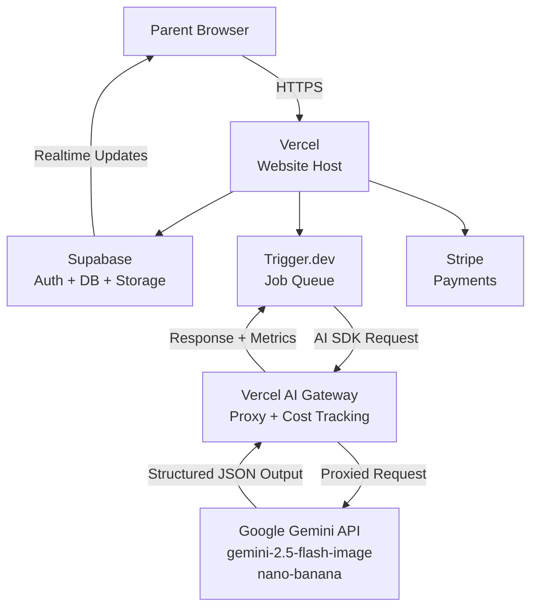
```mermaid
graph TB
    A[Parent Browser]
    B[Vercel<br/>Website Host]
    C1[Supabase<br/>Auth + DB + Storage]
    C2[Trigger.dev<br/>Job Queue]
    C3[Stripe<br/>Payments]
    D[Vercel AI Gateway<br/>Proxy + Cost Tracking]
    E[Google Gemini API<br/>gemini-2.5-flash-image<br/>nano-banana]

    A -->|HTTPS| B
    B --> C1
    B --> C2
    B --> C3
    C2 -->|AI SDK Request| D
    D -->|Proxied Request| E
    E -->|Structured JSON Output| D
    D -->|Response + Metrics| C2
    C1 -->|Realtime Updates| A
```

**Simple Translation:**

- **Vercel** = Storefront (hosts the website)
- **Supabase** = Filing cabinet (stores data, images, PDFs) + Real-time notifier
- **Trigger.dev** = Job manager (runs AI tasks in background)
- **Vercel AI Gateway** = AI proxy with cost tracking dashboard (routes requests to Gemini, provides observability)
- **Google Gemini API (gemini-2.5-flash-image / nano-banana)** = Artist + Quality checker (generates personalized illustrations AND validates faces via structured output)
- **Stripe** = Cash register (processes $5.99 payments)

---

### 3.2 Selected Technologies

| Decision                 | Winner                                         | Why (Reliability Perspective)                                                                                                                                                                                                                                                                           | Reliability Impact                                                                                                                                                     | Cost (approx.)                                                |
| :----------------------- | :--------------------------------------------- | :------------------------------------------------------------------------------------------------------------------------------------------------------------------------------------------------------------------------------------------------------------------------------------------------------ | :--------------------------------------------------------------------------------------------------------------------------------------------------------------------- | :------------------------------------------------------------ |
| **AI Provider**          | **Google Gemini API (gemini-2.5-flash-image)** | Runs on Google's managed infrastructure with **auto-scaling, SLA 99.9%, regional redundancy, and built-in logging + retries**. Supports structured JSON output for face validation - critical for automated quality control. Extremely low failure rate (<0.01%) and consistent latency across regions. | Predictable image generation under heavy load; no single point of failure. Built-in face validation via structured output eliminates need for separate validation API. | **$0.039 / image** ($30 per 1M tokens, 1290 tokens per image) |
| **Framework + Hosting**  | **Remix on Vercel**                            | Remix’s **server-first architecture** avoids client hydration errors and ensures deterministic rendering. Deployed on Vercel’s **edge CDN with zero-downtime atomic deploys**, auto-rollback, and global failover. Together they deliver fast SSR, strong observability and 99.99% uptime.              | Highly resilient frontend stack with stable builds and instant recovery during deployments.                                                                            | **Free tier**, Pro ≈ $20–40 / mo                              |
| **Queue System**         | **Trigger.dev**                                | Designed for **long-running workflows** with persistent state, built-in retries and replays, and no timeout limits (critical for multi-minute book generation). Recoverable after deploys or network drops.                                                                                             | Prevents data loss and ensures job completion even after failures.                                                                                                     | Free → $20–50 / mo prod                                       |
| **Database**             | **Supabase (Postgres HA)**                     | Provides **multi-AZ replication, auto-failover, and continuous backups**. Integrated Auth + Storage simplifies dependencies and reduces cross-service failures. Stable connection pooling under load.                                                                                                   | Consistent transactions and high data durability.                                                                                                                      | Free → $25 / mo small prod                                    |
| **CI/CD and Monitoring** | **Vercel + Supabase Insights**                 | Both offer built-in **metrics, logs and alerts**; deploys are atomic and versioned so rollbacks are instant. Remix errors isolated via Error Boundaries prevent system-wide crashes.                                                                                                                    | Rapid issue detection and minimal downtime during updates.                                                                                                             | Included in existing plans                                    |

### 3.3 Technical Justification

**Tech Stack Summary:**

- **Frontend**: Remix + TypeScript + Tailwind CSS
- **Backend**: Node.js + tRPC (type-safe APIs)
- **Database**: PostgreSQL (via Supabase)
- **AI**: Google Gemini API (gemini-2.5-flash-image / nano-banana) via Vercel AI Gateway
- **Payments**: Stripe Checkout

**Key Justifications:**

- **Remix over Next.js**: Simpler for single developer, superior data loading patterns
- **Google Gemini API via Vercel AI Gateway**: $0.039/image with built-in structured output for face validation (critical feature). Vercel AI Gateway provides automatic cost tracking, usage dashboards, caching, and rate limiting without managing API keys directly.
- **Trigger.dev**: No timeout limits (critical for 1-2 min book generation with 27 AI personalized pages)
- **Supabase**: All-in-one solution (auth + database + storage)

---

## 4\. Functional Requirements (Detailed)

### TR-01: User Registration and Authentication

**What it does:** Parents create accounts with email/password

**Flow Diagrams:**

#### Registration

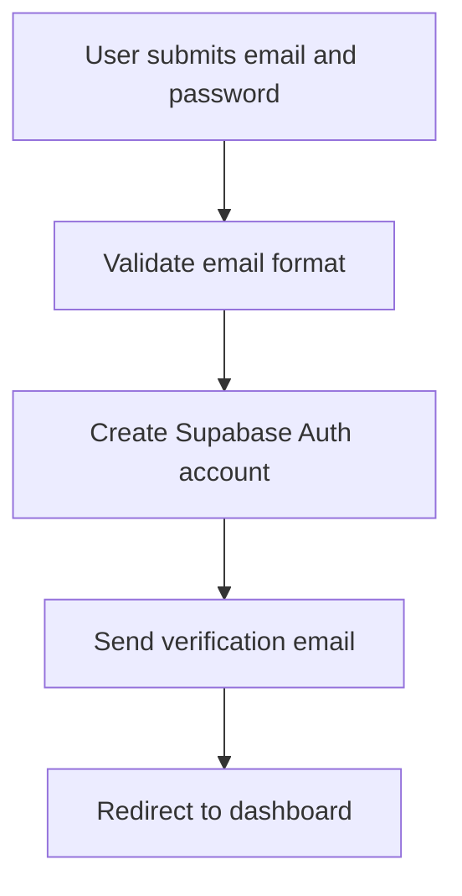
```mermaid
flowchart TD
    A[User submits email and password] --> B[Validate email format]
    B --> C[Create Supabase Auth account]
    C --> D[Send verification email]
    D --> E[Redirect to dashboard]
```

**Steps:**

1. Parent enters email/password on registration form
2. Client validates email format and password strength (min 8 chars)
3. System creates Supabase Auth account
4. Send verification email → Redirect to dashboard
5. Login: Validate credentials → Issue JWT token → Create session (7-day expiration)

**Security:**

- JWT-based sessions with httpOnly cookies
- Password hashing (bcrypt via Supabase)
- Rate limiting: 5 attempts per 15 minutes
- HTTPS-only connections
- Row-Level Security (RLS): Users access only own data
- CSRF protection on all forms

**Accessibility:**

- WCAG 2.1 AA compliant forms
- Screen reader support on all inputs
- Keyboard navigation enabled
- Clear error messaging

**Data Integrity:**

- Email uniqueness enforced at database level
- Password confirmation required on registration
- Foreign key constraints on all user_id references

**Data Reliability:**

- Session persistence across server restarts
- Automated database backups (Supabase daily)

**Critical Requirements:**

- Sessions must persist across page refreshes
- Password reset via magic link only (no security questions)

---

### TR-02: Photo Upload and Line Art Generation

**What it does:** During child profile creation, parent uploads child's photo and AI generates 4 different line art style variations to choose from. Line art is saved to child profile for reuse across multiple books.

**Flow Diagram:**

#### Line art generation

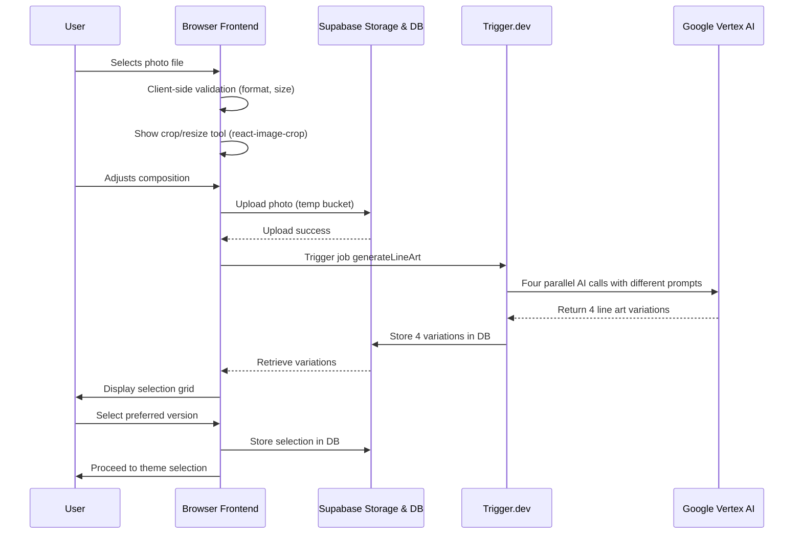
```mermaid
sequenceDiagram
    participant U as User
    participant B as Browser Frontend
    participant S as Supabase Storage & DB
    participant T as Trigger.dev
    participant V as Google Vertex AI

    U->>B: Selects photo file
    B->>B: Client-side validation (format, size)
    B->>B: Show crop/resize tool (react-image-crop)
    U->>B: Adjusts composition
    B->>S: Upload photo (temp bucket)
    S-->>B: Upload success
    B->>T: Trigger job generateLineArt
    T->>V: Four parallel AI calls with different prompts
    V-->>T: Return 4 line art variations
    T->>S: Store 4 variations in DB
    S-->>B: Retrieve variations
    B->>U: Display selection grid
    U->>B: Select preferred version
    B->>S: Store selection in DB
    B->>U: Proceed to theme selection
```

**Steps:**

1. Parent creates child profile and clicks "Upload Photo" or drags image file
2. Client validates file type (JPEG/PNG/WEBP), size (max 10MB), dimensions (min 512x512px)
3. Crop/resize tool displays with square aspect ratio guides (face-focus)
4. Parent adjusts crop area → Clicks "Continue"
5. Image uploads to Supabase Storage (temp-photos bucket with 1-hour auto-expiration as failsafe)
6. Trigger.dev job initiates 4 parallel AI calls with different prompts: Anime, Disney, Cartoon, Illustration
7. Each variant generated in \~3 seconds (12 seconds total for 4 parallel)
8. Variants displayed in grid → Parent selects favorite
9. **Original photo IMMEDIATELY deleted** (within 60 seconds)
10. Photo deletion logged to application logs
11. Selected line art URL saved to child profile
12. Line art reusable for all future books for this child

**Security:**

- File type validation (prevent malicious uploads)
- MIME type verification on server-side
- Virus scanning on uploaded files (Supabase Storage built-in)
- RLS: Users can only upload/access own child profiles
- Original photos deleted IMMEDIATELY after line art selection (within 60 seconds, privacy compliance)
- Photo deletion logged to application logs (compliance audit trail)
- Temp bucket with 1-hour auto-expiration as failsafe

**Accessibility:**

- Drag-and-drop \+ traditional file picker
- Crop tool keyboard accessible
- Alt text on all generated variants
- Progress indicators for screen readers

**Data Integrity:**

- Unique constraint: One line art per child profile
- Foreign key: child_id references children.id
- Line art URL required before child profile can be used for book creation
- Photo deletion timestamp recorded (compliance)

**Data Reliability:**

- Retry logic on AI generation failure (max 3 attempts per variant)
- Exponential backoff on API errors
- Partial success handling (if 3/4 variants generate, allow proceeding)
- Job status tracking in database

**Critical Requirements:**

- All 4 variants must use different prompt styles (for variety)
- **Image requirements**:
  - Square aspect ratio for input photos (e.g., 1024x1024) strongly preferred
  - Reduces blank face errors by 50% per client testing
  - Line art output will also be square for consistency
  - Note: Final PDF pages are standard portrait size; square composites are placed within page templates
- **Original photo MUST be deleted within 60 seconds of line art selection** (privacy compliance)
- Photo deletion MUST be logged to application logs
- Photo deletion failures MUST trigger alerts
- Line art persists indefinitely in child profile (reusable across books)
- Cost control: Exactly 4 generations per child profile
- Line art generation may use different prompting strategy than scene composites

**Cost:** $0.156 per child profile (4 × $0.039)

---

### TR-03: Theme Selection

**What it does:** Parent chooses book theme from available options (Insects, Dinosaurs, etc.)

**Flow Diagram:**

#### Theme selection

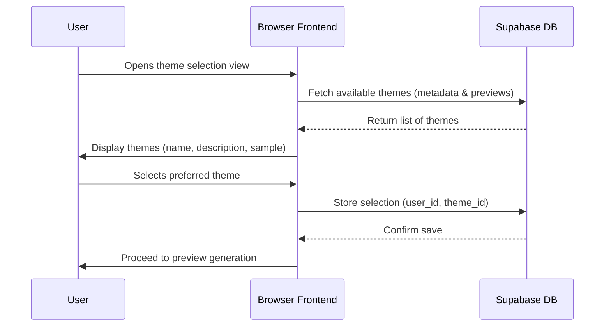
```mermaid
sequenceDiagram
    participant U as User
    participant B as Browser Frontend
    participant S as Supabase DB

    U->>B: Opens theme selection view
    B->>S: Fetch available themes (metadata & previews)
    S-->>B: Return list of themes
    B->>U: Display themes (name, description, sample)
    U->>B: Selects preferred theme
    B->>S: Store selection (user_id, theme_id)
    S-->>B: Confirm save
    B->>U: Proceed to preview generation
```

**Steps:**

1. System queries database for active themes (is_active=true)
2. Display theme gallery with thumbnails, names, descriptions
3. Each theme shows sample pages (letters A, B, C)
4. Parent clicks theme → Selection saved to book record → Redirect to preview generation

**Security:**

- RLS: Users can view all active themes, but only update own book.theme_id
- SQL injection prevention via Drizzle
- Theme activation requires admin role

**Accessibility:**

- Keyboard navigation through theme cards
- Screen reader descriptions of each theme
- High contrast mode support
- Focus indicators on selection

**Data Integrity:**

- Foreign key: book.theme_id references themes.id
- Check constraint: Only active themes can be selected
- Validation: Theme must have all 26 letters configured
- Each letter must have all 3 required images

**Data Reliability:**

- Theme data cached to reduce database queries
- Graceful handling if theme deleted after selection (rare edge case)
- Fallback to default theme if selected theme becomes inactive

**Critical Requirements:**

- Only show themes with complete letter sets (all 26 letters × 2 images each \= 52 images)
- Admin uploads all theme assets before activation (see TR-11)
- Theme selection must be saved before proceeding to preview generation

---

### TR-04: Preview Generation (Pre-Payment)

**What it does:** Generates FREE 5-page preview (cover + 2 Letter A pages + 2 Letter B pages) so parents can see quality before paying

**Flow Diagram:**

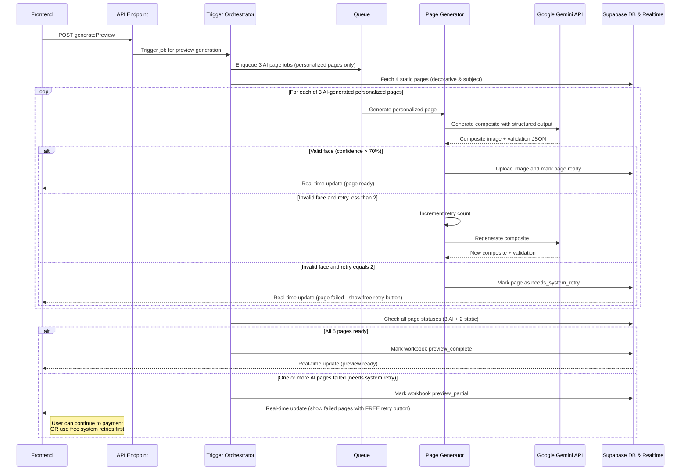
```mermaid
sequenceDiagram
    participant F as Frontend
    participant API as API Endpoint
    participant T as Trigger Orchestrator
    participant Q as Queue
    participant L as Page Generator
    participant G as Google Gemini API
    participant DB as Supabase DB & Realtime

    F->>API: POST generatePreview
    API->>T: Trigger job for preview generation
    T->>Q: Enqueue 3 AI page jobs (personalized pages only)
    T->>DB: Fetch 4 static pages (decorative & subject)

    loop For each of 3 AI-generated personalized pages
        Q->>L: Generate personalized page
        L->>G: Generate composite with structured output
        G-->>L: Composite image + validation JSON

        alt Valid face (confidence > 70%)
            L->>DB: Upload image and mark page ready
            DB-->>F: Real-time update (page ready)
        else Invalid face and retry less than 2
            L->>L: Increment retry count
            L->>G: Regenerate composite
            G-->>L: New composite + validation
        else Invalid face and retry equals 2
            L->>DB: Mark page as needs_system_retry
            DB-->>F: Real-time update (page failed - show free retry button)
        end
    end

    T->>DB: Check all page statuses (3 AI + 2 static)

    alt All 5 pages ready
        T->>DB: Mark workbook preview_complete
        DB-->>F: Real-time update (preview ready)
    else One or more AI pages failed (needs system retry)
        T->>DB: Mark workbook preview_partial
        DB-->>F: Real-time update (show failed pages with FREE retry button)
        Note right of F: User can continue to payment<br/>OR use free system retries first
    end
```

**Steps:**

1. User completes theme selection → Trigger.dev job initiated
2. Trigger.dev orchestrates **3 AI generation jobs** (personalized pages only):
   - 1 Cover page, 1 Letter A personalized, 1 Letter B personalized
3. System fetches **2 static image pages** from admin-uploaded assets (Letter A + B letter+subject combined)
4. AI-generated personalized pages use client-validated composite order:
   - **First attempt**: Background → Photo → Line Art (minimizes facial deformity)
   - **Retry attempt**: Photo → Line Art → Background (minimizes blank faces)
   - Sent to **Google Gemini API (gemini-2.5-flash-image)**: square inputs (~1024x1024) reduce blank face errors by 50%
   - AI outputs square composite → placed into portrait page template
   - Face validation via structured output: `face_detected=true`, `confidence>0.70`, `sharpness>0.50`
   - Max **2 automatic retries** per page with adjusted image order
5. Pages progressively appear via **Supabase Realtime** (~15-20s for 3 AI generations)
   - Failed pages after max retries show manual retry option (25 total per book)
6. All 5 pages ready (3 AI + 2 static) → **"Continue to Payment"** enabled

**Security:**

- RLS: Users can only view/regenerate pages for own books
- Job authentication: Verify user owns book before generation
- Rate limiting: Max 1 preview generation per book per 5 minutes (prevent abuse)

**Accessibility:**

- Progressive page loading with ARIA live regions
- Status announcements for screen readers
- Zoom/pan controls for page preview
- Skip to "Continue" button

**Data Integrity:**

- Pages marked as is_preview=true
- Unique constraint: (book_id, page_number)
- Foreign key cascades: Delete pages when book deleted
- Face validation status tracked per page

**Data Reliability:**

- Job retry on failure (max 3 attempts)
- Partial generation recovery: Save completed pages even if some fail
- Job status persisted: Can resume if interrupted
- Failed pages flagged for admin review

**Critical Requirements:**

- **Preview page breakdown**: 1 cover + 2 Letter A + 2 Letter B = **5 pages total** per BRD requirement
  - **AI-generated personalized pages**: 3 pages (cover + Letter A personalized + Letter B personalized)
  - **Static image pages**: 2 pages (Letter A letter+subject combined + Letter B letter+subject combined)
- **Image submission order** (client-validated through alpha testing):
  - **First attempt**: Background → Photo → Line Art (minimizes deformity)
  - **Retry attempt**: Photo → Line Art → Background (minimizes blank faces)
  - **Square aspect ratios for AI inputs** (all images ~1024x1024) - 50% error reduction
  - Note: AI generates square composite images, which are then placed into standard portrait PDF page templates
- Preview is FREE (no charge until payment confirmed)
- All 5 pages must be ready before allowing payment
- Only **3 personalized pages** require AI generation and face detection validation
- Static pages use pre-uploaded admin assets (no AI cost)
- PDF generation is on-demand only (not part of preview workflow)
- Retry strategy: Max **2 automatic retries** per personalized page with different image order

**Cost:** $0.117 per preview (3 AI-generated personalized pages × $0.039 using Google Gemini API gemini-2.5-flash-image)

**Note**: "Belongs to" page is NOT in preview - added post-payment as static template with blank space for child to write name by hand

**Updated Nov 6, 2025**: Changed from 7 pages (3 AI + 4 static) to 5 pages (3 AI + 2 static) per client feedback. Letter decorative and subject pages consolidated into single combined static image.

---

### TR-05: Full Book Generation (Post-Payment)

**What it does:** After payment confirmed, generates remaining 56 pages to complete 61-page book

**Page Breakdown**:

- **Already generated** (preview): 5 pages (3 AI personalized + 2 static)
- **To generate** (post-payment): 56 pages
  - 24 AI-generated personalized pages (Letters C-Z personalized scenes)
  - 24 static image pages (Letters C-Z letter+subject combined)
  - 1 "belongs to" static template (blank space for child to write name by hand)
  - 6 handwriting practice pages (static, pre-uploaded)
  - 1 back cover (static, pre-uploaded)
- **Total book**: 5 + 56 = **61 pages**

**AI-Generated Pages Summary**:

- Preview: 3 AI-generated personalized pages (already completed)
- Post-payment: 24 AI-generated personalized pages (Letters C-Z personalized scenes)
- **Total**: 27 personalized pages require AI generation and face validation
- **Static pages**: 34 total pages use pre-uploaded admin images (no AI cost)

**Flow Diagram:**

####

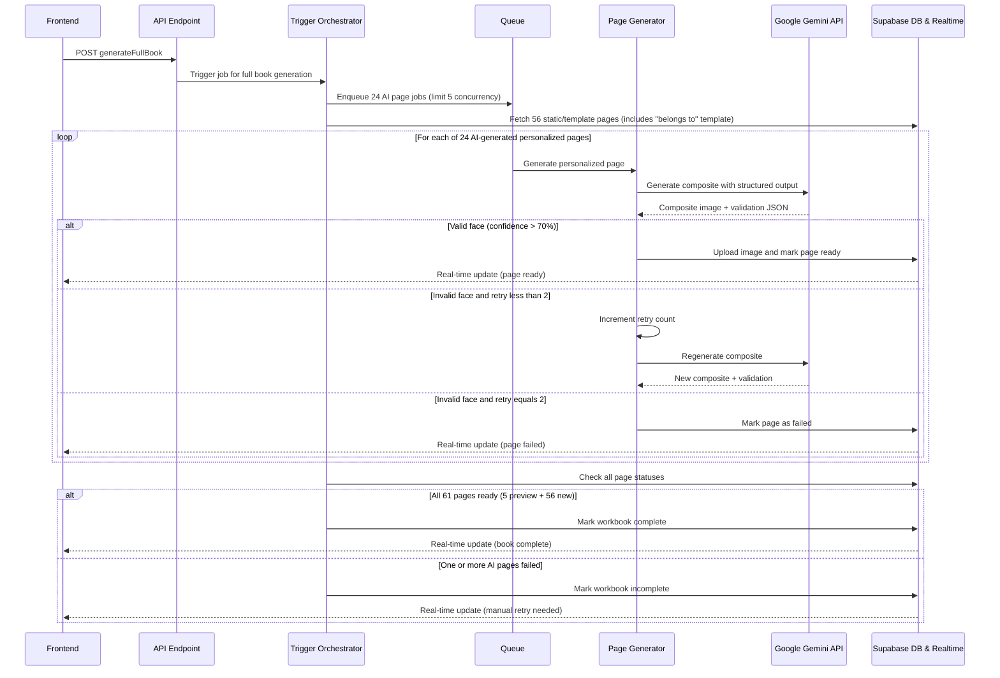
```mermaid
sequenceDiagram
    participant F as Frontend
    participant API as API Endpoint
    participant T as Trigger Orchestrator
    participant Q as Queue
    participant L as Page Generator
    participant G as Google Gemini API
    participant DB as Supabase DB & Realtime

    F->>API: POST generateFullBook
    API->>T: Trigger job for full book generation
    T->>Q: Enqueue 24 AI page jobs (limit 5 concurrency)
    T->>DB: Fetch 56 static/template pages (includes "belongs to" template)

    loop For each of 24 AI-generated personalized pages
        Q->>L: Generate personalized page
        L->>G: Generate composite with structured output
        G-->>L: Composite image + validation JSON

        alt Valid face (confidence > 70%)
            L->>DB: Upload image and mark page ready
            DB-->>F: Real-time update (page ready)
        else Invalid face and retry less than 2
            L->>L: Increment retry count
            L->>G: Regenerate composite
            G-->>L: New composite + validation
        else Invalid face and retry equals 2
            L->>DB: Mark page as failed
            DB-->>F: Real-time update (page failed)
        end
    end

    T->>DB: Check all page statuses

    alt All 61 pages ready (5 preview + 56 new)
        T->>DB: Mark workbook complete
        DB-->>F: Real-time update (book complete)
    else One or more AI pages failed
        T->>DB: Mark workbook incomplete
        DB-->>F: Real-time update (manual retry needed)
    end
```

**Steps:**

1. Stripe webhook confirms payment → Book status = 'payment_complete'
2. Trigger.dev generates remaining 56 pages (5 concurrent AI generations):
   - **24 AI personalized pages**: Letters C-Z personalized scenes
   - **32 static/template pages**: 1 "belongs to" (blank for handwriting), 24 letter+subject combined (C-Z), 6 handwriting practice, 1 back cover
3. Each AI page validated with face detection; failed pages auto-regenerate (max **2 attempts**)
4. Static pages fetched from admin-uploaded assets (no AI cost)
5. Progress via **Supabase Realtime** → book status = 'complete' when all 61 pages ready

**Security:**

- Webhook signature verification (Stripe HMAC)
- Generation only triggered after confirmed payment
- RLS: Only book owner can access generated pages
- Payment record immutable after creation

**Accessibility:**

- Real-time progress bar with percentage
- Estimated time remaining
- Audio notification when complete (optional, user preference)
- Accessible progress status for screen readers

**Data Integrity:**

- Payment.book_id unique constraint (one payment per book)
- Book status transitions enforced: payment_complete → generating → complete
- Page ordering validated (1-61 sequential)
- Static pages inserted at correct positions

**Data Reliability:**

- Job persistence: Resume from last completed page if interrupted
- Idempotency: Duplicate webhook calls don't trigger duplicate generation
- Error isolation: One page failure doesn't stop entire job
- Failed pages after 3 retries: Flag for admin, allow book completion

**Critical Requirements:**

- Generation MUST NOT start until payment webhook verified
- Takes approximately 50-75 seconds for 24 AI pages in batches of 5 concurrent generations
- All 61 pages stored individually in Supabase Storage
- Static pages and templates fetched from admin-uploaded assets (no AI generation)
- "Belongs to" page is static template with BLANK space (child writes name by hand when printed)
- PDF generation is on-demand only (see TR-08)
- Pages never regenerated after payment (final)

**Cost:** $0.936 for 24 AI-generated personalized pages (24 × $0.039) + $0 for 32 static/template pages = **$0.936 total post-payment**

- 24 AI-generated personalized pages (Letters C-Z personalized scenes with child's face)
- 1 "belongs to" static template (BLANK - child writes name by hand, no dynamic text or image)
- 24 static image pages (Letters C-Z letter+subject combined pages)
- 7 pre-uploaded static pages (6 handwriting practice + 1 back cover)

---

### TR-06: Page Regeneration

**What it does:** Parent can regenerate any unsatisfactory AI-generated page before OR after payment (max 25 total per book - global limit)

**Steps:**

**User-Requested Regeneration (Counts Toward Quota):**

1. User viewing book (preview OR full book): Parent clicks "Regenerate" button on specific AI-generated page
2. System checks: count user regenerations for this book < 25
3. If under limit: Create regeneration record with `reason='user_requested'` → Trigger new generation
4. New page replaces old page → Update UI → Decrement quota counter
5. If at limit: Disable "Regenerate" buttons → Show "25 regeneration limit reached"

**System-Failure Retry (Does NOT Count Toward Quota):**

6. Page fails after 2 auto-retries → display "System Issue - Retry Free" button
7. User clicks "Retry Free" → system creates regeneration record with `reason='system_failure'`
8. Does NOT decrement user's 25-regeneration quota
9. Max 10 system retries per book (abuse prevention); logged for admin monitoring
10. Limit is GLOBAL: 25 user regenerations apply to all 27 AI-generated pages throughout book lifecycle

**Security:**

- Hard limit enforcement at API level (cannot bypass via client)
- RLS: Users can only regenerate own book pages
- Rate limiting: Max 3 regenerations per minute (prevent spam clicking)
- Available before AND after payment (global 25 limit applies to both)

**Accessibility:**

- Clear visual indication of remaining regenerations (e.g., "20 of 25 remaining")
- Screen reader announces count after each regeneration
- Disabled buttons have aria-disabled and explanation
- Confirmation dialog before regenerating (optional)

**Data Integrity:**

- Regenerations table tracks each attempt (audit trail)
- Count verified against database, not client-provided
- Foreign key: regenerations.page_id references pages.id
- Unique constraint prevents duplicate simultaneous regenerations of same page

**Data Reliability:**

- Count persisted in database (not in-memory)
- Transaction ensures count increment and generation trigger are atomic
- Failed regeneration doesn't consume count quota
- Old page preserved until new page successfully generated

**Critical Requirements:**

- **Hard limit: 25 USER regenerations total per book** (GLOBAL - applies to preview AND post-payment combined)
- **Two types of regenerations:**
  1. **User-requested** (counts toward 25 quota): User doesn't like the result
  2. **System-failure** (FREE - does NOT count): Page failed after 2 auto-retries (our fault, not theirs)
- Regenerations available for ANY of the 27 AI-generated pages at any time
- Only AI-generated personalized pages can be regenerated (not static decorative/subject pages)
- Counter displays: "X of 25 regenerations remaining" (only counts user-requested)
- Failed pages after auto-retries show "Retry Free" button (doesn't consume quota)
- **Admin monitoring**: System failures logged with `reason='system_failure'` for review
- **Anti-abuse**: Max 10 system-failure retries per book (prevents gaming the free retries)
- Tracking: reason field captures "user_requested" vs "system_failure" vs "validation_failed" (for analytics)
- **Cost control:**
  - User regenerations: Max $0.975 (25 × $0.039) - included in price
  - System retries: Max $0.390 (10 × $0.039) - our cost, not charged to user
  - Total worst case: $2.184 + $0.390 = $2.574 (still profitable at $5.99)

---

### TR-07: Payment Processing

**What it does:** Securely processes $5.99 payment via Stripe for complete book

**Flow Diagram:**

####

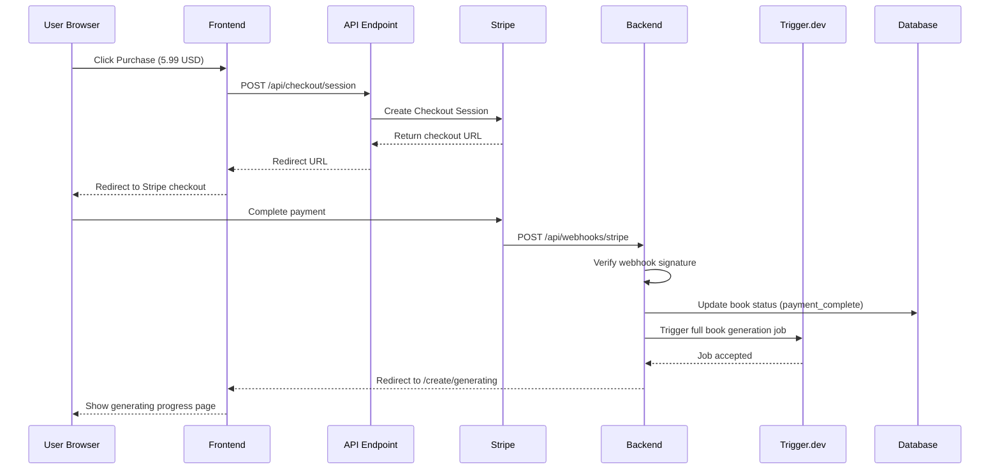
```mermaid
sequenceDiagram
    participant U as User Browser
    participant F as Frontend
    participant API as API Endpoint
    participant S as Stripe
    participant B as Backend
    participant T as Trigger.dev
    participant DB as Database

    U->>F: Click Purchase (5.99 USD)
    F->>API: POST /api/checkout/session
    API->>S: Create Checkout Session
    S-->>API: Return checkout URL
    API-->>F: Redirect URL
    F-->>U: Redirect to Stripe checkout

    U->>S: Complete payment
    S->>B: POST /api/webhooks/stripe
    B->>B: Verify webhook signature
    B->>DB: Update book status (payment_complete)

    B->>T: Trigger full book generation job
    T-->>B: Job accepted

    B-->>F: Redirect to /create/generating
    F-->>U: Show generating progress page
```

**Steps:**

1. Parent clicks "Purchase ($5.99)" → server creates Stripe Checkout Session (metadata: bookId, userId)
2. Redirect to Stripe-hosted checkout (card details never touch our servers)
3. Stripe processes → sends `checkout.session.completed` webhook
4. Server verifies webhook signature → creates payment record → updates book status
5. Triggers full book generation (TR-05) → redirects to progress page

**Security:**

- PCI DSS Level 1 compliant (Stripe handles all card data)
- Webhook signature verification (HMAC SHA-256)
- HTTPS-only for all payment endpoints
- Idempotency keys prevent duplicate charges
- Payment metadata includes user_id for authorization check

**Accessibility:**

- Stripe Checkout is WCAG 2.1 AA compliant
- Clear pricing displayed before checkout
- Success/failure messages announced to screen readers
- Accessible return to site after payment

**Data Integrity:**

- One payment per book (unique constraint on payments.book_id)
- Payment amount validated server-side ($5.99 \= 599 cents, hardcoded)
- Book status must be 'preview_generated' to allow payment
- Stripe session_id stored for refund capability

**Data Reliability:**

- Webhook retry logic (Stripe retries up to 3 days)
- Duplicate webhook handling (idempotency check on session_id)
- Payment record created before triggering generation
- Failed generation doesn't affect payment record (for refund tracking)

**Critical Requirements:**

- Amount MUST be $5.99 (599 cents) \- hardcoded, not user-controllable
- Webhook signature MUST be verified (prevent fraudulent webhooks)
- Generation triggered only after payment.status \= 'completed'
- Stripe test mode for staging, live mode for production

**Operational Cost**: Stripe processing fees = 2.9% + $0.30 = $0.47 per transaction

---

### TR-08: PDF Download

**What it does:** Parent downloads complete 61-page PDF book after generation completes

**Steps:**

1. Book status \= 'complete' → Download button enabled on dashboard
2. Parent clicks "Download" → Check if PDF already cached
3. If cached: Return signed URL immediately
4. If not cached: Assemble PDF on-demand (\~30 seconds):
   - Fetch all 61 pages in order from Supabase Storage
   - Upload PDF to books-pdf bucket
   - Update book.pdf_url and book.pdf_generated_at
5. Generate signed URL (expires in 1 hour) → Return to client
6. Browser downloads PDF file

**Security:**

- RLS: Users can only download own books
- Signed URLs with 1-hour expiration
- PDF URLs not publicly guessable (UUID-based)
- Download requires active authenticated session
- No direct bucket access (all via signed URLs)

**Accessibility:**

- Clear "Download PDF" button with icon
- Download progress indicator for slow connections
- Keyboard accessible
- Screen reader announces when download starts

**Data Integrity:**

- PDF assembly validates all 61 pages present before generating
- Page ordering enforced (1-61 sequential)
- Metadata in PDF: Title, Author, Creation Date
- PDF/A compliant for archival quality

**Data Reliability:**

- PDF cached after first generation (no re-assembly on subsequent downloads)
- Cache invalidation if pages regenerated (rare, only pre-payment)
- Failed assembly retried (max 3 attempts)
- Download count tracked for analytics

**Critical Requirements:**

- Unlimited downloads per book (no download limits)
- PDF cached to avoid repeated assembly cost
- Assembly must complete within 60 seconds (30s target)
- No email delivery (download via platform only for MVP)

**Operational Cost**: Negligible (PDF assembly is CPU-only, no additional API calls beyond storage)

---

### TR-09: Book Library

**What it does:** Parents view all their purchased books in one dashboard

**Steps:**

1. Parent navigates to /dashboard
2. System queries books table for user's books (ORDER BY created_at DESC)
3. For each book: Fetch cover page thumbnail, theme name, status
4. Display grid/list of book cards
5. Click book card → Navigate to book detail page → Download button visible if complete

**Security:**

- RLS: WHERE user_id \= auth.uid() (users only see own books)
- SQL injection prevention via Prisma ORM
- No public book listing (private library only)

**Accessibility:**

- Responsive grid layout (works on mobile)
- Keyboard navigation through book cards
- Status badges screen reader accessible
- Search/filter by theme or date (future enhancement)

**Data Integrity:**

- Books never deleted (soft delete only if implemented)
- Cover page foreign key references pages table
- Theme foreign key references themes table

**Data Reliability:**

- Pagination for users with many books (10-20 per page)
- Caching of cover thumbnails
- Graceful handling if cover image missing (show placeholder)

**Critical Requirements:**

- Books stored forever (never auto-deleted)
- Sort by creation date descending (newest first)
- Show clear status: Creating, Preview Ready, Generating, Complete

---

### TR-10: Create Multiple Books

**What it does:** Parents can create unlimited books (different children, themes, styles)

**Flow Diagram:**

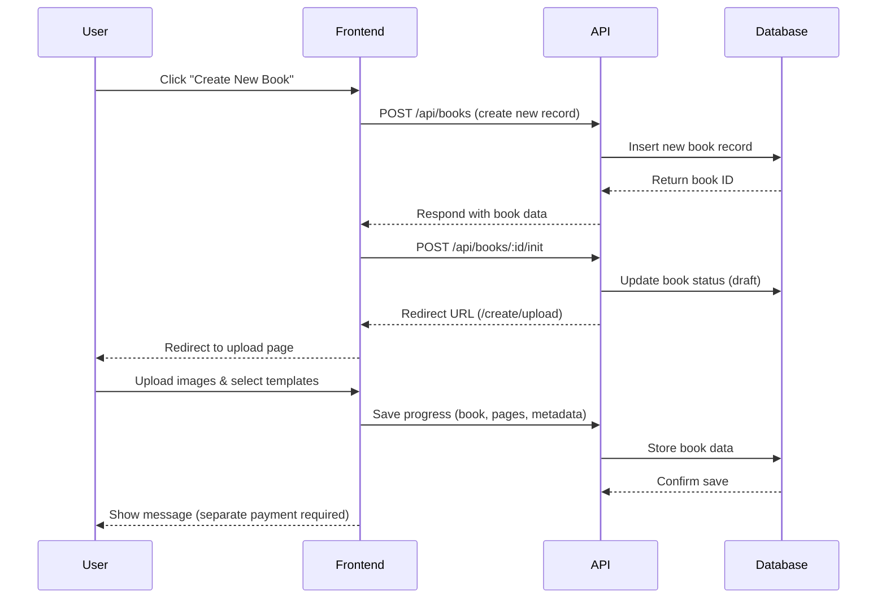
```mermaid
sequenceDiagram
    participant U as User
    participant F as Frontend
    participant API as API
    participant DB as Database

    U->>F: Click "Create New Book"
    F->>API: POST /api/books (create new record)
    API->>DB: Insert new book record
    DB-->>API: Return book ID
    API-->>F: Respond with book data

    F->>API: POST /api/books/:id/init
    API->>DB: Update book status (draft)
    API-->>F: Redirect URL (/create/upload)
    F-->>U: Redirect to upload page

    U->>F: Upload images & select templates
    F->>API: Save progress (book, pages, metadata)
    API->>DB: Store book data
    DB-->>API: Confirm save
    F-->>U: Show message (separate payment required)
```

**Steps:**

1. From dashboard: Parent clicks "Create New Book"
2. System creates new book record (status='created')
3. Redirect to /create/upload (TR-02)
4. Follow standard book creation flow (TR-02 → TR-03 → TR-04 → TR-07 → TR-05)
5. Each book requires separate $5.99 payment

**Security:**

- Anti-abuse: Max 5 books in 'creating' status simultaneously (prevent spam)
- RLS: Users can only create books for own account
- Payment verification per book

**Accessibility:**

- Prominent "Create New Book" button on dashboard
- Wizard-style flow with progress indicator
- Ability to save draft and return later

**Data Integrity:**

- Each book has unique ID (UUID)
- Books independent (deleting one doesn't affect others)
- No shared state between books

**Data Reliability:**

- Abandoned books (created but never paid) cleaned up after 30 days
- Draft state saved at each step
- Can have multiple books at different stages

**Critical Requirements:**

- Each book requires separate $5.99 payment
- No limit on total books per user
- Books completely independent (different photos, themes, styles allowed)

---

### TR-11: Admin Theme Management (the client Only)

**What it does:** the client can create/edit themes and upload all required assets via admin UI

**Flow Diagram:**

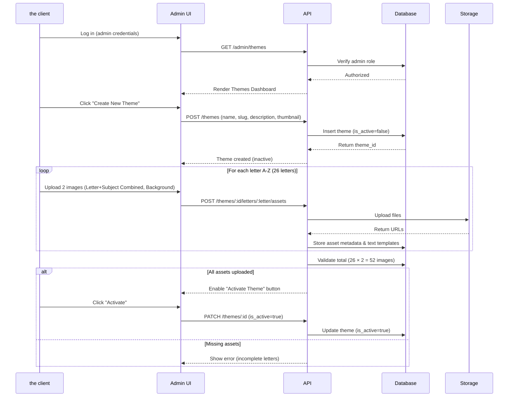
```mermaid
sequenceDiagram
    participant A as the client
    participant F as Admin UI
    participant API as API
    participant DB as Database
    participant S as Storage

    A->>F: Log in (admin credentials)
    F->>API: GET /admin/themes
    API->>DB: Verify admin role
    DB-->>API: Authorized
    API-->>F: Render Themes Dashboard

    A->>F: Click "Create New Theme"
    F->>API: POST /themes (name, slug, description, thumbnail)
    API->>DB: Insert theme (is_active=false)
    DB-->>API: Return theme_id
    API-->>F: Theme created (inactive)

    loop For each letter A-Z (26 letters)
        A->>F: Upload 2 images (Letter+Subject Combined, Background)
        F->>API: POST /themes/:id/letters/:letter/assets
        API->>S: Upload files
        S-->>API: Return URLs
        API->>DB: Store asset metadata & text templates
    end

    API->>DB: Validate total (26 × 2 = 52 images)
    alt All assets uploaded
        API-->>F: Enable "Activate Theme" button
        A->>F: Click "Activate"
        F->>API: PATCH /themes/:id (is_active=true)
        API->>DB: Update theme (is_active=true)
    else Missing assets
        API-->>F: Show error (incomplete letters)
    end
```

**Steps:**

1. The client logs in with admin account → Navigates to /admin/themes
2. Clicks "Create New Theme" → Enter name, slug, description, upload thumbnail
3. Theme created but inactive (is_active=false)
4. For each letter A-Z (26 total):
   - Upload 2 required images: Letter+Subject Combined, Background
   - Add text templates: trace_text_upper, trace_text_lower, subject_name
5. System validates: All 26 letters × 2 images \= 52 images uploaded?
6. If complete: "Activate Theme" button enabled
7. Click activate → is_active=true → Theme visible to users

**Security:**

- Admin-only access (role check on all /admin routes)
- Admin role stored in admin_users table
- File upload validation (image types only, max 5MB each)
- RLS: Only admins can modify themes/letters tables

**Accessibility:**

- Bulk upload option (upload all images for a letter at once)
- Progress indicator during multi-file upload
- Drag-and-drop \+ traditional file picker

**Data Integrity:**

- Unique constraint: themes.slug (URL-safe identifier)
- Foreign key: letters.theme_id references themes.id
- Check constraint: letters.letter IN ('A'..'Z')
- Validation: Cannot activate theme unless all 26 letters complete

**Data Reliability:**

- Draft themes saved (can work over multiple sessions)
- Image upload rollback on failure
- Duplicate slug prevention

**Critical Requirements:**

- Theme cannot activate unless all 26 letters have 2 images each (52 images total)
- Admin uploads all assets (no dynamic generation)
- Text templates support \[child_name\] placeholder
- Images stored in Supabase Storage (letter-images bucket)

---

### TR-12: Asset Library & Analytics (the client Only)

**What it does:** the client can view all uploaded assets and see analytics on user preferences

**Flow Diagram:**

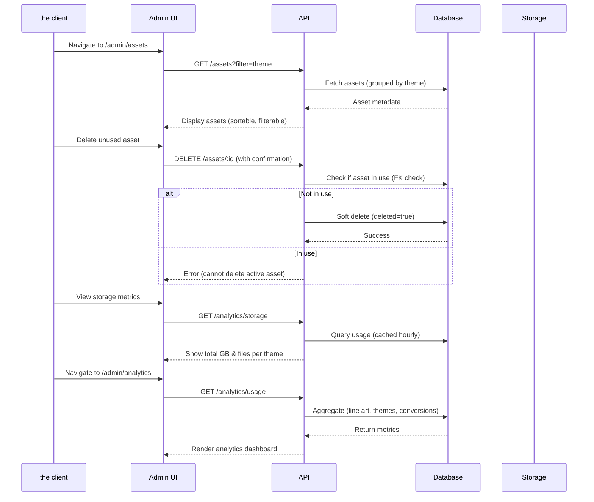
```mermaid
sequenceDiagram
    participant A as the client
    participant F as Admin UI
    participant API as API
    participant DB as Database
    participant S as Storage

    A->>F: Navigate to /admin/assets
    F->>API: GET /assets?filter=theme
    API->>DB: Fetch assets (grouped by theme)
    DB-->>API: Asset metadata
    API-->>F: Display assets (sortable, filterable)

    A->>F: Delete unused asset
    F->>API: DELETE /assets/:id (with confirmation)
    API->>DB: Check if asset in use (FK check)
    alt Not in use
        API->>DB: Soft delete (deleted=true)
        DB-->>API: Success
    else In use
        API-->>F: Error (cannot delete active asset)
    end

    A->>F: View storage metrics
    F->>API: GET /analytics/storage
    API->>DB: Query usage (cached hourly)
    API-->>F: Show total GB & files per theme

    A->>F: Navigate to /admin/analytics
    F->>API: GET /analytics/usage
    API->>DB: Aggregate (line art, themes, conversions)
    DB-->>API: Return metrics
    API-->>F: Render analytics dashboard
```

**Steps:**

1. The client navigates to /admin/assets
2. View assets organized by theme or by bucket
3. Filter by file type, upload date
4. See storage metrics: Total GB used, files per theme
5. Delete unused assets (with confirmation)
6. Navigate to /admin/analytics to see:
   - Line art prompt performance (which styles selected most)
   - Theme popularity (which themes used most)
   - Average regenerations per book
   - Conversion rate (preview → payment)

**Security:**

- Admin-only access
- Deletion requires confirmation \+ password re-entry
- Cannot delete assets currently in use (foreign key constraint)

**Accessibility:**

- Sortable tables
- Filterable views
- Exportable reports (CSV download)

**Data Integrity:**

- Asset usage tracking (which themes/images used in active books)
- Soft delete for assets (mark as deleted, don't remove immediately)

**Data Reliability:**

- Cached storage calculations (updated hourly)
- Analytics aggregated via database views
- Historical data preserved

**Critical Requirements:**

- Line art prompt analytics (track which styles users select)
- Storage usage monitoring (prevent overage)
- Cannot delete themes/assets in active use

---

### TR-13: Automated Quality Validation (Face Detection via Google Gemini API)

**What it does:** Google Gemini API returns face confidence via structured JSON output alongside image generation, automatically regenerating if face validation fails

**Flow Diagram:**

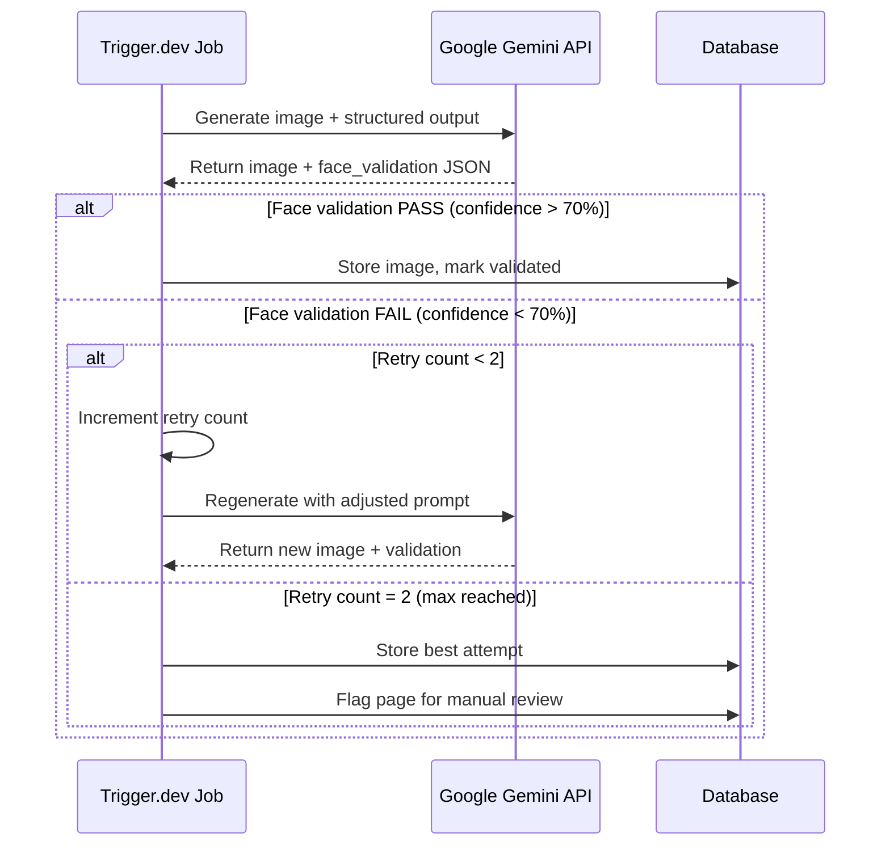
```mermaid
sequenceDiagram
    participant T as Trigger.dev Job
    participant G as Google Gemini API
    participant DB as Database

    T->>G: Generate image + structured output
    G-->>T: Return image + face_validation JSON

    alt Face validation PASS (confidence > 70%)
        T->>DB: Store image, mark validated
    else Face validation FAIL (confidence < 70%)
        alt Retry count < 2
            T->>T: Increment retry count
            T->>G: Regenerate with adjusted prompt
            G-->>T: Return new image + validation
        else Retry count = 2 (max reached)
            T->>DB: Store best attempt
            T->>DB: Flag page for manual review
        end
    end
```

**Steps:**

1. After personalized page requested: Call Google Gemini API with structured output enabled
2. API returns both image URL and face validation JSON:
   ```json
   {
     "image_url": "https://...",
     "face_validation": {
       "face_detected": true,
       "confidence": 0.95,
       "face_count": 1,
       "face_quality": {
         "sharpness": 0.87,
         "brightness": 0.82,
         "visibility": 0.93
       }
     }
   }
   ```
3. Check validation criteria:
   - `face_detected` = true
   - `confidence` > 0.70 (70% minimum)
   - `face_quality.sharpness` > 0.50
   - `face_count` >= 1
4. If PASS: Store image, mark page.face_validation_passed = true → Continue
5. If FAIL: Increment page.generation_attempts → If < 2: Regenerate page
6. If still failing after 2 attempts: Store best attempt, mark page.flagged_for_review = true

**Security:**

- Google AI API key restricted to generation + validation only
- Images sent via HTTPS
- Structured output validated server-side
- No image data persisted by Google beyond generation

**Accessibility:**

- Validation happens server-side (no user interaction needed)
- Failed pages flagged for admin review (accessible admin UI)
- Users can manually regenerate flagged pages (up to 15 times total)

**Data Integrity:**

- Validation confidence score stored (for analytics)
- Validation results logged (audit trail)
- Regeneration attempts tracked per page
- Best attempt always saved (never lose work)

**Data Reliability:**

- API timeout: 30 seconds (generation + validation)
- Retry on API failure (network errors, not validation failures)
- Exponential backoff between retries
- Fallback: Accept page if structured output unavailable (rare edge case)

**Critical Requirements:**

- **AUTO-RETRY STRATEGY**:
  - Max **2 automatic retries** per page (consistent across preview and full book generation)
  - Max **25 manual regenerations** total per book (per BRD requirement BR-RULE-06)
  - Target **80% first-attempt pass rate** with photo quality guidance at upload
- Validation runs on ALL AI-generated personalized pages (27 total: 3 preview + 24 post-payment)
- Failed pages after 2 auto-retries: Flag for admin review, allow book completion with manual retry option
- Validation threshold: **70% confidence minimum**
- Photo quality guidance at upload (crop tool helps ensure optimal composition)

**Cost:** Included in generation cost via structured output - no additional API calls

- **Google Gemini API (gemini-2.5-flash-image): $0.039/image** (includes validation)
- Pricing: $30 per 1M output tokens, with 1290 tokens per image
- API Access: Vercel AI SDK for API access

---

### TR-15: Child Profile Management

**Maps to:** BR-15 (Child Profile Management)

**What it does:** Parents manage multiple child profiles with reusable line art for creating books across different themes

**Flow Diagram:**

#### Child profile creation and line art generation

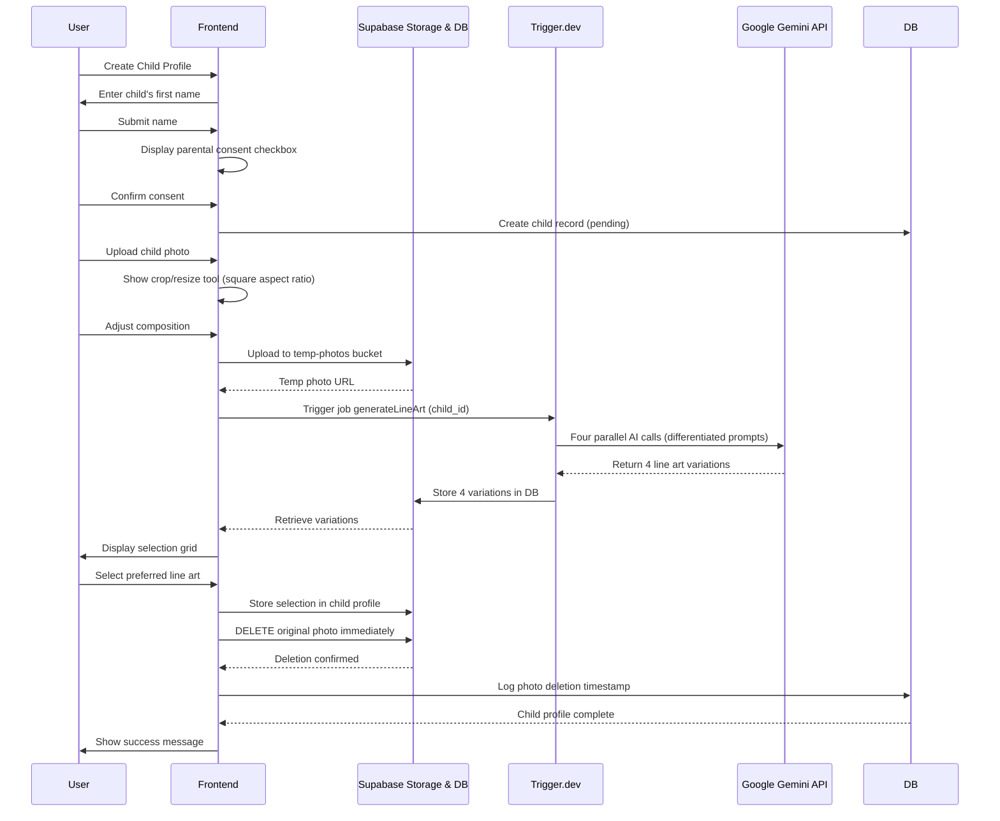
```mermaid
sequenceDiagram
    participant U as User
    participant F as Frontend
    participant S as Supabase Storage & DB
    participant T as Trigger.dev
    participant G as Google Gemini API

    U->>F: Create Child Profile
    F->>U: Enter child's first name
    U->>F: Submit name
    F->>F: Display parental consent checkbox
    U->>F: Confirm consent
    F->>DB: Create child record (pending)

    U->>F: Upload child photo
    F->>F: Show crop/resize tool (square aspect ratio)
    U->>F: Adjust composition
    F->>S: Upload to temp-photos bucket
    S-->>F: Temp photo URL

    F->>T: Trigger job generateLineArt (child_id)
    T->>G: Four parallel AI calls (differentiated prompts)
    G-->>T: Return 4 line art variations
    T->>S: Store 4 variations in DB
    S-->>F: Retrieve variations

    F->>U: Display selection grid
    U->>F: Select preferred line art
    F->>S: Store selection in child profile
    F->>S: DELETE original photo immediately
    S-->>F: Deletion confirmed
    F->>DB: Log photo deletion timestamp

    DB-->>F: Child profile complete
    F->>U: Show success message
```

**Steps:**

1. Parent clicks "Create Child Profile" → enters child's first name (no last name)
2. Parent confirms parental consent checkbox (exact wording finalized by attorney)
3. System creates child record with status='pending'
4. Photo upload and line art generation follows TR-02 flow (crop, 4 AI variants, selection)
5. Original photo IMMEDIATELY deleted (within 60 seconds) — see TR-02 for full deletion protocol
6. Selected line art URL saved to child profile → status updated to 'complete'

**Security:**

- Parental consent checkbox required before photo upload
- RLS: Parents can only create/access own child profiles
- Photo handling per TR-02 (temp bucket, immediate deletion, failure alerts)
- Child profiles cascade delete when parent account deleted

**Accessibility:**

- Clear form labels with screen reader support
- Keyboard navigation, progress indicators, success confirmations

**Data Integrity:**

- Unique constraint: One active child profile per (user_id, first_name) WHERE deleted_at IS NULL
- Foreign key: children.user_id references users.id (CASCADE DELETE)
- Line art URL required before profile can be used for book creation
- Photo deletion timestamp recorded (compliance audit)

**Data Reliability:**

- Photo deletion retry logic per TR-02 (max 3 attempts, logged, temp bucket failsafe)
- Line art generation failure doesn't prevent profile creation (can retry)

**Critical Requirements:**

- Original photo MUST be deleted within 60 seconds of line art selection
- Deletion MUST be logged to application logs (compliance)
- Line art persists indefinitely in child profile (reusable)
- No limit on number of child profiles per parent
- Child profile required before book creation
- Photo deletion failures MUST trigger alerts

**Cost:** $0.156 per child profile (4 line art generations × $0.039)

---

### TR-16: Marketing Analytics Integration

**Maps to:** BR-16 (Marketing Data Integration)

**What it does:** Sends user activity webhooks to HubSpot for marketing campaign management and cross-sell targeting

**Flow Diagram:**

#### Webhook event flow

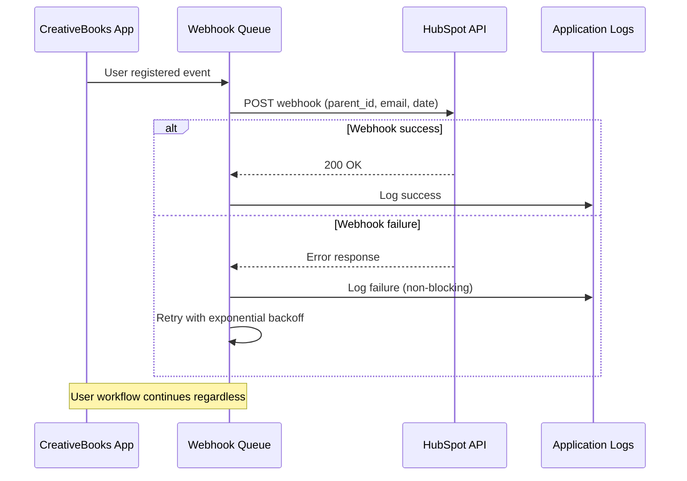
```mermaid
sequenceDiagram
    participant A as CreativeBooks App
    participant Q as Webhook Queue
    participant H as HubSpot API
    participant L as Application Logs

    A->>Q: User registered event
    Q->>H: POST webhook (parent_id, email, date)

    alt Webhook success
        H-->>Q: 200 OK
        Q->>L: Log success
    else Webhook failure
        H-->>Q: Error response
        Q->>L: Log failure (non-blocking)
        Q->>Q: Retry with exponential backoff
    end

    Note over A,Q: User workflow continues regardless
```

**Steps:**

1. User completes triggering action (registration, book completion, payment)
2. System enqueues webhook event (non-blocking)
3. Background job sends webhook to HubSpot endpoint
4. Webhook includes: event type, timestamp, user data, metadata
5. Success/failure logged to application logs
6. Failures retry with exponential backoff (max 3 attempts)
7. After max retries, failure logged for admin review

**Webhook Events:**

**user.registered:**

- parent_id (user UUID)
- email
- registration_date (ISO 8601)

**book.completed:**

- parent_id (user UUID)
- child_id (child UUID)
- theme_id (theme UUID)
- theme_name (string)
- completion_date (ISO 8601)

**payment.completed:**

- parent_id (user UUID)
- book_id (book UUID)
- child_id (child UUID)
- theme_id (theme UUID)
- amount_cents (integer)
- currency (string)
- payment_date (ISO 8601)

**Security:**

- Webhook endpoint URL configurable via environment variable
- HTTPS-only webhook delivery
- Optional webhook secret for signature verification (client configurable)
- No sensitive data in webhook payload (no passwords, payment methods)
- Webhook failures don't expose user data in logs

**Accessibility:**

- N/A (backend integration only)

**Data Integrity:**

- Webhook events idempotent (can be sent multiple times safely)
- Event timestamp included for ordering
- Webhook failures don't affect user workflows

**Data Reliability:**

- Webhook queue persisted (survives app restarts)
- Retry with exponential backoff (1s, 5s, 30s)
- Max 3 retry attempts per event
- Failed webhooks logged for admin review
- Non-blocking (user workflows proceed regardless)

**Critical Requirements:**

- Webhooks MUST NOT block user workflows
- Failures logged but don't affect user experience
- Endpoint URL configurable (can disable by not setting env var)
- Optional for MVP (can be Phase 1.5)
- Event queue must survive app restarts

**Cost:** Negligible (webhook delivery only, no external API costs)

---

### TR-17: Privacy & Data Protection Features

> ** LEGAL DISCLAIMER - NOT LEGAL ADVICE**
>
> The Contractor is not providing legal advice. These are technical implementations of compliance features. Client must retain qualified legal counsel to verify compliance with COPPA, GDPR, CCPA, and other applicable regulations.

**Maps to:** BR-17 (Privacy & Compliance Framework)

**What it does:** Implements technical features to support privacy compliance per client's legal counsel requirements

**Flow Diagram:**

#### Photo deletion flow

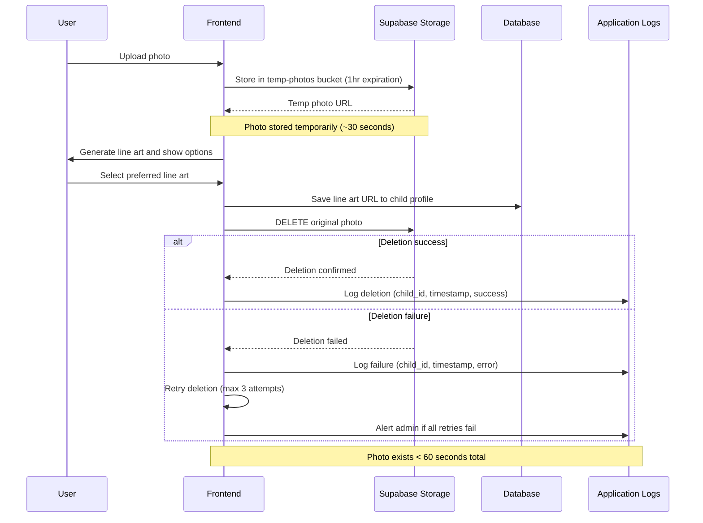
```mermaid
sequenceDiagram
    participant U as User
    participant F as Frontend
    participant S as Supabase Storage
    participant DB as Database
    participant L as Application Logs

    U->>F: Upload photo
    F->>S: Store in temp-photos bucket (1hr expiration)
    S-->>F: Temp photo URL

    Note over F,S: Photo stored temporarily (~30 seconds)

    F->>U: Generate line art and show options
    U->>F: Select preferred line art

    F->>DB: Save line art URL to child profile
    F->>S: DELETE original photo

    alt Deletion success
        S-->>F: Deletion confirmed
        F->>L: Log deletion (child_id, timestamp, success)
    else Deletion failure
        S-->>F: Deletion failed
        F->>L: Log failure (child_id, timestamp, error)
        F->>F: Retry deletion (max 3 attempts)
        F->>L: Alert admin if all retries fail
    end

    Note over F,L: Photo exists < 60 seconds total
```

**Steps:**

**Photo Upload & Deletion:**

Per TR-02/TR-15: Photo uploaded to temp bucket (1-hour expiration) → line art generated → user selects → immediate deletion within 60 seconds → logged → retry up to 3× on failure → alert admin if all retries fail.

**Legal Pages:**

1. `/privacy-policy` and `/terms-of-service` static pages created
2. Content provided by client (with legal counsel approval)
3. Version-stamped (e.g., "Last Updated: January 1, 2026")
4. Accessible before registration (no auth required)

**Consent Tracking:**

1. Registration form includes checkboxes:
   - Age 18+ confirmation
   - Parental/guardian authority confirmation
   - Terms of Service acceptance
   - Privacy Policy acknowledgment (link visible)
2. Child profile creation includes:
   - Parental authority attestation (exact wording by attorney)
   - Clear statement of data collection
3. Consent recorded in user_consents table with timestamp

**Data Deletion:**

1. Parent can delete child profile from dashboard
2. Confirmation dialog with password re-entry
3. Soft delete: children.deleted_at = now()
4. Data hidden from UI, recoverable for 30 days
5. After 30 days, automated job hard deletes:
   - Child profile record
   - Line art from storage
   - Associated book references updated
6. Account deletion cascades to all child profiles (immediate hard delete)

**PII (Personally Identifiable Information) Handling:**

**Data Classification:**

_PII Collected:_

- Parent email address (authentication, required)
- Parent password (hashed with bcrypt, never stored in plain text)
- Child first name only (minimal PII for personalization)

_Temporary PII (< 60 seconds):_

- Child photo (uploaded, processed, **immediately deleted** after line art selection)

_Non-PII Retained:_

- Line art illustration (anonymized, non-identifiable, cannot be reverse-engineered to original photo)
- Book metadata (theme selection, purchase date, page generation status)
- Transaction records (Stripe session IDs, amounts, timestamps - no card data)

**Data We Do NOT Collect:**

- Child last names, dates of birth, SSN, or government IDs
- Child addresses or phone numbers
- Credit card numbers or CVV (Stripe PCI DSS Level 1 handles all payment data)
- Behavioral tracking beyond basic usage analytics
- Location data or device fingerprinting

**PII Protection Implementation:**

- Photo deletion: Automated with 3-retry logic, logged, alerts on failure (per TR-02)
- Line art: Stored separately, non-identifiable, cannot be reverse-engineered
- Database: RLS restricts access to account owner only
- Encryption: AES-256 at rest, TLS 1.3 in transit
- Access logs: Deletion events logged for compliance audit trail

**Security:**

- All child data behind RLS policies; photo deletion explicitly triggered (not relying on auto-expiration alone)
- Consent checkbox validation server-side; password re-confirmation for data deletion
- HTTPS-only for all data transmission

**Accessibility:**

- Legal pages WCAG 2.1 AA compliant; consent checkboxes keyboard accessible
- Screen reader support for all forms; clear error messaging

**Data Integrity:**

- FK: user_consents.user_id → users.id; consent type enum constraint
- Deletion timestamps recorded; soft delete preserves audit trail

**Data Reliability:**

- Photo deletion retries per TR-02; temp bucket failsafe (1-hour expiration)
- Automated cleanup job for expired soft deletes; deletion queue persists across restarts

**Critical Requirements:**

- Photos MUST be deleted within 60 seconds of line art selection
- Deletion MUST be logged (success or failure)
- Deletion failures MUST alert admin
- Temp bucket MUST have 1-hour auto-expiration (failsafe)
- Legal pages MUST be accessible before registration
- Consent tracking MUST record timestamp and policy version
- Child profile deletion MUST cascade properly
- No photo retention for book generation (use line art only)

**Tables Required:**

```
USER_CONSENTS table:
- id (uuid, PK)
- user_id (uuid, FK → users.id)
- consent_type (enum: 'terms_of_service', 'privacy_policy', 'parental_attestation')
- consented_at (timestamp)
- policy_version (varchar)
```

**Cost:** Negligible (storage deletion and logging only)

---

## 5. Non-Functional Requirements

### 5.1 Security

#### Authentication & Authorization

- **Authentication Method**: JWT-based sessions via Supabase Auth
- **Session Management**: 7-day expiration, httpOnly cookies
- **Password Requirements**: Minimum 8 characters, hashed via bcrypt
- **Row-Level Security (RLS)**: Enforced on all database tables
  - Users can only access their own books, pages, and regenerations
  - Admin-only access to themes, letters, and analytics tables
- **API Security**: All endpoints require authentication except public landing page
- **CSRF Protection**: Enabled on all forms via Remix built-in protection

#### Data Protection

- **Encryption in Transit**: HTTPS-only (TLS 1.3) for all connections
- **Encryption at Rest**: Supabase provides AES-256 encryption for all stored data
- **PCI DSS Compliance**: Stripe handles all payment data (Level 1 certified)
- **Privacy**: Original photos deleted IMMEDIATELY after line art selection (within 60 seconds, privacy compliance)
- **API Keys**: Stored in environment variables, never in code
- **Webhook Verification**: HMAC SHA-256 signature verification for Stripe webhooks

#### Rate Limiting

- **Login Attempts**: Max 5 per 15 minutes per IP
- **API Endpoints**: 100 requests/minute per user
- **Image Regeneration**: Max 3 per minute (prevent abuse)
- **Registration**: Max 3 accounts per IP per day

#### Regulatory Compliance

- **GDPR**: User data deletion on request, privacy policy visible, child profile deletion supported
- **COPPA**: Service directed at parents (18+), parental consent attestation required for child profiles
- **Data Retention**: Books stored indefinitely, original photos deleted immediately after line art selection, line art persists in child profiles
- **Note**: See TR-17 for detailed privacy compliance features (legal disclaimer applies)

---

### 5.2 Performance

#### Response Times (Target SLAs)

- **Page Load**: < 2 seconds (95th percentile)
- **API Endpoints**: < 500ms (average)
- **Line Art Generation**: < 15 seconds for 4 variants (parallel)
- **Preview Generation**: < 30 seconds for 3 AI pages + 4 static pages (with retries)
- **Full Book Generation**: < 2 minutes for 25 AI pages + 55 static pages (batched, 5 concurrent)
- **PDF Assembly**: < 30 seconds (on-demand)

#### Concurrency

- **Simultaneous Users**: Support 100+ concurrent users on free tier
- **Image Generation**: Max 5 concurrent jobs per book (API rate limit)
- **Database Connections**: Supabase connection pooling (max 50 connections)

#### Resource Optimization

- **Image Optimization**: WebP format for web display, PNG for PDF
- **CDN Caching**: Static assets cached via Vercel Edge Network
- **Database Queries**: Indexed on user_id, book_id, created_at
- **Lazy Loading**: Images loaded progressively as generation completes

---

### 5.3 Scalability

#### Horizontal Scaling

- **Vercel**: Auto-scales based on traffic (serverless functions)
- **Supabase**: Connection pooling handles increased load
- **Trigger.dev**: Auto-scales job workers based on queue depth

#### Vertical Scaling

- **Database**: Upgrade Supabase plan as data grows (Pro → Team → Enterprise)
- **Storage**: Supabase Storage scales automatically (pay-per-GB)

#### Cost Scaling (Per-Book Economics)

**Per Book Operational Costs**:

- **Base AI Generation (First Book for a Child)**: $1.209 (4 line arts @ $0.039 + 27 personalized pages @ $0.039)
- **Base AI Generation (Additional Books for Same Child)**: $1.053 (27 personalized pages @ $0.039 only - line art reused from child profile)
- **With Maximum Regenerations**: $2.184 (base + 25 regenerations @ $0.039)
- **Stripe Processing Fee**: $0.47 per transaction (2.9% + $0.30 on $5.99)
- **Infrastructure Costs**: Variable based on usage (Vercel, Supabase, Trigger.dev)

**Note:** Line art generation ($0.156 for 4 variants) is a **one-time cost per child profile**. Line art is stored in the child profile and reused across all books for that child, reducing subsequent book costs by $0.156.

**Infrastructure Scaling**:

- **50 books/month**: Free tier infrastructure sufficient
- **500 books/month**: Estimated $50-100/month infrastructure costs
- **1,000 books/month**: Estimated $100-200/month infrastructure costs
- **Scalability**: Linear cost scaling with volume; infrastructure costs remain minimal relative to revenue

---

### 5.4 Availability

#### Target SLA

- **Uptime**: 99.5% (4 hours downtime/year acceptable for MVP)
- **Vercel**: 99.99% uptime SLA
- **Supabase**: 99.9% uptime SLA (Pro plan)
- **Gemini API**: 99.9% uptime SLA

#### Redundancy

- **Multi-AZ**: Supabase runs across multiple availability zones
- **Edge CDN**: Vercel serves from 100+ global edge locations
- **Backup Strategy**:
  - Supabase daily automated backups (Pro plan)
  - Point-in-time recovery available
  - Books never deleted (soft delete only)

#### Monitoring & Alerting

- **Uptime Monitoring**: Vercel Analytics + Supabase Insights
- **Error Tracking**: Built-in Vercel error logs
- **Alerts**: Email notifications for downtime > 5 minutes

---

### 5.5 Usability

#### UX/UI Design Principles

- **Framework**: Tailwind CSS for consistent styling
- **Mobile-First**: Responsive design for all screen sizes
- **Progressive Disclosure**: Show complexity only when needed
- **Loading States**: Clear progress indicators during generation
- **Error Messages**: User-friendly, actionable error text

#### Accessibility (WCAG 2.1 AA)

- **Screen Readers**: ARIA labels on all interactive elements
- **Keyboard Navigation**: Full keyboard support (tab order, focus indicators)
- **Color Contrast**: Minimum 4.5:1 contrast ratio
- **Alt Text**: All images have descriptive alt text
- **Form Validation**: Clear, accessible error messages

#### User Feedback

- **Real-time Progress**: Supabase Realtime updates during generation
- **Status Indicators**: Clear book status (Creating, Preview Ready, Generating, Complete)
- **Regeneration Counter**: "12 of 15 remaining" visible at all times
- **Success Confirmations**: Visual feedback on successful actions

---

### 5.6 Maintainability

#### Code Quality

- **TypeScript**: Full type safety across frontend and backend
- **tRPC**: End-to-end type-safe APIs
- **Linting**: ESLint + Prettier for consistent code style
- **Testing**: Unit tests for critical business logic (see Section 10)

#### Modularity

- **Component-Based**: Reusable React components via Remix
- **Separation of Concerns**: Clear boundaries between UI, API, and data layers
- **Service Layer**: Business logic separated from route handlers

#### Documentation

- **Code Comments**: JSDoc for all public functions
- **API Documentation**: tRPC auto-generates API docs from types
- **README**: Setup instructions, environment variables, deployment steps

#### Version Control

- **Git**: GitHub repository with protected main branch
- **Branch Strategy**: feature/\* branches, PR reviews before merge
- **Commit Messages**: Conventional commits format

---

## 6. Data Models and Structures

### 6.1 Entity-Relationship Model

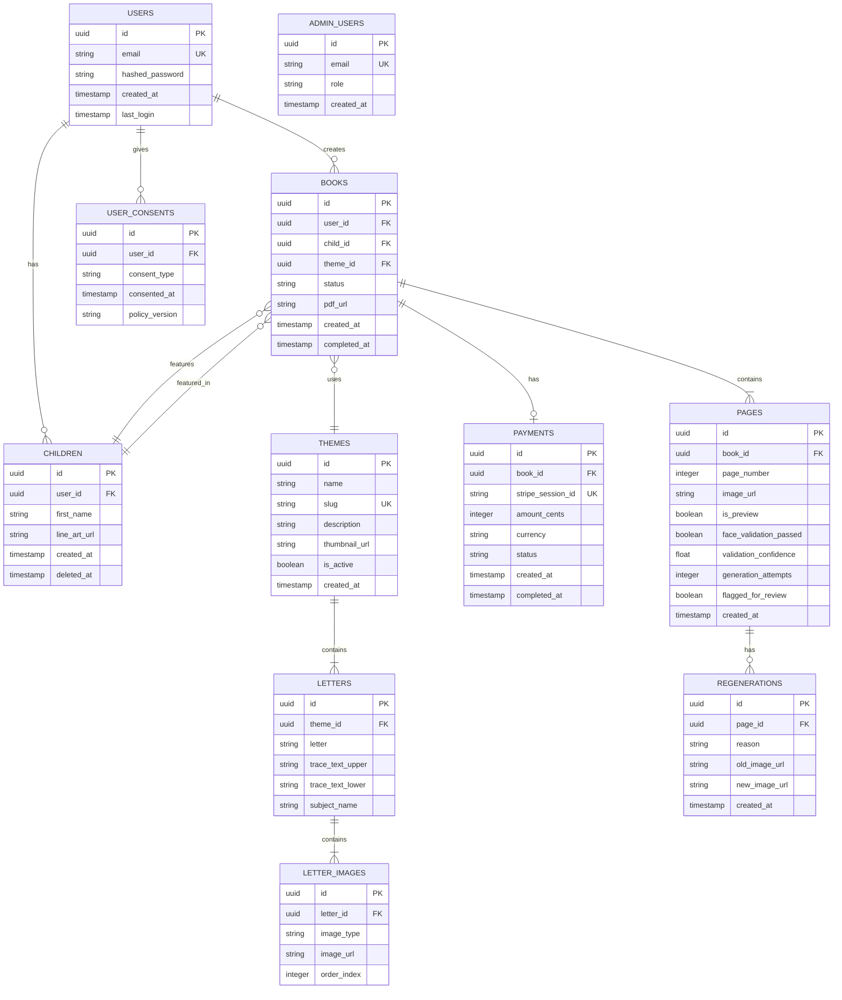
```mermaid
erDiagram
    USERS ||--o{ BOOKS : creates
    USERS ||--o{ CHILDREN : has
    USERS ||--o{ USER_CONSENTS : gives
    USERS {
        uuid id PK
        string email UK
        string hashed_password
        timestamp created_at
        timestamp last_login
    }

    CHILDREN ||--o{ BOOKS : featured_in
    CHILDREN {
        uuid id PK
        uuid user_id FK
        string first_name
        string line_art_url
        timestamp created_at
        timestamp deleted_at
    }

    USER_CONSENTS {
        uuid id PK
        uuid user_id FK
        string consent_type
        timestamp consented_at
        string policy_version
    }

    BOOKS ||--|{ PAGES : contains
    BOOKS ||--o| PAYMENTS : has
    BOOKS }o--|| THEMES : uses
    BOOKS }o--|| CHILDREN : features
    BOOKS {
        uuid id PK
        uuid user_id FK
        uuid child_id FK
        uuid theme_id FK
        string status
        string pdf_url
        timestamp created_at
        timestamp completed_at
    }

    THEMES ||--|{ LETTERS : contains
    THEMES {
        uuid id PK
        string name
        string slug UK
        string description
        string thumbnail_url
        boolean is_active
        timestamp created_at
    }

    LETTERS ||--|{ LETTER_IMAGES : contains
    LETTERS {
        uuid id PK
        uuid theme_id FK
        string letter
        string trace_text_upper
        string trace_text_lower
        string subject_name
    }

    LETTER_IMAGES {
        uuid id PK
        uuid letter_id FK
        string image_type
        string image_url
        integer order_index
    }

    PAGES ||--o{ REGENERATIONS : has
    PAGES {
        uuid id PK
        uuid book_id FK
        integer page_number
        string image_url
        boolean is_preview
        boolean face_validation_passed
        float validation_confidence
        integer generation_attempts
        boolean flagged_for_review
        timestamp created_at
    }

    REGENERATIONS {
        uuid id PK
        uuid page_id FK
        string reason
        string old_image_url
        string new_image_url
        timestamp created_at
    }

    PAYMENTS {
        uuid id PK
        uuid book_id FK
        string stripe_session_id UK
        integer amount_cents
        string currency
        string status
        timestamp created_at
        timestamp completed_at
    }

    ADMIN_USERS {
        uuid id PK
        string email UK
        string role
        timestamp created_at
    }
```

---

### 6.2 Data Dictionary

#### **Table: users**

| Column          | Type         | Constraints             | Description                            |
| --------------- | ------------ | ----------------------- | -------------------------------------- |
| id              | uuid         | PK, NOT NULL            | Unique user identifier (Supabase Auth) |
| email           | varchar(255) | UNIQUE, NOT NULL        | User email address                     |
| hashed_password | varchar(255) | NOT NULL                | bcrypt hashed password                 |
| created_at      | timestamp    | NOT NULL, DEFAULT now() | Account creation timestamp             |
| last_login      | timestamp    | NULL                    | Last successful login                  |

**Indexes**: email (unique), created_at

**RLS Policy**: Users can only SELECT/UPDATE their own row

---

#### **Table: children**

| Column       | Type        | Constraints             | Description                               |
| ------------ | ----------- | ----------------------- | ----------------------------------------- |
| id           | uuid        | PK, NOT NULL            | Unique child profile identifier           |
| user_id      | uuid        | FK → users.id, NOT NULL | Parent/owner of child profile             |
| first_name   | varchar(50) | NOT NULL                | Child's first name (no last name)         |
| line_art_url | text        | NOT NULL                | Selected line art (reusable across books) |
| created_at   | timestamp   | NOT NULL, DEFAULT now() | Profile creation timestamp                |
| deleted_at   | timestamp   | NULL                    | Soft delete timestamp (30-day recovery)   |

**Unique Constraint**: (user_id, first_name) WHERE deleted_at IS NULL

**Indexes**: user_id, deleted_at, created_at

**RLS Policy**: Users can only access their own child profiles

**Cascade**: DELETE user → CASCADE DELETE children

---

#### **Table: user_consents**

| Column         | Type        | Constraints                            | Description                            |
| -------------- | ----------- | -------------------------------------- | -------------------------------------- |
| id             | uuid        | PK, NOT NULL                           | Unique consent identifier              |
| user_id        | uuid        | FK → users.id, NOT NULL                | User who gave consent                  |
| consent_type   | varchar(50) | NOT NULL, CHECK(consent_type IN (...)) | Type of consent given                  |
| consented_at   | timestamp   | NOT NULL, DEFAULT now()                | When consent was given                 |
| policy_version | varchar(20) | NOT NULL                               | Version of policy/terms user agreed to |

**Consent Types**: `terms_of_service`, `privacy_policy`, `parental_attestation`

**Indexes**: user_id, consent_type, consented_at

**RLS Policy**: Users can only SELECT their own consents; system can INSERT

**Cascade**: DELETE user → CASCADE DELETE consents

---

#### **Table: books**

| Column       | Type        | Constraints                      | Description                     |
| ------------ | ----------- | -------------------------------- | ------------------------------- |
| id           | uuid        | PK, NOT NULL                     | Unique book identifier          |
| user_id      | uuid        | FK → users.id, NOT NULL          | Book owner (parent)             |
| child_id     | uuid        | FK → children.id, NOT NULL       | Child featured in this book     |
| theme_id     | uuid        | FK → themes.id, NOT NULL         | Selected theme                  |
| status       | varchar(50) | NOT NULL, CHECK(status IN (...)) | Current book status             |
| pdf_url      | text        | NULL                             | Generated PDF location (cached) |
| created_at   | timestamp   | NOT NULL, DEFAULT now()          | Book creation timestamp         |
| completed_at | timestamp   | NULL                             | Generation completion timestamp |

**Status Values**: `created`, `preview_generating`, `preview_ready`, `payment_pending`, `generating`, `complete`, `failed`

**Indexes**: user_id, child_id, theme_id, status, created_at

**RLS Policy**: Users can only access their own books; admins can view all

**Note**: Original photo and line art URLs removed - now stored in children table. Line art fetched from child profile for book generation.

---

#### **Table: themes**

| Column        | Type         | Constraints             | Description                           |
| ------------- | ------------ | ----------------------- | ------------------------------------- |
| id            | uuid         | PK, NOT NULL            | Unique theme identifier               |
| name          | varchar(100) | NOT NULL                | Theme display name (e.g., "Insects")  |
| slug          | varchar(100) | UNIQUE, NOT NULL        | URL-safe identifier (e.g., "insects") |
| description   | text         | NULL                    | Theme description for users           |
| thumbnail_url | text         | NULL                    | Theme preview image                   |
| is_active     | boolean      | DEFAULT false           | Visible to users (admin-controlled)   |
| created_at    | timestamp    | NOT NULL, DEFAULT now() | Theme creation timestamp              |

**Indexes**: slug (unique), is_active

**RLS Policy**: All users can SELECT active themes; only admins can INSERT/UPDATE/DELETE

---

#### **Table: letters**

| Column           | Type         | Constraints                           | Description                            |
| ---------------- | ------------ | ------------------------------------- | -------------------------------------- |
| id               | uuid         | PK, NOT NULL                          | Unique letter identifier               |
| theme_id         | uuid         | FK → themes.id, NOT NULL              | Parent theme                           |
| letter           | varchar(1)   | NOT NULL, CHECK(letter IN ('A'..'Z')) | Letter of alphabet                     |
| trace_text_upper | varchar(50)  | NOT NULL                              | Uppercase tracing text                 |
| trace_text_lower | varchar(50)  | NOT NULL                              | Lowercase tracing text                 |
| subject_name     | varchar(100) | NOT NULL                              | Subject name (e.g., "Ant for insects") |

**Unique Constraint**: (theme_id, letter)

**Indexes**: theme_id, letter

**RLS Policy**: All users can SELECT; only admins can INSERT/UPDATE/DELETE

---

#### **Table: letter_images**

| Column      | Type        | Constraints                          | Description             |
| ----------- | ----------- | ------------------------------------ | ----------------------- |
| id          | uuid        | PK, NOT NULL                         | Unique image identifier |
| letter_id   | uuid        | FK → letters.id, NOT NULL            | Parent letter           |
| image_type  | varchar(20) | NOT NULL, CHECK(image_type IN (...)) | Image category          |
| image_url   | text        | NOT NULL                             | Supabase Storage URL    |
| order_index | integer     | NOT NULL                             | Display order (1-2)     |

**Image Types**: `combined` (letter+subject combined), `background` (for personalization)

**Unique Constraint**: (letter_id, image_type, order_index)

**Indexes**: letter_id, image_type

**RLS Policy**: All users can SELECT; only admins can INSERT/UPDATE/DELETE

---

#### **Table: pages**

| Column                 | Type      | Constraints                                        | Description                           |
| ---------------------- | --------- | -------------------------------------------------- | ------------------------------------- |
| id                     | uuid      | PK, NOT NULL                                       | Unique page identifier                |
| book_id                | uuid      | FK → books.id, NOT NULL                            | Parent book                           |
| page_number            | integer   | NOT NULL, CHECK(page_number BETWEEN 1 AND 61)      | Page position in book                 |
| image_url              | text      | NULL                                               | Generated page image URL              |
| is_preview             | boolean   | DEFAULT false                                      | Is this a preview page (pre-payment)? |
| face_validation_passed | boolean   | DEFAULT false                                      | Did face validation pass?             |
| validation_confidence  | float     | NULL, CHECK(validation_confidence BETWEEN 0 AND 1) | Face detection confidence (0-1)       |
| generation_attempts    | integer   | DEFAULT 0                                          | Auto-retry count (max 2)              |
| system_retry_count     | integer   | DEFAULT 0                                          | Free system retries (max 10)          |
| flagged_for_review     | boolean   | DEFAULT false                                      | Manual admin review needed            |
| created_at             | timestamp | NOT NULL, DEFAULT now()                            | Page creation timestamp               |

**Unique Constraint**: (book_id, page_number)

**Indexes**: book_id, page_number, is_preview, flagged_for_review

**RLS Policy**: Users can only access pages for their own books

---

#### **Table: regenerations**

| Column        | Type        | Constraints                      | Description                    |
| ------------- | ----------- | -------------------------------- | ------------------------------ |
| id            | uuid        | PK, NOT NULL                     | Unique regeneration identifier |
| page_id       | uuid        | FK → pages.id, NOT NULL          | Affected page                  |
| reason        | varchar(50) | NOT NULL, CHECK(reason IN (...)) | Why regenerated                |
| old_image_url | text        | NOT NULL                         | Previous image                 |
| new_image_url | text        | NOT NULL                         | New image                      |
| created_at    | timestamp   | NOT NULL, DEFAULT now()          | Regeneration timestamp         |

**Reason Values**: `user_requested` (counts toward quota), `system_failure` (free retry after auto-retry exhaustion), `validation_failed` (automatic retry, not shown to user), `admin_override` (admin manual intervention)

**Indexes**: page_id, created_at

**RLS Policy**: Users can only view regenerations for their own book pages

---

#### **Table: payments**

| Column            | Type         | Constraints                      | Description                            |
| ----------------- | ------------ | -------------------------------- | -------------------------------------- |
| id                | uuid         | PK, NOT NULL                     | Unique payment identifier              |
| book_id           | uuid         | FK → books.id, UNIQUE, NOT NULL  | Associated book (one payment per book) |
| stripe_session_id | varchar(255) | UNIQUE, NOT NULL                 | Stripe checkout session ID             |
| amount_cents      | integer      | NOT NULL                         | Payment amount in cents (599 = $5.99)  |
| currency          | varchar(3)   | NOT NULL, DEFAULT 'USD'          | Payment currency                       |
| status            | varchar(20)  | NOT NULL, CHECK(status IN (...)) | Payment status                         |
| created_at        | timestamp    | NOT NULL, DEFAULT now()          | Payment initiated                      |
| completed_at      | timestamp    | NULL                             | Payment completed                      |

**Status Values**: `pending`, `completed`, `failed`, `refunded`

**Indexes**: book_id (unique), stripe_session_id (unique), status

**RLS Policy**: Users can only view payments for their own books

---

#### **Table: admin_users**

| Column     | Type         | Constraints               | Description             |
| ---------- | ------------ | ------------------------- | ----------------------- |
| id         | uuid         | PK, NOT NULL              | Unique admin identifier |
| email      | varchar(255) | UNIQUE, NOT NULL          | Admin email address     |
| role       | varchar(20)  | NOT NULL, DEFAULT 'admin' | Admin role level        |
| created_at | timestamp    | NOT NULL, DEFAULT now()   | Admin account creation  |

**Role Values**: `admin`, `super_admin`

**Indexes**: email (unique)

**RLS Policy**: Only super_admins can INSERT/UPDATE/DELETE; admins can SELECT

---

### 6.3 Database Versioning and Migration Policies

#### Migration Strategy

- **Tool**: Supabase CLI for migrations
- **Version Control**: All migrations tracked in `/supabase/migrations/` directory
- **Naming Convention**: `YYYYMMDDHHMMSS_description.sql` (e.g., `20250124120000_create_books_table.sql`)
- **Direction**: Forward-only migrations (no rollbacks in production)
- **Testing**: All migrations tested on local dev environment before staging

#### Migration Process

1. **Development**: Create migration file locally
2. **Review**: PR review for all schema changes
3. **Staging**: Apply to staging environment first
4. **Validation**: Run automated tests to verify schema
5. **Production**: Apply during low-traffic window with monitoring

#### Data Integrity Rules

- **Foreign Keys**: CASCADE on DELETE for child entities (pages, regenerations)
- **Check Constraints**: Validate enum values at database level
- **Unique Constraints**: Prevent duplicate records (email, stripe_session_id, etc.)
- **NOT NULL**: Required fields enforced at database level
- **Default Values**: Sensible defaults for optional fields

#### Backup and Recovery

- **Frequency**: Daily automated backups (Supabase Pro)
- **Retention**: 7 days point-in-time recovery
- **Testing**: Monthly backup restoration tests
- **Recovery Time Objective (RTO)**: < 4 hours
- **Recovery Point Objective (RPO)**: < 24 hours

---

## 7. Integrations and APIs

### 7.1 External Services

| Service                                   | Purpose                       | Data Exchange                         | Authentication                   |
| ----------------------------------------- | ----------------------------- | ------------------------------------- | -------------------------------- |
| **Vercel AI Gateway → Google Gemini API** | Image generation + validation | JSON (structured output)              | AI Gateway API key or OIDC token |
| **Stripe**                                | Payment processing            | Webhooks (checkout.session.completed) | Webhook secret + API key         |
| **Supabase**                              | Auth, DB, Storage, Realtime   | PostgreSQL, REST, WebSocket           | JWT tokens                       |
| **Trigger.dev**                           | Background job queue          | SDK + Webhooks                        | API key                          |

**Note:** Google Gemini API (gemini-2.5-flash-image / nano-banana) accessed via Vercel AI Gateway. Gemini API key configured once in AI Gateway dashboard. Gateway provides automatic cost tracking, usage dashboards, caching, and rate limiting.

### 7.2 API Specifications

#### tRPC Endpoints (Type-Safe)

- `auth.register` - User registration
- `auth.login` - JWT session creation
- `books.create` - Initialize new book
- `books.list` - Get user's books
- `books.uploadPhoto` - Upload child photo to Supabase Storage
- `lineArt.generate` - Trigger 4-variant line art generation
- `themes.list` - Get active themes
- `preview.generate` - Generate 8 preview pages
- `pages.regenerate` - Manually regenerate specific page
- `payment.createSession` - Create Stripe checkout session
- `pdf.download` - Get signed PDF URL

#### Webhook Endpoints

- `POST /api/webhooks/stripe` - Handle Stripe events (signature verified)
- `POST /api/webhooks/trigger` - Trigger.dev job status updates

### 7.3 Data Exchange Formats

**Gemini API Request**:

```typescript
{
  prompt: string,
  negativePrompt?: string,
  structuredOutput: {
    schema: "face_validation",
    fields: ["face_detected", "confidence", "face_quality"]
  }
}
```

**Gemini API Response**:

```typescript
{
  image_url: string,
  face_validation: {
    face_detected: boolean,
    confidence: number, // 0-1
    face_quality: {
      sharpness: number,
      brightness: number
    }
  }
}
```

---

## 8. User Interface (Technical)

### 8.1 Design System

- **Framework**: Tailwind CSS v3
- **Components**: shadcn/ui (accessible React components)
- **Icons**: Lucide React
- **Fonts**: Inter (system fallback)

### 8.2 Key UI Components

- **PhotoUploader**: Drag-drop + file picker with crop tool (react-image-crop)
- **LineArtSelector**: 4-image grid with selection state
- **ThemeGallery**: Card grid with theme previews
- **ProgressTracker**: Real-time book generation progress bar
- **PagePreview**: Image viewer with zoom and regenerate button
- **RegenerationCounter**: "20 of 25 remaining" badge

### 8.3 Form Validation

- **Client-side**: Zod schemas for type-safe validation
- **Server-side**: Same Zod schemas validated in tRPC procedures
- **Error Display**: Inline errors below fields, accessible announcements

---

## 9. Infrastructure Requirements

### 9.1 Environments

| Environment    | Purpose     | URL              | Database                                |
| -------------- | ----------- | ---------------- | --------------------------------------- |
| **Local**      | Development | localhost:3000   | Supabase CLI (Docker-based local stack) |
| **Staging**    | Testing     | staging.creativebooks.app | Supabase Cloud Project (shared)         |
| **Production** | Live users  | **app.creativebooks.app** | Supabase Cloud Project (dedicated)      |

**Note:** Production app runs on subdomain `app.creativebooks.app`. Main domain `creativebooks.app` hosts the marketing site (Lovable - client managed).

---

### 9.1.1 Multi-Environment Configuration by Service

**Supabase Setup:**

- **Local**: Supabase CLI + Docker (`supabase init`, `supabase start`) - Each developer runs own local instance
- **Staging**: Create dedicated Supabase Cloud project for team testing
- **Production**: Create dedicated Supabase Cloud project for live users
- **Total Cloud Projects Needed:** 2 (Staging + Production)
- **Configuration per project:**
  - 5 storage buckets: temp-photos, line-arts, admin-assets, book-pages, books-pdf
  - Auth settings (JWT 7-day expiration)
  - RLS policies for all tables
  - Independent API keys (SUPABASE_URL, SUPABASE_ANON_KEY, SUPABASE_SERVICE_KEY)

**Vercel Setup:**

- **Automatic multi-environment support** - No additional configuration needed
- Vercel creates preview deployments for PRs automatically
- Branch-based deployment: `develop` → Staging, `main` → Production
- Environment variables configured per environment in Vercel dashboard

**Trigger.dev Setup:**

- **Create 2 Trigger.dev projects:**
  - Development/Staging: Shared project for testing
  - Production: Dedicated project for live jobs
- **Configuration per project:**
  - Independent API keys (TRIGGER_DEV_API_KEY)
  - Job definitions deployed per environment
  - Webhook endpoints configured per environment

**Stripe Setup:**

- **Single Stripe account** with test mode and live mode
- **Test Mode**: Used for Local and Staging environments
- **Live Mode**: Used for Production only
- **Configuration:**
  - Test keys: STRIPE_TEST_SECRET_KEY, STRIPE_TEST_PUBLISHABLE_KEY, STRIPE_TEST_WEBHOOK_SECRET
  - Live keys: STRIPE_LIVE_SECRET_KEY, STRIPE_LIVE_PUBLISHABLE_KEY, STRIPE_LIVE_WEBHOOK_SECRET

**Google Gemini API Setup (via Vercel AI Gateway):**

- **Vercel AI Gateway** acts as proxy/router to Google Gemini API (gemini-2.5-flash-image / nano-banana)
- **Google Gemini API key** configured ONCE in Vercel AI Gateway dashboard (team-level, not in app code)
- **Vercel AI Gateway provides:**
  - Built-in observability dashboard (cost tracking, usage metrics, request logs)
  - Automatic cost attribution per project/environment
  - Caching and rate limiting
  - Request routing and failover
- **Configuration:**
  - Option 1: AI_GATEWAY_API_KEY (team-wide, same across environments)
  - Option 2 (Preferred): OIDC token authentication (automatic per deployment, no key management)
  - AI Gateway automatically tracks which environment (local/staging/prod) based on deployment context
- **Cost Tracking:** Vercel AI Gateway dashboard shows spend breakdown by project and environment automatically

**HubSpot Webhook (Optional):**

- **Configuration:**
  - Webhook endpoint URL: HUBSPOT_WEBHOOK_URL (different per environment)
  - Optional webhook secret: HUBSPOT_WEBHOOK_SECRET
  - Can be disabled by not setting environment variable

---

### 9.1.2 Environment Variables Template

**Required Environment Variables (.env.example):**

```bash
# Supabase (different per environment)
SUPABASE_URL=https://[project-ref].supabase.co
SUPABASE_ANON_KEY=eyJh...
SUPABASE_SERVICE_KEY=eyJh...

# Trigger.dev (different per environment)
TRIGGER_DEV_API_KEY=tr_dev_... or tr_prod_...

# Stripe (test keys for local/staging, live keys for production)
STRIPE_SECRET_KEY=sk_test_... or sk_live_...
STRIPE_PUBLISHABLE_KEY=pk_test_... or pk_live_...
STRIPE_WEBHOOK_SECRET=whsec_...

# Vercel AI Gateway (for Google Gemini API access)
# Option 1: API Key (team-wide, same across environments)
AI_GATEWAY_API_KEY=ag_...
# Option 2: OIDC tokens (preferred - automatically generated per deployment, no key needed)
# Note: Google Gemini API key configured in Vercel AI Gateway dashboard, not in app code

# HubSpot (optional, different webhook URL per environment)
HUBSPOT_WEBHOOK_URL=https://api.hubspot.com/webhooks/...
HUBSPOT_WEBHOOK_SECRET=optional_secret

# Application Config
NODE_ENV=development | staging | production
APP_URL=http://localhost:3000 | https://staging.creativebooks.app | https://app.creativebooks.app
```

**Environment-Specific Configuration:**

| Variable            | Local                 | Staging              | Production                           |
| ------------------- | --------------------- | -------------------- | ------------------------------------ |
| SUPABASE_URL        | localhost:54321 (CLI) | Project-specific URL | Project-specific URL                 |
| STRIPE_SECRET_KEY   | sk*test*\*            | sk*test*\*           | sk*live*\*                           |
| TRIGGER_DEV_API_KEY | tr*dev*\*             | tr*dev*\*            | tr*prod*\*                           |
| AI_GATEWAY_API_KEY  | Same (team-wide)      | Same (team-wide)     | Same (team-wide) or OIDC (automatic) |
| APP_URL             | localhost:3000        | staging.creativebooks.app     | **app.creativebooks.app**                     |

**Note:** Vercel AI Gateway automatically tracks usage by project/environment in its dashboard. Google Gemini API key is configured once in AI Gateway dashboard, not in application environment variables.

---

### 9.1.3 Vercel AI Gateway Configuration

**Setup Process:**

1. **Configure Gemini API Access** (one-time): Add Google Gemini API provider in Vercel AI Gateway dashboard → configure API key → enables gemini-2.5-flash-image (nano-banana) model

2. **Authentication Method** (choose one):

   **Option A: API Key (Simpler for MVP):**

   - Create AI Gateway API key in Vercel dashboard
   - Add `AI_GATEWAY_API_KEY` to environment variables (same key across all environments)
   - AI SDK automatically uses this key when model specified as string: `model: 'google/gemini-2.5-flash-image'`

   **Option B: OIDC Tokens (Preferred for Production):**

   - No API key management needed
   - Vercel automatically generates OIDC tokens per deployment
   - Tokens expire after 12 hours (auto-refreshed in deployed environments)
   - Local dev: Run `vercel link` then `vercel env pull` to get OIDC token

**Built-in Benefits:**

- **Cost Tracking**: Spend breakdown by project/environment in Vercel dashboard
- **Usage Metrics**: Requests per model, TTFT, token counts
- **Observability**: Team-wide or project-specific views
- **Auto Environment Attribution**: Tracks local/staging/prod based on deployment context
- **Caching & Rate Limiting**: Reduces redundant calls and prevents quota exhaustion
- **Failover**: Provider switching capability (future feature)

**Documentation:**

- Vercel AI Gateway Docs: [https://vercel.com/docs/ai-gateway](https://vercel.com/docs/ai-gateway)
- Authentication Guide: [https://vercel.com/docs/ai-gateway/authentication](https://vercel.com/docs/ai-gateway/authentication)
- Observability Dashboard: [https://vercel.com/docs/ai-gateway/observability](https://vercel.com/docs/ai-gateway/observability)

---

### 9.2 CI/CD Pipeline

- **Platform**: Vercel (automatic deployment)
- **Trigger**: Git push to `main` → Production, `develop` → Staging
- **Build**: `npm run build` (Remix)
- **Tests**: Run on PR creation (unit + integration)
- **Preview**: Unique URL for each PR

### 9.3 Monitoring

- **Logs**: Vercel logs + Supabase logs
- **Metrics**: Vercel Analytics (page views, load times)
- **Errors**: Vercel error tracking
- **Alerts**: Email on 5xx errors or >5min downtime

---

## 10. Testing and QA

### 10.1 Testing Strategy

- **Unit Tests**: Vitest for business logic (cost calculations, validation)
- **Integration Tests**: Playwright for critical user flows
- **E2E Tests**: Full book creation flow (photo upload → payment → PDF)
- **API Tests**: tRPC procedures tested with mock data

### 10.2 Critical Test Cases

1. User registration
2. Photo upload and line art generation
3. Preview generation with face validation retries
4. Payment flow (Stripe test mode)
5. Full book generation (79 pages)
6. PDF download
7. Regeneration limit enforcement (15 max)

### 10.3 Performance Testing

- **Load**: Simulate 100 concurrent users creating books
- **Stress**: Test Gemini API rate limits (5 concurrent per book)
- **Soak**: Run for 1 hour to check for memory leaks

### 10.4 Security Testing

- **Authentication**: Verify RLS policies block unauthorized access
- **Input Validation**: Test SQL injection, XSS attempts
- **Rate Limiting**: Verify rate limits work correctly

---

## 11. Technical Assumptions and Limitations

### 11.1 Assumptions

1. **Google Gemini API Availability**: 99.9% uptime, stable pricing ($0.039/image)
2. **User Behavior**: Average 10-15 manual regenerations per book (not full 25 limit)
3. **Validation Pass Rate**: 80% of images pass face validation on first attempt with proper photo guidance
4. **Growth**: Reaching 500-1,000 books/month within 12 months is achievable
5. **Static Assets**: Admin provides high-quality decorative and subject images for all 26 letters per theme

### 11.2 Limitations

1. **Pricing Model**: Fixed at $5.99 per book for MVP Phase 1, with operational costs of $1.21-$2.18 per book depending on regeneration usage
2. **Regeneration Limit**: Hard cap at 25 total manual regenerations per book (per BRD requirement)
3. **Auto-Retry Limit**: Max 2 automatic retries per page for failed face validation
4. **Google Gemini API Rate Limits**: 5 concurrent generations per book to respect API quotas
5. **PDF Size**: Fixed at 61 pages (not configurable in MVP)
6. **Theme Availability**: Only themes with complete 26-letter sets uploaded by admin are available
7. **Mobile Responsiveness**: Web app designed for desktop/tablet with responsive layout (best effort), but not fully optimized for mobile phones in MVP. Full mobile optimization is Phase 2.
8. **Mobile App**: No native mobile app in MVP (web-only)
9. **Page Architecture**: Decorative and subject pages must be pre-uploaded by admin as static images (not AI-generated)

### 11.3 Technology Dependencies

- **Vercel**: Vendor lock-in for serverless deployment
- **Supabase**: PostgreSQL + Auth + Storage in one platform
- **Stripe**: Payment processing (no alternative payment methods)
- **Google Gemini API**: Single AI provider with structured output capability (critical for face validation)

---

## 12. Technical Roadmap

**Contract Period:** November 10, 2025 - January 10, 2026 (8 weeks)  
**Development Model:** Linear Method with 2-week cycles  
**Team Configuration:** 1 full-stack developer with AI-assisted development (Cursor + Claude)  
**Estimated Velocity:** 15-20 story points per week with AI acceleration

---

### 12.1 Cycle 1: Foundation & Admin Portal (Nov 10-24, 2025)

**Duration:** 2 weeks (14 days)  
**Estimated Effort:** 30 story points  
**Client Demo:** November 24, 2025

**Technical Deliverables:**

**Week 1 - Infrastructure Foundation (16 pts):**

- Environment & deployment setup: Remix on Vercel with CI/CD pipeline
- Supabase project configuration: PostgreSQL database, Auth, Storage (5 buckets), Realtime
- Database schema implementation: 11 tables (users, children, user_consents, books, themes, letters, letter_images, pages, regenerations, payments, admin_users)
- Row-Level Security (RLS) policies for all tables
- tRPC API foundation with type-safe procedures (publicProcedure, protectedProcedure, adminProcedure)
- Admin authentication middleware with role-based access control
- Google Gemini API integration (gemini-2.5-flash-image) with structured output for face validation
- Trigger.dev setup for long-running background jobs (no timeout limits)

**Week 2 - Admin Portal (14 pts):**

- Admin dashboard UI with navigation and layout components
- Theme CRUD operations (create, read, update, delete, activate/deactivate)
- Letter asset upload system: 52 images per theme (26 letters × 2 images: combined letter+subject, background scene)
- Bulk upload functionality with progress indicators
- Static template upload: Cover, "belongs to" (blank for handwriting), 6 practice pages, back cover
- Asset library with filtering, search, and storage metrics
- Theme validation: Cannot activate until all 26 letters have 2 images each

**Technical Stack Decisions:**

- **Remix** chosen over Next.js for simpler data loading patterns and server-first architecture
- **Google Gemini API** chosen for structured output capability (critical for face validation)
- **Trigger.dev** chosen for no timeout limits (critical for 1-2 minute book generation)

---

### 12.2 Cycle 2: User Experience & Preview Generation (Nov 24 - Dec 8, 2025)

**Duration:** 2 weeks (14 days)  
**Estimated Effort:** 39 story points  
**Client Demo:** December 8, 2025

**Technical Deliverables:**

**Week 1 - Authentication & Child Profiles (15 pts):**

- User registration with Supabase Auth (TR-01), email verification, JWT sessions
- Privacy Policy / Terms of Service static pages (client-provided content)
- Consent tracking: user_consents table with policy versioning, server-side checkbox validation
- Child profile CRUD with soft delete (30-day recovery) per TR-15
- Photo upload + crop tool + 4 line art variants + immediate deletion per TR-02

**Week 2 - Book Creation & Preview Generation (24 pts):**

- Book creation workflow with child profile selection and status state machine
- Theme selection UI with validation (52 images required)
- Supabase Realtime for progressive page display
- Preview generation backend (Trigger.dev) per TR-04: 3 AI pages + 2 static, face validation, auto-retry
- Preview display UI with 5-page gallery
- Regeneration system per TR-06: 25 user quota + free system-failure retries (max 10)
- Client-approved limit message: "You have reached the maximum number of re-generations for this book. Please re-purchase a book to reset the regeneration limit."

**Critical Features:**

- APP-170 (Preview Generation Backend) is most complex (8 pts) — allocate extra time
- Face validation and immediate photo deletion are critical-path features

---

### 12.3 Cycle 3: Payment, Full Book Generation & Delivery (Dec 8-22, 2025)

**Duration:** 2 weeks (14 days)  
**Estimated Effort:** 27 story points (Week 1 only - critical path)  
**Client Demo:** December 22, 2025

**Technical Deliverables:**

**Week 1 - Core Feature Completion (27 pts):**

- Stripe integration per TR-07: checkout session, webhook handler, payment records with idempotency
- Full book generation backend (Trigger.dev) per TR-05: 24 AI pages (5 concurrent), 32 static pages, face validation, job persistence
- Post-payment regeneration UI (continuing global 25 quota per TR-06)
- PDF assembly (pdf-lib) per TR-08: fetch 61 pages → validate → metadata → compress → upload to books-pdf bucket
- PDF download with signed URLs (1-hour expiration), cached after first generation
- Book library dashboard per TR-09 and book detail view with regeneration buttons
- Automated cleanup jobs: daily hard-delete of expired child profiles (30 days) and stale temp-photos (>2 hours)

**Week 2 - Testing & Polish (21 pts - Buffer Week):**

- E2E testing: Full book creation flow (registration → download), face validation retries, regeneration quotas, payment/webhook handling, PDF assembly (61 pages)
- Cross-browser testing: Chrome, Safari, Firefox, Edge
- Security audit: RLS policies, rate limiting, SQL injection, CSRF, file upload security, webhook signatures, admin auth
- Performance optimization: DB indexes, image optimization (lazy load, WebP), Realtime subscription cleanup, load testing (10+ concurrent), connection pool tuning
- UI/UX polish: Loading states, toast notifications, responsive refinements, error messages
- Optional (if time permits): Admin monitoring dashboard, HubSpot webhook integration

**Technical Notes:**

- Week 1 aggressive (27 pts); Week 2 buffer available. Payment must complete before book generation. PDF assembly target: 30s (max 60s).

---

### 12.4 Cycle 4: Final Testing, Polish & Launch Preparation (Dec 22, 2025 - Jan 5, 2026)

**Duration:** 2 weeks (14 days)  
**Estimated Effort:** Buffer cycle for unexpected issues  
**Client Demo:** January 5, 2026 (Final Launch Review)

**Technical Deliverables:**

- Regression testing, security hardening, penetration testing
- Load testing (100+ concurrent users target)
- Admin compliance dashboard: photo deletion success rates (24h/7d/30d), failure alerts (>5%), soft-delete status, consent tracking
- Documentation: user guides, admin docs, API docs (tRPC auto-generated), developer onboarding
- Production deployment: env vars, domain (app.creativebooks.app), SSL, error monitoring, backups
- Optional: HubSpot webhook integration (user.registered, book.completed, payment.completed) with non-blocking queue
- Final client demo and launch readiness verification

**Contingency Planning:**

- Buffer for Cycle 3 overflow, unexpected technical challenges, or client feedback incorporation

---

### 12.5 Success Metrics & Acceptance Criteria

**Performance Targets:**

- Page load: < 2 seconds (95th percentile)
- API endpoints: < 500ms (average)
- Line art generation: < 15 seconds for 4 variants (parallel)
- Preview generation: < 30 seconds for 5 pages (3 AI + 2 static)
- Full book generation: < 90 seconds for 61 pages (24 AI + 37 static/template)
- PDF assembly: < 30 seconds (on-demand)

**Quality Targets:**

- Face validation pass rate: > 80% on first attempt (with photo guidance)
- System uptime: > 99.5% (4 hours downtime/year acceptable for MVP)
- Payment success rate: > 99% (< 1% failed transactions)
- Photo deletion success rate: > 99.5% (within 60 seconds)

**Scalability Targets:**

- Support 100+ concurrent users
- Handle 500 books/month by end of contract period
- Database connection pooling supports 50 connections
- AI generation rate limit: 5 concurrent per book

**User Experience Targets:**

- Average book completion time: < 10 minutes (registration to download)
- Users complete purchase without assistance (no support tickets for happy path)
- Regeneration usage: Average < 5 regenerations per book (system quality target)
- Positive customer feedback on book quality and user experience

---

### 12.6 Post-MVP Enhancements (Future Phases)

**Phase 2 - Initial Launch & Validation (Post-Launch):**

- User feedback collection and analytics
- Performance monitoring and optimization
- Cost analysis and pricing validation
- Support process refinement
- Feature enhancement based on customer feedback

**Phase 3 - Production Scale (Months 4-12):**

- Scale to 1,000 books/month
- Advanced admin features (user management, order management)
- Additional themes development (Dinosaurs, Space, Ocean, etc.)
- Marketing website integration enhancements

**Phase 4 - Feature Expansion (Year 2+):**

- Saved draft functionality for incomplete books
- Multiple line art versions per child
- Professional print fulfillment integration (Lulu.com)
- Social sharing features
- Affiliate program integration
- Multi-language support implementation (schema prepared)
- Mobile app (React Native)
- International pricing (EUR, GBP)
- Incremental billing for regenerations beyond 25 quota

---

## 13. Appendices

### 13.1 Technical Glossary

- **RLS**: Row-Level Security (Supabase database security policies)
- **tRPC**: Type-safe Remote Procedure Call framework
- **JWT**: JSON Web Token (authentication method)
- **CDN**: Content Delivery Network
- **SLA**: Service Level Agreement
- **MVP**: Minimum Viable Product

### 13.2 References

- **Business Requirements**: See CreativeBooks BRD
- **Google Gemini API Pricing**: [ai.google.dev/gemini-api/docs/pricing](https://ai.google.dev/gemini-api/docs/pricing)
- **Supabase Documentation**: [supabase.com/docs](https://supabase.com/docs)
- **Stripe API**: [stripe.com/docs/api](https://stripe.com/docs/api)
- **Trigger.dev**: [trigger.dev/docs](https://trigger.dev/docs)

### 13.3 Change Log

| Version | Date         | Author         | Changes                                                                                                                                                                                                                                                                                                                                                                                                                                                                                                                                                                                                                                                                                          |
| ------- | ------------ | -------------- | ------------------------------------------------------------------------------------------------------------------------------------------------------------------------------------------------------------------------------------------------------------------------------------------------------------------------------------------------------------------------------------------------------------------------------------------------------------------------------------------------------------------------------------------------------------------------------------------------------------------------------------------------------------------------------------------------ |
| 1.0     | Oct 29, 2025 | The Contractor Team | Initial complete TRD with all 14 technical requirements                                                                                                                                                                                                                                                                                                                                                                                                                                                                                                                                                                                                                                          |
| 1.1     | Oct 30, 2025 | The Contractor Team | **CRITICAL CORRECTIONS**: Fixed page generation architecture (static vs AI pages), restored regeneration limit to 25, corrected preview to 7 pages, fixed all cost calculations, clarified Google Gemini API usage, confirmed $5.99 pricing profitability                                                                                                                                                                                                                                                                                                                                                                                                                                        |
| 1.2     | Oct 31, 2025 | The Contractor Team | **FINAL CORRECTION**: Verified "belongs to" page is static template (not AI-generated), reducing AI page count from 28 to 27. Base cost now $1.209/book. Preview confirmed as 7 pages (no "belongs to"). Verified against actual client book PDF. Template has blank space for child to write name by hand (no dynamic text).                                                                                                                                                                                                                                                                                                                                                                    |
| 2.0     | Nov 4, 2025  | The Contractor Team | **MAJOR UPDATE - CLIENT FEEDBACK**: Added TR-15 (Child Profile Management), TR-16 (Marketing Analytics Integration), TR-17 (Privacy & Data Protection). Updated TR-02 for immediate photo deletion. Added CHILDREN and USER_CONSENTS tables to database schema. Updated ER diagram. Original photos now deleted within 60 seconds of line art selection. Line art persists in child profiles (reusable). Multiple children per parent supported. HubSpot webhook integration for marketing. Privacy compliance features with legal disclaimer.                                                                                                                                                   |
| 2.1     | Nov 6, 2025  | The Contractor Team | **BOOK STRUCTURE UPDATE**: Changed from 3 pages per letter to 2 pages per letter (87 pages → 61 pages). Preview reduced from 7 to 5 pages. Post-payment reduced from 80 to 56 pages. Consolidated decorative and subject pages into single combined static image per letter. Updated TR-04 and TR-05 with new page breakdowns. Updated TR-11 admin theme management (52 images vs 78). Updated letter_images table structure. Total: 52 alphabet pages (26 letters × 2 pages) + 9 other pages = 61-page book. Fixed AI page count references to 27 personalized pages.                                                                                                                           |
| 2.2     | Nov 10, 2025 | The Contractor Team | **TIMELINE FINALIZATION & SOW PREPARATION**: Added complete 2-month development roadmap (Section 12) with 4 cycles, specific dates (Nov 10, 2025 - Jan 10, 2026), client demo schedule, and story point estimates. Updated document status to "Final - SOW Attachment". Development approach changed from "Agile" to "Linear Method" throughout document. Updated success metrics and acceptance criteria.                                                                                                                                                                                                                                                                                       |
| 2.3     | Nov 10, 2025 | The Contractor Team | **PRODUCTION LAUNCH & PII CLARIFICATION**: Removed all beta testing references (going straight to production launch). Added comprehensive PII handling documentation in TR-17 (what data we collect vs don't collect, temporary vs retained PII, protection measures). Updated terminology throughout ("beta users" → "users" or "early adopters"). Enhanced success criteria with quantifiable metrics. Document status updated to "FINAL - SOW Attachment".                                                                                                                                                                                                                                    |
| 2.4     | Nov 10, 2025 | The Contractor Team | **INFRASTRUCTURE & AI GATEWAY CONFIGURATION**: Added comprehensive multi-environment configuration guide (Section 9.1.1, 9.1.2, 9.1.3). Detailed Vercel AI Gateway setup for Google Gemini API access with automatic cost tracking and observability dashboards. Corrected production URL (creativebooks.app → app.creativebooks.app) to reflect subdomain for app vs marketing site. Added environment variables template with AI_GATEWAY_API_KEY. Updated architecture diagram to show Vercel AI Gateway as separate proxy layer. Clarified Supabase local development via CLI + Docker. Specified exact number of cloud projects needed per service (2 Supabase, 2 Trigger.dev, 1 Stripe, 1 Vercel AI Gateway). |

---

**Document Status**:  **Version 2.4 - FINAL** - SOW Attachment Ready for Client Signature

See Change Log table (Section 13.3) for detailed version history.

---

## Important Note: Accessibility in MVP

**Accessibility features listed throughout this TRD are OPTIONAL for MVP Phase 1.** They are documented for future planning and architectural awareness, not core implementation scope.

MVP uses basic semantic HTML and standard form elements for foundational accessibility. Full WCAG 2.1 AA compliance (screen readers, ARIA labels, keyboard navigation, high contrast, etc.) deferred to post-MVP phases based on user feedback and regulatory needs.

**Cost Impact:** Deferring full accessibility reduces MVP development time by ~10-15%.
