# Horizon Data Integration Architecture v2.0

## Executive Summary

Enterprise data integration architecture for Horizon portfolio data, delivering real-time portfolio analytics through Power BI dashboards. Uses **asynchronous polling architecture** with FastAPI, Egnyte status management, and Power BI visualization.

**Key Architecture Principle**: **Asynchronous background processing** with polling-based status tracking:
1. API returns **immediately** with "RUNNING" status
2. Background threads process Horizon data
3. Egnyte status files track job progress (PENDING → RUNNING → DONE/FAILED)
4. Clients poll status endpoint until completion
5. Power BI reads final CSV URLs from status file

This yields fast API response times, reliable job tracking via persistent status files, idempotent requests via request_id, stale job detection with automatic restart (30-minute timeout), and seamless Power Apps/Power BI integration.

---

## Table of Contents

1. [Environment Architecture: Development vs Production](#environment-architecture-development-vs-production)
2. [Architecture Overview](#architecture-overview)
3. [System Components](#system-components)
4. [Asynchronous Data Flow](#asynchronous-data-flow)
5. [Polling Mechanism](#polling-mechanism)
6. [Egnyte Status Management](#egnyte-status-management)
7. [Integration Points](#integration-points)
8. [Deployment & Staging](#deployment--staging)
9. [Security & Compliance](#security--compliance)
10. [Operational Procedures](#operational-procedures)

---

## Environment Architecture: Development vs Production

### Key Architectural Difference

Two distinct deployment modes with different architectures:

| Aspect | Development/Staging | Production |
|--------|---------------------|------------|
| **API Server** | FastAPI + ngrok (local) | Azure Function |
| **Endpoints Available** | generate_report, check_status, debug | **Only generate_report** |
| **Status Checking** | Via API endpoint `/api/check_status` | **Direct Egnyte read** |
| **Storage** | Egnyte (same as prod) | Egnyte |

### Development/Staging Architecture

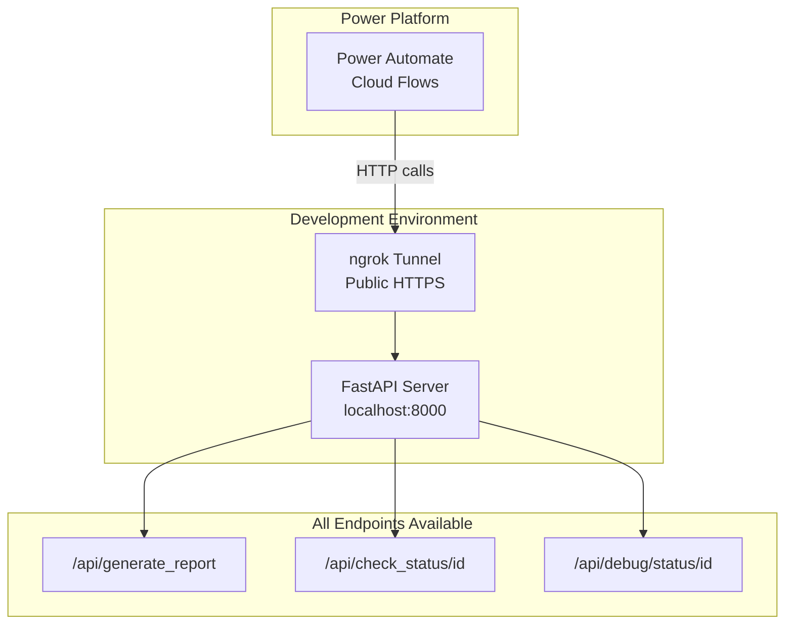

**Development Flow:**
1. Power Automate calls ngrok URL for `generate_report`
2. Power Automate polls ngrok URL for `check_status`
3. All status checking goes through API endpoints

### Production Architecture

In production, an **Azure Function HTTP trigger** executes a **PowerShell script** that runs `horizon_data_api.py` via command-line arguments. This cleanly separates Azure infrastructure from Python business logic, enables independent testing, and ensures consistent execution whether HTTP-triggered or scheduled.

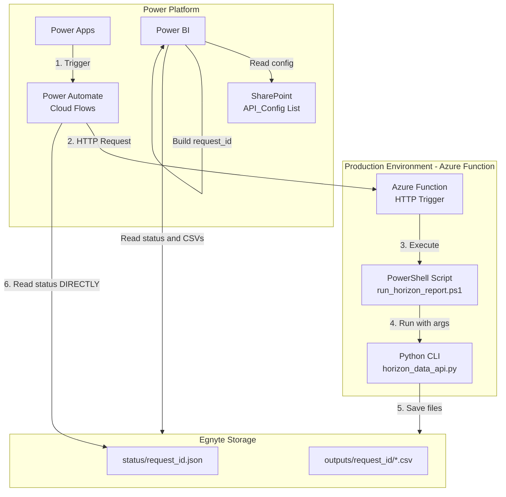

**Production Flow:**
1. **Power Apps** triggers Power Automate Cloud Flow
2. **Power Automate** sends HTTP request to Azure Function endpoint
3. **Azure Function** executes the PowerShell script (`run_horizon_report.ps1`)
4. **PowerShell** invokes `horizon_data_api.py` with command-line arguments
5. **Python script** fetches data from Horizon, saves CSVs and status file to Egnyte
6. **Power Automate reads status DIRECTLY from Egnyte** (no API endpoint needed)
7. **Power BI** builds the idempotent request_id from SharePoint API_Config
8. **Power BI** reads status file and CSV files directly from Egnyte

### Azure Function Execution Details

HTTP parameters are passed to Python via PowerShell:

```powershell
# run_horizon_report.ps1 - Executed by Azure Function
param(
    [string]$EndDate,
    [string]$KnowledgeDate,
    [string]$Portfolio,
    [string]$Mode = "horizon",
    [string]$Storage = "egnyte",
    [switch]$ForceRefresh
)

# Build command-line arguments
$args = @(
    "horizon_data_api.py",
    "--mode", $Mode,
    "--end-date", $EndDate,
    "--knowledge-date", $KnowledgeDate,
    "--portfolio", $Portfolio,
    "--storage", $Storage
)

if ($ForceRefresh) {
    $args += "--force"
}

# Execute Python script
python @args
```

**HTTP Request to Azure Function**:
```http
POST https://{function-app}.azurewebsites.net/api/generate_report
Content-Type: application/json

{
    "end_date": "2025-01-20",
    "knowledge_date": "2025-01-17",
    "portfolio": "CCG - All - Group",
    "mode": "horizon",
    "force_refresh": false
}

### Idempotent Request ID Generation

Both Power Automate and Power BI generate the same idempotent key:

```
Format: {end_date}_{knowledge_date}_{portfolio}
Example: 2025-01-20_2025-01-17_CCG---All---Group
```

**Power Apps/Power Automate generates it from user input:**
```
Text(EndDate, "yyyy-mm-dd") & "_" & Text(KnowledgeDate, "yyyy-mm-dd") & "_" & Portfolio
```

**Power BI generates it from SharePoint API_Config:**
```m
RequestId = EndDateText & "_" & KnowledgeDateText & "_" & PortfolioClean
```

### Why This Architecture?

| Benefit | Description |
|---------|-------------|
| **Simpler Production** | Azure Function only needs one endpoint |
| **No Status API Needed** | Power Automate reads Egnyte directly |
| **Idempotent** | Same parameters = same request_id = reuse cached results |
| **Decoupled** | Power BI does not need to call any API, just reads files |
| **Cost Efficient** | No Azure Function invocations for status checks |

---

## Architecture Overview

### High-Level Architecture

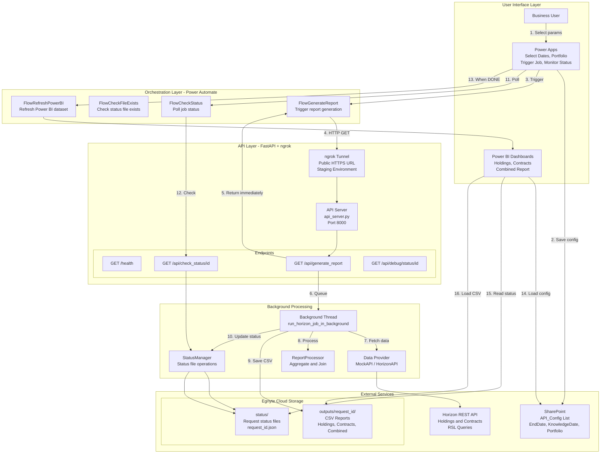

---

## System Components

### 1. API Server (`src/api_server.py`)

**Purpose**: FastAPI server with async background processing and stale job detection.

**Key Features**: Async endpoints via FastAPI `BackgroundTasks`, API key authentication (`X-API-Key` header), CORS enabled, stale job detection (>30 min → restart).

**Endpoints**:

| Endpoint | Method | Auth | Purpose |
|----------|--------|------|---------|
| `/` | GET | No | Basic health check |
| `/health` | GET | No | Detailed health with config status |
| `/api/delay` | GET | No | Artificial delay (for testing) |
| `/api/generate_report` | GET | Yes | Start report generation (async) |
| `/api/check_status/{request_id}` | GET | Yes | Check job status |
| `/api/debug/status/{request_id}` | GET | No | Debug status (no auth) |
| `/api/debug/force_restart/{request_id}` | GET | No | Force delete status file |

**Location**: `src/api_server.py` (534 lines)

---

### 2. Core Polling Module (`src/horizon_data_api_pooling.py`)

**Purpose**: Central module for Horizon data fetching with polling-based status tracking.

**Key Classes**:

#### A. Config Class (lines 31-107)
Centralized configuration management with 30+ environment variables:
```python
GENEVA_BASE_URL = "{horizon-api-url}"
GENEVA_USERNAME = "{username}"
GENEVA_HOST = "{horizon-host}"
GENEVA_PORT = "4646"

EGNYTE_DOMAIN = "{domain}"
EGNYTE_TOKEN = "{egnyte-token}"
EGNYTE_FOLDER_PATH = "/Shared/OPS/Operations/Data Science/Horizon Consolidated Reports"

DEFAULT_PORTFOLIO = "CCG - All - Group"
DEFAULT_STORAGE_MODE = "egnyte"  # or "local" for development
```

#### B. StatusManager Class (lines 178-445)
Manages status files in Egnyte for polling-based workflows.

**States**: `PENDING`, `RUNNING`, `DONE`, `FAILED`

**Key Methods**: `ensure_folders_exist()`, `read_status(request_id)`, `write_status()`, `update_status_running()`, `update_status_done()`, `update_status_failed()`

#### C. HorizonAPIProvider Class (lines 543-730)
Integrates with Horizon REST API: creates authenticated sessions, executes RSL/GSQL queries, fetches holdings (`CustomHoldings.rsl`) and contracts (`CustomHoldingsCreditContract.rsl`).

#### D. EgnyteStorageWithStatus Class (lines 736-841)
Handles Egnyte file storage: uploads CSVs to request-specific folders, creates public shareable links, falls back to local storage if unavailable.

#### E. ReportProcessor Class (lines 846-958)
Aggregates holdings and contracts by portfolio, joins them into combined reports.

**Location**: `src/horizon_data_api_pooling.py` (1,604 lines)

---

## Asynchronous Data Flow

### Complete Request Lifecycle

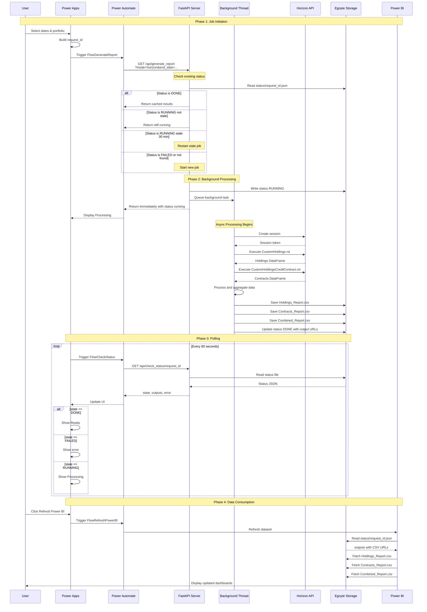

---

## Polling Mechanism

### Request ID Generation

Same idempotent key format as described in [Environment Architecture](#environment-architecture-development-vs-production): `{end_date}_{knowledge_date}_{portfolio}` (dates as `yyyy-mm-dd`, portfolio spaces replaced by hyphens). Same parameters = same request_id = reuses cached results.

### Polling State Machine

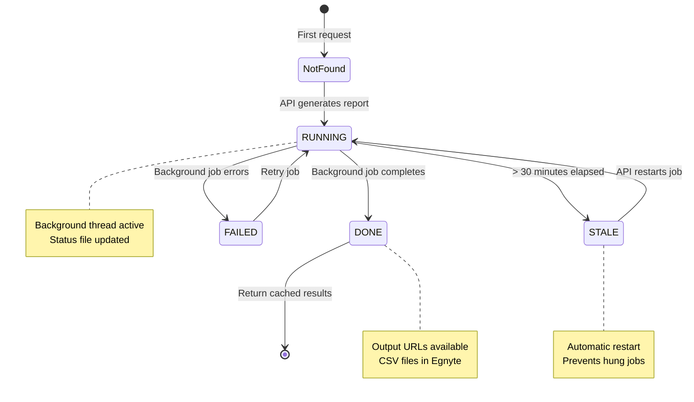

### Stale Job Detection

Jobs running >30 minutes are considered stale:

```python
def is_job_stale(existing_status: dict, timeout_minutes: int = 30) -> bool:
    updated_at = existing_status.get('updated_at')
    if not updated_at:
        return True  # No timestamp = stale

    updated_time = datetime.fromisoformat(updated_at)
    age_minutes = (now - updated_time).total_seconds() / 60

    return age_minutes > timeout_minutes
```

---

## Egnyte Status Management

### Folder Structure

```
/Shared/OPS/Operations/Data Science/Horizon Consolidated Reports/
 status/
    2025-11-20_2025-11-17_CCG---All---Group.json
    2025-11-19_2025-11-15_CCG---All---Group.json
    ...
 outputs/
     2025-11-20_2025-11-17_CCG---All---Group/
        Holdings_Report_11.20.2025.csv
        Contracts_Report_11.20.2025.csv
        Combined_Report_11.20.2025.csv
     ...
```

### Status File Schema

```json
{
  "request_id": "2025-11-20_2025-11-17_CCG---All---Group",
  "state": "DONE",
  "updated_at": "2025-11-20T15:30:00Z",
  "params": {
    "mode": "horizon",
    "end_date": "2025-11-20",
    "knowledge_date": "2025-11-17",
    "portfolio": "CCG - All - Group",
    "storage_mode": "egnyte",
    "save_to_storage": true,
    "consolidate": false
  },
  "outputs": {
    "holdings_url": "https://{domain}.egnyte.com/pubapi/v1/fs-content/...",
    "contracts_url": "https://{domain}.egnyte.com/pubapi/v1/fs-content/...",
    "combined_url": "https://{domain}.egnyte.com/pubapi/v1/fs-content/..."
  },
  "error": null
}
```

### State Transitions

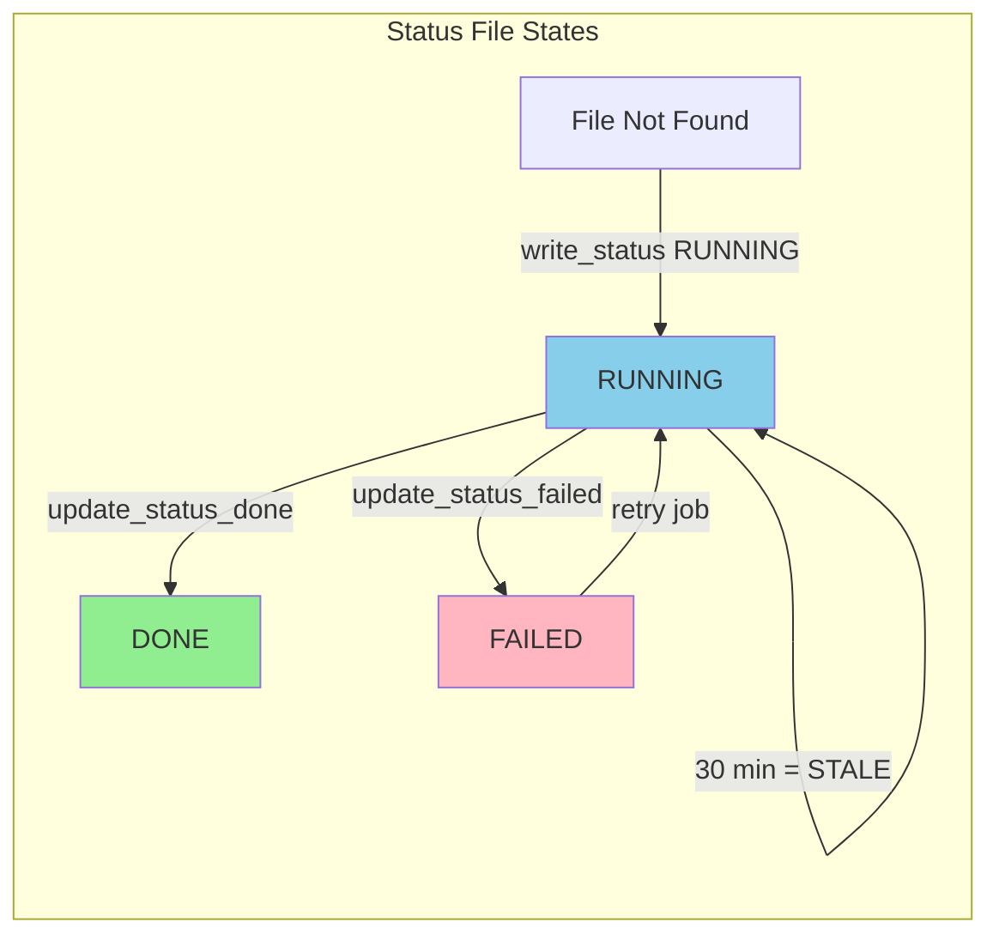

---

## Integration Points

### 1. Horizon REST API Integration

**Session Creation**:
```http
POST /horizonweb/horizon/v2/sessions
Authorization: Basic {base64(username:password)}
Content-Type: application/json

{
  "configuration": {
    "name": "Default",
    "servers": [{
      "host": "{horizon-host}",
      "port": "4646"
    }]
  }
}
```

**Query Execution**:
```http
POST /horizonweb/horizon/v2/reports/rsl
sessionId: {session_token}
Content-Type: application/json

{
  "name": "CustomHoldings.rsl",
  "reportingParameters": [
    {"name": "Portfolio", "values": ["CCG - All - Group"]},
    {"name": "PeriodEndDate", "values": ["11/20/2025"]},
    {"name": "KnowledgeDate", "values": ["11/17/2025"]},
    {"name": "Consolidate", "values": ["2"]}
  ]
}
```

### 2. Egnyte API Integration

**Upload File**:
```http
POST /pubapi/v1/fs-content{path}
Authorization: Bearer {egnyte_token}
Content-Type: multipart/form-data

file: {CSV content}
```

**Read File**:
```http
GET /pubapi/v1/fs-content{path}
Authorization: Bearer {egnyte_token}
```

**Create Folder**:
```http
POST /pubapi/v1/fs{path}
Authorization: Bearer {egnyte_token}
Content-Type: application/json

{"action": "add_folder"}
```

### 3. Power Automate Flows

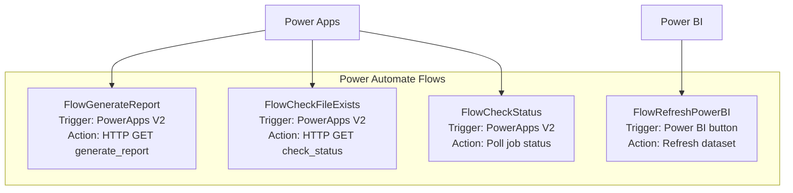

### 4. Power BI Data Model

**Query Chain**:
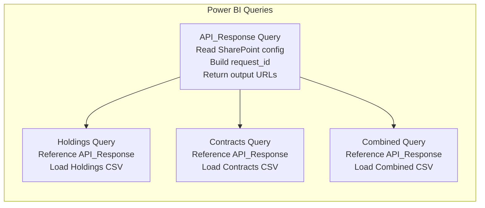

---

## Deployment & Staging

### Local Development with ngrok

API server runs locally and is exposed via ngrok for staging/testing:

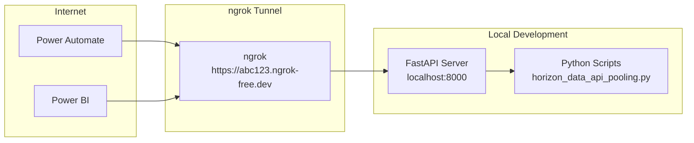

**Starting the Stack**:

```bash
# Terminal 1: Start API Server
cd C:\Task_Scheduler_Scripts\Python\prod
python -m uvicorn api_server:app --reload --port 8000

# Terminal 2: Start ngrok tunnel
ngrok http 8000
# Copy URL: https://abc123.ngrok-free.dev

# Update Power Automate flows with new ngrok URL
```

### Azure Function Deployment (Production)

Production uses an **Azure Function with PowerShell** invoking the Python CLI. Azure Functions natively support PowerShell for orchestration, PowerShell manages environment variables and process arguments, and the Python module remains portable and independently testable.

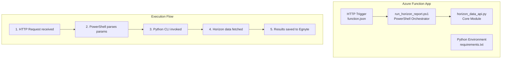

**Azure Function Structure**:
```
horizon-function-app/
 host.json                      # Function app configuration
 requirements.txt               # Python dependencies
 horizon_data_api.py             # Core Python module
 generate_report/
    function.json              # HTTP trigger definition
    run_horizon_report.ps1      # PowerShell entry point
 local.settings.json            # Environment variables (not committed)
```

**PowerShell Script (run_horizon_report.ps1)**:
```powershell
using namespace System.Net

param($Request, $TriggerMetadata)

# Extract parameters from HTTP request
$body = $Request.Body | ConvertFrom-Json
$endDate = $body.end_date ?? (Get-Date -Format "yyyy-MM-dd")
$knowledgeDate = $body.knowledge_date ?? $endDate
$portfolio = $body.portfolio ?? "CCG - All - Group"
$mode = $body.mode ?? "horizon"
$storage = $body.storage ?? "egnyte"
$forceRefresh = $body.force_refresh ?? $false

# Build Python command arguments
$pythonArgs = @(
    "horizon_data_api.py",
    "--mode", $mode,
    "--end-date", $endDate,
    "--knowledge-date", $knowledgeDate,
    "--portfolio", "`"$portfolio`"",
    "--storage", $storage
)

if ($forceRefresh -eq $true) {
    $pythonArgs += "--force"
}

# Execute Python script and capture output
$output = python @pythonArgs 2>&1 | Out-String

# Return response
Push-OutputBinding -Name Response -Value ([HttpResponseContext]@{
    StatusCode = [HttpStatusCode]::OK
    Body = @{
        status = "accepted"
        message = "Report generation started"
        parameters = @{
            end_date = $endDate
            knowledge_date = $knowledgeDate
            portfolio = $portfolio
            mode = $mode
        }
        output = $output
    } | ConvertTo-Json
})
```

**Python CLI Usage (called by PowerShell)**:
```bash
# Generate report with all parameters
python horizon_data_api.py \
    --mode horizon \
    --end-date 2025-01-20 \
    --knowledge-date 2025-01-17 \
    --portfolio "CCG - All - Group" \
    --storage egnyte

# Force refresh (bypass cache)
python horizon_data_api.py \
    --mode horizon \
    --end-date 2025-01-20 \
    --knowledge-date 2025-01-17 \
    --portfolio "CCG - All - Group" \
    --force

# Run integration test
python horizon_data_api.py --test

# Check health
python horizon_data_api.py --health

# Check specific request status
python horizon_data_api.py --check-status 2025-01-20_2025-01-17_CCG---All---Group

# Poll until job completes
python horizon_data_api.py --poll 2025-01-20_2025-01-17_CCG---All---Group
```

**CLI Arguments Reference**:

| Argument | Required | Default | Description |
|----------|----------|---------|-------------|
| `--mode` | No | horizon | Data source: `mock` or `horizon` |
| `--end-date` | No | today | Period end date (YYYY-MM-DD) |
| `--knowledge-date` | No | end_date | Knowledge date (YYYY-MM-DD) |
| `--portfolio` | No | CCG - All - Group | Portfolio code |
| `--storage` | No | egnyte | Storage mode: `egnyte` or `local` |
| `--force` | No | false | Bypass cache, force fresh data |
| `--test` | No | - | Run integration test |
| `--health` | No | - | Health check only |
| `--check-status ID` | No | - | Check status of request ID |
| `--poll ID` | No | - | Poll until request completes |

---

## Security & Compliance

### Authentication & Authorization

| Component | Auth Method | Details |
|-----------|-------------|---------|
| API Server | API Key | `X-API-Key` header required for protected endpoints |
| Horizon API | HTTP Basic | Username/password in Authorization header |
| Egnyte API | Bearer Token | OAuth token in Authorization header |
| Power BI | SharePoint Auth | Uses SharePoint connector credentials |

### Data Security

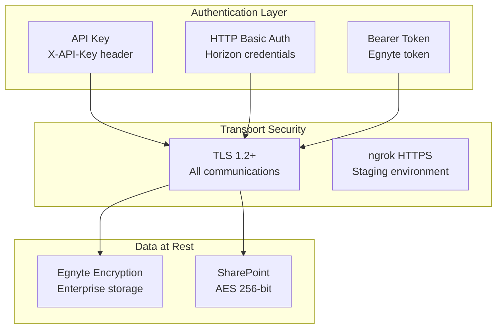

### Environment Variables

Sensitive credentials stored as environment variables. See [Appendix D: Configuration Reference](#d-configuration-reference) for the complete list. Key credential groups: API authentication (`API_KEY`), Horizon API (`GENEVA_*`), Egnyte storage (`EGNYTE_*`), and Azure (`AZURE_TENANT_ID`, `AZURE_CLIENT_ID`, `AZURE_CLIENT_SECRET`).

---

## Operational Procedures

### Health Check Monitoring

```bash
# Basic health check
curl https://YOUR-NGROK-URL/health

# Expected response
{
  "status": "healthy",
  "version": "2.1.0-async",
  "service": "Horizon Data API with Background Processing",
  "timestamp": "2025-11-20T15:30:00",
  "environment": "production",
  "egnyte_configured": true,
  "horizon_configured": true,
  "stale_timeout_minutes": 30
}
```

### Debug Endpoints

```bash
# Check status without auth (for debugging)
curl https://YOUR-NGROK-URL/api/debug/status/2025-11-20_2025-11-17_CCG---All---Group

# Force restart a stuck job (debug only)
curl https://YOUR-NGROK-URL/api/debug/force_restart/2025-11-20_2025-11-17_CCG---All---Group

# Alternative: Use force_refresh parameter
curl "https://YOUR-NGROK-URL/api/generate_report?force_refresh=true&..." -H "X-API-Key: YOUR_KEY"
```

### Common Issues & Resolutions

| Issue | Cause | Resolution |
|-------|-------|------------|
| Job stuck in RUNNING | Process crashed or Horizon timeout | Wait 30 min for auto-restart, or use `force_refresh=true` |
| 401 Unauthorized | Missing or invalid API key | Check `X-API-Key` header |
| Egnyte upload fails | Invalid token or path | Verify `EGNYTE_TOKEN` and folder permissions |
| Horizon session timeout | Session expired mid-query | Session auto-recreates on next request |
| ngrok URL changed | Tunnel restarted | Update URL in all Power Automate flows |

### Log Monitoring

API server logs provide execution traces:

```
2025-11-20 15:30:00 - api_server - INFO - ======================================================================
2025-11-20 15:30:00 - api_server - INFO - GENERATE REPORT - ASYNC VERSION
2025-11-20 15:30:00 - api_server - INFO - ======================================================================
2025-11-20 15:30:00 - api_server - INFO - Parameters:
2025-11-20 15:30:00 - api_server - INFO -   mode: horizon
2025-11-20 15:30:00 - api_server - INFO -   end_date: 2025-11-20
2025-11-20 15:30:00 - api_server - INFO - Request ID: 2025-11-20_2025-11-17_CCG---All---Group
2025-11-20 15:30:00 - api_server - INFO - Marking status as RUNNING...
2025-11-20 15:30:00 - api_server - INFO - Starting BACKGROUND TASK...
...
2025-11-20 15:32:45 - api_server - INFO - [BACKGROUND]  JOB COMPLETED SUCCESSFULLY! 
```

---

## Appendix

### A. File Naming Conventions

**Generated Files**:
```
Holdings_Report_MM.DD.YYYY.csv     - Aggregated holdings data
Contracts_Report_MM.DD.YYYY.csv   - Aggregated contracts data
Combined_Report_MM.DD.YYYY.csv    - Joined holdings + contracts
```

**Status Files**:
```
{end_date}_{knowledge_date}_{portfolio}.json
Example: 2025-11-20_2025-11-17_CCG---All---Group.json
```

### B. API Endpoints Summary

See [System Components > API Server](#1-api-server-srcapi_serverpy) for the complete endpoint table.

### C. Data Schemas

**Holdings Schema** (23 core columns):
```
AsOfDate, PortfolioCode, LegalEntityCode, AssetType, InvestmentType,
InvestmentCode, InvestmentDescription, LongShort, Currency,
TradedQuantity, SettledQuantity, LocalPrice, CostLocal, CostBook,
UnrealizedGLBook, UnrealizedPriceGLBook, UnrealizedFXGLBook,
AccruedInterestBook, MarketValueBook, GlobalAmt,
FundedCommit, UnfundedCommit, TotalCommit
```

**Contracts Schema** (26 core columns):
```
AsOfDate, Portfolio, AssetType, InvestmentType,
IsCreditContract, IsCreditFacility, FacilityID, ContractID,
Description, GlobalAmount, ContractAmt, ContractIssue, ContractMat,
RefIndex, Spread, Rate2, Rate3, AllInRate, RefIndexPrice,
RefIndexFloor, IsPIKContract, PIKMethod, PIKPortion,
ResetDate, IndexPriceDate, PriceOverride
```

### D. Configuration Reference

**Required Environment Variables**:
```bash
# Core Settings
ENVIRONMENT=production
LOG_LEVEL=WARNING

# API Authentication
API_KEY=your-secret-api-key

# Horizon API
GENEVA_BASE_URL={horizon-api-url}
GENEVA_USERNAME={username}
GENEVA_PASSWORD={password}
GENEVA_HOST={horizon-host}
GENEVA_PORT=4646

# Egnyte Storage
EGNYTE_DOMAIN={domain}
EGNYTE_TOKEN={egnyte-token}
EGNYTE_FOLDER_PATH=/Shared/OPS/Operations/Data Science/Horizon Consolidated Reports

# Default Parameters
DEFAULT_PORTFOLIO=CCG - All - Group
DEFAULT_STORAGE_MODE=egnyte
```

---

## Revision History

| Version | Date | Author | Changes |
|---------|------|--------|---------|
| 1.0 | 2025-01-31 | System | Initial architecture documentation |
| 2.0 | 2025-01-19 | System | Updated for async polling architecture with Egnyte status management |

---

**Document Status**: Production
**Classification**: Internal Use Only
**Last Reviewed**: 2025-01-19
